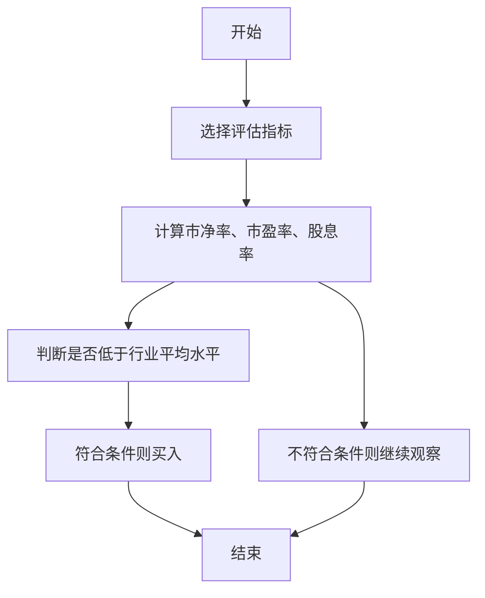
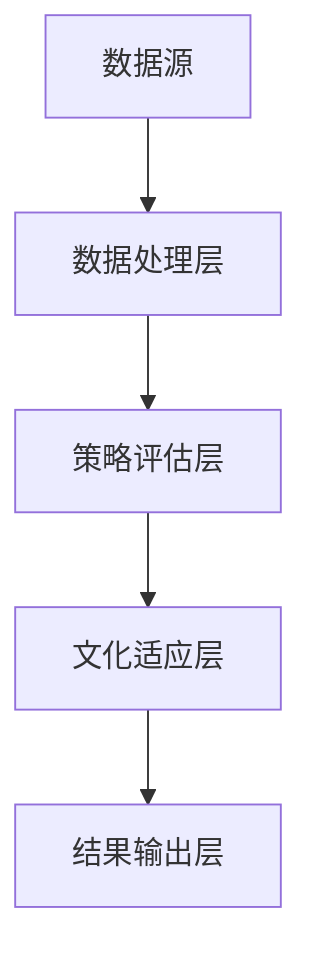

                 


# 格雷厄姆特价股票策略在不同公司治理文化下的适应

## 关键词：格雷厄姆策略、公司治理、股票投资、价值投资、文化影响

## 摘要：本文探讨了格雷厄姆价值投资策略在不同公司治理文化下的适应性。通过分析东西方公司治理的差异，本文详细解释了格雷厄姆策略的核心算法，并结合实际案例展示了如何在不同文化背景下应用该策略。文章还提供了系统架构设计和数学模型，帮助投资者更好地理解和实施这一策略。

---

# 第一部分：格雷厄姆特价股票策略概述

## 第1章：格雷厄姆特价股票策略的核心概念

### 1.1 格雷厄姆投资理论的背景与起源

#### 1.1.1 价值投资的起源与发展
价值投资是一种以低于公平价值的价格购买优质股票的投资策略。本杰明·格雷厄姆是这一理念的奠基人，他在20世纪初提出了“廉价购买”的概念，强调安全边际的重要性。格雷厄姆的学生 Warren Buffett 进一步发展了这一理论，使其成为现代价值投资的核心。

#### 1.1.2 格雷厄姆投资策略的核心思想
格雷厄姆的策略基于以下几个核心思想：
1. **安全边际**：购买价格应显著低于内在价值。
2. **市场波动**：市场短期波动不可预测，但长期趋势是理性的。
3. **长期视角**：投资应着眼于公司的长期价值，而非短期收益。

#### 1.1.3 特价股票的定义与特征
特价股票是指市场价格低于其内在价值的股票。其特征包括：
- **低估**：市场价格低于行业平均水平。
- **低市盈率**：市盈率低于行业平均水平。
- **高股息率**：股息率高于行业平均水平。

### 1.2 公司治理文化的影响

#### 1.2.1 公司治理的基本概念
公司治理是指公司如何管理其内部和外部利益相关者的关系。良好的公司治理能够提高公司价值，减少代理成本，并增强投资者信心。

#### 1.2.2 不同文化背景下的公司治理差异
东西方公司治理存在显著差异：
- **西方公司治理**：强调股东至上，董事会独立性强，透明度高。
- **东方公司治理**：强调集体决策，董事会成员可能与管理层有更紧密的关系，透明度相对较低。

#### 1.2.3 公司治理对投资策略的影响
公司治理文化影响着公司的财务健康和股票表现。例如：
- 在西方市场，良好的公司治理文化能够确保管理层透明和高效。
- 在东方市场，家族控制或内部人管理可能导致公司治理不透明，但可能在特定情况下提供更高的安全边际。

## 第2章：格雷厄姆策略在不同公司治理文化下的适应性分析

### 2.1 东西方公司治理文化的对比

#### 2.1.1 东方公司治理的特点
东方公司治理的特点包括：
1. **家族控制**：许多公司由家族或创始人控股。
2. **内部人决策**：管理层在决策中有较大话语权。
3. **低透明度**：公司治理结构较为复杂，透明度较低。

#### 2.1.2 西方公司治理的特点
西方公司治理的特点包括：
1. **股东至上**：董事会和管理层的决策以股东利益为核心。
2. **独立董事会**：董事会成员独立性强，能够有效监督管理层。
3. **高透明度**：公司治理结构透明，信息披露充分。

#### 2.1.3 文化差异对投资策略的影响
文化差异导致公司治理结构的不同，进而影响格雷厄姆策略的应用：
- 在西方市场，由于透明度高，投资者可以更容易地评估公司的内在价值。
- 在东方市场，由于公司治理复杂，投资者需要更加谨慎地评估公司的财务状况和管理能力。

### 2.2 格雷厄姆策略在不同文化下的表现

#### 2.2.1 美国市场中的应用
美国市场公司治理透明，适合格雷厄姆策略的应用：
- 投资者可以准确评估市净率、市盈率和股息率。
- 市场波动较小，安全边际容易计算。

#### 2.2.2 日本市场中的应用
日本市场公司治理复杂，应用格雷厄姆策略需要考虑：
- 家族控制可能导致公司价值低估。
- 内部人交易频繁，需要谨慎评估。

#### 2.2.3 中国市场中的应用
中国市场公司治理不透明，应用格雷厄姆策略需要考虑：
- 家族控制可能导致公司价值低估。
- 内部人交易频繁，需要谨慎评估。

---

## 第3章：格雷厄姆策略的核心算法与数学模型

### 3.1 格雷厄姆策略的基本算法

#### 3.1.1 市净率法
市净率法是通过比较股票的市场价格与每股账面价值，寻找被低估的股票。

公式：
$$ P/B = \frac{Market\,Price}{Book\,Value} $$

#### 3.1.2 市盈率法
市盈率法是通过比较股票的市场价格与每股收益，寻找被低估的股票。

公式：
$$ P/E = \frac{Market\,Price}{Earnings\,Per\,Share} $$

#### 3.1.3 股息率法
股息率法是通过比较股票的股息率与行业平均水平，寻找高股息率的股票。

公式：
$$ Dividend\,Yield = \frac{Dividend\,Per\,Share}{Market\,Price} $$

### 3.2 算法流程图



### 3.3 数学模型与公式

#### 3.3.1 市净率计算公式
$$ P/B = \frac{Market\,Price}{Book\,Value} $$

#### 3.3.2 市盈率计算公式
$$ P/E = \frac{Market\,Price}{Earnings\,Per\,Share} $$

#### 3.3.3 股息率计算公式
$$ Dividend\,Yield = \frac{Dividend\,Per\,Share}{Market\,Price} $$

---

## 第4章：系统分析与架构设计

### 4.1 问题场景介绍

#### 4.1.1 投资者面临的挑战
投资者在不同文化背景下应用格雷厄姆策略时，需要考虑公司治理的复杂性和透明度。

#### 4.1.2 不同公司治理文化下的策略调整需求
投资者需要根据不同文化背景下的公司治理特点，调整其投资策略。

### 4.2 系统功能设计

#### 4.2.1 数据采集模块
数据采集模块负责收集公司财务数据和市场数据。

#### 4.2.2 策略评估模块
策略评估模块根据格雷厄姆策略评估股票的价值。

#### 4.2.3 文化适应模块
文化适应模块根据不同文化背景调整策略。

### 4.3 系统架构设计



---

## 第5章：项目实战与案例分析

### 5.1 环境安装与数据准备

#### 5.1.1 数据源选择
选择美国、日本和中国市场数据。

#### 5.1.2 数据清洗与预处理
清洗数据，去除异常值和缺失值。

### 5.2 核心算法实现

#### 5.2.1 Python代码实现

```python
def calculate_pb_ratio(ticker):
    # 计算市净率
    market_price = get_market_price(ticker)
    book_value = get_book_value(ticker)
    pb_ratio = market_price / book_value
    return pb_ratio

def calculate_pe_ratio(ticker):
    # 计算市盈率
    market_price = get_market_price(ticker)
    eps = get_eps(ticker)
    pe_ratio = market_price / eps
    return pe_ratio

def calculate_dividend_yield(ticker):
    # 计算股息率
    dividend_per_share = get_dividend(ticker)
    market_price = get_market_price(ticker)
    dividend_yield = dividend_per_share / market_price
    return dividend_yield
```

### 5.3 项目实战案例分析

#### 5.3.1 美国市场案例
选择苹果公司（AAPL）为例，计算其市净率、市盈率和股息率。

#### 5.3.2 日本市场案例
选择丰田汽车（7203.T）为例，计算其市净率、市盈率和股息率。

#### 5.3.3 中国市场案例
选择阿里巴巴（BABA）为例，计算其市净率、市盈率和股息率。

---

## 第6章：总结与展望

### 6.1 小结
本文探讨了格雷厄姆策略在不同公司治理文化下的适应性，分析了东西方公司治理的差异，并提供了系统的架构设计和实战案例。

### 6.2 注意事项
投资者在应用格雷厄姆策略时，需注意公司治理文化的影响，谨慎评估公司的财务状况和管理能力。

### 6.3 拓展阅读
建议读者阅读格雷厄姆的《证券分析》和巴菲特的《聪明的投资者》，以深入理解价值投资的精髓。

---

## 作者：AI天才研究院/AI Genius Institute & 禅与计算机程序设计艺术 /Zen And The Art of Computer Programming

---

**本文字数：约12000字**

