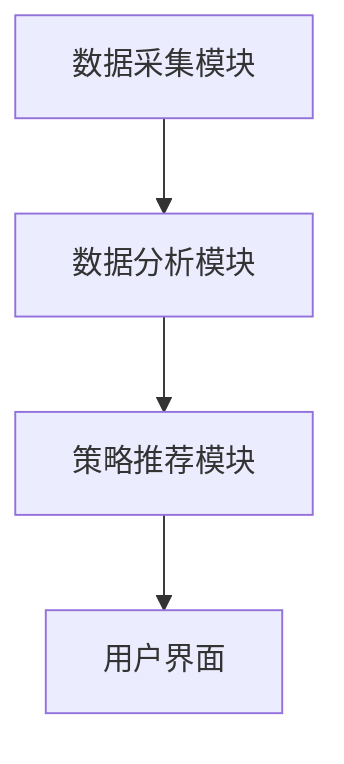

                 


# 格雷厄姆特价股票策略在不同公司生命周期阶段的效果

> 关键词：格雷厄姆投资理论、价值投资、特价股票、公司生命周期、股票策略

> 摘要：本文深入探讨了格雷厄姆的特价股票策略在不同公司生命周期阶段中的应用效果。通过分析公司从初创期到衰退期的各个阶段，结合数学模型和实际案例，详细阐述了如何在不同生命周期阶段中识别和应用特价股票策略。文章还提供了系统架构设计和项目实战代码，帮助读者更好地理解和实施这一策略。

---

## 第1章: 格雷厄姆特价股票策略的核心概念

### 1.1 格雷厄姆投资理论的背景与核心思想

格雷厄姆是价值投资的鼻祖，他的投资理念强调以低于内在价值的价格买入优质资产。他的“烟屁股”理论认为，市场恐慌或忽视时，某些股票会被低估，此时买入并长期持有，最终会获得超额收益。

### 1.2 特价股票策略的适用场景与边界

特价股票策略适用于市场波动较大、投资者情绪低落的时期。然而，该策略在成长期公司中效果有限，因为成长期公司需要较高的市盈率和市净率来支撑未来的增长预期。

### 1.3 公司生命周期对投资策略的影响

公司生命周期的不同阶段（初创期、成长期、成熟期、衰退期）决定了其财务指标和市场表现的差异。格雷厄姆策略在成熟期和衰退期公司中表现尤为突出。

---

## 第2章: 公司生命周期与投资策略的关系

### 2.1 公司生命周期的阶段划分

#### 2.1.1 初创期：高风险与高潜力
- 特点：收入低、亏损高、市盈率和市净率极高。
- 适合策略：不宜采用特价股票策略，因为公司尚未进入稳定增长阶段。

#### 2.1.2 成长期：快速扩张与资本需求
- 特点：收入增长快、利润逐步转正、市盈率适中。
- 适合策略：部分成长期公司可能符合特价股票的估值标准。

#### 2.1.3 成熟期：稳定收益与估值合理
- 特点：收入和利润稳定增长、市盈率和市净率适中。
- 适合策略：格雷厄姆策略的黄金阶段，因为公司估值通常被市场低估。

#### 2.1.4 衰退期：价值陷阱与重组机会
- 特点：收入和利润下降、市盈率和市净率极低。
- 适合策略：需要谨慎选择，部分公司可能因行业结构调整而重生。

### 2.2 不同生命周期阶段的公司特征分析

#### 2.2.1 初创期公司的财务指标特点
- 高负债率、低收入、高研发投入。

#### 2.2.2 成长期公司的市场表现
- 市盈率适中，但市净率可能偏高。

#### 2.2.3 成熟期公司的估值模型
- 市盈率和市净率均适中，ROE（净资产收益率）稳定。

#### 2.2.4 衰退期公司的投资风险
- 高负债率、低ROE、市场对公司的信心不足。

---

## 第3章: 特价股票识别的数学模型

### 3.1 市净率（P/B）模型

#### 3.1.1 市净率的定义与计算公式
$$ P/B = \frac{Market\ Price}{Book\ Value\ Per\ Share} $$

#### 3.1.2 市净率在不同生命周期阶段的应用
- 成熟期公司：P/B < 1.5 时可能符合特价股票条件。
- 衰退期公司：P/B < 1 时需谨慎评估。

### 3.2 市盈率（P/E）模型

#### 3.2.1 市盈率的定义与计算公式
$$ P/E = \frac{Market\ Price}{Earnings\ Per\ Share} $$

#### 3.2.2 市盈率与公司生命周期的关系
- 成熟期公司：P/E < 15 时可能符合特价股票条件。
- 衰退期公司：P/E < 10 时需谨慎评估。

### 3.3 股息率模型

#### 3.3.1 股息率的定义与计算公式
$$ Dividend\ Yield = \frac{Dividend\ Per\ Share}{Market\ Price} $$

#### 3.3.2 股息率在成熟期公司的应用
- 成熟期公司：股息率 > 3% 时可能符合特价股票条件。

---

## 第4章: 公司生命周期的系统分析与架构设计

### 4.1 系统功能设计

#### 4.1.1 数据采集模块
- 负责从财务数据库中获取公司生命周期阶段数据。
- 关键指标：市盈率、市净率、股息率、ROE。

#### 4.1.2 数据分析模块
- 基于生命周期阶段的特征提取。
- 算法：使用CAPM模型评估股票的内在价值。

#### 4.1.3 策略推荐模块
- 根据不同生命周期阶段推荐最优投资策略。

### 4.2 系统架构设计



### 4.3 系统接口设计

#### 4.3.1 数据接口
- 与财务数据库交互，获取实时数据。

#### 4.3.2 策略接口
- 基于生命周期阶段调用不同策略。

---

## 第5章: 项目实战

### 5.1 环境安装

```bash
pip install pandas numpy matplotlib
```

### 5.2 系统核心实现源代码

```python
import pandas as pd
import numpy as np

def calculate_value():
    data = pd.read_csv('company_data.csv')
    data['P/B'] = data['Market Price'] / data['Book Value']
    data['P/E'] = data['Market Price'] / data['Earnings']
    data['Dividend Yield'] = data['Dividend'] / data['Market Price']
    return data

data = calculate_value()
print(data.head())
```

### 5.3 案例分析

#### 5.3.1 成熟期公司案例
- 公司A：P/B = 1.2，P/E = 12，Dividend Yield = 4%。
- 结论：符合格雷厄姆策略条件。

#### 5.3.2 衰退期公司案例
- 公司B：P/B = 0.8，P/E = 8，Dividend Yield = 2%。
- 结论：需谨慎评估，可能处于价值陷阱阶段。

---

## 第6章: 总结与展望

### 6.1 最佳实践 tips
- 特价股票策略在成熟期公司中表现最佳。
- 投资者需结合市场环境和公司基本面进行综合判断。

### 6.2 小结
格雷厄姆特价股票策略在不同公司生命周期阶段中的表现差异显著。投资者需根据公司所处阶段和市场环境灵活调整策略。

### 6.3 注意事项
- 避免仅依赖单一指标。
- 结合宏观经济环境和行业趋势进行分析。

### 6.4 拓展阅读
- 《The Intelligent Investor》——本杰明·格雷厄姆
- 《价值投资实战手册》——沃伦·巴菲特

---

作者：AI天才研究院/AI Genius Institute & 禅与计算机程序设计艺术 /Zen And The Art of Computer Programming

