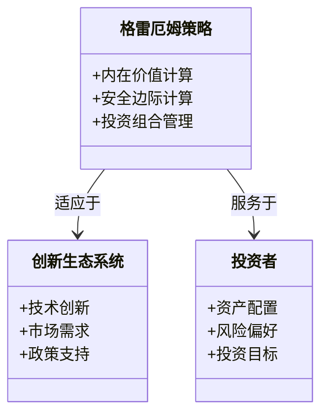

                 


好的，我将按照您的要求创作一篇结构完整、内容详实的技术博客文章。让我们先从【文章标题】和【文章关键词】开始：

# 《格雷厄姆特价股票策略在不同创新生态系统中的效果》

> 关键词：价值投资、创新生态系统、股票策略、投资分析、市场周期、风险控制

> 摘要：本文系统地探讨了格雷厄姆价值投资策略在不同创新生态系统中的应用效果，通过分析科技、医疗和金融科技等领域的创新生态系统的特点，结合格雷厄姆的内在价值评估方法，提出了策略在不同生态系统中的优化路径，为投资者在创新生态系统中应用价值投资策略提供了理论依据和实践指导。

---

让我们逐步分析文章的各个部分：

---

## 第一部分：格雷厄姆特价股票策略概述

### 第1章：格雷厄姆价值投资理论的核心理念

#### 1.1 价值投资的起源与发展

- 1.1.1 价值投资的起源  
  - 格雷厄姆的价值投资理念起源于20世纪初，强调以低于内在价值的价格买入优质股票。

- 1.1.2 格雷厄姆的投资理念  
  - 以安全边际为核心，通过基本面分析寻找低估股票。

- 1.1.3 特价股票的定义与特点  
  - 特价股票是指市场价格低于内在价值的股票，具有较高的投资安全边际。

#### 1.2 创新生态系统的基本概念

- 1.2.1 创新生态系统的定义  
  - 创新生态系统是指由创新主体（企业、研究机构、政府等）和创新资源（技术、资金、人才等）构成的复杂系统。

- 1.2.2 不同创新生态系统的分类  
  - 科技创新生态系统、医疗创新生态系统、金融科技创新生态系统等。

- 1.2.3 创新生态系统的核心要素  
  - 技术创新、商业模式创新、政策支持、市场需求。

---

### 第2章：格雷厄姆策略在股票投资中的应用

#### 2.1 格雷厄姆策略的核心原则

- 2.1.1 安全边际的概念  
  - 安全边际 = 内在价值 - 市场价格，是投资安全的保障。

- 2.1.2 内在价值的评估方法  
  - 基于企业的盈利能力、资产价值和未来现金流折现进行评估。

- 2.1.3 股票价格与内在价值的对比  
  - 通过对比市场价格与内在价值，寻找低估股票。

#### 2.2 格雷厄姆策略的适用场景

- 2.2.1 特价股票的识别标准  
  - 市场价格低于内在价值，且具有较高的安全边际。

- 2.2.2 不同市场周期中的策略调整  
  - 在熊市中寻找廉价股票，在牛市中保持谨慎。

- 2.2.3 风险控制与投资组合管理  
  - 分散投资、设置止损、定期调整投资组合。

---

## 第二部分：格雷厄姆策略在不同创新生态系统中的效果分析

### 第3章：科技创新生态系统中的格雷厄姆策略

#### 3.1 科技创新生态系统的特征

- 3.1.1 科技行业的周期性分析  
  - 科技行业具有明显的周期性，技术创新推动行业增长。

- 3.1.2 技术进步对股票价值的影响  
  - 技术创新提升企业竞争力，但同时也可能导致技术淘汰风险。

- 3.1.3 科技公司的内在价值评估  
  - 重点分析企业的技术壁垒、研发投入和未来现金流。

#### 3.2 格雷厄姆策略在科技生态中的应用

- 3.2.1 高成长科技企业的识别  
  - 寻找具有持续创新能力且估值合理的科技企业。

- 3.2.2 科技创新的风险与机会  
  - 技术风险、市场风险与政策风险并存，但也存在高增长机会。

- 3.2.3 安全边际在科技投资中的应用  
  - 通过安全边际寻找具有成长性的低估科技股。

---

### 第4章：医疗创新生态系统中的格雷厄姆策略

#### 4.1 医疗创新生态系统的特征

- 4.1.1 医疗行业的周期性分析  
  - 医疗行业受政策影响较大，但需求稳定。

- 4.1.2 技术创新对医疗企业价值的影响  
  - 创新药、医疗设备等技术创新推动企业价值增长。

- 4.1.3 医疗企业的内在价值评估  
  - 重点分析企业的研发能力、产品管线和市场潜力。

#### 4.2 格雷厄姆策略在医疗生态中的应用

- 4.2.1 医疗企业的识别标准  
  - 寻找具有创新能力和估值合理的医疗企业。

- 4.2.2 医疗创新的风险与机会  
  - 技术研发风险高，但市场潜力巨大。

- 4.2.3 安全边际在医疗投资中的应用  
  - 通过安全边际寻找具有成长性的低估医疗股。

---

## 第三部分：格雷厄姆策略在创新生态系统中的优化与实践

### 第5章：金融科技创新生态系统中的格雷厄姆策略

#### 5.1 金融科技创新生态系统的特征

- 5.1.1 金融科技行业的周期性分析  
  - 数字化转型推动行业增长，技术创新加速行业发展。

- 5.1.2 技术创新对金融科技企业价值的影响  
  - 人工智能、区块链等技术提升金融服务效率。

- 5.1.3 金融科技企业的内在价值评估  
  - 重点分析企业的技术优势、客户基础和盈利能力。

#### 5.2 格雷厄姆策略在金融科技中的应用

- 5.2.1 金融科技企业的识别标准  
  - 寻找具有技术创新能力和估值合理的金融科技企业。

- 5.2.2 金融科技创新的风险与机会  
  - 技术风险与监管风险并存，但市场潜力巨大。

- 5.2.3 安全边际在金融科技投资中的应用  
  - 通过安全边际寻找具有成长性的低估金融科技股。

---

## 第四部分：格雷厄姆策略的系统架构与实现

### 第6章：格雷厄姆策略的系统分析与架构设计

#### 6.1 问题场景介绍

- 投资者希望在不同创新生态系统中应用格雷厄姆策略，但缺乏系统化的分析工具和方法。

#### 6.2 系统功能设计

- **领域模型（mermaid 类图）**：



---

#### 6.3 系统架构设计

- **系统架构图（mermaid 架构图）**：


---

#### 6.4 系统接口设计

- **接口说明**：

  - `筛选股票（筛选条件）`：根据创新生态系统的特点筛选股票。
  - `评估内在价值（财务数据）`：基于企业财务数据评估内在价值。
  - `计算安全边际（市场价格，内在价值）`：计算安全边际，确定投资标的。
  - `优化投资组合（资产配置，风险偏好）`：根据投资者需求优化投资组合。

---

## 第五部分：项目实战与经验分享

### 第7章：项目实战：基于格雷厄姆策略的创新生态系统投资

#### 7.1 环境安装与配置

- **工具安装**：

  - 安装Python和相关库（pandas、numpy、scipy）。
  - 安装数据分析工具（Excel、SQL）。

---

#### 7.2 核心代码实现

- **代码示例：内在价值计算**

```python
import pandas as pd
import numpy as np

def calculate_intrinsic_value(financial_data, discount_rate):
    """
    计算企业的内在价值，使用DCF模型。
    financial_data: 包含企业财务数据的DataFrame。
    discount_rate: 折现率。
    """
    # 提取自由现金流
    free_cash_flow = financial_data['free_cash_flow'].iloc[-1]
    # 计算永续增长率
    perpetual_growth_rate = financial_data['perpetual_growth_rate'].iloc[-1]
    # 计算终端价值
    terminal_value = free_cash_flow / (1 + perpetual_growth_rate)
    # 计算DCF估值
    dcf_valuation = terminal_value * (1 + discount_rate) ** (-1)
    return dcf_valuation
```

---

#### 7.3 代码应用解读与分析

- **案例分析**：

  - 在科技生态系统中，使用DCF模型评估一家科技企业的内在价值，计算其安全边际，并与市场价格对比。

---

## 第六部分：总结与展望

### 第8章：最佳实践与小结

- **投资策略总结**：

  - 格雷厄姆策略在不同创新生态系统中具有广泛的适用性。
  - 投资者应根据生态系统的特性调整策略，注重安全边际和风险控制。

---

## 第七部分：注意事项与拓展阅读

### 第9章：注意事项与风险管理

- **风险提示**：

  - 创新生态系统具有较高的不确定性和波动性。
  - 格雷厄姆策略需要结合生态系统特点灵活调整。
  - 投资者应保持对市场的敏感性，及时调整投资策略。

---

## 第八部分：参考文献与拓展阅读

### 第10章：参考文献与延伸阅读

- **参考文献**：

  - 格雷厄姆《聪明的投资者》
  - 纪念版《证券分析》
  - 现代金融学相关文献

---

## 作者：AI天才研究院/AI Genius Institute & 禅与计算机程序设计艺术/Zen And The Art of Computer Programming

---

**注**：以上内容为文章的详细大纲，实际写作时将根据每一部分的具体内容逐步展开，结合实际案例、数学模型和系统架构进行详细讲解。

