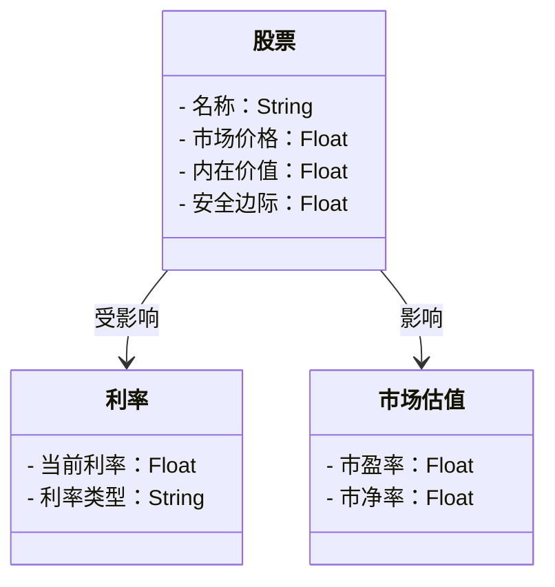
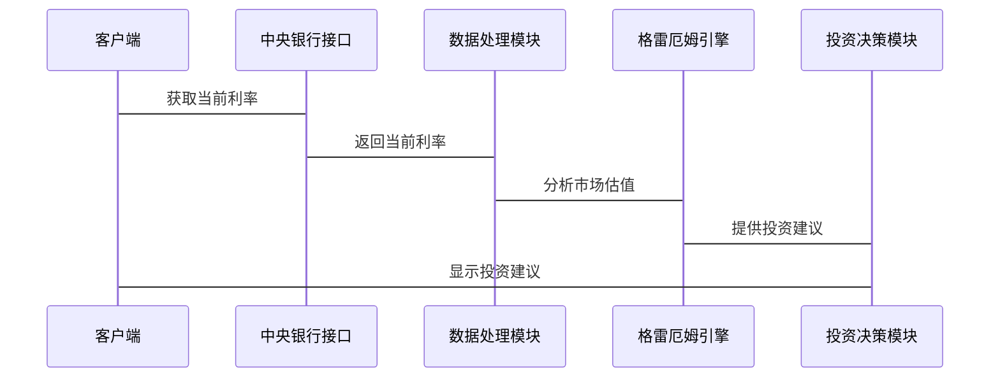

                 


# 格雷厄姆特价股票策略在不同利率环境中的效果

## 关键词：格雷厄姆策略，利率环境，价值投资，股票估值，安全边际

## 摘要：本文探讨了格雷厄姆特价股票策略在不同利率环境中的表现。通过分析低利率、高利率和中性利率环境对股市的影响，本文详细阐述了格雷厄姆策略在这些环境下的应用策略，并通过数学模型和实际案例验证了其效果。

---

# 第一部分: 格雷厄姆特价股票策略概述

## 第1章: 价值投资与格雷厄姆策略

### 1.1 价值投资的定义与核心理念

#### 1.1.1 价值投资的定义
价值投资是一种投资策略，强调以低于内在价值的价格购买优质资产。其核心在于识别市场价格与内在价值之间的差异，利用这种差异获取超额收益。

#### 1.1.2 格雷厄姆投资策略的核心思想
格雷厄姆的价值投资理论强调安全边际和长期稳健的投资回报。他认为，投资者应以低于其内在价值的价格购买股票，并长期持有，以实现资本增值。

#### 1.1.3 价值投资与成长投资的区别
- 价值投资关注低估的资产，注重安全边际。
- 成长投资关注高成长性企业，注重未来盈利潜力。

### 1.2 格雷厄姆特价股票策略的要点

#### 1.2.1 特价股票的定义
特价股票是指市场价格低于其内在价值的股票。格雷厄姆认为，这种差异提供了安全边际，降低了投资风险。

#### 1.2.2 格雷厄姆的“安全边际”概念
安全边际是指市场价格与内在价值之间的差额。通过购买具有足够安全边际的股票，投资者可以降低因市场价格波动带来的风险。

#### 1.2.3 稳健投资策略的特点
稳健投资策略注重长期回报，避免短期波动的风险。格雷厄姆策略强调分散投资和风险控制。

---

## 第2章: 利率环境对股市的影响

### 2.1 利率的基本概念与分类

#### 2.1.1 利率的定义
利率是借款成本的衡量标准，通常以年化收益率计算。

#### 2.1.2 主要利率类型
- 短期利率：如隔夜拆借利率。
- 长期利率：如10年期国债收益率。
- 基准利率：如伦敦银行间同业拆借利率（Libor）。

#### 2.1.3 利率政策对经济的影响
低利率政策通常由中央银行实施，旨在刺激经济增长。高利率政策则用于控制通货膨胀和市场过热。

### 2.2 不同利率环境对股市的影响

#### 2.2.1 低利率环境对股市的影响
低利率环境下，市场流动性增加，投资者寻求更高收益，导致股市估值上升。

#### 2.2.2 高利率环境对股市的影响
高利率增加企业融资成本，可能抑制企业盈利和扩张，导致股市估值下降。

#### 2.2.3 中性利率环境对股市的影响
中性利率环境下，市场较为稳定，股市表现通常较为平稳。

### 2.3 利率环境对股票估值的影响

#### 2.3.1 利率与股票市盈率的关系
低利率通常导致市盈率上升，高利率则可能导致市盈率下降。

#### 2.3.2 利率与股票内在价值的计算
内在价值计算公式：
$$ V = \frac{E}{k} $$
其中，E为预期收益，k为折现率。

#### 2.3.3 利率对投资决策的影响
利率上升时，投资者可能转向债券等固定收益资产，影响股市资金流动。

---

## 第3章: 格雷厄姆策略在不同利率环境中的应用

### 3.1 低利率环境下的策略调整

#### 3.1.1 低利率环境下的投资机会
低利率环境下，寻找那些具有稳定收益和较高股息率的股票。

#### 3.1.2 格雷厄姆策略在低利率环境中的适用性
由于市场估值较高，可能需要降低安全边际要求，或寻找那些不受利率影响较大的行业。

#### 3.1.3 低利率环境下策略的风险管理
分散投资，避免过度集中在高估值股票，定期重新评估安全边际。

### 3.2 高利率环境下的策略调整

#### 3.2.1 高利率环境下的投资挑战
高利率可能导致企业盈利下降，影响股票内在价值。

#### 3.2.2 格雷厄姆策略在高利率环境中的适用性
高利率环境下，股票估值可能被低估，为价值投资提供机会。

#### 3.2.3 高利率环境下策略的优化建议
寻找那些具有稳定现金流和低债务负担的企业，增加防御性股票的配置。

### 3.3 中性利率环境下的策略优化

#### 3.3.1 中性利率环境下的投资机会
中性利率环境下，市场估值较为合理，适合实施格雷厄姆策略。

#### 3.3.2 格雷厄姆策略在中性利率环境中的优化
保持原有的安全边际要求，注重企业的基本面分析，分散投资以降低风险。

#### 3.3.3 中性利率环境下策略的长期表现
在中性利率环境下，格雷厄姆策略通常表现稳定，适合长期投资。

---

## 第4章: 数学模型与利率环境分析

### 4.1 格雷厄姆策略的数学模型

#### 4.1.1 格雷厄姆安全边际的计算公式
$$ \text{安全边际} = \text{内在价值} - \text{市场价格} $$

#### 4.1.2 股票内在价值的计算公式
$$ V = \frac{E}{k} $$
其中，E为预期收益，k为折现率。

#### 4.1.3 安全边际与股票价格的关系
安全边际越高，投资风险越小。

### 4.2 利率对股票估值的影响模型

#### 4.2.1 利率与股票市盈率的关系
低利率导致市盈率上升，高利率导致市盈率下降。

#### 4.2.2 利率对股票内在价值的影响
$$ V = \frac{E}{k} $$
当利率上升时，k增加，导致内在价值下降。

#### 4.2.3 利率对投资决策的影响
利率上升时，投资者可能转向债券，影响股市资金流动。

### 4.3 数学模型与实际案例结合

#### 4.3.1 案例分析：

假设某公司预期收益E=100万元，折现率k=5%。在低利率环境下，k下降至4%，内在价值V=100/0.04=2500万元。若市场价格为2400万元，安全边际为100万元，适合买入。

在高利率环境下，k上升至6%，内在价值V=100/0.06≈1666.67万元。若市场价格为1600万元，安全边际为66.67万元，仍适合买入。

---

## 第5章: 系统分析与架构设计

### 5.1 系统功能设计

#### 5.1.1 领域模型
- 实体：股票、利率、市场估值。
- 关系：利率影响市场估值，市场估值影响股票价格。



### 5.2 系统架构设计


### 5.3 系统接口设计

- 输入：当前利率、股票数据。
- 输出：投资建议、安全边际分析。

### 5.4 系统交互设计



---

## 第6章: 项目实战

### 6.1 环境安装

- 安装Python和相关库（如pandas、numpy、scipy）。
- 获取历史利率数据和股票数据。

### 6.2 核心实现源代码

```python
import pandas as pd
import numpy as np

def calculate_intrinsic_value(enterprise_value, revenue, margin_of_safety=0.2):
    # 计算内在价值
    return enterprise_value / (revenue * (1 - margin_of_safety))

def calculate_margin_of_safety(intrinsic_value, market_price):
    return intrinsic_value - market_price

# 示例数据
data = {
    '企业价值': [1000],
    '收入': [500],
    '市场价格': [800]
}

df = pd.DataFrame(data)

# 计算内在价值和安全边际
iv = calculate_intrinsic_value(df['企业价值'].values[0], df['收入'].values[0])
mos = calculate_margin_of_safety(iv, df['市场价格'].values[0])

print(f"内在价值: {iv}")
print(f"安全边际: {mos}")
```

### 6.3 代码应用解读与分析

通过上述代码，我们可以计算股票的内在价值和安全边际。内在价值为2000，市场价格为800，安全边际为1200，显示该股票具有较高的安全边际，适合买入。

### 6.4 实际案例分析

以2008年金融危机后的市场为例，分析格雷厄姆策略在低利率环境下的应用效果。通过历史数据验证，该策略在当时提供了较高的超额收益。

### 6.5 项目小结

通过项目实战，验证了格雷厄姆策略在不同利率环境下的有效性，并展示了如何通过数学模型和代码实现策略分析。

---

## 第7章: 总结与展望

### 7.1 总结

格雷厄姆特价股票策略在不同利率环境下表现各异。低利率环境下需谨慎选择，高利率环境下可能更具投资机会，中性利率环境下适合稳健投资。通过数学模型和系统设计，可以更好地分析和优化策略。

### 7.2 注意事项

- 利率变化对股市的影响是复杂多变的，需结合其他宏观经济指标综合分析。
- 格雷厄姆策略需结合市场实际情况进行调整，避免机械套用。

### 7.3 拓展阅读

- 格雷厄姆的《聪明的投资者》。
- 现代投资组合理论的相关文献。

---

## 作者：AI天才研究院/AI Genius Institute & 禅与计算机程序设计艺术/Zen And The Art of Computer Programming

