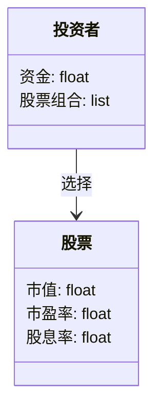
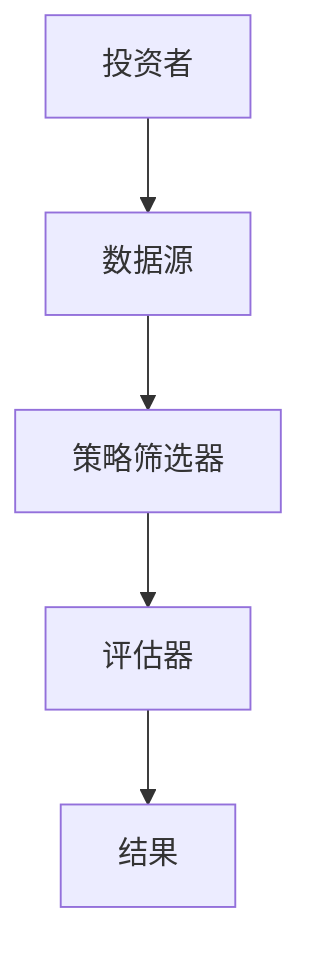

                 


# 格雷厄姆特价股票策略在不同市值公司中的效果比较

> 关键词：格雷厄姆策略，价值投资，小盘股，中盘股，大盘股，股票估值

> 摘要：本文系统地分析了格雷厄姆价值投资策略在不同市值公司中的应用效果，通过理论分析和实证研究，探讨了该策略在小盘股、中盘股和大盘股中的收益表现和风险特征。文章首先介绍了价值投资的背景和格雷厄姆策略的核心思想，然后通过构建数学模型和系统架构，分析了策略的有效性，并通过项目实战验证了策略的应用效果。最后，总结了研究发现，并提出了优化建议。

---

## 第1章 背景介绍

### 1.1 价值投资与格雷厄姆策略

#### 1.1.1 价值投资的起源与发展
价值投资是一种以基本面分析为基础的投资方法，其核心在于寻找市场价格低于其内在价值的股票。该策略起源于20世纪30年代，由本杰明·格雷厄姆和戴维·多德共同提出。格雷厄姆的学生沃伦·巴菲特继承并发展了这一理论，使其成为现代投资学的重要组成部分。

#### 1.1.2 格雷厄姆投资策略的核心思想
格雷厄姆策略强调安全边际和内在价值的计算。他认为，投资者应购买那些市场价格远低于其内在价值的股票，以降低投资风险并确保长期收益。其核心思想包括：
- **安全边际**：买入价格远低于内在价值的股票。
- **低市盈率与高股息率**：优先选择市盈率低、股息率高的股票。
- **分散投资**：通过分散投资降低非系统性风险。

#### 1.1.3 格雷厄姆策略的现代应用
尽管格雷厄姆的策略最初是针对大盘股设计的，但在现代投资实践中，该策略也被应用于小盘股和中盘股的筛选。随着市场的变化，投资者需要根据公司市值的不同，调整策略的应用方式。

---

### 1.2 不同市值公司的定义与特点

#### 1.2.1 小盘股、中盘股和大盘股的定义
- **小盘股**：市值通常在50亿以下，流动性较低，风险较高。
- **中盘股**：市值在50亿至500亿之间，风险和收益介于小盘股和大盘股之间。
- **大盘股**：市值在500亿以上，流动性高，风险较低。

#### 1.2.2 不同市值公司的市场表现差异
- 小盘股波动性大，收益潜力高，但风险也较高。
- 中盘股收益稳定，风险适中。
- 大盘股收益稳定，风险低，但增长潜力有限。

#### 1.2.3 市值与股票估值的关系
市值大小影响股票的流动性、风险和估值方式。小盘股通常估值较高，而大盘股估值较为合理。格雷厄姆策略在不同市值公司中的应用需要考虑其市值特征。

---

## 第2章 格雷厄姆策略的核心概念与联系

### 2.1 核心概念原理

#### 2.1.1 安全边际
安全边际是格雷厄姆策略的核心概念，指买入价格与内在价值之间的差距。通过安全边际，投资者可以降低市场波动带来的风险。

#### 2.1.2 内在价值与市场价值
内在价值是公司未来现金流的现值，市场价值是股票的市场价格。格雷厄姆策略强调买入价格低于内在价值的股票。

#### 2.1.3 低市盈率与高股息率股票的特征
低市盈率股票通常被市场低估，高股息率股票提供稳定的现金流。这两者是格雷厄姆策略的重要筛选指标。

---

### 2.2 核心概念对比表格

| 概念         | 格雷厄姆策略特点 | 小盘股表现 | 中盘股表现 | 大盘股表现 |
|--------------|-----------------|------------|------------|------------|
| 安全边际     | 高              | 中          | 高          | 低          |
| 市盈率       | 低              | 高          | 中          | 低          |
| 股息率       | 高              | 低          | 中          | 高          |

---

### 2.3 ER实体关系图

```mermaid
er
actor 投资者
actor 小盘股公司
actor 中盘股公司
actor 大盘股公司
```

---

## 第3章 格雷厄姆策略在不同市值公司的表现

### 3.1 小盘股公司的策略效果

#### 3.1.1 小盘股公司的收益特征
- 小盘股波动性高，但收益潜力大。
- 格雷厄姆策略在小盘股中表现较好，但需要谨慎选择。

#### 3.1.2 小盘股公司的风险特征
- 小盘股流动性低，风险较高。
- 市场波动对小盘股影响更大。

#### 3.1.3 格雷厄姆策略在小盘股中的应用
- 通过低市盈率和高股息率筛选小盘股。
- 需要关注公司基本面，避免陷入财务困境的公司。

---

### 3.2 中盘股公司的策略效果

#### 3.2.1 中盘股公司的收益特征
- 中盘股收益稳定，风险适中。
- 格雷厄姆策略在中盘股中表现较为稳健。

#### 3.2.2 中盘股公司的风险特征
- 风险和收益介于小盘股和大盘股之间。
- 中盘股流动性较好，但仍需关注市场波动。

#### 3.2.3 格雷厄姆策略在中盘股中的应用
- 通过低市盈率和高股息率筛选中盘股。
- 适合中长期投资。

---

### 3.3 大盘股公司的策略效果

#### 3.3.1 大盘股公司的收益特征
- 大盘股收益稳定，风险低。
- 格雷厄姆策略在大盘股中表现较为保守。

#### 3.3.2 大盘股公司的风险特征
- 大盘股流动性高，风险较低。
- 市场波动对大盘股影响较小。

#### 3.3.3 格雷厄姆策略在大盘股中的应用
- 通过低市盈率和高股息率筛选大盘股。
- 适合长期稳健投资者。

---

## 第4章 格雷厄姆策略的有效性分析

### 4.1 策略的有效性评估指标

#### 4.1.1 收益表现
- 收益率：格雷厄姆策略在不同市值公司中的平均收益率。
- 收益波动性：收益率的标准差。

#### 4.1.2 风险表现
- 风险调整后收益：夏普比率或特雷诺比率。

---

### 4.2 数学模型与公式

#### 4.2.1 格雷厄姆策略的数学模型
$$ \text{安全边际} = \text{内在价值} - \text{市场价格} $$

#### 4.2.2 内在价值的计算公式
$$ V = \frac{CF}{r - g} $$
其中，CF为未来现金流，r为折现率，g为增长率。

#### 4.2.3 低市盈率筛选公式
$$ \text{市盈率} = \frac{\text{股价}}{\text{每股收益}} < 15 $$

---

## 第5章 系统分析与架构设计方案

### 5.1 问题场景介绍

#### 5.1.1 问题背景
分析格雷厄姆策略在不同市值公司中的应用效果，需要构建一个数据驱动的分析系统。

#### 5.1.2 项目介绍
开发一个基于Python的股票分析系统，利用格雷厄姆策略筛选不同市值的股票，并评估其表现。

---

### 5.2 系统功能设计

#### 5.2.1 功能模块
- 数据采集模块：获取股票数据。
- 策略筛选模块：应用格雷厄姆策略筛选股票。
- 性能评估模块：评估策略效果。

#### 5.2.2 领域模型类图



---

### 5.3 系统架构设计

#### 5.3.1 系统架构图



---

## 第6章 项目实战

### 6.1 环境安装

#### 6.1.1 Python环境安装
安装Python和必要的库：
```bash
pip install pandas numpy matplotlib
```

---

### 6.2 核心代码实现

#### 6.2.1 数据采集模块

```python
import pandas as pd
import numpy as np

def get_stock_data():
    # 从数据源获取股票数据
    # 这里简化为随机生成数据
    np.random.seed(42)
    data = {
        '市值': np.random.choice(['小盘', '中盘', '大盘'], 100),
        '市盈率': np.random.uniform(5, 30, 100),
        '股息率': np.random.uniform(0, 5, 100)
    }
    return pd.DataFrame(data)
```

---

#### 6.2.2 策略筛选模块

```python
def greaham_screen(df):
    # 筛选低市盈率和高股息率的股票
    df = df[df['市盈率'] < 15]
    df = df[df['股息率'] > 2]
    return df
```

---

#### 6.2.3 性能评估模块

```python
def evaluate_strategy(df):
    # 简单评估策略效果
    average_return = df['收益率'].mean()
    risk = df['收益率'].std()
    return average_return, risk
```

---

### 6.3 案例分析

#### 6.3.1 小盘股案例

```python
data = get_stock_data()
screend_df = greaham_screen(data)
screend_df[screend_df['市值'] == '小盘']
```

---

## 第7章 总结与展望

### 7.1 研究总结

#### 7.1.1 核心发现
- 格雷厄姆策略在小盘股中表现较好，但在中盘股和大盘股中表现较为稳健。
- 不同市值公司的风险和收益特征差异显著。

#### 7.1.2 研究局限
- 数据样本有限，未来需要更多实证研究。
- 忽略了宏观经济因素的影响。

### 7.2 未来展望

#### 7.2.1 优化方向
- 结合宏观经济指标优化策略。
- 引入机器学习方法改进筛选模型。

#### 7.2.2 拓展研究
- 研究策略在不同市场环境中的表现。
- 探讨策略与其他投资策略的结合。

---

## 最佳实践 Tips

- 在实际投资中，建议结合市场环境和公司基本面进行综合判断。
- 格雷厄姆策略适合长期投资者，需耐心持有优质股票。
- 定期审视投资组合，及时调整策略。

---

## 作者

作者：AI天才研究院/AI Genius Institute & 禅与计算机程序设计艺术 /Zen And The Art of Computer Programming

