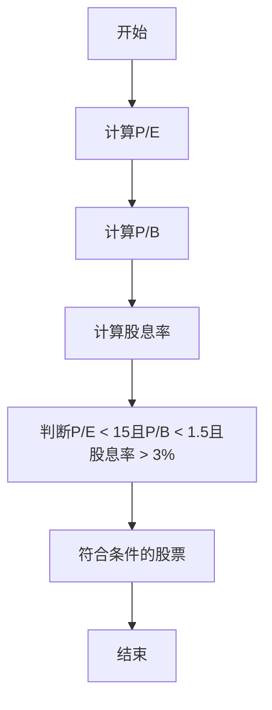
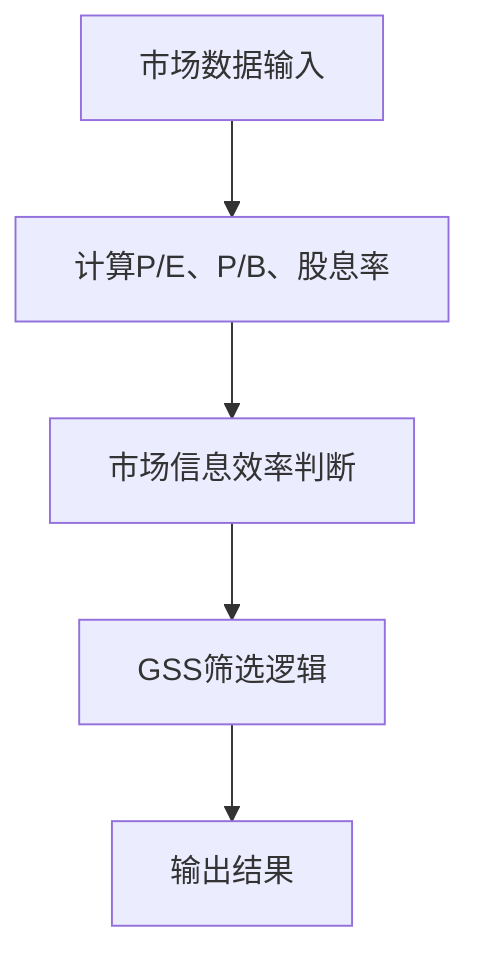
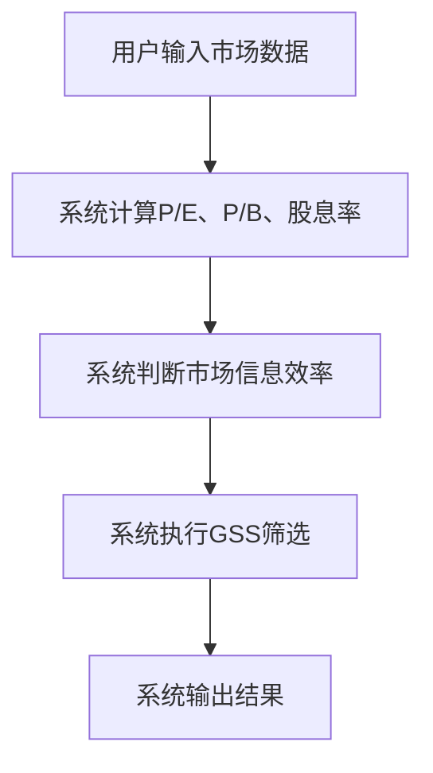

                 


# 格雷厄姆特价股票策略在不同市场信息效率下的表现

> 关键词：格雷厄姆特价股票策略（GSS）、市场信息效率、股票筛选算法、投资策略、低效市场

> 摘要：本文深入探讨了格雷厄姆特价股票策略（GSS）在不同市场信息效率下的表现。通过分析GSS的核心原理、数学模型、系统架构以及实际案例，本文揭示了市场信息效率对GSS投资效果的影响，并提出了优化策略和投资建议。

---

## 第一部分: 格雷厄姆特价股票策略（GSS）基础理论

### 第1章: 格雷厄姆特价股票策略概述

#### 1.1 格雷厄姆特价股票策略的核心概念

##### 1.1.1 格雷厄姆投资理论的起源与发展
本节介绍格雷厄姆投资理论的背景，强调其价值投资理念，即寻找市场低估的股票进行长期投资。GSS是格雷厄姆策略中的一种，专注于筛选具有低市盈率（P/E）、低市净率（P/B）和高股息率的股票。

##### 1.1.2 格雷厄姆特价股票策略的定义与特点
GSS的核心在于通过严格的财务指标筛选，寻找那些市场价格低于其内在价值的股票。其特点包括低风险、高安全边际和长期稳定收益。

##### 1.1.3 格雷厄姆特价股票策略的核心思想
GSS的投资哲学是基于市场非完美效率的假设，认为市场有时会出现错误定价，投资者可以通过基本面分析捕捉这些机会。

#### 1.2 格雷厄姆特价股票策略与市场信息效率的关系

##### 1.2.1 市场信息效率的基本概念
市场信息效率指市场价格反映所有相关信息的程度。高效市场中，信息已被充分消化，价格反映所有公开信息；低效市场中，信息未被充分反映。

##### 1.2.2 格雷厄姆特价股票策略在不同市场信息效率下的适用性
在高效市场中，GSS的筛选逻辑可能受限，因为价格通常反映所有信息；在低效市场中，GSS可能更具优势。

##### 1.2.3 市场信息效率对格雷厄姆特价股票策略表现的影响
市场效率越高，GSS筛选的有效性越低，因为低估机会减少；市场效率越低，GSS的表现越好。

---

## 第2章: 格雷厄姆特价股票策略的数学模型与算法

### 2.1 格雷厄姆特价股票策略的数学模型

#### 2.1.1 格雷厄姆特价股票筛选指标的数学表达

##### 市盈率（P/E）公式：
$$ P/E = \frac{\text{股价}}{\text{每股净利润}} $$

##### 市净率（P/B）公式：
$$ P/B = \frac{\text{股价}}{\text{每股净资产}} $$

##### 股息率公式：
$$ \text{股息率} = \frac{\text{每股股息}}{\text{股价}} \times 100\% $$

#### 2.1.2 市盈率与市净率的计算公式
市盈率衡量股票的估值，市净率衡量股票相对于账面价值的高低。

#### 2.1.3 股息率与股息支付率的数学模型
股息率反映了股票的收益能力，股息支付率反映了公司分红意愿。

### 2.2 格雷厄姆特价股票策略的算法实现

#### 2.2.1 筛选逻辑的Mermaid流程图


#### 2.2.2 基于Python的GSS筛选代码实现
```python
def graham_screen(stocks):
    selected_stocks = []
    for stock in stocks:
        pe = stock.pe
        pb = stock.pb
        dividend_yield = stock.dividend_yield
        if pe < 15 and pb < 1.5 and dividend_yield > 3:
            selected_stocks.append(stock)
    return selected_stocks
```

---

## 第3章: 市场信息效率对GSS表现的影响

### 3.1 不同市场信息效率下GSS的表现分析

#### 3.1.1 高效市场中的GSS表现
在高效市场中，GSS的表现可能受限，因为低估机会较少。

#### 3.1.2 低效市场中的GSS表现
在低效市场中，GSS的表现较好，因为存在更多的低估机会。

#### 3.1.3 弱有效市场中的GSS表现
在弱有效市场中，GSS的表现介于高效和低效市场之间。

### 3.2 基于GSS的市场信息效率分析系统

#### 3.2.1 系统架构设计


#### 3.2.2 功能模块设计
- 数据采集模块：获取股票数据。
- 计算模块：计算P/E、P/B、股息率。
- 判断模块：判断市场信息效率。
- 筛选模块：执行GSS筛选。

#### 3.2.3 接口设计
- 输入接口：市场数据。
- 输出接口：筛选结果。

#### 3.2.4 交互流程


---

## 第4章: GSS的实际应用与案例分析

### 4.1 实战分析

#### 4.1.1 某个市场的GSS筛选结果
以A股为例，筛选出符合条件的股票。

#### 4.1.2 结果分析
分析筛选结果，比较不同市场效率下的表现差异。

#### 4.1.3 案例对比
对比不同市场中的GSS表现，验证理论分析。

### 4.2 GSS的优化与调整

#### 4.2.1 根据市场信息效率调整筛选条件
在低效市场中，可以适当放宽筛选条件。

#### 4.2.2 结合其他指标优化GSS
引入ROE、现金流等指标，提升筛选效果。

---

## 第5章: 总结与展望

### 5.1 核心要点总结

#### 5.1.1 GSS的核心优势
低风险、高安全边际。

#### 5.1.2 市场信息效率对GSS的影响
信息效率越低，GSS表现越好。

### 5.2 投资建议

#### 5.2.1 低效市场中的投资策略
优先选择GSS。

#### 5.2.2 高效市场中的投资策略
结合其他策略，降低对GSS的依赖。

### 5.3 GSS的局限性

#### 5.3.1 市场信息效率的不确定性
市场效率难以准确判断。

#### 5.3.2 市场波动的影响
短期波动可能影响GSS的表现。

### 5.4 未来展望

#### 5.4.1 GSS的进一步优化
引入更多指标，提升筛选精度。

#### 5.4.2 市场信息效率的动态分析
研究市场效率的变化对GSS的影响。

---

## 作者信息

作者：AI天才研究院/AI Genius Institute & 禅与计算机程序设计艺术 /Zen And The Art of Computer Programming

---

以上是《格雷厄姆特价股票策略在不同市场信息效率下的表现》的完整目录大纲和文章结构。

