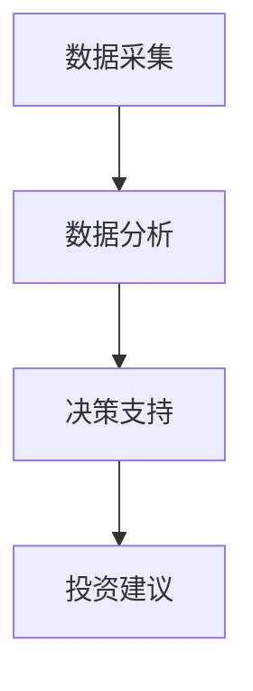

                 


# 格雷厄姆特价股票策略在不同市场成熟度中的动态调整

> 关键词：格雷厄姆投资理论，价值投资，市场成熟度，动态调整，投资策略，风险管理

> 摘要：本文系统地分析了格雷厄姆特价股票策略的核心理念、在不同市场成熟度下的适用性以及如何进行动态调整。通过结合数学模型、系统架构设计和实际案例分析，本文详细阐述了如何在不同市场环境下优化投资策略，降低风险并提高投资回报。

---

## 第一部分：格雷厄姆投资理论与背景介绍

### 第1章：格雷厄姆投资理论的核心概念

#### 1.1 价值投资的定义与核心原则

价值投资是一种以公司基本面分析为基础的投资策略，其核心理念是购买那些市场价格低于其内在价值的股票。以下是价值投资的几个核心原则：

1. **安全边际**：投资时应确保买入价格远低于公司的内在价值，以降低投资风险。
2. **长期视角**：关注公司的长期盈利能力，而非短期市场波动。
3. **逆市场思维**：在市场恐慌时买入，在市场狂热时卖出。

#### 1.2 特价股票的识别标准

格雷厄姆在《 Intelligent Investor 》中提出了多种识别特价股票的指标，包括：

1. **低市盈率（P/E）**：市盈率低于市场平均水平。
2. **低市净率（P/B）**：市净率低于行业平均水平。
3. **高股息率**：股息率远高于市场平均水平。
4. **低债务比率**：公司负债水平较低，财务风险可控。

#### 1.3 市场成熟度对投资策略的影响

市场成熟度是指市场的发育程度和参与者理性程度。不同成熟度的市场对投资策略的影响如下：

- **新兴市场**：市场波动大，信息不透明，适合短期交易策略。
- **成熟市场**：市场波动小，信息透明，适合长期价值投资。

---

### 第2章：格雷厄姆策略的核心工具与方法

#### 2.1 格雷厄姆的多因子分析模型

格雷厄姆的多因子分析模型通过多个财务指标来评估公司的内在价值。以下是核心指标及其计算公式：

1. **市盈率（P/E）**：
   $$ \text{P/E} = \frac{\text{股价}}{\text{每股收益}} $$

2. **市净率（P/B）**：
   $$ \text{P/B} = \frac{\text{股价}}{\text{每股净资产}} $$

3. **股息率**：
   $$ \text{股息率} = \frac{\text{每股股息}}{\text{股价}} $$

#### 2.2 投资组合构建与风险管理

- **分散化投资**：通过投资多个行业和公司的股票来降低风险。
- **止损点设置**：当股价跌破买入价的一定比例时，立即卖出以减少损失。

---

## 第二部分：动态调整策略与市场适应性

### 第3章：市场成熟度对策略调整的影响

#### 3.1 不同市场成熟度下的投资策略

- **新兴市场**：由于市场波动大，建议采用短期交易策略，如波段交易。
- **成熟市场**：由于市场波动小，建议采用长期持有策略，如价值投资。

#### 3.2 动态调整的触发条件与方法

- **触发条件**：
  - 市场波动率显著增加。
  - 公司基本面发生变化。
  - 市场利率发生变化。

- **调整方法**：
  - 调整投资组合的权重。
  - 重新评估个股的内在价值。

### 第4章：动态调整的数学模型与算法

#### 4.1 格雷厄姆策略的数学模型

- **内在价值计算**：
  $$ \text{内在价值} = \frac{\text{净利润} \times (1 + g)}{\text{折现率} - g} $$
  其中，\( g \) 为净利润增长率，\( r \) 为折现率。

- **安全边际计算**：
  $$ \text{安全边际} = \text{内在价值} \times \text{安全系数} $$

#### 4.2 动态调整的算法实现

- **步骤1**：收集市场数据，包括股价、市盈率、市净率等。
- **步骤2**：计算各股票的内在价值。
- **步骤3**：比较市场价格与内在价值，判断是否低估。
- **步骤4**：根据市场成熟度调整投资组合。

---

## 第三部分：系统分析与架构设计

### 第5章：系统架构设计

#### 5.1 系统功能模块

- **数据采集模块**：收集市场数据。
- **数据分析模块**：计算各股票的内在价值。
- **决策支持模块**：提供投资建议。

#### 5.2 系统架构设计



---

## 第四部分：项目实战

### 第6章：项目实战与案例分析

#### 6.1 环境安装与数据收集

- **环境**：Python 3.8+，Pandas，NumPy。
- **数据来源**：Yahoo Finance。

#### 6.2 核心代码实现

```python
import pandas as pd
import numpy as np

def calculate_intrinsic_value(earnings, growth_rate, discount_rate):
    return earnings * (1 + growth_rate) / (discount_rate - growth_rate)

def calculate_margin_of_safety(intrinsic_value, market_price):
    return (intrinsic_value - market_price) / intrinsic_value

# 示例数据
data = {
    '公司': ['公司A', '公司B', '公司C'],
    '股价': [50, 60, 40],
    '每股收益': [10, 15, 5],
    '净利润增长率': [0.1, 0.05, 0.15],
    '折现率': [0.1, 0.1, 0.1]
}

df = pd.DataFrame(data)

# 计算内在价值和安全边际
df['内在价值'] = df.apply(lambda x: calculate_intrinsic_value(x['每股收益'], x['净利润增长率'], x['折现率']), axis=1)
df['安全边际'] = df.apply(lambda x: calculate_margin_of_safety(x['内在价值'], x['股价']), axis=1)

print(df)
```

#### 6.3 案例分析

- **案例背景**：假设在A股市场中，某公司股价为30元，每股收益为5元，净利润增长率为10%，折现率为10%。
- **计算结果**：
  $$ \text{内在价值} = \frac{5 \times (1 + 0.1)}{0.1 - 0.1} $$
  由于分母为零，内在价值无法计算，因此该股票不适合投资。

---

## 第五部分：总结与展望

### 第7章：总结与最佳实践

#### 7.1 总结

- 格雷厄姆策略的核心在于寻找被低估的股票。
- 动态调整策略的关键在于根据市场成熟度和公司基本面变化进行调整。

#### 7.2 最佳实践

- **风险管理**：始终设置止损点。
- **长期视角**：坚持价值投资，避免短期波动干扰。
- **持续学习**：关注市场变化，不断优化投资策略。

---

## 作者：AI天才研究院/AI Genius Institute & 禅与计算机程序设计艺术 /Zen And The Art of Computer Programming

