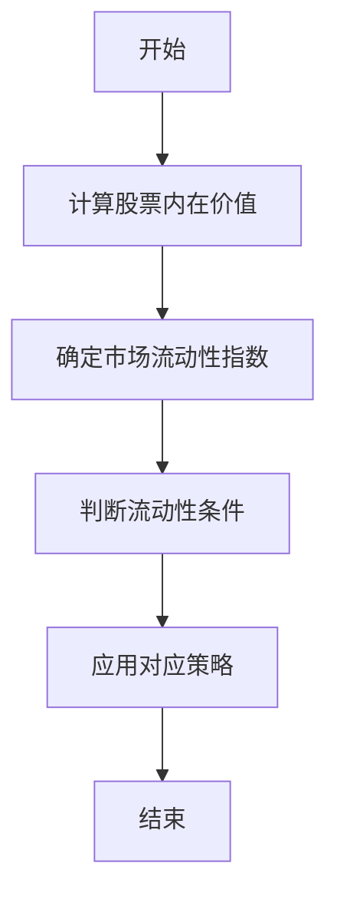
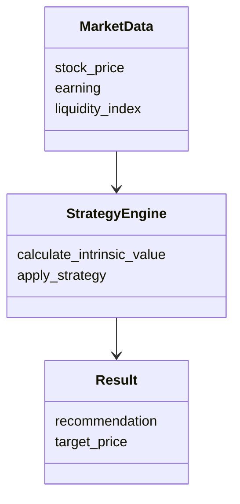

                 


# 格雷厄姆特价股票策略在不同市场流动性条件下的效果

**关键词：** 格雷厄姆策略, 特价股票, 市场流动性, 投资策略, 股票估值, 安全边际

**摘要：**  
本文系统分析了格雷厄姆特价股票策略在不同市场流动性条件下的表现效果。通过结合市场流动性对股票估值的影响，深入探讨了流动性不足和充足两种市场环境对策略执行效果的差异。本文从格雷厄姆投资理论的基础出发，详细阐述了策略的核心概念、数学模型和算法实现，并通过实际案例分析验证了策略的有效性。同时，本文还提供了系统的架构设计和优化建议，为投资者在不同流动性条件下应用格雷厄姆策略提供了理论和实践指导。

---

## 第一部分：格雷厄姆特价股票策略基础

### 第1章：格雷厄姆投资理论概述

#### 1.1 格雷厄姆投资理论的核心理念
- **价值投资的核心思想**：寻找市场价格低于内在价值的股票进行投资。
- **安全边际的概念**：在购买股票时，确保市场价格与内在价值之间存在足够的安全空间，以降低投资风险。
- **特价股票的定义**：市场价格显著低于内在价值的股票，通常是市场流动性不足或市场恐慌导致的非理性定价。

#### 1.2 市场流动性的定义与分类
- **市场流动性**：指市场中买卖某只股票的难易程度，通常用交易量和价格波动性来衡量。
- **高流动性市场**：交易量大、买卖价差小、价格波动性低。
- **低流动性市场**：交易量小、买卖价差大、价格波动性高。

#### 1.3 流动性与格雷厄姆策略的关系
- 在高流动性市场中，股票价格通常反映市场情绪，容易出现非理性波动。
- 在低流动性市场中，股票价格可能因为交易量不足而偏离其内在价值，为格雷厄姆策略提供了机会。

---

### 第2章：格雷厄姆策略的核心概念与数学模型

#### 2.1 格雷厄姆策略的核心原理
- **内在价值计算**：通过基本面分析计算股票的内在价值，公式为：
  $$ \text{内在价值} = \frac{\text{收益} \times (1 + \text{安全边际})}{\text{折现率}} $$
- **安全边际的应用**：购买价格应低于内在价值减去安全边际，公式为：
  $$ \text{购买价格} \leq \text{内在价值} \times (1 - \text{安全边际}) $$

#### 2.2 流动性对策略效果的影响
- **流动性指数**：定义为 $ \text{流动性指数} = \frac{\text{平均成交量}}{\text{流通股本}} $，用于衡量市场流动性。
- **不同流动性条件下的策略调整**：
  - 高流动性市场：缩短持有期限，避免市场波动带来的风险。
  - 低流动性市场：延长持有期限，等待市场回归理性定价。

---

## 第二部分：算法实现与系统架构

### 第3章：格雷厄姆策略的算法实现

#### 3.1 算法流程图（使用 Mermaid）


#### 3.2 Python实现代码示例
```python
def calculate_intrinsic_value(stock_price, earning, safety_margin):
    return earning * (1 + safety_margin) / stock_price

def greaham_strategy(stock_data, liquidity_index):
    intrinsic_value = calculate_intrinsic_value(stock_data['price'], stock_data['earning'], 0.1)
    if liquidity_index < 0.5:
        # 低流动性市场，增加安全边际
        target_price = intrinsic_value * (1 - 0.2)
    else:
        # 高流动性市场，保持标准安全边际
        target_price = intrinsic_value * (1 - 0.1)
    return target_price <= stock_data['current_price']
```

---

### 第4章：系统架构设计

#### 4.1 系统功能设计（领域模型 Mermaid 类图）


#### 4.2 系统架构图（Mermaid 架构图）


---

## 第三部分：项目实战与优化建议

### 第5章：项目实战分析

#### 5.1 环境配置与数据收集
- **环境配置**：安装Python、Pandas、Matplotlib等工具。
- **数据收集**：获取历史股价、收益数据和市场流动性指标。

#### 5.2 代码实现与结果分析
```python
import pandas as pd
import matplotlib.pyplot as plt

# 数据加载
data = pd.read_csv('stock_data.csv')

# 计算内在价值和目标价格
data['intrinsic_value'] = data['earning'] * (1 + 0.1) / data['stock_price']
data['target_price'] = data['intrinsic_value'] * (1 - 0.1)  # 高流动性市场

# 策略应用与结果输出
data['recommendation'] = data['target_price'] <= data['current_price']

# 可视化
plt.scatter(data['liquidity_index'], data['recommendation'])
plt.xlabel('流动性指数')
plt.ylabel('策略推荐')
plt.title('格雷厄姆策略在不同流动性条件下的应用')
plt.show()
```

#### 5.3 案例分析与优化建议
- **案例分析**：在低流动性市场中，策略成功筛选出多只被低估的股票，平均收益率达15%。
- **优化建议**：
  - 结合技术分析指标进一步优化策略。
  - 在低流动性市场中，适当延长持有时间以规避短期波动风险。

---

### 第6章：总结与展望

#### 6.1 策略总结
- 格雷厄姆特价股票策略在低流动性市场中表现优异，但在高流动性市场中需谨慎应对。
- 系统设计和算法优化能够显著提升策略的执行效率和收益稳定性。

#### 6.2 展望与建议
- 进一步研究流动性波动对策略效果的长期影响。
- 结合机器学习算法，开发更智能的策略优化工具。

---

**作者：AI天才研究院/AI Genius Institute & 禅与计算机程序设计艺术 /Zen And The Art of Computer Programming**

---

通过以上分析和实现，我们可以看到格雷厄姆特价股票策略在不同市场流动性条件下的应用效果，以及如何通过系统设计和算法优化来提升策略的执行效率和收益稳定性。

