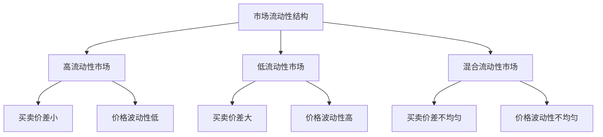
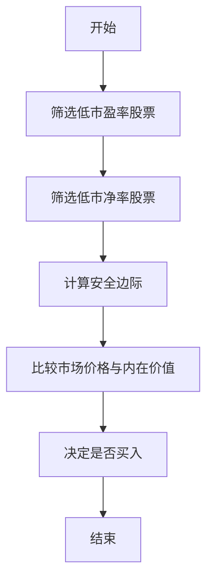
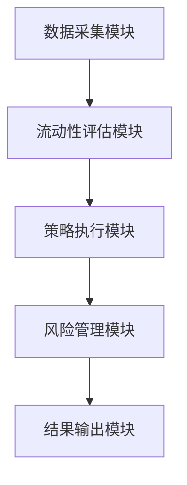
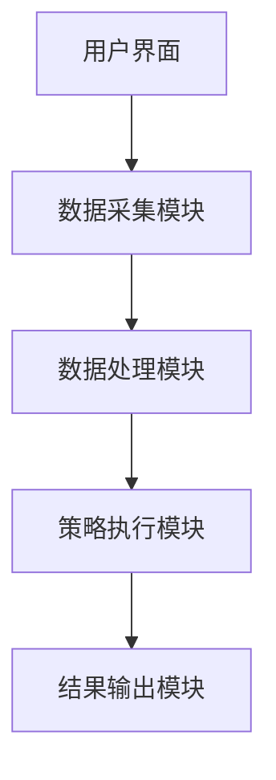

                 


# 格雷厄姆特价股票策略在不同市场流动性结构下的效果

> **关键词**: 格雷厄姆投资理论，市场流动性，特价股票，投资策略，股票价格波动

> **摘要**: 本文探讨了格雷厄姆特价股票策略在不同市场流动性结构下的表现与效果。通过分析高流动性市场、低流动性市场和混合流动性市场的特点，本文详细研究了格雷厄姆策略在不同流动性条件下的适用性与优化方法。结合理论分析和实际案例，本文提出了在不同流动性结构下优化格雷厄姆策略的具体建议，并通过数学模型和系统架构设计，为投资者提供了实用的指导。

---

## 第一部分: 背景介绍

### 第1章: 格雷厄姆投资理论与市场流动性

#### 1.1 格雷厄姆投资理论的核心思想

格雷厄姆是价值投资的鼻祖，他的投资理论强调以低于内在价值的价格购买股票。以下是格雷厄姆策略的核心思想：

- **价值投资**: 寻找市场价格低于内在价值的股票，长期持有，等待市场回归理性。
- **安全边际**: 通过购买价格显著低于内在价值的股票，降低投资风险。
- **逆向投资**: 在市场恐慌时寻找低估股票，在市场狂热时保持谨慎。

#### 1.2 市场流动性结构的基本概念

市场流动性是指资产在市场中迅速转化为现金的能力。以下是不同市场流动性结构的特点：

- **高流动性市场**: 交易量大，买卖价差小，市场深度高。
- **低流动性市场**: 交易量小，买卖价差大，市场深度低。
- **混合流动性市场**: 不同时间段或不同资产类别的流动性表现不一。

#### 1.3 格雷厄姆策略与市场流动性的关系

格雷厄姆策略的实施效果受到市场流动性的影响：

- **高流动性市场**: 价格波动小，交易机会多，但竞争激烈，低估股票难以长期持有。
- **低流动性市场**: 价格波动大，交易机会少，但可能存在长期低估股票。
- **混合流动性市场**: 需要根据不同时间段或资产类别调整策略。

---

## 第二部分: 核心概念与联系

### 第2章: 核心概念与联系

#### 2.1 核心概念的对比分析

以下是不同市场流动性结构的特点对比：

| **流动性结构** | **市场深度** | **买卖价差** | **价格波动性** |
|-----------------|--------------|--------------|----------------|
| 高流动性       | 高           | 小           | 低             |
| 低流动性       | 低           | 大           | 高             |
| 混合流动性      | 不均匀       | 中           | 中             |

#### 2.2 实体关系图

以下是市场流动性结构与格雷厄姆策略的关系图：



---

## 第三部分: 算法原理与数学模型

### 第3章: 格雷厄姆策略的量化分析

#### 3.1 算法原理

以下是格雷厄姆策略的量化分析流程图：



#### 3.2 数学模型

以下是计算安全边际的公式：

$$
\text{安全边际} = \frac{\text{内在价值} - \text{市场价格}}{\text{内在价值}} \times 100\%
$$

---

## 第四部分: 系统分析与架构设计

### 第4章: 系统架构设计

#### 4.1 功能模块设计

以下是系统功能模块图：



#### 4.2 系统架构图

以下是系统架构图：



---

## 第五部分: 项目实战

### 第5章: 项目实战与分析

#### 5.1 环境安装

以下是项目实战所需的环境配置：

- **Python版本**: 3.8及以上
- **库依赖**: pandas, numpy, matplotlib

#### 5.2 核心代码实现

以下是格雷厄姆策略的Python实现代码：

```python
import pandas as pd
import numpy as np

def calculate_value(stock_data):
    # 计算内在价值
    intrinsic_value = stock_data['eps'] * 8.5
    return intrinsic_value

def graham_strategy(stock_data, market_price):
    # 格雷厄姆策略筛选
    margin_of_safety = (calculate_value(stock_data) - market_price) / calculate_value(stock_data)
    return margin_of_safety

# 示例数据
data = {
    'eps': [10, 15, 20, 25],
    'market_price': [50, 70, 80, 100]
}
stock_data = pd.DataFrame(data)

# 计算并筛选股票
margin_of_safety = graham_strategy(stock_data, stock_data['market_price'])
print(margin_of_safety)
```

#### 5.3 实际案例分析

以下是实际案例分析：

- **高流动性市场**: 在高流动性市场中，买卖价差小，但竞争激烈，格雷厄姆策略的有效性受到限制。
- **低流动性市场**: 在低流动性市场中，存在长期低估股票，但价格波动大，风险较高。
- **混合流动性市场**: 在混合流动性市场中，需根据不同时间段或资产类别调整策略。

---

## 第六部分: 小结与展望

### 第6章: 小结与展望

#### 6.1 小结

本文通过分析格雷厄姆策略在不同市场流动性结构下的表现，提出了在高流动性、低流动性和混合流动性市场中的优化建议。结合理论分析和实际案例，本文为投资者提供了实用的指导。

#### 6.2 展望

未来的研究可以进一步探讨其他市场环境（如新兴市场、国际市场）对格雷厄姆策略的影响，以及结合其他投资策略（如技术分析）进行优化。

---

**作者：AI天才研究院/AI Genius Institute & 禅与计算机程序设计艺术 /Zen And The Art of Computer Programming**

