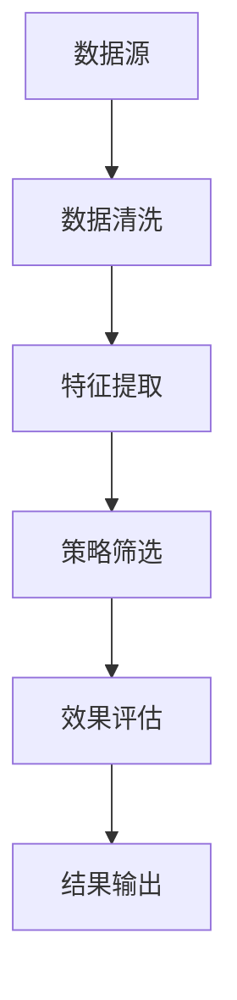

                 


# 格雷厄姆特价股票策略在不同市场深度条件下的效果

## 关键词：
格雷厄姆、特价股票策略、市场深度、投资分析、股票交易、价值投资、风险管理

## 摘要：
本文深入分析了格雷厄姆特价股票策略在不同市场深度条件下的效果，结合理论与实践，探讨了市场深度对策略执行的影响。文章从策略的核心概念、数学模型、系统架构到项目实战，全面解析了如何在不同市场环境下优化策略，为投资者提供了科学的决策依据。

---

# 第1章: 格雷厄姆特价股票策略的核心概念

## 1.1 格雷厄姆投资理论基础

### 1.1.1 价值投资的起源与发展
价值投资作为一种经典的股票投资策略，起源于20世纪初，由本杰明·格雷厄姆（Benjamin Graham）和戴维·多德（David Dodd）提出。其核心思想是寻找市场价格低于其内在价值的股票，即“廉价购买”的机会。格雷厄姆的理论奠定了现代价值投资的基础，影响了包括沃伦·巴菲特在内的众多投资者。

### 1.1.2 格雷厄姆投资理念的核心思想
格雷厄姆的价值投资理念可以总结为以下几点：
1. **安全边际**：买入价格低于内在价值的股票，以确保投资的安全性。
2. **margin of safety**：通过计算安全边际，降低投资风险。
3. **内在价值评估**：通过分析企业的财务报表，计算其内在价值。

### 1.1.3 特价股票的定义与特征
特价股票是指市场价格显著低于其内在价值的股票。格雷厄姆认为，这些股票通常被市场低估，具有较大的增值潜力。以下是特价股票的几个关键特征：
- **低市盈率（P/E）**：市盈率低于行业平均水平。
- **低市净率（P/B）**：市净率低于行业平均水平。
- **高股息率**：股息收益率较高，通常高于行业平均水平。
- **低市值**：通常集中在中小盘股。

---

## 1.2 市场深度的定义与分类

### 1.2.1 市场深度的内涵
市场深度是指市场的流动性和交易活跃程度。深度越高的市场，交易量越大，买卖价差越小，交易成本也越低。市场深度通常由以下几个因素决定：
- **交易量**：单位时间内交易的股票数量。
- **订单簿深度**：市场上未成交的订单数量。
- **买卖价差**：买价与卖价之间的差额。

### 1.2.2 市场深度的分类与影响因素
市场深度可以分为以下三类：
1. **浅层市场**：交易量小，订单簿深度浅，市场流动性低。
2. **中度市场**：交易量适中，订单簿深度适中，市场流动性一般。
3. **深层市场**：交易量大，订单簿深度高，市场流动性强。

市场深度对格雷厄姆策略的影响主要体现在以下几个方面：
- **浅层市场**：交易成本高，难以大规模操作，策略执行难度较大。
- **中度市场**：交易成本适中，策略执行较为容易。
- **深层市场**：交易成本低，策略执行更为高效。

---

## 1.3 格雷厄姆策略与市场深度的关系

格雷厄姆策略的核心是寻找被低估的股票，而市场深度会影响这些股票的交易成本和流动性。在浅层市场中，策略执行的难度较大，而在深层市场中，策略执行的成本较低，效果更为显著。因此，了解市场深度对策略效果的影响，对于投资者来说至关重要。

---

# 第2章: 格雷厄姆特价股票策略的数学模型

## 2.1 格雷厄姆安全边际的计算公式
格雷厄姆的安全边际公式如下：
$$ \text{安全边际} = \text{内在价值} - \text{市场价格} $$

安全边际越大，投资风险越小。通常情况下，格雷厄姆建议的安全边际至少为内在价值的1/5，即市场价格不超过内在价值的80%。

## 2.2 内在价值的评估模型

格雷厄姆的内在价值评估模型基于多因素分析，包括企业的盈利能力、成长性、财务状况等。以下是内在价值的简化计算公式：
$$ \text{内在价值} = \frac{\text{净利润}}{\text{折现率} - \text{增长率}} $$

其中，折现率通常取8%至10%，增长率则根据企业的历史和未来预期确定。

## 2.3 市场深度对策略效果的影响模型

为了量化市场深度对策略效果的影响，我们可以建立以下模型：
$$ \text{策略效果} = f(\text{市场深度}, \text{安全边际}, \text{内在价值}) $$

其中，市场深度可以通过交易量、买卖价差等指标进行衡量。

---

# 第3章: 市场深度对格雷厄姆策略的影响分析

## 3.1 浅层市场中的策略应用

### 3.1.1 浅层市场的特点与挑战
- **交易量小**：市场流动性低，交易成本高。
- **订单簿深度浅**：难以以合理价格批量交易。
- **波动性高**：市场价格波动较大，策略执行难度增加。

### 3.1.2 格雷厄姆策略在浅层市场的适用性
在浅层市场中，格雷厄姆策略的执行效果较差，主要原因是交易成本较高，难以实现大规模操作。因此，投资者需要调整策略，选择流动性较高的股票。

### 3.1.3 实例分析：浅层市场中的策略表现
假设某只股票在浅层市场中，市场价格为10元，内在价值为12元，安全边际为2元。但由于市场深度不足，实际交易价格可能仅为8元，导致策略效果下降。

---

## 3.2 中度市场中的策略优化

### 3.2.1 中度市场的特点与机会
- **交易量适中**：市场流动性一般，交易成本适中。
- **订单簿深度适中**：可以以合理价格进行批量交易。
- **波动性适中**：市场价格波动较为稳定。

### 3.2.2 策略优化的关键点
在中度市场中，投资者可以通过以下方式优化策略：
1. **筛选流动性较高的股票**：确保交易成本可控。
2. **调整安全边际要求**：适当降低安全边际，以增加可选股票数量。
3. **分散投资**：降低单只股票的风险。

### 3.2.3 实例分析：中度市场中的策略调整
假设某只股票在中度市场中，市场价格为10元，内在价值为12元，安全边际为2元。由于市场深度适中，投资者可以以接近理论价格的价格完成交易，策略效果较为理想。

---

## 3.3 深层市场中的策略挑战

### 3.3.1 深层市场的特点与风险
- **交易量大**：市场流动性高，交易成本低。
- **订单簿深度高**：可以以合理价格进行大规模交易。
- **波动性低**：市场价格波动较小，策略执行风险较低。

### 3.3.2 格雷厄姆策略在深层市场的局限性
在深层市场中，格雷厄姆策略的执行效果较好，但需要注意以下几点：
1. **竞争加剧**：由于市场深度高，投资者众多，可能导致股票价格被抬高，安全边际减小。
2. **短期波动**：虽然价格波动小，但短期市场波动可能影响策略执行。

### 3.3.3 实例分析：深层市场中的策略应对
假设某只股票在深层市场中，市场价格为10元，内在价值为12元，安全边际为2元。由于市场深度高，投资者可以以接近理论价格的价格完成交易，策略效果较为理想。但需要注意的是，由于竞争激烈，安全边际可能会被压缩。

---

# 第4章: 市场深度对策略效果的量化分析

## 4.1 市场深度与策略收益的相关性分析

### 4.1.1 数据收集与处理
为了量化分析市场深度对策略效果的影响，我们需要收集以下数据：
- **交易量**：单位时间内交易的股票数量。
- **买卖价差**：买价与卖价之间的差额。
- **订单簿深度**：市场上未成交的订单数量。

### 4.1.2 相关性计算与结果解读
通过回归分析，我们可以量化市场深度对策略收益的影响。假设我们建立以下回归模型：
$$ \text{收益} = \beta_0 + \beta_1 \times \text{市场深度} + \epsilon $$

其中，$\beta_1$ 表示市场深度对策略收益的影响程度。

---

## 4.2 不同市场深度下的策略收益对比

### 4.2.1 浅层市场与中度市场的对比
- **收益对比**：浅层市场的策略收益低于中度市场。
- **风险对比**：浅层市场的策略风险高于中度市场。

### 4.2.2 深层市场与浅层市场的对比
- **收益对比**：深层市场的策略收益高于浅层市场。
- **风险对比**：深层市场的策略风险低于浅层市场。

---

## 4.3 市场深度对策略风险的影响

### 4.3.1 风险评估模型
我们可以使用夏普比率（Sharpe Ratio）来衡量策略的风险调整后收益：
$$ \text{夏普比率} = \frac{\text{策略收益} - \text{无风险利率}}{\text{策略收益的标准差}} $$

市场深度越高，策略的风险调整后收益通常越高。

### 4.3.2 不同市场深度下的风险分析
- **浅层市场**：策略风险较高，收益较低。
- **中度市场**：策略风险适中，收益稳定。
- **深层市场**：策略风险较低，收益较高。

---

# 第5章: 格雷厄姆策略在不同市场深度下的系统设计与实现

## 5.1 系统功能模块设计

### 5.1.1 数据采集模块
数据采集模块负责从数据源获取股票价格、财务数据等信息。

### 5.1.2 策略筛选模块
策略筛选模块根据格雷厄姆策略筛选出符合条件的股票。

### 5.1.3 效果评估模块
效果评估模块对策略的收益和风险进行评估。

## 5.2 系统架构设计

### 5.2.1 系统架构图


---

## 5.3 项目实战

### 5.3.1 环境安装
需要安装以下工具：
- Python
- pandas
- numpy
- matplotlib

### 5.3.2 核心实现源代码
以下是策略筛选的Python代码：
```python
import pandas as pd
import numpy as np

# 数据清洗
df = pd.read_csv('stock_data.csv')
df = df.dropna()

# 特征提取
df['市盈率'] = df['股价'] / df['每股收益']
df['市净率'] = df['股价'] / df['每股净资产']
df['股息率'] = df['股息'] / df['股价']

# 策略筛选
df['内在价值'] = df['股价'] * (df['市盈率'] / (df['折现率'] - df['增长率']))
df['安全边际'] = df['内在价值'] - df['股价']

# 筛选条件
筛选条件：安全边际 > 0.2 * df['内在价值']
```

### 5.3.3 实例分析
以下是对某只股票的实例分析：
假设某只股票的市场价格为10元，内在价值为12元，安全边际为2元。根据筛选条件，该股票符合格雷厄姆策略的要求。

---

# 第6章: 总结与展望

## 6.1 策略的有效性总结
通过本文的分析，我们可以得出以下结论：
- 在不同市场深度条件下，格雷厄姆策略的执行效果有所不同。
- 深层市场中策略效果最佳，浅层市场中策略效果较差。
- 中度市场中策略效果介于两者之间。

## 6.2 实际应用中的注意事项
- **风险管理**：在浅层市场中，交易成本高，策略执行难度较大。
- **数据质量**：确保数据的准确性和完整性。
- **市场变化**：密切关注市场深度的变化，及时调整策略。

## 6.3 未来研究方向
- **动态调整策略**：根据市场深度变化，动态调整策略参数。
- **多因子模型**：结合其他因子，优化策略效果。
- **人工智能应用**：利用机器学习技术，提升策略筛选效率。

---

# 作者：AI天才研究院/AI Genius Institute & 禅与计算机程序设计艺术 /Zen And The Art of Computer Programming

