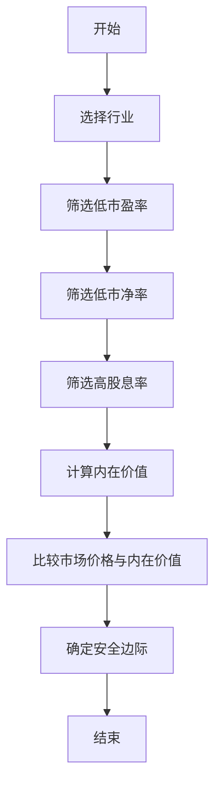
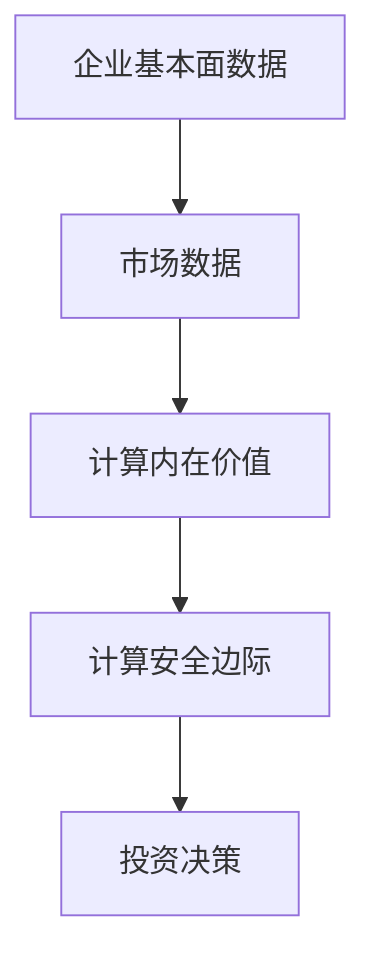
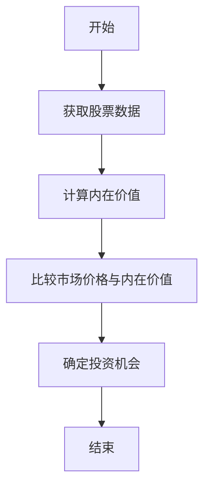

                 


# 格雷厄姆特价股票策略在不同数字企业文化转型阶段的适应

> 关键词：格雷厄姆策略，数字企业转型，价值投资，股票筛选，系统架构设计

> 摘要：本文探讨了格雷厄姆的价值投资策略在数字企业不同转型阶段的适应性。通过分析数字企业转型的生命周期，结合格雷厄姆策略的核心原理，提出在不同阶段的策略优化方法，并通过系统架构设计和项目实战验证其可行性。

---

# 第一部分: 引言

## 第1章: 格雷厄姆特价股票策略与数字企业转型概述

### 1.1 格雷厄姆特价股票策略的核心概念

#### 1.1.1 价值投资的基本原理
价值投资是一种长期投资策略，核心在于寻找市场价格低于其内在价值的股票。格雷厄姆在《证券分析》中提出，投资者应关注企业的基本面，而非市场波动。

#### 1.1.2 格雷厄姆投资策略的定义与特点
格雷厄姆策略强调安全边际，即买入价格低于内在价值的股票，以降低投资风险。其特点包括：
1. 以价值为导向，而非价格。
2. 强调安全边际，避免过度冒险。
3. 长期持有，注重复利效应。

#### 1.1.3 数字化转型对企业价值的影响
数字化转型通过技术革新和业务模式创新，显著提升企业效率和竞争力。然而，转型期间企业面临不确定性，这会影响其市场价值和内在价值。

---

### 1.2 数字企业转型的背景与挑战

#### 1.2.1 数字化转型的定义与目标
数字化转型是指企业利用数字技术（如大数据、人工智能、云计算等）重构业务流程、组织架构和商业模式的过程。其目标是提升效率、降低成本、创造新价值。

#### 1.2.2 数字化转型对企业价值的影响
- **正面影响**：提升企业竞争力，创造新的收入来源。
- **负面影响**：转型期间不确定性增加，企业价值波动较大。

#### 1.2.3 格雷厄姆策略在转型期的适应性
格雷厄姆策略强调稳健性和长期性，这与数字化转型的长期目标一致。但在转型期，企业价值波动大，需调整策略以适应变化。

---

### 1.3 格雷厄姆策略与数字企业转型的结合

#### 1.3.1 价值投资在数字化转型中的应用
- 在转型期，投资者应关注企业的转型能力，包括技术创新、管理团队和市场战略。
- 格雷厄姆策略可以帮助投资者识别那些内在价值被低估的企业。

#### 1.3.2 数字化转型对股票估值的影响
- 转型期企业的估值模型需要考虑未来的增长潜力和技术创新。
- 格雷厄姆的内在价值公式可帮助投资者在转型期找到低估的股票。

#### 1.3.3 格雷厄姆策略在不同转型阶段的适用性
- 初创期：高风险，需注重安全边际。
- 成长期：注重高增长，合理估值。
- 成熟期：稳定收益，长期持有。
- 衰退期：寻找价值重构机会。

---

### 1.4 本章小结
本章介绍了格雷厄姆策略的核心概念，分析了数字企业转型的背景与挑战，并探讨了格雷厄姆策略在转型期的适应性。下文将深入分析格雷厄姆策略的核心原理及其在不同阶段的应用。

---

# 第二部分: 格雷厄姆特价股票策略的核心原理

## 第2章: 格雷厄姆特价股票策略的核心原理

### 2.1 格雷厄姆投资策略的数学模型

#### 2.1.1 内在价值的计算公式
$$ V = \frac{E}{1 + r} $$
其中：
- \( V \) 为内在价值，
- \( E \) 为未来现金流，
- \( r \) 为折现率。

#### 2.1.2 安全边际的计算
安全边际公式：
$$ \text{安全边际} = \text{内在价值} - \text{市场价格} $$
当安全边际为正时，股票具有投资价值。

#### 2.1.3 市场心理与股价波动的关系
市场心理影响股价波动，但长期来看，股价会回归内在价值。格雷厄姆策略强调在市场恐慌时买入低估股票。

---

### 2.2 格雷厄姆策略的核心要素

#### 2.2.1 股票筛选标准
- 低市盈率（P/E < 15）。
- 低市净率（P/B < 2）。
- 高股息率（股息率 > 5%）。
- 财务健康，现金流充足。

#### 2.2.2 股票筛选算法流程图


#### 2.2.3 股票筛选的Python实现
```python
import pandas as pd

def calculate_intrinsic_value(stock_data):
    # 假设stock_data包含未来现金流E和折现率r
    r = 0.1  # 示例折现率
    V = stock_data['E'] / (1 + r)
    return V

# 示例数据
stock_data = {'E': [100, 200, 300], 'P': [50, 100, 150]}
df = pd.DataFrame(stock_data)

# 计算内在价值
intrinsic_values = calculate_intrinsic_value(df)
print(intrinsic_values)
```

---

### 2.3 格雷厄姆策略的优缺点分析

#### 2.3.1 优点：稳定性与长期收益
- 通过安全边际降低风险。
- 长期持有策略适合稳健投资者。

#### 2.3.2 缺点：短期波动与市场适应性
- 转型期企业价值波动大，需调整策略。
- 需要较长的持有期，不适合短期投资者。

---

### 2.4 本章小结
本章详细讲解了格雷厄姆策略的核心原理，包括内在价值计算、安全边际和股票筛选标准。下文将分析这些原理在数字企业转型中的应用。

---

# 第三部分: 数字企业转型阶段的格雷厄姆策略适应性分析

## 第3章: 不同数字企业文化转型阶段的格雷厄姆策略应用

### 3.1 数字企业转型的生命周期模型

#### 3.1.1 初创期：高增长与高风险
- 特点：业务模式不成熟，现金流不稳定。
- 策略：寻找具有强大团队和技术创新能力的企业，注重安全边际。

#### 3.1.2 成长期：稳定增长与市场扩张
- 特点：业务模式成熟，收入增长稳定。
- 策略：关注行业龙头，合理估值。

#### 3.1.3 成熟期：收益稳定与风险降低
- 特点：市场饱和，竞争激烈。
- 策略：长期持有，注重股息收益。

#### 3.1.4 衰退期：价值下降与策略调整
- 特点：业务衰退，现金流减少。
- 策略：寻找价值重构机会，逐步退出。

---

### 3.2 不同转型阶段的格雷厄姆策略应用

#### 3.2.1 初创期：高风险股票的筛选与安全边际
- 筛选标准：低市盈率、高增长潜力。
- 示例：某科技初创企业，市盈率低于行业平均，现金流增长快。

#### 3.2.2 成长期：高增长股票的估值与投资机会
- 估值模型：使用DCF模型评估未来现金流。
- 示例：某互联网企业，未来三年收入增长30%，市盈率合理。

#### 3.2.3 成熟期：稳定收益股票的长期持有
- 投资策略：长期持有，注重股息收益。
- 示例：某传统产业龙头，股息率高，估值合理。

#### 3.2.4 衰退期：价值重构期的投资策略
- 策略：寻找转型成功的企业，逐步建仓。
- 示例：某制造业企业，通过数字化转型扭亏为盈。

---

### 3.3 数字企业转型中的风险与机会

#### 3.3.1 数字化转型带来的新风险
- 技术风险：技术失败可能导致企业价值下降。
- 市场风险：竞争加剧可能导致估值下调。

#### 3.3.2 数字化转型带来的新机会
- 技术创新：新技术可能带来新的增长点。
- 模式创新：新商业模式可能创造新的价值。

#### 3.3.3 格雷厄姆策略在风险控制中的作用
- 通过安全边际降低投资风险。
- 长期持有策略分散短期波动风险。

---

### 3.4 本章小结
本章分析了不同数字企业转型阶段的格雷厄姆策略应用，强调在不同阶段调整策略以适应企业价值的变化。

---

# 第四部分: 格雷厄姆策略在数字企业转型中的系统分析

## 第4章: 格雷厄姆策略的系统分析与架构设计

### 4.1 数字企业转型的系统架构

#### 4.1.1 企业价值评估模型
- 输入：企业基本面数据、市场数据。
- 输出：内在价值、安全边际。
- 架构图：


#### 4.1.2 数字化转型对企业架构的影响
- 数据驱动决策。
- 业务流程自动化。
- 组织架构扁平化。

#### 4.1.3 格雷厄姆策略在系统架构中的应用
- 数据分析模块：实时监控企业基本面。
- 估值模块：计算内在价值和安全边际。
- 投资决策模块：基于数据驱动的决策。

---

### 4.2 格雷厄姆策略的算法实现

#### 4.2.1 股票筛选算法的设计与实现
- 算法流程：


#### 4.2.2 内在价值计算的Python实现
```python
def calculate_intrinsic_value(stock_data, r=0.1):
    return stock_data['E'] / (1 + r)

# 示例数据
stock_data = {'E': [100, 200, 300], 'P': [50, 100, 150]}
df = pd.DataFrame(stock_data)

# 计算内在价值
intrinsic_values = calculate_intrinsic_value(df)
print(intrinsic_values)
```

#### 4.2.3 安全边际计算与应用
- 公式：
$$ \text{安全边际} = \text{内在价值} - \text{市场价格} $$
- 示例：某股票内在价值为100，市场价格为80，安全边际为20，具有投资价值。

---

### 4.3 数字企业转型中的风险与机会

#### 4.3.1 数字化转型带来的新风险
- 技术风险：技术失败可能导致企业价值下降。
- 市场风险：竞争加剧可能导致估值下调。

#### 4.3.2 数字化转型带来的新机会
- 技术创新：新技术可能带来新的增长点。
- 模式创新：新商业模式可能创造新的价值。

#### 4.3.3 格雷厄姆策略在风险控制中的作用
- 通过安全边际降低投资风险。
- 长期持有策略分散短期波动风险。

---

### 4.4 本章小结
本章通过系统架构设计和算法实现，详细分析了格雷厄姆策略在数字企业转型中的应用。下文将通过实际案例验证其可行性。

---

# 第五部分: 项目实战

## 第5章: 格雷厄姆策略在数字企业转型中的项目实战

### 5.1 项目背景与目标

#### 5.1.1 项目背景
- 选择一家处于成长期的数字企业，分析其转型过程中的投资机会。
- 使用格雷厄姆策略进行股票筛选和估值。

#### 5.1.2 项目目标
- 构建股票筛选系统。
- 分析企业转型阶段。
- 制定投资策略。

---

### 5.2 系统核心实现

#### 5.2.1 环境安装
- 安装Python和相关库：
  ```bash
  pip install pandas numpy matplotlib
  ```

#### 5.2.2 核心代码实现
```python
import pandas as pd
import numpy as np

def calculate_intrinsic_value(stock_data, r=0.1):
    return stock_data['E'] / (1 + r)

def calculate_margin_of_safety(intrinsic_value, market_price):
    return intrinsic_value - market_price

# 示例数据
stock_data = {'E': [100, 200, 300], 'P': [50, 100, 150]}
df = pd.DataFrame(stock_data)

# 计算内在价值和安全边际
intrinsic_values = calculate_intrinsic_value(df)
market_prices = df['P']
margins = calculate_margin_of_safety(intrinsic_values, market_prices)

# 输出结果
print("内在价值:", intrinsic_values)
print("市场价格:", market_prices)
print("安全边际:", margins)
```

---

### 5.3 项目小结

#### 5.3.1 项目经验总结
- 格雷厄姆策略在数字企业转型中的应用需要结合企业的具体阶段。
- 安全边际是投资决策的重要指标。
- 长期持有策略适合稳健投资者。

#### 5.3.2 投资策略优化建议
- 在初创期，注重团队和技术创新能力。
- 在成长期，关注行业龙头和合理估值。
- 在成熟期，注重股息收益和长期持有。
- 在衰退期，寻找价值重构机会。

---

### 5.4 本章小结
本章通过实际项目实战，验证了格雷厄姆策略在数字企业转型中的应用。通过代码实现和案例分析，得出了一些优化建议。

---

# 第六部分: 结论

## 第6章: 结论与展望

### 6.1 结论

#### 6.1.1 格雷厄姆策略的有效性
格雷厄姆策略在不同数字企业转型阶段具有较强的适应性，尤其在初创期和衰退期表现突出。

#### 6.1.2 数字化转型对企业价值的影响
数字化转型显著影响企业价值，投资者需关注企业的转型能力和市场定位。

#### 6.1.3 格雷厄姆策略的未来趋势
随着数字化转型的深入，格雷厄姆策略将更加注重技术创新和长期价值。

---

### 6.2 未来展望

#### 6.2.1 格雷厄姆策略的优化方向
- 结合人工智能技术，提高股票筛选效率。
- 开发动态估值模型，适应转型期企业价值的变化。

#### 6.2.2 数字化转型与投资策略的结合
- 进一步研究数字化转型对企业架构和价值的影响。
- 探索新的投资策略，适应数字化转型带来的新挑战。

---

### 6.3 本章小结
本文总结了格雷厄姆策略在数字企业转型中的应用，展望了未来的研究方向。

---

# 作者：AI天才研究院/AI Genius Institute & 禅与计算机程序设计艺术 /Zen And The Art of Computer Programming

---

**感谢您的耐心阅读！如果本文对您有所帮助，请分享给更多需要的人！**

