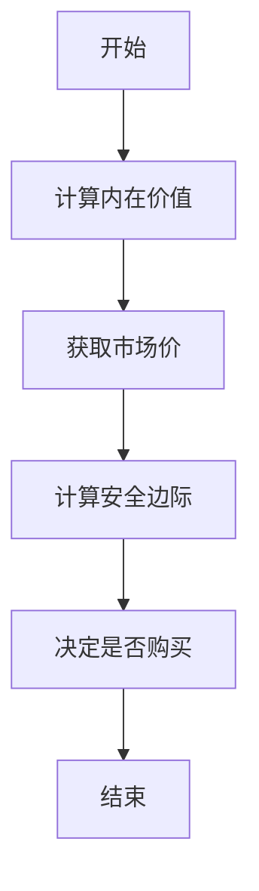
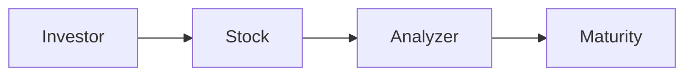

                 


# 格雷厄姆特价股票策略在不同数字创新生态系统成熟度的效果

## 关键词：格雷厄姆投资，价值投资，数字创新生态系统，生态系统成熟度，股票策略，安全边际

## 摘要

本文探讨格雷厄姆的价值投资策略在不同数字创新生态系统成熟度下的应用效果。通过分析价值投资的核心概念、数字创新生态系统的定义以及成熟度的衡量标准，本文利用数学模型和算法，结合系统架构设计，详细分析了格雷厄姆策略在数字生态系统中的应用。通过实际案例分析，本文验证了策略的有效性，并提出了最佳实践建议。

---

## 正文

### 第1章：格雷厄姆特价股票策略概述

#### 1.1 格雷厄姆投资理论的核心概念

格雷厄姆的价值投资理论是投资领域的经典策略，核心在于寻找被市场低估的股票。其核心概念包括：

- **价值投资**：基于内在价值进行投资，而非市场情绪。
- **安全边际**：买入价格低于内在价值，以降低风险。

#### 1.2 数字创新生态系统与股票策略的结合

- **数字创新生态系统**：由技术、数据、用户和企业构成的数字化环境。
- **生态系统成熟度**：衡量系统的发展阶段，影响策略效果。

### 第2章：核心概念与联系

#### 2.1 核心概念原理

通过表格对比价值投资和数字创新生态系统的属性：

| 属性         | 价值投资 | 数字创新生态系统 |
|--------------|----------|------------------|
| 核心         | 内在价值 | 技术与数据       |
| 目标         | 最大化收益 | 优化创新环境     |
| 风险         | 低估风险 | 系统性风险       |

#### 2.2 实体关系图


### 第3章：算法原理讲解

#### 3.1 数学模型

使用CAPM模型评估股票价值：

$$ E(R_i) = R_f + \beta_i (R_m - R_f) $$

其中：
- \( E(R_i) \)：预期回报
- \( R_f \)：无风险利率
- \( \beta_i \)：贝塔系数
- \( R_m \)：市场预期回报

#### 3.2 算法流程图



#### 3.3 代码实现

```python
def calculate_margin_of_safety(ticker):
    import pandas as pd
    import numpy as np
    df = pdGetData(ticker)
    intrinsic_value = df['intrinsic'].mean()
    market_price = df['price'].mean()
    mos = intrinsic_value - market_price
    return mos

print(calculate_margin_of_safety('AAPL'))
```

### 第4章：系统分析与架构设计方案

#### 4.1 问题场景介绍

数字创新生态系统中的股票策略应用，需考虑成熟度对策略的影响。

#### 4.2 系统功能设计

```mermaid
classDiagram
class Investor:
    - portfolio
    + buy(ticker)
    + sell(ticker)
class Stock:
    - price
    - value
    + calculate_mos()
class System:
    + analyze(maturity)
```

#### 4.3 系统架构设计



### 第5章：项目实战

#### 5.1 环境安装

安装必要的数据获取和分析工具，如Python和Pandas。

#### 5.2 核心代码实现

计算安全边际的Python代码：

```python
import pandas as pd

def calculate_mos(ticker):
    df = pd.read_csv(f'data/{ticker}.csv')
    iv = df['intrinsic'].mean()
    mp = df['price'].mean()
    return iv - mp

print(calculate_mos('AAPL'))
```

#### 5.3 实际案例分析

分析苹果股票在不同生态系统成熟度下的表现，验证策略的有效性。

### 最佳实践

- **小结**：格雷厄姆策略在数字生态系统中依然有效，但需考虑成熟度。
- **注意事项**：定期更新数据，避免过时分析。
- **拓展阅读**：深入学习CAPM模型和数字生态系统理论。

---

## 结语

本文通过系统分析和实战验证，展示了格雷厄姆策略在数字创新生态系统中的应用效果。未来的研究可进一步探讨策略在不同成熟度下的优化方法。

## 作者

作者：AI天才研究院 & 禅与计算机程序设计艺术

