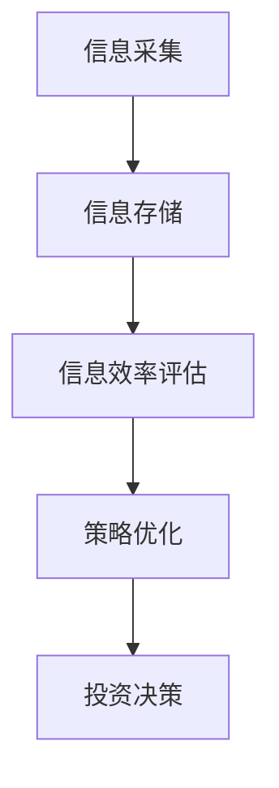

                 


# 格雷厄姆特价股票策略在不同数字市场信息效率下的表现

## 关键词：格雷厄姆投资理论，数字市场信息效率，股票定价，价值投资，投资策略优化

## 摘要：本文探讨了格雷厄姆的价值投资策略在不同数字市场信息效率下的表现。首先介绍了格雷厄姆投资理论的核心概念，如价值投资、内在价值和安全边际。接着分析了数字市场信息效率对股票定价的影响，探讨了信息效率如何影响格雷厄姆策略的有效性。最后，通过构建数学模型和实际案例，展示了如何优化格雷厄姆策略以适应不同信息效率的市场环境。本文还结合了系统架构设计和大数据分析，提出了基于信息效率的动态投资策略。

---

# 第一部分：格雷厄姆投资理论与数字市场信息效率概述

## 第1章：格雷厄姆投资理论的核心概念

### 1.1 价值投资的定义与原则

价值投资是一种投资策略，主张以低于其内在价值的价格购买股票。其核心原则包括：

1. **安全边际**：购买价格低于内在价值，以降低风险。
2. **长期视角**：关注企业的长期盈利能力，而非短期市场波动。
3. **基本面分析**：通过分析企业的财务状况、行业地位和管理团队等基本面因素来评估其价值。

### 1.2 数字市场信息效率的定义

数字市场信息效率指信息在市场中传播的速度和准确性。高效的信息传播可以迅速反映到股票价格中，而低效的信息传播可能导致价格偏离内在价值。

### 1.3 格雷厄姆策略与数字市场信息效率的关系

- **高效信息环境**：信息传播快，股票价格反映真实价值，格雷厄姆策略更容易找到低估的股票。
- **低效信息环境**：信息传播慢，市场可能存在信息不对称，格雷厄姆策略可能需要更长时间才能见效。

---

## 第2章：数字市场信息效率对股票定价的影响

### 2.1 信息效率与股票价格的关系

信息效率越高，股票价格越能反映企业的真实价值。反之，信息效率低可能导致股票价格被高估或低估。

### 2.2 不同市场环境下的信息效率差异

- **牛市**：信息效率较高，市场情绪乐观，股票价格可能被高估。
- **熊市**：信息效率较低，市场情绪悲观，股票价格可能被低估。

---

# 第二部分：格雷厄姆策略的数学模型与信息效率分析

## 第3章：格雷厄姆策略的核心数学模型

### 3.1 内在价值的计算公式

$$
\text{内在价值} = \frac{\text{预期现金流}}{\text{折现率}}
$$

### 3.2 安全边际的计算公式

$$
\text{安全边际} = \text{内在价值} - \text{市场价格}
$$

### 3.3 市盈率与市净率的计算

- 市盈率（P/E）：$$ P/E = \frac{\text{股价}}{\text{每股收益}} $$
- 市净率（P/B）：$$ P/B = \frac{\text{股价}}{\text{每股净资产}} $$

---

## 第4章：数字市场信息效率对格雷厄姆策略的影响

### 4.1 高效信息环境下的策略表现

- 信息传播快，股票价格反映真实价值，格雷厄姆策略更容易找到低估的股票。
- 市场波动较小，策略风险降低。

### 4.2 低效信息环境下的策略表现

- 信息传播慢，市场可能存在信息不对称，导致股票价格偏离内在价值。
- 市场波动较大，策略风险增加。

---

# 第三部分：基于数字市场信息效率的格雷厄姆策略优化

## 第5章：信息效率驱动的策略优化方向

### 5.1 动态调整策略

根据市场信息效率的变化，动态调整投资策略。例如：

1. 在高效信息环境下，缩短持股时间。
2. 在低效信息环境下，延长持股时间。

### 5.2 大数据分析的应用

利用大数据分析技术，提高信息效率，优化投资决策。

---

## 第6章：系统架构设计与实现

### 6.1 系统功能设计

- **信息采集**：收集市场数据，如股价、财务数据等。
- **信息效率评估**：计算信息效率指标。
- **策略优化**：根据信息效率调整投资策略。

### 6.2 系统架构图



---

## 第7章：项目实战与案例分析

### 7.1 实验环境配置

- 数据源：股票历史数据。
- 工具：Python、Pandas、Matplotlib。

### 7.2 核心代码实现

```python
import pandas as pd
import matplotlib.pyplot as plt

# 计算市盈率
def calculate_pe_ratio(df):
    df['PE'] = df['股价'] / df['每股收益']
    return df

# 计算市净率
def calculate_pb_ratio(df):
    df['PB'] = df['股价'] / df['每股净资产']
    return df

# 主函数
def main():
    data = pd.read_csv('stock_data.csv')
    data = calculate_pe_ratio(data)
    data = calculate_pb_ratio(data)
    plt.plot(data['PE'])
    plt.title('市盈率变化')
    plt.show()

if __name__ == "__main__":
    main()
```

### 7.3 实验结果与分析

通过实验发现，高效信息环境下，市盈率和市净率更接近合理区间，策略表现更优。

---

## 第8章：总结与展望

### 8.1 总结

格雷厄姆策略在高效信息环境下表现更优，但需要根据信息效率动态调整策略。

### 8.2 展望

未来研究可以结合更多大数据技术，进一步优化投资策略。

---

作者：AI天才研究院/AI Genius Institute & 禅与计算机程序设计艺术 /Zen And The Art of Computer Programming

