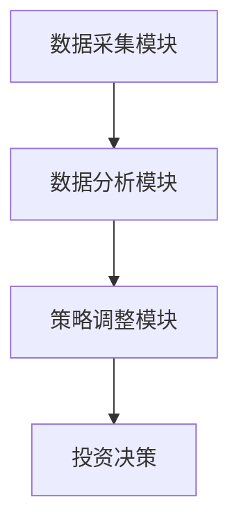

                 


# 格雷厄姆特价股票策略在不同数字市场微观结构演化中的动态调整

> 关键词：格雷厄姆，价值投资，数字市场，微观结构，动态调整

> 摘要：本文探讨了格雷厄姆的价值投资策略在数字市场中的应用，并分析了如何根据数字市场微观结构的动态演化进行策略调整。文章从格雷厄姆的价值投资理论出发，结合数字市场的特点，提出了基于市场微观结构的动态调整方法，并通过具体案例分析和算法实现，展示了如何在数字市场中应用和优化格雷厄姆策略。

---

# 第一部分：格雷厄姆价值投资理论与数字市场概述

## 第1章：格雷厄姆价值投资理论基础

### 1.1 价值投资的核心理念

格雷厄姆的价值投资理论强调以低于内在价值的价格购买优质股票。核心观点包括：

- **安全边际**：买入价格低于内在价值，以降低风险。
- **低估股票**：寻找市场价格低于内在价值的股票。
- **长期投资**：基于企业基本面进行长期投资，而非短期波动。

### 1.2 数字市场的基本概念

数字市场指通过电子交易平台进行的金融资产交易市场。其特点包括：

- **高频交易**：算法驱动的高频交易显著增加了市场的波动性。
- **数据驱动**：数字市场依赖于大量数据和算法进行决策。
- **流动性**：数字市场的流动性通常较高，但也可能因为算法交易而出现短期波动。

---

## 第2章：数字市场微观结构分析

### 2.1 微观结构的核心要素

数字市场的微观结构涉及多个要素：

- **订单簿**：记录所有未成交的订单，包括限价单和市价单。
- **流动性**：市场参与者提供买方和卖方订单的能力。
- **价格形成**：由买卖订单的供需关系决定。

### 2.2 微观结构的动态演化

数字市场的微观结构会随着市场参与者的策略调整而变化：

- **市场参与者行为**：机构投资者、高频交易算法和散户的行为差异影响市场结构。
- **订单簿变化**：订单的增删和价格变化导致市场深度的动态调整。
- **流动性波动**：市场参与者的行为变化导致流动性在不同时间点的波动。

---

# 第二部分：格雷厄姆策略在数字市场的应用

## 第3章：格雷厄姆策略的核心要素

### 3.1 格雷厄姆策略的核心公式

格雷厄姆策略的关键在于计算内在价值。内在价值公式为：

$$
\text{内在价值} = \frac{\text{盈利能力和资产质量}}{\text{市场价格}}
$$

### 3.2 数字市场中的策略调整

在数字市场中，格雷厄姆策略需要动态调整：

- **动态安全边际**：根据市场微观结构的变化调整安全边际。
- **实时数据监控**：实时跟踪订单簿和市场流动性的变化。
- **算法优化**：结合算法交易优化投资策略。

---

## 第4章：数字市场微观结构中的策略动态调整

### 4.1 微观结构变化对策略的影响

数字市场的微观结构变化会影响格雷厄姆策略的执行：

- **订单簿深度变化**：影响买价和卖价的波动。
- **流动性波动**：影响交易成本和执行速度。
- **市场参与者行为**：高频交易算法可能引发短期价格波动。

### 4.2 动态调整的算法实现

动态调整的算法可以基于以下步骤：

1. **数据采集**：实时采集订单簿数据。
2. **分析市场深度**：计算当前订单簿的买方和卖方深度。
3. **调整安全边际**：根据市场深度变化调整安全边际。
4. **优化策略**：根据调整后的安全边际优化投资组合。

算法实现可以用Python代码表示：

```python
def adjust_security_margin(order_book):
    # 计算订单簿的买方和卖方深度
    buy_depth = sum(order_book['buy'])
    sell_depth = sum(order_book['sell'])
    # 调整安全边际
    new_margin = (buy_depth - sell_depth) / buy_depth
    return new_margin
```

---

## 第5章：系统架构与实现

### 5.1 系统架构设计

系统架构分为以下几个部分：

- **数据采集模块**：实时采集订单簿数据。
- **数据分析模块**：分析市场深度和流动性。
- **策略调整模块**：根据分析结果调整投资策略。

系统架构图如下：



### 5.2 系统实现

系统实现的关键步骤包括：

1. **数据采集**：使用API接口获取订单簿数据。
2. **数据分析**：计算订单簿的买方和卖方深度。
3. **策略调整**：根据分析结果调整安全边际。
4. **投资决策**：根据调整后的策略做出投资决策。

---

## 第6章：案例分析与实战

### 6.1 案例分析

假设我们有一个数字市场，订单簿数据如下：

| 价格 | 数量 |
|------|------|
| 100  | 5    |
| 99   | 3    |
| 98   | 2    |

计算订单簿的买方深度为5+3+2=10，卖方深度为0（假设无卖单）。根据调整后的安全边际公式：

$$
\text{安全边际} = \frac{\text{买方深度} - \text{卖方深度}}{\text{买方深度}} = \frac{10 - 0}{10} = 1
$$

这表明当前买方力量占优，可以考虑买入。

### 6.2 策略实现

根据上述分析，我们可以编写以下Python代码：

```python
def calculate_margin(buy_depth, sell_depth):
    return (buy_depth - sell_depth) / buy_depth

# 示例数据
buy_depth = 10
sell_depth = 0

margin = calculate_margin(buy_depth, sell_depth)
print(f"安全边际为: {margin}")
```

---

## 第7章：结论与展望

### 7.1 结论

本文探讨了格雷厄姆价值投资策略在数字市场中的应用，并分析了如何根据数字市场微观结构的动态演化进行策略调整。通过案例分析和算法实现，展示了如何在数字市场中优化投资策略。

### 7.2 展望

未来的研究可以进一步优化算法，结合更多市场微观结构特征进行策略调整，同时探索在不同数字市场中的应用。

---

作者：AI天才研究院/AI Genius Institute & 禅与计算机程序设计艺术 /Zen And The Art of Computer Programming

