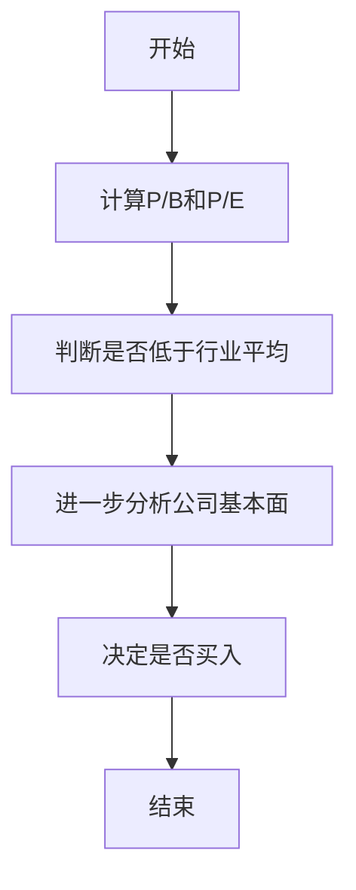
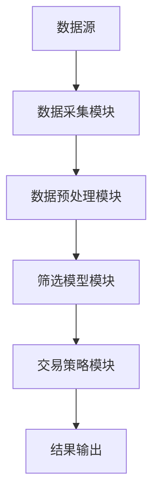

                 


# 格雷厄姆特价股票策略在不同数字市场成熟度下的效果

## 关键词：
格雷厄姆投资理论、数字市场成熟度、特价股票策略、股票筛选模型、系统架构设计、算法实现、数学模型

## 摘要：
本文系统性地探讨了格雷厄姆特价股票策略在不同数字市场成熟度下的应用效果。通过分析数字市场的成熟度模型，构建了格雷厄姆策略的数学模型与算法流程，结合实际案例，详细分析了策略在不同市场环境下的表现差异，并提出了优化建议。文章结构清晰，内容详实，既有理论分析，又有实践指导，为投资者提供了深度的技术参考。

---

## 第一部分: 格雷厄姆特价股票策略基础

### 第1章: 格雷厄姆投资理论与数字市场成熟度

#### 1.1 格雷厄姆投资理论的核心思想
格雷厄姆是价值投资之父，其核心思想是寻找市场价格低于内在价值的股票，即“便宜货”。他认为市场情绪波动会导致短期价格偏离长期价值，投资者应以基本面分析为基础，寻找被低估的投资标的。

- **核心概念**：
  - 内在价值：股票的真实价值，基于公司盈利能力、资产质量等因素计算。
  - 市场价格：市场参与者情绪和交易行为决定的价格。
  - 低估股票：市场价格 < 内在价值。

#### 1.2 数字市场成熟度的定义与分类
数字市场成熟度是指市场参与者、交易机制、信息透明度等方面的完善程度。根据市场特征，可将数字市场分为以下三类：

- **传统数字市场**：如传统股票市场，参与者成熟，信息透明度高。
- **新兴数字市场**：如加密货币市场，参与者多为散户，市场波动剧烈。
- **前沿数字市场**：如新兴区块链项目市场，交易机制不完善，信息不对称严重。

#### 1.3 数字市场成熟度的影响
- **传统市场**：市场机制成熟，适合格雷厄姆策略长期投资。
- **新兴市场**：市场波动大，策略需调整参数。
- **前沿市场**：信息不透明，策略需谨慎使用。

### 第2章: 格雷厄姆策略的数学模型与算法原理

#### 2.1 格雷厄姆策略的核心公式
- **市净率（P/B）**：$$P/B = \frac{\text{股价}}{\text{每股净资产}}$$
- **市盈率（P/E）**：$$P/E = \frac{\text{股价}}{\text{每股收益}}$$
- **内在价值计算**：$$\text{内在价值} = \text{净利润} \times \text{合理市盈率}$$

#### 2.2 算法流程图


#### 2.3 算法实现代码
```python
import pandas as pd

def calculate_pb(stock_data):
    return stock_data['price'] / stock_data['book_value']

def calculate_pe(stock_data):
    return stock_data['price'] / stock_data['eps']

def gray_gram_strategy(stock_data, industry_avg_pb, industry_avg_pe):
    stock_data['pb_ratio'] = calculate_pb(stock_data)
    stock_data['pe_ratio'] = calculate_pe(stock_data)
    stock_data['below_avg_pb'] = stock_data['pb_ratio'] < industry_avg_pb
    stock_data['below_avg_pe'] = stock_data['pe_ratio'] < industry_avg_pe
    return stock_data[stock_data['below_avg_pb'] & stock_data['below_avg_pe']]
```

---

## 第二部分: 格雷厄姆策略在不同数字市场的应用

### 第3章: 传统数字市场的应用

#### 3.1 传统市场的特点
- 参与者成熟，信息透明。
- 市场波动较小，适合长期投资。

#### 3.2 格雷厄姆策略的适用性
- 策略表现稳定，适合机构投资者。
- 通过历史数据验证，策略在传统市场中表现良好。

### 第4章: 新兴数字市场的应用

#### 4.1 新兴市场的特点
- 市场波动剧烈，参与者多为散户。
- 信息不对称严重，市场情绪化。

#### 4.2 策略的调整
- 调整筛选标准，降低PB和PE阈值。
- 增加市场情绪指标（如VIX指数）的考量。

#### 4.3 实际案例分析
- 以某加密货币为例，分析策略在新兴市场中的表现。

### 第5章: 前沿数字市场的应用

#### 5.1 前沿市场的特点
- 交易机制不完善，信息透明度低。
- 市场参与者多为投机者。

#### 5.2 策略的挑战
- 策略难以有效筛选，需结合其他指标。
- 需谨慎使用，避免重大损失。

---

## 第三部分: 系统分析与架构设计

### 第6章: 系统分析

#### 6.1 问题场景介绍
- 传统市场和新兴市场对策略的需求不同。
- 需要构建一个灵活的系统，适应不同市场环境。

#### 6.2 系统功能设计
- 数据采集模块：实时采集市场数据。
- 筛选模型模块：根据市场成熟度调整筛选标准。
- 交易策略模块：根据分析结果执行交易。

#### 6.3 系统架构设计


### 第7章: 系统实现与测试

#### 7.1 环境安装
- 安装Python、Pandas、NumPy等库。
- 配置数据源接口。

#### 7.2 核心代码实现
```python
class MarketAnalyzer:
    def __init__(self, data_source):
        self.data_source = data_source

    def analyze(self, market_type):
        if market_type == 'traditional':
            return self._analyze_traditional()
        elif market_type == 'emerging':
            return self._analyze_emerging()

    def _analyze_traditional(self):
        # 根据传统市场的特点进行分析
        pass

    def _analyze_emerging(self):
        # 根据新兴市场的特点进行分析
        pass
```

---

## 第四部分: 项目实战与优化

### 第8章: 项目实战

#### 8.1 环境安装
- Python 3.8+
- 安装Pandas、NumPy、Matplotlib。

#### 8.2 核心代码实现
```python
import pandas as pd
import matplotlib.pyplot as plt

def plot_market_trend(data):
    plt.plot(data['date'], data['price'])
    plt.xlabel('日期')
    plt.ylabel('价格')
    plt.title('市场趋势')
    plt.show()
```

#### 8.3 案例分析
- 以某加密货币为例，分析策略在新兴市场中的表现。
- 对比不同市场下的策略收益。

### 第9章: 优化与建议

#### 9.1 策略优化
- 结合技术指标（如RSI、MACD）进行多因子筛选。
- 动态调整筛选阈值，适应市场变化。

#### 9.2 实施建议
- 在传统市场中，建议长期持有优质股票。
- 在新兴市场中，建议结合市场情绪指标，谨慎投资。

---

## 第五部分: 总结与展望

### 第10章: 总结

#### 10.1 核心发现
- 格雷厄姆策略在传统市场中表现稳定。
- 在新兴市场中需谨慎调整策略参数。

#### 10.2 优缺点分析
- 优点：策略简单易懂，适合长期投资。
- 缺点：在新兴市场中效果有限，需结合其他指标。

### 第11章: 未来展望

#### 11.1 研究方向
- 研究多因子模型在策略中的应用。
- 探索人工智能在策略优化中的潜力。

#### 11.2 技术趋势
- 随着市场的成熟，价值投资策略将更加重要。
- 数字化工具将为策略优化提供更多可能性。

---

## 作者：AI天才研究院/AI Genius Institute & 禅与计算机程序设计艺术 /Zen And The Art of Computer Programming

