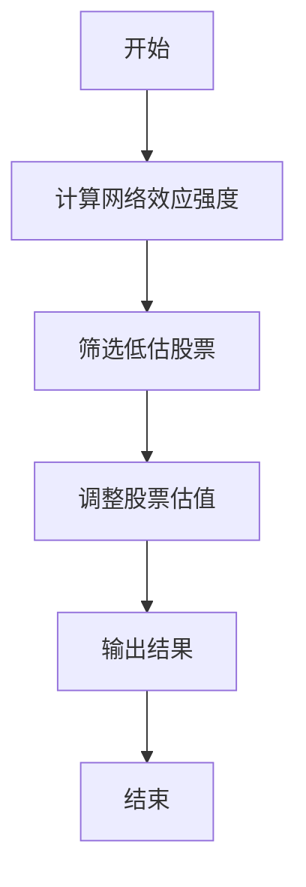
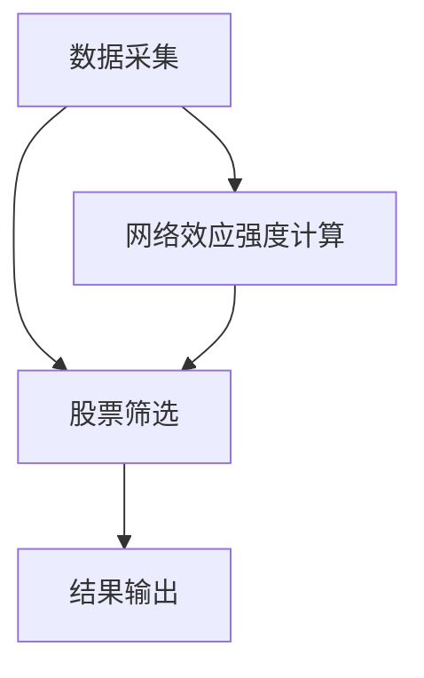
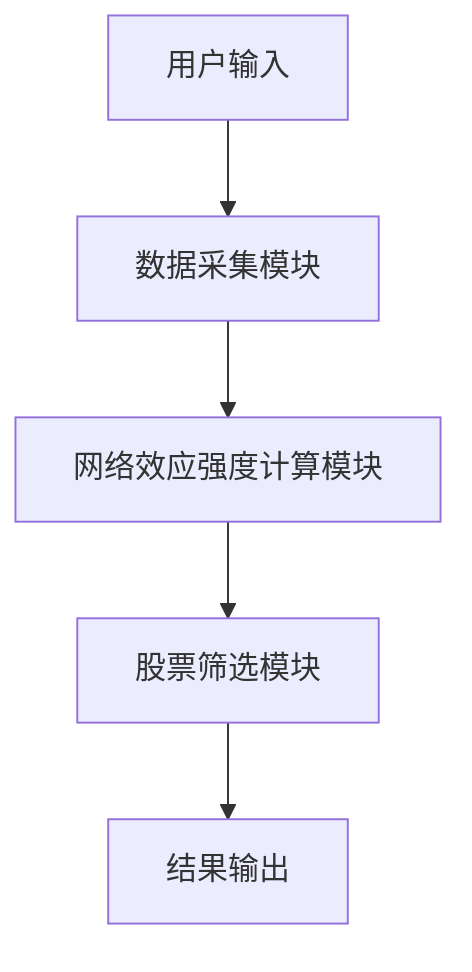
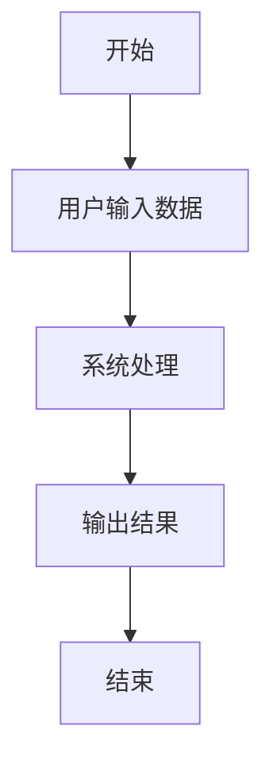

                 


# 格雷厄姆特价股票策略在不同数字市场网络效应强度下的效果

## 关键词：格雷厄姆特价股票，数字市场，网络效应强度，投资策略，股票分析

## 摘要：
本文探讨格雷厄姆特价股票策略在不同数字市场中网络效应强度下的效果。通过分析网络效应强度对股票价格波动、低估识别和投资回报率的影响，结合数学模型和实际案例，揭示网络效应如何影响格雷厄姆策略的有效性，并提出优化建议。

---

## 第1章: 格雷厄姆特价股票策略的核心概念

### 1.1 格雷厄姆投资理论基础

#### 1.1.1 格雷厄姆投资理论的起源与发展
格雷厄姆是价值投资之父，其投资理论强调寻找市场价格低于内在价值的股票。这种策略在传统金融市场中被广泛应用，但在数字市场环境下，网络效应的引入带来了新的挑战和机遇。

#### 1.1.2 格雷厄姆特价股票的定义与特征
格雷厄姆特价股票是指市场价格远低于其内在价值的股票。其核心特征包括低市盈率、低市净率和高股息率等。这些特征在数字市场中可能受到网络效应的影响而发生变化。

#### 1.1.3 格雷厄姆策略在现代投资中的地位
尽管格雷厄姆策略在传统投资中表现优异，但在数字市场中，其效果受到网络效应的影响。本文将分析不同网络效应强度下的策略表现。

---

### 1.2 数字市场与网络效应的基本概念

#### 1.2.1 数字市场的定义与特点
数字市场是指通过互联网进行交易的市场，其特点包括交易速度快、信息透明度高和参与者多样性等。数字市场的兴起使得网络效应在股票交易中变得更加重要。

#### 1.2.2 网络效应的定义与分类
网络效应是指随着用户数量增加，系统价值呈指数级增长的现象。在股票市场中，网络效应可以分为正向网络效应和负向网络效应。

#### 1.2.3 网络效应在数字市场中的表现形式
在网络效应强度高的市场中，股票价格可能因信息传播速度和范围的扩大而出现更大的波动。本文将分析不同网络效应强度对格雷厄姆策略的影响。

---

## 第2章: 格雷厄姆策略与数字市场网络效应的结合

### 2.1 格雷厄姆策略在数字市场中的适用性

#### 2.1.1 数字市场对传统投资策略的影响
数字市场的高频交易和算法交易改变了传统的投资环境，使得格雷厄姆策略需要进行调整以适应新的市场环境。

#### 2.1.2 格雷厄姆策略在数字市场中的优势与挑战
格雷厄姆策略的优势在于其对低估股票的识别能力，但其挑战在于数字市场中信息传播速度和网络效应的复杂性。

#### 2.1.3 数字市场中格雷厄姆策略的优化方向
通过结合网络效应强度的分析，优化格雷厄姆策略在数字市场中的应用。

---

### 2.2 网络效应强度对特价股票策略的影响

#### 2.2.1 网络效应强度的衡量指标
网络效应强度可以通过市场规模、用户活跃度和信息传播速度等指标进行衡量。

#### 2.2.2 不同网络效应强度下的股票选择策略
在网络效应强度高的市场中，投资者应更加关注股票的流动性和技术面分析；在网络效应强度低的市场中，传统的基本面分析更为重要。

#### 2.2.3 网络效应与股票价格波动的关系
网络效应强度高的市场中，股票价格波动更大，这为格雷厄姆策略提供了更多的套利机会，但也增加了投资风险。

---

## 第3章: 网络效应强度的量化模型

### 3.1 网络效应强度的数学模型

#### 3.1.1 网络效应强度的定义与公式
网络效应强度可以通过以下公式进行量化：
$$
\text{网络效应强度} = \frac{\text{用户数量}}{\text{用户增长速度}}
$$

#### 3.1.2 网络效应强度的计算方法
通过分析市场参与者的数量和交易频率，可以计算出网络效应强度。

#### 3.1.3 网络效应强度与股票价格的相关性分析
通过回归分析可以得出网络效应强度与股票价格的相关性系数。

---

### 3.2 格雷厄姆策略在网络效应下的优化算法

#### 3.2.1 基于网络效应强度的股票筛选算法
通过网络效应强度对股票进行排序，优先选择网络效应强度高的股票。

#### 3.2.2 网络效应强度对股票估值的影响公式
$$
\text{股票估值} = \text{内在价值} \times \text{网络效应强度调整因子}
$$

#### 3.2.3 算法实现的步骤与流程图
以下是算法实现的流程图：



---

## 第4章: 网络效应强度与股票价格波动的数学关系

### 4.1 网络效应强度与股票价格波动的数学模型

#### 4.1.1 网络效应强度与股票价格波动的线性回归模型
$$
\text{股票价格波动} = \beta \times \text{网络效应强度} + \epsilon
$$

#### 4.1.2 网络效应强度与股票价格波动的非线性关系
在网络效应强度很高的市场中，股票价格波动与网络效应强度呈非线性关系。

#### 4.1.3 网络效应强度对股票价格波动的预测模型
通过时间序列分析可以预测网络效应强度对股票价格波动的影响。

---

## 第5章: 系统分析与架构设计

### 5.1 系统分析

#### 5.1.1 系统目标与范围
系统目标是分析网络效应强度对格雷厄姆策略的影响，范围包括数字市场的数据采集和网络效应强度的计算。

#### 5.1.2 系统功能需求分析
系统需要实现网络效应强度的计算、股票筛选和价格波动预测等功能。

#### 5.1.3 系统性能需求分析
系统需要具备高计算能力和快速数据处理能力。

---

### 5.2 系统架构设计

#### 5.2.1 系统架构的模块划分
系统架构包括数据采集模块、网络效应强度计算模块和股票筛选模块。

#### 5.2.2 系统架构的层次结构
以下是系统架构的层次结构图：



#### 5.2.3 系统架构的交互流程图
以下是系统架构的交互流程图：



---

## 第6章: 系统接口设计与实现

### 6.1 系统接口设计

#### 6.1.1 系统接口的定义与实现
系统接口包括数据输入接口和结果输出接口。

#### 6.1.2 接口的交互流程图
以下是接口的交互流程图：



---

## 第7章: 项目实战

### 7.1 环境安装与配置

#### 7.1.1 系统环境要求
需要安装Python和相关数据处理库。

#### 7.1.2 数据集获取
从数字市场中获取相关股票数据和用户行为数据。

---

### 7.2 核心实现

#### 7.2.1 网络效应强度计算
以下是Python代码实现：

```python
def calculate_network_effect_intensity(users, growth_rate):
    return users / growth_rate
```

#### 7.2.2 股票筛选算法
以下是Python代码实现：

```python
def screen_undervalued_stocks(stocks, network_intensity):
    selected_stocks = []
    for stock in stocks:
        if stock.value < stock.price * network_intensity:
            selected_stocks.append(stock)
    return selected_stocks
```

---

### 7.3 案例分析

#### 7.3.1 案例背景
选取某数字市场中的部分股票进行分析。

#### 7.3.2 案例分析与结果解读
通过计算网络效应强度，筛选出低估股票并进行投资回报率分析。

---

## 第8章: 总结与展望

### 8.1 研究总结
本文分析了网络效应强度对格雷厄姆策略的影响，并提出了优化建议。

### 8.2 未来研究方向
未来可以进一步研究网络效应强度对不同类型股票的影响。

### 8.3 注意事项与实践小结
投资者在应用格雷厄姆策略时，需结合网络效应强度进行综合分析。

---

## 作者：AI天才研究院/AI Genius Institute & 禅与计算机程序设计艺术 /Zen And The Art of Computer Programming

---

通过以上结构和内容，我们可以系统地分析格雷厄姆特价股票策略在不同数字市场网络效应强度下的效果。

