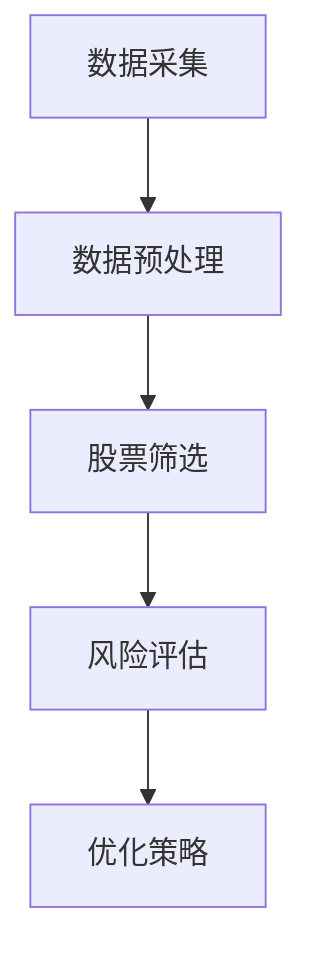
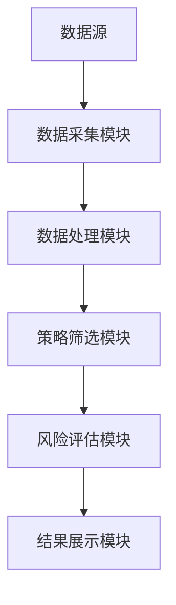

                 


# 格雷厄姆特价股票策略在不同数字监管科技环境中的表现

## 关键词：  
- 格雷厄姆策略  
- 数字监管科技  
- 特价股票  
- 投资策略  
- 金融市场  

## 摘要：  
格雷厄姆的特价股票策略是一种经典的价值投资方法，强调以低于内在价值的价格购买优质股票。随着数字监管科技的快速发展，这一策略在不同金融市场环境中的表现得到了新的提升和优化。本文将从策略的背景、核心概念、算法原理、系统架构、项目实战等多方面进行详细分析，探讨数字监管科技对格雷厄姆策略的赋能与影响，为投资者提供新的视角和实践指导。

---

# 第一部分：格雷厄姆特价股票策略概述

## 第1章：格雷厄姆特价股票策略的背景与核心概念

### 1.1 格雷厄姆特价股票策略的定义与背景

#### 1.1.1 价值投资的起源与发展  
价值投资起源于20世纪初，本杰明·格雷厄姆是该领域的先驱。他提出的“安全边际”概念奠定了现代价值投资的基础。格雷厄姆认为，股票的价值应基于企业的内在价值，而非市场情绪或短期波动。这种理念在金融市场中长期被实践证明是有效的。

#### 1.1.2 格雷厄姆投资理念的核心思想  
格雷厄姆强调“Margin of Safety（安全边际）”，即以低于内在价值的价格购买股票，以降低投资风险。他还提出，投资者应关注企业的基本面，如盈利能力、财务状况和市场地位。

#### 1.1.3 特价股票的定义与特征  
特价股票指的是市场价格低于内在价值的股票。这类股票通常具有较高的股息收益率、较低的市盈率和市净率，适合长期投资者。

---

### 1.2 数字监管科技的定义与作用

#### 1.2.1 数字监管科技的基本概念  
数字监管科技（RegTech）是利用数字技术（如人工智能、大数据、区块链等）来优化金融监管和合规流程。它通过自动化和智能化手段，提升监管效率和透明度。

#### 1.2.2 数字监管科技在金融领域的应用  
数字监管科技的应用包括实时监控、风险评估、合规自动化等。它能够帮助投资者快速获取信息，识别市场风险，并优化投资决策。

#### 1.2.3 数字监管科技与股票投资的关系  
数字监管科技为投资者提供了更高效的数据处理和分析工具，帮助他们在不同市场环境下更好地实施格雷厄姆策略。

---

### 1.3 格雷厄姆策略与数字监管科技的结合

#### 1.3.1 数字技术对股票分析的赋能  
数字技术通过数据挖掘和机器学习，帮助投资者更精准地评估股票的内在价值和风险。

#### 1.3.2 监管科技对投资决策的影响  
数字监管科技能够实时监控市场动态，帮助投资者快速响应政策变化和市场波动。

#### 1.3.3 格雷厄姆策略在数字化时代的演变  
随着技术的进步，格雷厄姆策略逐步融入数字化工具，形成了更加智能化和高效的投资方法。

---

## 第2章：格雷厄姆特价股票策略的核心概念与原理

### 2.1 格雷厄姆策略的核心要素

#### 2.1.1 安全边际的概念与计算  
安全边际 = (内在价值 - 市场价格) / 市场价格  
安全边际越高，投资风险越低。

#### 2.1.2 低市盈率股票的筛选标准  
市盈率（P/E）= 股价 / 每股收益  
低市盈率股票通常具有较高的投资价值。

#### 2.1.3 股息率与企业盈利能力的评估  
股息率 = 每股股息 / 股价  
高股息率股票通常具有稳定的收益。

---

### 2.2 数字监管科技对策略的影响

#### 2.2.1 数据采集与处理的技术创新  
数字监管科技通过大数据技术，帮助投资者快速获取和处理海量市场数据。

#### 2.2.2 算法在股票筛选中的应用  
机器学习算法可以优化股票筛选过程，提高策略的执行效率。

#### 2.2.3 监管政策对投资策略的调整  
监管政策的变化会影响市场环境，投资者需要及时调整策略以适应新的监管要求。

---

## 第3章：格雷厄姆策略在不同监管环境中的表现

### 3.1 传统金融市场中的表现

#### 3.1.1 美国市场的历史表现分析  
格雷厄姆策略在美国市场表现优异，特别是在经济衰退期间，其防御性特点更加突出。

#### 3.1.2 欧洲市场的应用案例  
欧洲市场的监管环境较为严格，但格雷厄姆策略通过精选低估值股票，仍能实现稳定的收益。

#### 3.1.3 亚洲市场的适应性探讨  
亚洲市场波动较大，但通过结合数字监管科技，格雷厄姆策略依然能够找到优质投资标的。

---

### 3.2 新兴市场中的表现

#### 3.2.1 新兴市场的监管特点  
新兴市场通常监管不完善，但通过数字监管科技，投资者可以更好地识别和管理风险。

#### 3.2.2 格雷厄姆策略在新兴市场的适用性  
新兴市场中，低市盈率和高股息率的股票依然具有较高的投资价值。

#### 3.2.3 数字监管科技在新兴市场的优势  
数字监管科技能够帮助投资者快速适应新兴市场的监管变化，提升投资效率。

---

### 3.3 加密货币市场中的表现

#### 3.3.1 加密货币市场的监管现状  
加密货币市场监管不一，但通过数字监管科技，投资者可以更好地管理市场风险。

#### 3.3.2 格雷厄姆策略在加密货币市场的应用  
尽管加密货币市场波动较大，但通过筛选具有稳定内在价值的加密货币，格雷厄姆策略依然能够实现收益。

#### 3.3.3 监管政策对加密货币投资的影响  
未来监管政策的变化将对加密货币市场产生重大影响，投资者需要密切关注政策动态。

---

## 第4章：格雷厄姆策略的算法原理与数学模型

### 4.1 格雷厄姆策略的算法流程

#### 4.1.1 数据采集与预处理  
通过API或爬虫获取市场数据，清洗和标准化后用于后续分析。

#### 4.1.2 股票筛选算法  
基于市盈率、市净率、股息率等指标，筛选出符合条件的股票。

#### 4.1.3 风险评估与优化算法  
通过蒙特卡洛模拟等方法，评估投资组合的风险，并进行优化。

---

### 4.2 格雷厄姆策略的数学模型

#### 4.2.1 安全边际的计算公式  
$$ 安全边际 = \frac{\text{内在价值} - \text{市场价格}}{\text{市场价格}} $$

#### 4.2.2 市盈率与市净率的对比分析  
$$ 市盈率 = \frac{\text{股价}}{\text{每股收益}} $$
$$ 市净率 = \frac{\text{股价}}{\text{每股净资产}} $$

---

### 4.3 算法流程图



---

## 第5章：系统分析与架构设计方案

### 5.1 系统功能设计

#### 5.1.1 数据采集模块  
- 通过API获取实时市场数据。
- 支持多种数据源的接入。

#### 5.1.2 策略筛选模块  
- 基于格雷厄姆策略筛选出符合条件的股票。
- 提供可视化界面展示筛选结果。

#### 5.1.3 风险评估模块  
- 使用机器学习模型评估投资组合风险。
- 提供风险预警功能。

#### 5.1.4 结果展示模块  
- 提供详细的图表和报告，帮助用户分析投资表现。

---

### 5.2 系统架构设计



---

## 第6章：项目实战

### 6.1 环境安装

```bash
pip install pandas numpy matplotlib requests
```

---

### 6.2 核心实现源代码

```python
import pandas as pd
import numpy as np

# 示例数据
data = {
    '股票代码': ['AAPL', 'GOOGL', 'MSFT'],
    '股价': [100, 150, 80],
    '每股收益': [10, 15, 8],
    '每股净资产': [50, 75, 40]
}

df = pd.DataFrame(data)

# 计算市盈率和市净率
df['市盈率'] = df['股价'] / df['每股收益']
df['市净率'] = df['股价'] / df['每股净资产']

print(df)
```

---

### 6.3 实际案例分析

以苹果公司为例，计算其市盈率和市净率：

$$ 市盈率 = \frac{100}{10} = 10 $$
$$ 市净率 = \frac{100}{50} = 2 $$

根据格雷厄姆策略，市盈率低于15且市净率低于2的股票具有较高的投资价值。因此，苹果公司符合筛选条件，可以作为投资标的。

---

## 第7章：总结与展望

### 7.1 总结  
格雷厄姆特价股票策略在不同数字监管科技环境中的表现优异，通过结合数字化工具，投资者能够更高效地实施这一策略，实现稳健收益。

### 7.2 展望  
未来，随着数字监管科技的进一步发展，格雷厄姆策略将更加智能化和高效化，为投资者提供更多优质的投资机会。

---

## 作者：  
AI天才研究院/AI Genius Institute  
禅与计算机程序设计艺术/Zen And The Art of Computer Programming

