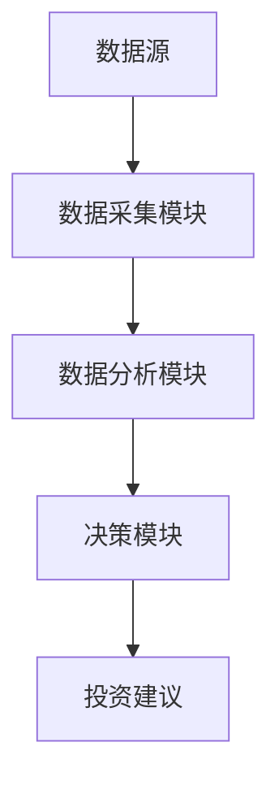

                 


# 格雷厄姆特价股票策略在不同数字监管科技生态中的表现

---

## 关键词：
- 格雷厄姆投资理论
- 数字监管科技
- 金融数据分析
- 人工智能
- 区块链
- 价值投资
- 大数据

---

## 摘要：
本文探讨了格雷厄姆的价值投资策略在数字监管科技生态中的应用表现。通过分析大数据、区块链和人工智能等技术，本文详细阐述了如何利用这些技术增强格雷厄姆策略的有效性，并结合实际案例和系统设计，展示了策略在不同监管环境中的适应性和优化方向。

---

## 第一部分: 格雷厄姆特价股票策略与数字监管科技生态的背景

### 第1章: 格雷厄姆投资理论的起源与发展

#### 1.1 价值投资的起源
- **1.1.1 本杰明·格雷厄姆的贡献**  
  本杰明·格雷厄姆是价值投资理论的奠基人，其核心思想是“以合理的价格买入优秀的公司”。他的投资策略强调安全边际和内在价值的评估。

#### 1.2 格雷厄姆策略的核心理念
- **1.2.1 安全边际**  
  安全边际是格雷厄姆策略的关键，指股票价格与内在价值之间的差距，确保投资者在市场波动中不会遭受重大损失。

- **1.2.2 内在价值评估**  
  内在价值是公司未来现金流的现值，计算方法通常涉及折现率和预期收益。

### 第2章: 数字监管科技生态的背景

#### 2.1 数字监管科技的定义与特点
- 数字监管科技利用大数据、人工智能和区块链等技术，实现金融市场的自动化监管和合规管理。

#### 2.2 数字监管科技的核心技术
- **大数据分析**：通过海量数据的处理和分析，识别市场风险和异常交易。
- **区块链技术**：提供透明的交易记录，确保数据不可篡改，增强监管的可信度。
- **人工智能**：利用机器学习算法预测市场趋势和评估风险。

### 第3章: 格雷厄姆策略与数字监管科技的结合

#### 3.1 结合的必要性
- 格雷厄姆策略在传统市场中表现优异，但在数字化和复杂化的现代金融市场中，需要借助数字监管科技来提升效率和准确性。

#### 3.2 数字化工具对策略的优化
- 通过大数据分析和人工智能，可以更精准地计算内在价值和安全边际，降低人为错误。

---

## 第二部分: 格雷厄姆策略在数字监管科技中的具体应用

### 第4章: 格雷厄姆策略的数学模型与算法实现

#### 4.1 核心算法
- **安全边际计算**  
  $$ 安全边际 = \frac{内在价值}{市场价格} $$
- **内在价值评估**  
  $$ 内在价值 = \frac{预期收益}{折现率} $$

#### 4.2 算法实现步骤
1. 数据采集：收集目标公司的财务数据和市场数据。
2. 数据预处理：清洗数据，处理缺失值和异常值。
3. 内在价值计算：使用格雷厄姆模型计算公司的内在价值。
4. 安全边际计算：比较市场价格与内在价值，确定安全边际。
5. 投资决策：根据安全边际和市场趋势，生成投资建议。

### 第5章: 数字监管科技对策略的优化

#### 5.1 大数据分析的应用
- **数据源多样性**：利用多种数据源（如社交媒体、新闻报道）进行综合分析，提升市场情绪预测的准确性。

#### 5.2 区块链技术的运用
- **透明交易记录**：区块链技术确保交易的透明性和不可篡改性，帮助监管机构快速识别异常交易。

#### 5.3 人工智能的优化
- **机器学习模型**：利用机器学习算法预测市场波动，优化投资组合的风险控制。

---

## 第三部分: 实际案例与系统设计

### 第6章: 实际案例分析

#### 6.1 案例背景
- 某科技公司股票在疫情期间的表现，利用格雷厄姆策略结合数字监管科技进行分析。

#### 6.2 数据分析与结果
- 使用Python进行数据分析，计算安全边际和内在价值，得出投资建议。

### 第7章: 系统架构设计

#### 7.1 系统功能设计
- **数据采集模块**：收集市场数据和公司财务数据。
- **数据分析模块**：计算内在价值和安全边际。
- **决策模块**：生成投资建议。

#### 7.2 系统架构图


#### 7.3 系统实现代码
```python
import pandas as pd
import numpy as np

# 示例数据
data = {
    '公司名称': ['公司A', '公司B'],
    '收入': [100, 150],
    '净利润': [20, 30]
}

df = pd.DataFrame(data)

# 计算内在价值
def calculate_intrinsic_value(revenue, net_profit, discount_rate=0.1):
    return (revenue + net_profit) / (1 + discount_rate)

# 应用计算
df['内在价值'] = df.apply(lambda x: calculate_intrinsic_value(x['收入'], x['净利润']), axis=1)
print(df)
```

---

## 第四部分: 结论与展望

### 结论
- 格雷厄姆策略在数字监管科技的支持下，能够更高效地应对复杂市场环境。
- 大数据分析和人工智能技术的结合，显著提升了策略的准确性和实用性。

### 展望
- 进一步研究如何利用区块链技术增强交易透明性。
- 探索更多人工智能算法，优化投资决策过程。

---

## 作者：
**AI天才研究院 / AI Genius Institute**  
**禅与计算机程序设计艺术 / Zen And The Art of Computer Programming**

---

通过以上结构和内容，本文系统地探讨了格雷厄姆策略在数字监管科技生态中的表现，结合理论分析、算法实现和实际案例，为投资者和监管机构提供了有价值的参考。

