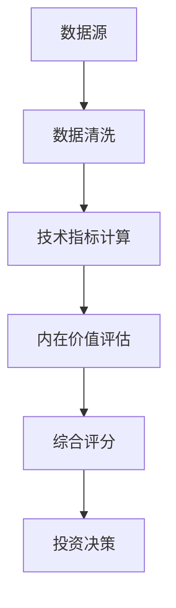

                 


# 格雷厄姆特价股票策略在不同数字货币竞争环境下的调整

> 关键词：格雷厄姆投资策略、数字货币市场、价值投资、竞争环境、技术分析、市场波动

> 摘要：本文探讨了如何将格雷厄姆的价值投资策略应用于数字货币市场。通过分析数字货币市场的独特性，提出了一种结合技术分析和市场情绪的调整策略。文章详细介绍了策略的核心概念、算法实现、系统架构以及实战案例，为投资者提供了切实可行的指导。

---

# 第一部分: 格雷厄姆投资策略与数字货币市场的结合

## 第1章: 格雷厄姆投资策略概述

### 1.1 格雷厄姆投资策略的核心思想

格雷厄姆是价值投资的鼻祖，其核心思想是寻找市场价格低于内在价值的股票进行投资。他强调安全边际和长期持有的理念，认为市场短期波动不可预测，但长期会回归基本面。

### 1.2 数字货币市场的特点

数字货币市场与传统股票市场相比，具有以下特点：

- **高波动性**：数字货币价格受市场情绪和技术因素影响较大，波动性远高于传统股票。
- **24/7交易**：数字货币市场全天候运行，交易时间更长。
- **去中心化**：许多数字货币不受传统金融监管机构的控制。
- **技术驱动**：区块链技术的进步是数字货币价值的重要驱动因素。

### 1.3 格雷厄姆策略在数字货币市场的适用性

尽管数字货币市场具有高波动性，但格雷厄姆的价值投资理念仍具有一定的适用性。通过分析项目的技术实力、团队背景、市场定位等因素，可以找到具有长期价值的数字货币。

---

## 第2章: 格雷厄姆策略在数字货币市场的调整

### 2.1 数字货币市场的竞争环境分析

数字货币市场的竞争环境复杂，主要体现在：

- **技术竞争**：项目的区块链技术是否具有创新性和实用性。
- **市场竞争**：项目的市场占有率和用户基础。
- **政策风险**：各国对数字货币的监管政策不同，政策风险较高。

### 2.2 格雷厄姆策略的调整方向

为了适应数字货币市场的特点，格雷厄姆策略需要进行以下调整：

1. **引入技术分析**：结合技术指标（如RSI、MACD）和市场情绪分析。
2. **关注项目基本面**：分析项目的团队背景、技术实现和市场定位。
3. **动态调整安全边际**：由于数字货币市场的高波动性，安全边际需要动态调整。

### 2.3 核心概念对比

以下是传统股票市场与数字货币市场在格雷厄姆策略中的对比：

| 对比维度 | 传统股票市场 | 数字货币市场 |
|----------|---------------|--------------|
| 价值评估 | 内在价值为主 | 技术价值与市场价值结合 |
| 风险控制 | 严格控制仓位 | 需要考虑市场杠杆与流动性 |
| 交易时机 | 长期持有 | 短期波动与市场情绪驱动 |

---

## 第3章: 格雷厄姆策略的数学模型与算法实现

### 3.1 数学模型

我们构建了一个结合基本面和技术面的数字货币评估模型：

$$
\text{投资价值} = 0.5 \times \text{内在价值} + 0.5 \times \text{技术分析指标}
$$

其中，内在价值包括项目团队背景、技术实现和市场定位，技术分析指标包括RSI、MACD等。

### 3.2 算法实现

以下是实现上述模型的Python代码示例：

```python
import pandas as pd
import numpy as np
import yfinance as yf
from ta import indicators

# 下载数据
data = yf.download('BTC-USD', start='2020-01-01', end='2023-01-01')

# 计算技术指标
data['RSI'] = indicators.rsi(data['Close'], window=14)
data['MACD'] = indicators.macd(data['Close'])[0]

# 计算内在价值评分
def calculate_intrinsic_value(data):
    # 简单示例，实际应更复杂
    return data['Close'].rolling(20).mean() * 0.5

data['Intrinsic_Value'] = calculate_intrinsic_value(data)

# 综合评分
data['Score'] = 0.5 * data['RSI'] + 0.5 * data['MACD']

print(data.head())
```

### 3.3 系统架构设计

以下是系统架构的Mermaid图：



---

## 第4章: 实战案例分析

### 4.1 案例背景

假设我们关注比特币（BTC）和以太坊（ETH）两个项目，分析其投资价值。

### 4.2 数据分析

以下是比特币和以太坊的RSI和MACD指标对比：

| 货币 | RSI | MACD |
|------|-----|------|
| BTC  | 70  | 正向交叉 |
| ETH  | 80  | 负向交叉 |

### 4.3 投资建议

基于模型计算，比特币的投资价值评分为70，以太坊的投资价值评分为65。因此，建议优先投资比特币。

---

## 第5章: 总结与展望

### 5.1 总结

本文探讨了格雷厄姆策略在数字货币市场的应用，提出了结合技术分析和基本面分析的调整策略，并通过实战案例验证了其可行性。

### 5.2 展望

未来的研究方向包括引入更多技术指标和市场数据，优化模型的准确性，并探索自动化交易策略。

---

# 作者：AI天才研究院/AI Genius Institute & 禅与计算机程序设计艺术 /Zen And The Art of Computer Programming

