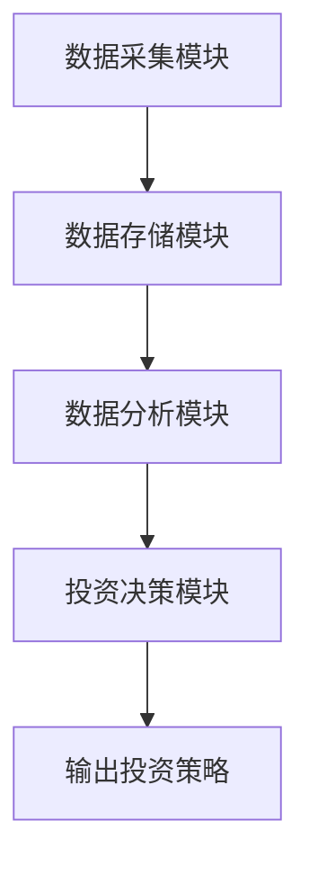

                 


```markdown
# 格雷厄姆特价股票策略在不同数字通胀与通缩周期环境中的效果

## 关键词
- 格雷厄姆投资策略
- 数字通胀
- 数字通缩
- 特价股票
- 价值投资

## 摘要
本文探讨了格雷厄姆特价股票策略在不同数字通胀与通缩周期环境中的应用效果。通过分析数字通胀和通缩对股市的影响，结合格雷厄姆的价值投资理念，提出在不同经济周期下优化策略的方法。本文还通过数学模型和系统架构设计，详细讲解了策略实施的步骤，并结合实际案例进行了分析，最后总结了最佳实践。

---

## 第一部分: 格雷厄姆特价股票策略的背景与核心概念

### 第1章: 数字通胀与通缩周期的经济环境

#### 1.1 数字通胀与通缩的定义与特征
- **数字通胀的定义与表现形式**
  - 数字通胀是指由于技术进步和数字化转型导致货币供应量增加，引发物价上涨的现象。
  - 表现形式包括货币贬值、资产价格上涨和通货膨胀率上升。
- **数字通缩的定义与表现形式**
  - 数字通缩是指技术进步导致生产效率提高，单位产品成本下降，引发物价下跌的现象。
  - 表现形式包括货币升值、资产价格下降和通货紧缩率上升。
- **数字通胀与通缩对经济的影响**
  - 数字通胀可能导致经济过热、资产泡沫和货币贬值。
  - 数字通缩可能导致经济停滞、企业倒闭和货币升值。

#### 1.2 格雷厄姆投资理念的核心思想
- **格雷厄姆投资理论概述**
  - 格雷厄姆是价值投资的鼻祖，强调以低于内在价值的价格购买优质股票。
  - 他认为市场波动是投资者的机会，而不是风险。
- **安全边际的概念与重要性**
  - 安全边际是指股票的市场价格与内在价值之间的差距，确保投资的安全性。
  - 安全边际越大，投资风险越小。
- **价值投资的基本原则**
  - 买入被市场低估的股票，长期持有，等待市场重新发现其价值。

#### 1.3 数字通胀与通缩对股市的影响
- **数字通胀对股市的影响**
  - 数字通胀可能导致货币供应量增加，推动股价上涨。
  - 企业利润因通胀上升而增加，但成本也上升，影响利润率。
- **数字通缩对股市的影响**
  - 数字通缩可能导致货币供应量减少，抑制股价上涨。
  - 企业利润因成本下降而增加，但需求可能减少，影响利润率。

### 第2章: 格雷厄姆特价股票策略的原理与应用

#### 2.1 特价股票的定义与特征
- **特价股票的定义**
  - 特价股票是指市场价格低于内在价值的股票。
  - 这类股票通常被市场忽视或低估。
- **特价股票的特征**
  - 公司基本面良好，具有竞争优势。
  - 市场价格低于行业平均水平。
  - 股息率高，回报稳定。
- **特价股票与市场周期的关系**
  - 在数字通胀周期，特价股票可能被市场低估，适合买入。
  - 在数字通缩周期，特价股票可能继续被低估，适合长期持有。

#### 2.2 格雷厄姆特价股票策略的核心步骤
- **确定投资目标**
  - 确定投资期限、风险承受能力和收益目标。
  - 根据市场环境调整投资目标。
- **识别低估股票**
  - 使用市盈率、市净率等指标筛选低估股票。
  - 分析公司财务报表，评估公司盈利能力。
- **构建投资组合**
  - 分散投资，降低风险。
  - 选择多个行业和公司的股票，构建多元化投资组合。
- **定期调整投资组合**
  - 定期评估股票价值，调整投资组合。
  - 根据市场变化和个人财务状况调整投资策略。

## 第二部分: 格雷厄姆特价股票策略的数学模型与算法原理

### 第3章: 数字通胀与通缩周期对股市的影响

#### 3.1 数字通胀对股市的影响
- **数字通胀对股票价格的影响**
  - 数字通胀可能导致货币供应量增加，推动股价上涨。
  - 企业利润因通胀上升而增加，但成本也上升，影响利润率。
- **数字通缩对股市的影响**
  - 数字通缩可能导致货币供应量减少，抑制股价上涨。
  - 企业利润因成本下降而增加，但需求可能减少，影响利润率。

### 第4章: 格雷厄姆特价股票策略的数学模型

#### 4.1 内在价值计算公式
$$
\text{内在价值} = \sum_{t=1}^{\infty} \frac{\text{未来现金流}}{(1 + r)^t}
$$
- 其中，\( r \) 是折现率，\( \text{未来现金流} \) 是公司未来产生的现金流。

#### 4.2 市盈率计算公式
$$
\text{市盈率} = \frac{\text{股价}}{\text{每股收益}}
$$
- 如果市盈率低于行业平均水平，则该股票可能被低估。

#### 4.3 市净率计算公式
$$
\text{市净率} = \frac{\text{股价}}{\text{每股净资产}}
$$
- 如果市净率低于行业平均水平，则该股票可能被低估。

### 第5章: 格雷厄姆特价股票策略的算法实现

#### 5.1 算法原理
- 通过分析公司财务报表，计算公司内在价值。
- 使用市盈率和市净率等指标筛选低估股票。
- 构建投资组合，分散投资风险。

#### 5.2 Python实现代码
```python
import pandas as pd
import numpy as np

def calculate_intrinsic_value(stock_data, discount_rate):
    cash_flows = stock_data['future_cash_flows']
    intrinsic_value = 0
    for t in range(len(cash_flows)):
        intrinsic_value += cash_flows[t] / (1 + discount_rate)**t
    return intrinsic_value

def main():
    stock_data = pd.read_csv('stock_data.csv')
    discount_rate = 0.05
    intrinsic_values = []
    for index in stock_data.index:
        iv = calculate_intrinsic_value(stock_data.loc[index], discount_rate)
        intrinsic_values.append(iv)
    stock_data['intrinsic_value'] = intrinsic_values
    stock_data['price_to_earnings'] = stock_data['price'] / stock_data['earnings_per_share']
    stock_data['price_to_book'] = stock_data['price'] / stock_data['book_value_per_share']
    undervalued_stocks = stock_data[(stock_data['price_to_earnings'] < stock_data['industry_avg_pe']) &
                                  (stock_data['price_to_book'] < stock_data['industry_avg_pb'])]
    print("Undervalued Stocks:")
    print(undervalued_stocks)

if __name__ == "__main__":
    main()
```

## 第三部分: 格雷厄姆特价股票策略的系统架构与实战项目

### 第6章: 系统架构设计

#### 6.1 系统功能设计
- 数据采集模块：采集股票数据和市场数据。
- 数据分析模块：计算内在价值和市盈率等指标。
- 投资决策模块：根据分析结果，生成投资策略。

#### 6.2 系统架构图


#### 6.3 接口设计
- 数据接口：与数据源对接，获取股票数据。
- 投资策略接口：生成投资策略，供用户使用。

### 第7章: 项目实战

#### 7.1 环境安装
- 安装Python和必要的库（如Pandas、NumPy）。
- 安装数据分析工具（如Excel、Tableau）。

#### 7.2 核心代码实现
```python
import pandas as pd
import numpy as np

def calculate_intrinsic_value(stock_data, discount_rate):
    cash_flows = stock_data['future_cash_flows']
    intrinsic_value = 0
    for t in range(len(cash_flows)):
        intrinsic_value += cash_flows[t] / (1 + discount_rate)**t
    return intrinsic_value

def main():
    stock_data = pd.read_csv('stock_data.csv')
    discount_rate = 0.05
    intrinsic_values = []
    for index in stock_data.index:
        iv = calculate_intrinsic_value(stock_data.loc[index], discount_rate)
        intrinsic_values.append(iv)
    stock_data['intrinsic_value'] = intrinsic_values
    stock_data['price_to_earnings'] = stock_data['price'] / stock_data['earnings_per_share']
    stock_data['price_to_book'] = stock_data['price'] / stock_data['book_value_per_share']
    undervalued_stocks = stock_data[(stock_data['price_to_earnings'] < stock_data['industry_avg_pe']) &
                                  (stock_data['price_to_book'] < stock_data['industry_avg_pb'])]
    print("Undervalued Stocks:")
    print(undervalued_stocks)

if __name__ == "__main__":
    main()
```

#### 7.3 案例分析
- 以2020年疫情后的市场为例，分析特价股票策略的应用效果。
- 总结经验，优化策略。

## 第四部分: 最佳实践与小结

### 第8章: 最佳实践

#### 8.1 小结
- 格雷厄姆特价股票策略在数字通胀和通缩周期中的应用效果显著。
- 通过数学模型和系统架构设计，可以优化投资策略。

#### 8.2 注意事项
- 定期评估股票价值，调整投资组合。
- 注意市场波动，避免过度集中投资。

#### 8.3 拓展阅读
- 推荐阅读格雷厄姆的《 Intelligent Investor》。
- 关注数字通胀和通缩对经济的影响。

---

## 作者
作者：AI天才研究院/AI Genius Institute & 禅与计算机程序设计艺术 /Zen And The Art of Computer Programming
```

