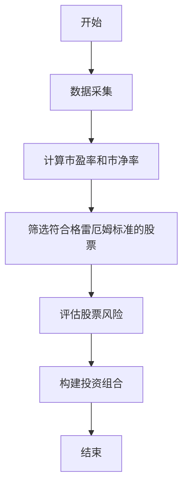
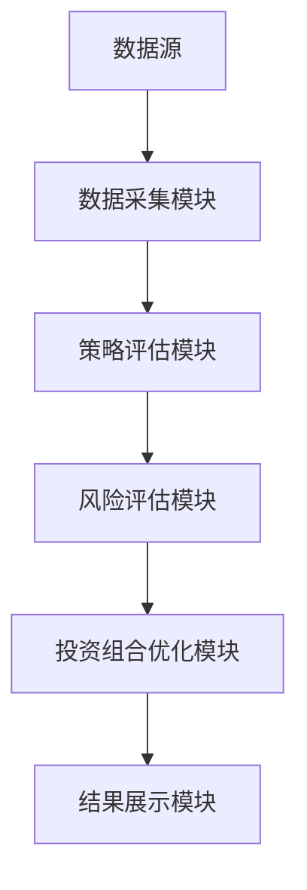

                 


# 格雷厄姆特价股票策略在不同数字通胀与通缩预期环境中的效果

---

## 关键词：格雷厄姆、特价股票、数字通胀、通缩预期、投资策略、价值投资

---

## 摘要

本文探讨了格雷厄姆特价股票策略在不同数字通胀与通缩预期环境中的表现和效果。通过分析经济周期中的市场波动，结合价值投资理论，本文提出了一套量化分析方法，帮助投资者在数字通胀与通缩预期下优化投资组合。文章从背景介绍、核心概念、算法原理、数学模型、系统架构、项目实战等多个维度展开，旨在为投资者提供理论支持和实践指导。

---

## 正文

### 第一部分：背景介绍

#### 第1章：数字通胀与通缩的基本概念

##### 1.1 数字通胀与通缩的定义

数字通胀指的是由于技术进步、数字化转型等因素导致的货币供应量增加、物价上涨的现象。与传统通胀不同，数字通胀更多体现在数字经济领域，例如加密货币的发行、数字化支付的普及等。数字通缩则是指数字技术的应用导致货币供应量减少、物价下降的现象，例如区块链技术的去中心化可能导致货币流通效率降低，进而引发通缩。

##### 1.2 数字通胀与通缩对股市的影响

数字通胀通常会导致市场流动性增加，推动股价上涨；而数字通缩则可能导致市场流动性减少，股价下跌。此外，数字通胀环境下，科技类股票往往表现较好，而传统行业可能面临压力；在数字通缩环境下，防御性股票可能更受青睐。

##### 1.3 格雷厄姆特价股票策略的基本介绍

格雷厄姆的投资理念以“价值投资”为核心，强调寻找市场低估的股票。他提出了“特价股票”的概念，即市盈率、市净率等估值指标低于行业平均水平的股票。在市场恐慌或经济低迷时，这些股票往往被市场低估，但具有长期增值的潜力。

---

### 第二部分：核心概念与联系

#### 第2章：格雷厄姆特价股票策略的核心原理

##### 2.1 格雷厄姆策略的核心原理

格雷厄姆策略的核心在于寻找具有安全边际的股票。他提出，投资者应关注企业的基本面，如盈利能力、财务状况等，而不是市场的短期波动。特价股票的筛选标准包括：

1. **低市盈率（P/E）**：市盈率低于行业平均水平。
2. **低市净率（P/B）**：市净率低于行业平均水平。
3. **高股息率**：股息率高于行业平均水平。

##### 2.2 格雷厄姆策略与数字通胀通缩的关系

在数字通胀环境下，市场流动性充裕，科技股通常表现较好，但格雷厄姆策略更关注低估值的传统行业股票。在数字通缩环境下，市场流动性下降，防御性股票可能更受青睐，而格雷厄姆策略可以帮助投资者在市场低迷时找到低估的股票。

##### 2.3 核心概念属性对比表

| 比较维度       | 数字通胀环境         | 数字通缩环境         |
|----------------|----------------------|----------------------|
| 市场流动性       | 高                   | 低                   |
| 股票估值         | 科技股高估，传统股低估 | 传统股可能被低估     |
| 格雷厄姆策略适用性 | 适合传统行业股票       | 更适合防御性股票     |

---

### 第三部分：算法原理讲解

#### 第3章：格雷厄姆策略的量化算法

##### 3.1 格雷厄姆策略的量化模型

格雷厄姆策略可以通过以下步骤量化：

1. **数据采集**：获取目标股票的市盈率、市净率、股息率等数据。
2. **筛选标准**：设定筛选条件，如市盈率 < 行业平均市盈率，市净率 < 行业平均市净率，股息率 > 行业平均股息率。
3. **候选股票池**：根据筛选条件，生成候选股票池。
4. **风险评估**：评估候选股票的风险，如波动率、行业风险等。
5. **投资组合优化**：根据风险偏好，构建投资组合。

##### 3.2 算法流程图



---

### 第四部分：数学模型与公式解析

#### 第4章：数学模型与公式解析

##### 4.1 市盈率计算公式

市盈率（P/E）= 股价 / 每股收益（EPS）

##### 4.2 市净率计算公式

市净率（P/B）= 股价 / 每股净资产（BPS）

##### 4.3 风险评估模型

波动率 = 标准差（收益率）

---

### 第五部分：系统分析与架构设计方案

#### 第5章：系统架构设计

##### 5.1 系统功能设计

- **数据采集模块**：实时采集股票数据。
- **策略评估模块**：根据格雷厄姆标准筛选股票。
- **风险评估模块**：评估股票风险。
- **投资组合优化模块**：构建投资组合。

##### 5.2 系统架构图



---

### 第六部分：项目实战

#### 第6章：项目实战

##### 6.1 环境安装

- Python 3.8+
- Pandas、NumPy、Matplotlib

##### 6.2 核心代码实现

```python
import pandas as pd
import numpy as np

# 数据获取
df = pd.read_csv('stock_data.csv')

# 计算市盈率和市净率
df['P/E'] = df['股价'] / df['每股收益']
df['P/B'] = df['股价'] / df['每股净资产']

# 格雷厄姆筛选标准
筛选条件：P/E < 行业平均P/E 且 P/B < 行业平均P/B 且 股息率 > 行业平均股息率

候选股票 = df[df['P/E'] < 行业平均P/E 合格]
候选股票 = 候选股票[候选股票['P/B'] < 行业平均P/B 合格]
候选股票 = 候选股票[候选股票['股息率'] > 行业平均股息率]

# 风险评估
候选股票['波动率'] = 候选股票['收益率'].std()

# 投资组合优化
候选股票 = 候选股票.sort_values('波动率')
selected_stocks = 候选股票.head(10)
```

##### 6.3 实际案例分析

假设在数字通缩环境下，市场流动性下降，投资者可能更倾向于选择低估值的防御性股票。通过格雷厄姆策略筛选，我们可以找到市盈率和市净率低于行业平均水平的股票，如传统制造业或公用事业股。

##### 6.4 项目小结

通过代码实现格雷厄姆策略，投资者可以在不同经济环境下筛选出具有潜力的股票，优化投资组合。

---

### 第七部分：最佳实践

#### 第7章：最佳实践

##### 7.1 投资策略优化

- 定期复盘，根据市场变化调整策略。
- 结合技术分析，增强策略的有效性。

##### 7.2 风险管理

- 设置止损点，控制投资风险。
- 分散投资，避免过度集中。

##### 7.3 未来趋势

随着数字化转型的深入，数字通胀与通缩对股市的影响将更加复杂。投资者需密切关注市场变化，灵活调整策略。

---

## 作者

作者：AI天才研究院/AI Genius Institute & 禅与计算机程序设计艺术 /Zen And The Art of Computer Programming

