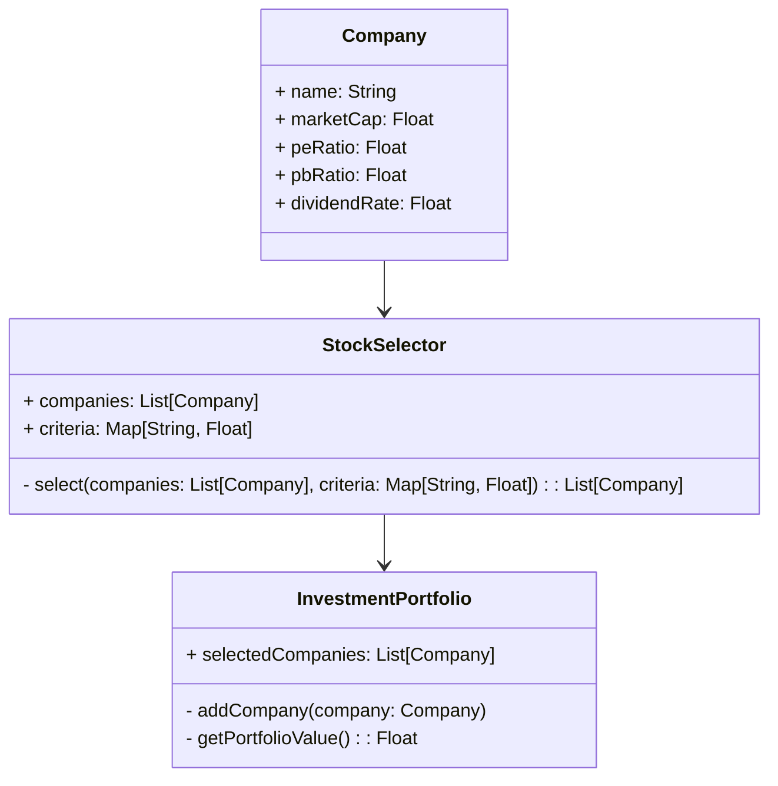

                 


# 格雷厄姆特价股票策略在不同规模公司中的应用

> 关键词：格雷厄姆投资理念、特价股票策略、公司规模分析、小盘股、中盘股、大盘股

> 摘要：本文系统地探讨了格雷厄姆的价值投资理念及其在不同规模公司中的应用。通过对小盘股、中盘股和大盘股的深入分析，本文揭示了格雷厄姆策略在不同规模企业中的适用性，并通过具体案例展示了策略的应用效果。文章还详细讨论了策略实施中的风险控制和数据准确性问题，为投资者提供了实用的指导。

---

## 第1章: 格雷厄姆投资理念与特价股票策略

### 1.1 格雷厄姆投资理念

格雷厄姆是价值投资的鼻祖，他主张以低于内在价值的价格购买优质股票。他的核心思想是“市场先生”的概念，认为市场的短期波动可以为理性投资者提供机会。

#### 格雷厄姆的选股标准
格雷厄姆的选股标准包括：
1. **低市盈率（P/E比率）**：市盈率低于行业平均水平。
2. **低市净率（P/B比率）**：市净率低于行业平均水平。
3. **高股息率**：股息率较高，表明公司愿意将利润返还给股东。

#### 投资心态与风险管理
格雷厄姆强调长期投资和分散投资，避免过度集中。他建议投资者保持耐心，并在市场恐慌时寻找机会。

### 1.2 特价股票的定义与特征

#### 特价股票的定义
特价股票是指市场价格低于其内在价值的股票。这种股票通常被市场低估，具有较大的上涨潜力。

#### 特价股票的特征
1. **低估值**：市盈率、市净率等指标远低于行业平均水平。
2. **稳定的盈利能力**：公司具有稳定的盈利能力和良好的财务状况。
3. **合理的股息政策**：公司愿意分配股息，回馈股东。

### 1.3 格雷厄姆策略在不同规模公司中的应用前景

#### 不同规模公司的定义与特点
1. **小盘股**：市值较小，流动性较低，风险较高。
2. **中盘股**：市值中等，流动性适中，风险介于小盘股和大盘股之间。
3. **大盘股**：市值较大，流动性高，风险较低。

#### 格雷厄姆策略在不同规模公司中的适用性
格雷厄姆策略在小盘股和中盘股中表现较好，因为这些公司的估值通常较低，容易被市场低估。而大盘股由于流动性高，市场价格通常较为合理，低估的机会较少。

---

## 第2章: 格雷厄姆选股标准与公司规模分析

### 2.1 格雷厄姆选股标准

#### 标准的数学模型
格雷厄姆的选股标准可以用以下公式表示：

$$
\text{P/E} = \frac{\text{股价}}{\text{每股收益}} \\
\text{P/B} = \frac{\text{股价}}{\text{每股净资产}}
$$

#### 选择标准的调整
根据公司规模的不同，格雷厄姆的选股标准需要适当调整。例如，小盘股的市盈率和市净率可以适当放宽。

### 2.2 不同规模公司的特点分析

#### 小盘股的特点
1. **高波动性**：价格波动较大，容易受到市场情绪影响。
2. **低流动性**：交易量小，买卖价差大。
3. **高风险**：公司规模小，抗风险能力弱。

#### 中盘股的特点
1. **适中波动性**：价格波动适中，风险介于小盘股和大盘股之间。
2. **适中流动性**：交易量适中，买卖价差较小。
3. **中等风险**：公司规模适中，抗风险能力较强。

#### 大盘股的特点
1. **低波动性**：价格波动小，市场较为稳定。
2. **高流动性**：交易量大，买卖价差小。
3. **低风险**：公司规模大，抗风险能力强。

### 2.3 公司规模与格雷厄姆策略的匹配性

#### 小盘股与格雷厄姆策略的匹配性
小盘股的高波动性和低流动性为格雷厄姆策略提供了机会，但同时也带来了较高的风险。

#### 中盘股与格雷厄姆策略的匹配性
中盘股的适中波动性和流动性使得格雷厄姆策略能够较好地应用。

#### 大盘股与格雷厄姆策略的匹配性
大盘股的低波动性和高流动性使得格雷厄姆策略的应用效果有限。

---

## 第3章: 格雷厄姆策略在小盘股中的应用

### 3.1 小盘股的市场特点

#### 小盘股的波动性
小盘股的价格波动较大，容易受到市场情绪的影响。

#### 小盘股的流动性
小盘股的交易量较小，买卖价差较大。

#### 小盘股的潜在收益与风险
小盘股具有较高的潜在收益，但也伴随着较高的风险。

### 3.2 格雷厄姆策略在小盘股中的具体应用

#### 选择标准的调整
在小盘股中，格雷厄姆的选股标准需要适当放宽，例如市盈率和市净率可以适当提高。

#### 数据分析与筛选
通过数据分析工具筛选出符合条件的小盘股，例如使用Python进行数据处理和分析。

#### 投资组合的构建
根据筛选结果，构建投资组合，分散投资风险。

### 3.3 小盘股应用案例分析

#### 案例一：XYZ公司
XYZ公司是一家小盘股，市盈率和市净率均低于行业平均水平，具有较高的投资价值。

#### 案例二：ABC公司
ABC公司是一家小盘股，股息率较高，具有稳定的盈利能力。

### 3.4 小盘股应用中的注意事项

#### 风险控制
小盘股的高波动性和低流动性需要投资者注意风险控制。

#### 数据的准确性与及时性
小盘股的数据通常较为分散，投资者需要确保数据的准确性和及时性。

#### 市场环境的影响
市场环境的变化对小盘股的影响较大，投资者需要密切关注市场动态。

---

## 第4章: 格雷厄姆策略在中盘股中的应用

### 4.1 中盘股的市场特点

#### 中盘股的稳定性
中盘股的价格波动适中，市场较为稳定。

#### 中盘股的流动性
中盘股的交易量适中，买卖价差较小。

#### 中盘股的收益与风险平衡
中盘股具有较高的收益潜力，同时风险介于小盘股和大盘股之间。

### 4.2 格雷厄姆策略在中盘股中的具体应用

#### 选择标准的调整
在中盘股中，格雷厄姆的选股标准可以适当调整，例如市盈率和市净率可以放宽。

#### 数据分析与筛选
通过数据分析工具筛选出符合条件的中盘股，例如使用Python进行数据处理和分析。

#### 投资组合的构建
根据筛选结果，构建投资组合，分散投资风险。

### 4.3 中盘股应用案例分析

#### 案例一：DEF公司
DEF公司是一家中盘股，市盈率和市净率均低于行业平均水平，具有较高的投资价值。

#### 案例二：GHI公司
GHI公司是一家中盘股，股息率较高，具有稳定的盈利能力。

### 4.4 中盘股应用中的注意事项

#### 风险控制
中盘股的投资风险需要投资者注意风险控制。

#### 数据的准确性与及时性
中盘股的数据通常较为分散，投资者需要确保数据的准确性和及时性。

#### 市场环境的影响
市场环境的变化对中盘股的影响较大，投资者需要密切关注市场动态。

---

## 第5章: 格雷厄姆策略在大盘股中的应用

### 5.1 大盘股的市场特点

#### 大盘股的稳定性
大盘股的价格波动小，市场较为稳定。

#### 大盘股的流动性
大盘股的交易量大，买卖价差小。

#### 大盘股的低风险
大盘股具有较高的抗风险能力，适合保守型投资者。

### 5.2 格雷厄姆策略在大盘股中的具体应用

#### 选择标准的调整
在大盘股中，格雷厄姆的选股标准需要适当放宽，例如市盈率和市净率可以适当提高。

#### 数据分析与筛选
通过数据分析工具筛选出符合条件的大盘股，例如使用Python进行数据处理和分析。

#### 投资组合的构建
根据筛选结果，构建投资组合，分散投资风险。

### 5.3 大盘股应用案例分析

#### 案例一：LMN公司
LMN公司是一家大盘股，市盈率和市净率均低于行业平均水平，具有较高的投资价值。

#### 案例二：OPQ公司
OPQ公司是一家大盘股，股息率较高，具有稳定的盈利能力。

### 5.4 大盘股应用中的注意事项

#### 风险控制
大盘股的投资风险较低，但仍需注意风险控制。

#### 数据的准确性与及时性
大盘股的数据通常较为准确和及时，投资者需要确保数据的准确性和及时性。

#### 市场环境的影响
市场环境的变化对大盘股的影响较小，投资者需要密切关注市场动态。

---

## 第6章: 格雷厄姆策略的系统分析与架构设计

### 6.1 问题场景介绍

#### 系统目标
通过系统化的分析和设计，帮助投资者更好地应用格雷厄姆策略。

#### 需求分析
投资者需要一个高效、准确的系统来筛选和分析股票。

### 6.2 系统功能设计

#### 领域模型设计
以下是领域模型的类图：



#### 系统架构设计

以下是系统架构图：

```mermaid

```

### 6.3 系统接口设计

#### 输入接口
投资者需要输入股票数据和筛选标准。

#### 输出接口
系统输出筛选结果和投资组合建议。

### 6.4 系统交互设计

以下是系统交互图：

```mermaid

```

---

## 第7章: 格雷厄姆策略的项目实战

### 7.1 环境安装

#### Python环境
安装Python和必要的库，例如Pandas、NumPy和Matplotlib。

### 7.2 核心实现源代码

以下是Python代码示例：

```python
import pandas as pd
import numpy as np

def calculate_pe_ratio(price, earnings):
    return price / earnings

def calculate_pb_ratio(price, book_value):
    return price / book_value

def select_cheap_stocks(companies, pe_threshold, pb_threshold):
    selected = []
    for company in companies:
        if company.pe_ratio <= pe_threshold and company.pb_ratio <= pb_threshold:
            selected.append(company)
    return selected

class Company:
    def __init__(self, name, pe_ratio, pb_ratio, dividend_rate):
        self.name = name
        self.pe_ratio = pe_ratio
        self.pb_ratio = pb_ratio
        self.dividend_rate = dividend_rate

# 示例数据
companies = [
    Company("Company A", 15, 2, 3),
    Company("Company B", 10, 1.5, 4),
    Company("Company C", 20, 3, 2)
]

# 筛选标准
pe_threshold = 15
pb_threshold = 2

# 筛选股票
selected = select_cheap_stocks(companies, pe_threshold, pb_threshold)

# 输出结果
for company in selected:
    print(f"{company.name}: PE={company.pe_ratio}, PB={company.pb_ratio}, Dividend Rate={company.dividend_rate}")
```

### 7.3 代码应用解读与分析

#### 代码解读
上述代码展示了如何使用Python进行股票筛选，包括计算市盈率和市净率，以及根据筛选标准选择廉价股票。

#### 代码分析
代码分为几个部分：
1. **函数定义**：定义了计算市盈率和市净率的函数。
2. **股票筛选**：定义了根据筛选标准选择股票的函数。
3. **公司类**：定义了公司类，包括名称、市盈率、市净率和股息率。
4. **示例数据**：创建了公司数据。
5. **筛选标准**：设置了市盈率和市净率的筛选阈值。
6. **筛选结果**：输出了符合条件的公司。

### 7.4 实际案例分析

#### 案例分析
假设我们有以下公司数据：

| 公司名称 | 市盈率 | 市净率 | 股息率 |
|----------|--------|--------|--------|
| 公司A    | 15     | 2      | 3%     |
| 公司B    | 10     | 1.5    | 4%     |
| 公司C    | 20     | 3      | 2%     |

筛选标准为市盈率 ≤ 15，市净率 ≤ 2。

根据筛选标准，公司B符合条件。

### 7.5 项目小结

#### 项目总结
通过Python代码实现格雷厄姆策略的股票筛选，能够帮助投资者快速找到符合条件的股票。

#### 项目收获
通过本项目，我们学会了如何将格雷厄姆策略应用于实际投资中，并掌握了使用Python进行数据处理和分析的技能。

---

## 第8章: 格雷厄姆策略的总结与展望

### 8.1 总结

格雷厄姆的特价股票策略在不同规模公司中的应用具有较高的实用价值。通过本文的分析，我们发现格雷厄姆策略在小盘股和中盘股中表现较好，而在大盘股中应用效果有限。

### 8.2 展望

未来，随着技术的进步和数据的完善，格雷厄姆策略的应用将更加广泛和精准。投资者可以通过大数据和人工智能技术进一步优化选股模型，提高投资效率。

---

## 作者

作者：AI天才研究院/AI Genius Institute & 禅与计算机程序设计艺术 /Zen And The Art of Computer Programming

---

这篇文章系统地探讨了格雷厄姆特价股票策略在不同规模公司中的应用，通过详细的分析和实例，为投资者提供了实用的指导。

