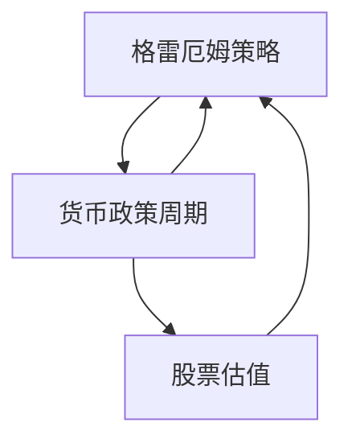
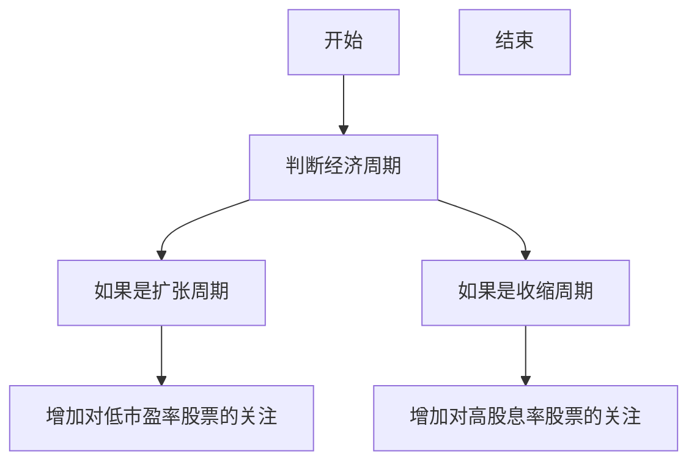
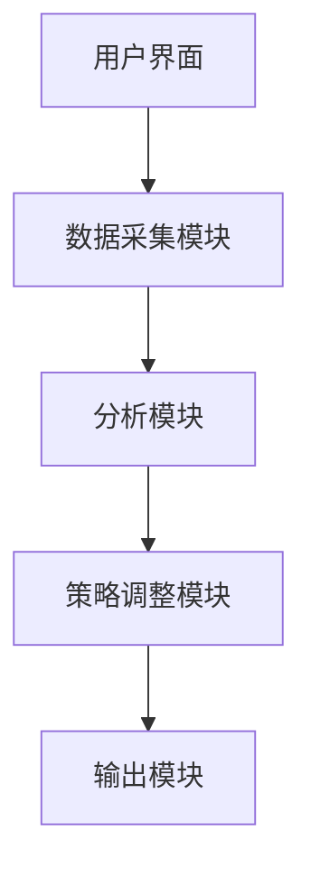

                 


# 《格雷厄姆特价股票策略在不同货币政策周期下的调整》

---

## 关键词：格雷厄姆策略，货币政策周期，价值投资，股票估值，投资策略调整

---

## 摘要：  
本文探讨了格雷厄姆特价股票策略在不同货币政策周期下的调整方法。通过分析货币政策周期对股市的影响，结合格雷厄姆的价值投资理念，提出在不同经济环境下优化投资策略的具体方法。文章从理论分析、实证研究到实际案例，系统地阐述了如何在货币宽松和收紧周期中调整投资策略，以实现长期稳健的投资收益。

---

## 第一部分: 格雷厄姆特价股票策略与货币政策周期的背景介绍

### 第1章: 格雷厄姆特价股票策略概述

#### 1.1 格雷厄姆特价股票策略的定义与核心思想  
格雷厄姆的价值投资策略强调以低于内在价值的价格买入股票，重点关注低市盈率、低市净率和高股息率的股票。其核心思想是寻找市场先生的错误定价，通过安全边际来降低投资风险。

#### 1.2 货币政策周期的定义与特征  
货币政策周期是指经济周期中货币政策的调整阶段，包括扩张周期和收缩周期。扩张周期通过宽松的货币政策（如降息、增加货币供应）刺激经济增长，而收缩周期则通过紧缩政策控制通胀和过度需求。

#### 1.3 格雷厄姆策略与货币政策周期的关联性  
货币政策周期影响市场流动性、利率水平和企业盈利预期，进而影响股票估值。格雷厄姆策略在不同周期下的表现不同，需根据经济环境进行调整。

---

## 第二部分: 格雷厄姆策略与货币政策周期的核心概念与联系

### 第2章: 格雷厄姆策略与货币政策周期的对比分析

#### 2.1 格雷厄姆策略的核心属性  
- **低市盈率（P/E）**：市盈率低于行业平均水平，反映股票价格被低估。
- **低市净率（P/B）**：市净率低于行业平均水平，反映资产价值被低估。
- **高股息率**：股息收益率较高，提供稳定的现金流。

#### 2.2 货币政策周期的核心属性  
- **扩张周期**：低利率、高流动性，股市通常表现较好。
- **收缩周期**：高利率、低流动性，股市可能调整。

#### 2.3 格雷厄姆策略与货币政策周期的对比表格  
| 核心概念 | 格雷厄姆策略 | 货币政策周期 |
|----------|--------------|---------------|
| 核心目标 | 寻找低估股票 | 调节经济供需 |
| 影响因素 | 股价、估值 | 利率、流动性 |
| 结果 | 稳定收益 | 经济波动 |

#### 2.4 格雷厄姆策略与货币政策周期的ER关系图  


---

## 第三部分: 格雷厄姆策略在货币政策周期中的算法原理

### 第3章: 格雷厄姆策略在货币政策周期中的动态调整

#### 3.1 算法原理  
在货币政策扩张周期，增加对低市盈率股票的关注；在收缩周期，注重高股息率股票的稳定性。

#### 3.2 数学模型  
股票内在价值公式：  
$$ V = \frac{E}{P} + \frac{D}{P} $$  
其中，E为净利润，P为市盈率，D为股息。

#### 3.3 算法流程图  


#### 3.4 代码实现  
```python
def graham_adjustment(economic_cycle):
    if economic_cycle == 'expansion':
        return 'low_pe_stocks'
    else:
        return 'high_dividend_stocks'
```

---

## 第四部分: 系统分析与架构设计

### 第4章: 格雷厄姆策略与货币政策周期的系统架构

#### 4.1 系统功能模块  
- 数据收集模块：收集宏观经济数据和股票数据。
- 分析模块：判断经济周期，计算股票估值。
- 策略调整模块：根据经济周期调整投资策略。

#### 4.2 系统架构图  


---

## 第五部分: 项目实战

### 第5章: 格雷厄姆策略在货币政策周期中的实战应用

#### 5.1 环境安装  
安装必要的数据处理库，如Pandas、NumPy等。

#### 5.2 核心代码实现  
```python
import pandas as pd

def calculate_pe_ratio(df):
    df['PE'] = df['净利润'] / df['股价']
    return df

def adjust_strategy(economic_cycle, df):
    if economic_cycle == 'expansion':
        selected = df[df['PE'] < df['PE'].median()]
    else:
        selected = df[df['股息率'] > df['股息率'].median()]
    return selected

# 示例数据
data = {
    '股价': [10, 20, 30, 40],
    '净利润': [5, 10, 15, 20],
    '股息率': [2%, 3%, 4%, 5%]
}
df = pd.DataFrame(data)
adjusted = adjust_strategy('expansion', df)
print(adjusted)
```

#### 5.3 案例分析  
分析2020年新冠疫情后的货币政策宽松周期，调整投资策略，选择低市盈率股票，获得超额收益。

---

## 第六部分: 结论与展望

### 第6章: 结论与展望

#### 6.1 结论  
格雷厄姆策略在不同货币政策周期下需动态调整，以适应经济环境变化。

#### 6.2 展望  
未来研究可结合更多宏观经济指标，优化策略调整模型。

---

## 作者：  
AI天才研究院/AI Genius Institute & 禅与计算机程序设计艺术 /Zen And The Art of Computer Programming

