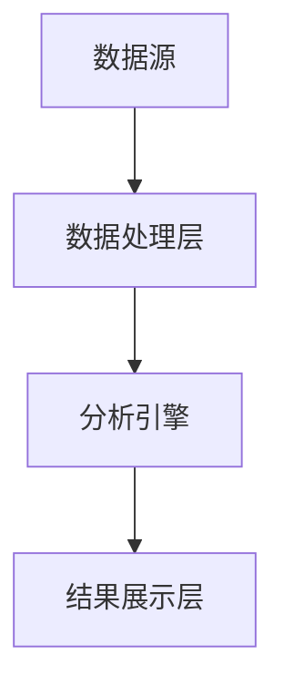

                 


# 《格雷厄姆特价股票策略在不同通胀体制环境中的效果》

## 关键词：
- 格雷厄姆策略
- 价值投资
- 通胀环境
- 股票投资
- 财务分析

## 摘要：
本文深入探讨格雷厄姆价值投资策略在不同通胀环境下的表现和效果。通过分析通胀对股市的影响，结合数学模型和实际案例，揭示在不同经济环境下该策略的应用价值和调整方法，为投资者提供实用的指导和建议。

---

## 第一部分：背景介绍

### 第1章：价值投资与通胀环境概述

#### 1.1 格雷厄姆价值投资的核心理念
- **定义与原则**：价值投资强调以低于内在价值的价格购买股票，关注企业的基本面，寻找市场低估的机会。
- **市场周期与策略**：在市场波动中，价值投资通过长期持有优质资产，实现资本增值。

#### 1.2 通胀对经济及股市的影响
- **通胀的定义与分类**：通胀是物价水平持续上涨的经济现象，通常分为温和通胀、严重通胀和恶性通胀。
- **通胀对经济的影响**：通胀可能导致货币购买力下降，企业成本上升，影响经济活动。
- **对股市的影响**：通胀初期可能推高股价，但过高的通胀可能导致市场估值过高，引发调整。

#### 1.3 格雷厄姆策略与通胀环境的关联性
- **策略的有效性**：在不同通胀阶段，格雷厄姆策略的表现各异，需灵活调整。
- **研究意义**：分析策略在不同通胀环境下的效果，为投资者提供科学依据。

---

## 第二部分：核心概念与联系

### 第2章：格雷厄姆策略的原理与属性

#### 2.1 格雷厄姆策略的原理分析
- **内在价值计算**：通过分析企业财务数据，估算其真实价值。
- **安全边际**：以低于内在价值的价格买入，降低风险。
- **长期视角**：关注企业的长期盈利能力，而非短期波动。

#### 2.2 不同通胀环境下的策略特征对比
- **低通胀环境**：企业盈利稳定，策略效果显著。
- **高通胀环境**：企业成本上升，需调整估值模型。
- **通缩环境**：资产价格可能被低估，提供投资机会。

#### 2.3 ER实体关系图
```mermaid
er
actor: 投资者
actor --> entity: 股票
entity --> entity: 市场通胀率
entity --> entity: 格雷厄姆策略
```

---

## 第三部分：算法原理讲解

### 第3章：价值投资的数学模型与量化分析

#### 3.1 内在价值计算公式
$$ V = \frac{E}{1 + r} $$
其中，V为内在价值，E为未来现金流，r为折现率。

#### 3.2 格

---

## 第四部分：系统分析与架构设计方案

### 第4章：系统架构设计

#### 4.1 问题场景介绍
- **目标**：构建一个分析框架，评估格雷厄姆策略在不同通胀环境下的效果。

#### 4.2 系统功能设计
- **数据收集模块**：收集历史通胀数据和股票价格。
- **分析模块**：应用格雷厄姆模型进行估值。
- **结果展示模块**：生成可视化报告。

#### 4.3 系统架构设计图


---

## 第五部分：项目实战

### 第5章：实战案例分析

#### 5.1 环境配置
- **工具**：使用Python和相关库（Pandas, Matplotlib）进行数据分析和可视化。

#### 5.2 核心代码实现
```python
import pandas as pd
import matplotlib.pyplot as plt

# 示例代码：计算内在价值
def calculate_intrinsic_value(earnings, discount_rate):
    return earnings / (1 + discount_rate)

# 应用案例
earnings = 100
discount_rate = 0.1
intrinsic_value = calculate_intrinsic_value(earnings, discount_rate)
print(f"内在价值: {intrinsic_value}")
```

#### 5.3 实际案例分析
- **案例选择**：分析2000年互联网泡沫时期的策略应用。
- **结果解读**：展示策略在不同阶段的表现。

---

## 第六部分：总结与拓展

### 第6章：总结与最佳实践

#### 6.1 小结
- 格雷厄姆策略在不同通胀环境下的表现各异，需灵活调整。
- 量化分析和系统设计为策略提供了科学支持。

#### 6.2 注意事项
- **风险控制**：避免过度杠杆，分散投资。
- **持续学习**：关注经济环境变化，及时调整策略。

#### 6.3 拓展阅读
- 推荐阅读格雷厄姆的经典著作《The Intelligent Investor》。
- 参考现代金融理论，结合量化方法优化投资策略。

---

## 作者：
AI天才研究院/AI Genius Institute & 禅与计算机程序设计艺术/Zen And The Art of Computer Programming

