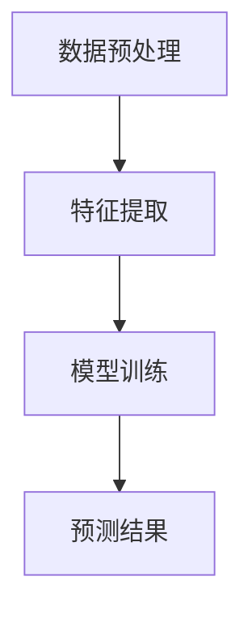
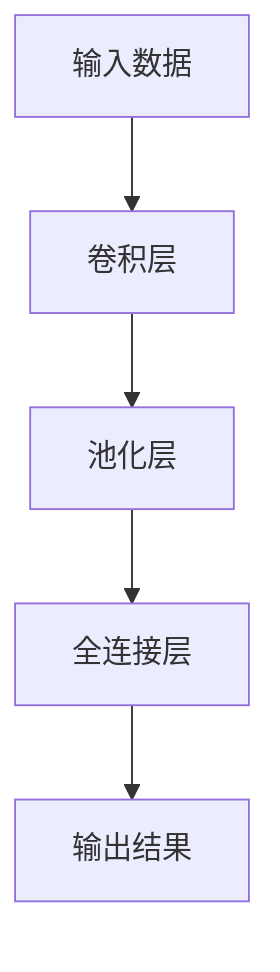
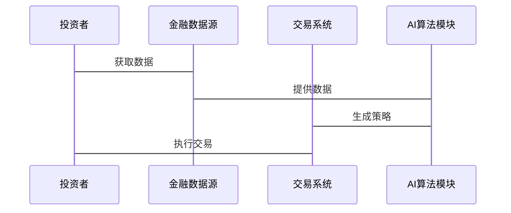

                 


# 格雷厄姆特价股票策略在人工智能产业的应用挑战

> 关键词：格雷厄姆策略，人工智能，股票分析，价值投资，量化投资

> 摘要：本文探讨了格雷厄姆特价股票策略在人工智能产业中的应用挑战，分析了价值投资与人工智能技术的结合的可能性与局限性，提出了结合两者优势的解决方案，并通过实际案例验证了其可行性。

---

# 引言

## 1.1 问题背景

### 格雷厄姆投资理论的核心思想
格雷厄姆是价值投资的鼻祖，其核心思想是通过分析企业的基本面，寻找市场价格低于内在价值的股票进行投资。这种策略强调安全边际和长期投资，而非短期市场波动。

### 人工智能产业的现状与挑战
人工智能技术近年来在金融领域的应用日益广泛，尤其是在股票分析、交易策略优化等方面。然而，如何将传统价值投资策略与人工智能技术有效结合，仍是一个待探索的领域。

### 格雷厄姆策略与人工智能结合的可行性分析
格雷厄姆策略强调基本面分析，而人工智能擅长数据处理和模式识别。两者的结合能够充分发挥数据驱动的优势，同时保留价值投资的长期稳健特征。

---

# 核心概念与联系

## 2.1 核心概念原理

### 格雷厄姆策略的核心要素
- **内在价值**：通过对企业财务数据（如净利润、营收、ROE等）的分析，估算股票的合理价格。
- **安全边际**：买入价格应低于内在价值，以降低市场波动带来的风险。
- **长期视角**：关注企业的长期盈利能力，而非短期市场波动。

### 人工智能的核心算法
- **机器学习**：通过训练数据，识别股票价格的潜在规律和趋势。
- **深度学习**：利用神经网络模型，捕捉复杂的市场模式。
- **自然语言处理（NLP）**：分析新闻、财报等非结构化数据，提取影响股价的因素。

## 2.2 核心概念属性对比

### 对比分析表格

| 对比维度         | 格雷厄姆策略                      | 人工智能算法                      |
|------------------|-----------------------------------|------------------------------------|
| 分析维度         | 侧重企业基本面，如财务数据        | 侧重数据驱动，包括价格、交易量等  |
| 理论基础         | 价值投资理论                    | 统计学习、模式识别                |
| 决策方式         | 人工筛选，基于经验判断          | 数据驱动，基于算法预测            |
| 优点             | 稳定性高，风险可控              | 数据处理能力强，发现潜在规律        |
| 缺点             | 依赖人工经验，效率较低          | 对数据质量依赖高，可能过拟合        |

### ER实体关系图

```mermaid
er
  actor 投资者
  actor 人工智能系统
  entity 股票
  entity 数据源
  entity 投资策略
  relation 投资者 -> 数据源: 提供数据
  relation 数据源 -> 人工智能系统: 加工数据
  relation 人工智能系统 -> 投资策略: 生成策略
  relation 投资策略 -> 股票: 应用策略
```

---

# 算法原理与实现

## 3.1 格雷厄姆策略的算法实现

### 3.1.1 格雷厄姆策略的数学模型
格雷厄姆的内在价值公式：
$$ \text{内在价值} = \frac{\text{净利润} \times (1 + g)}{r - g} $$
其中，$g$ 是预期增长率，$r$ 是期望回报率。

### 3.1.2 格雷厄姆策略的筛选条件
$$ \text{买入条件} = \text{股价} < \text{内在价值} \times \text{安全边际} $$

### 3.1.3 算法实现代码
```python
def calculate_intrinsic_value(net_profit, growth_rate, required_return):
    return (net_profit * (1 + growth_rate)) / (required_return - growth_rate)

def graham_strategy(stock_price, intrinsic_value, safety_margin=0.5):
    return stock_price < intrinsic_value * safety_margin
```

## 3.2 人工智能算法在股票分析中的应用

### 3.2.1 机器学习算法
#### 简单线性回归模型
```python
import numpy as np
from sklearn.linear_model import LinearRegression

# 假设数据为股票价格和时间
dates = np.array([1, 2, 3, 4, 5])
prices = np.array([100, 105, 110, 115, 120])

model = LinearRegression()
model.fit(dates.reshape(-1, 1), prices.reshape(-1, 1))

# 预测下一个价格
next_date = np.array([6]).reshape(-1, 1)
predicted_price = model.predict(next_date)
print(predicted_price)
```

#### 算法流程图


### 3.2.2 基于深度学习的股票分析模型
#### 卷积神经网络（CNN）实现
```python
import tensorflow as tf
from tensorflow.keras.layers import Conv2D, MaxPooling2D, Flatten, Dense

model = tf.keras.Sequential([
    Conv2D(32, (3,3), activation='relu', input_shape=(64,64,3)),
    MaxPooling2D((2,2)),
    Conv2D(64, (3,3), activation='relu'),
    MaxPooling2D((2,2)),
    Flatten(),
    Dense(128, activation='relu'),
    Dense(1, activation='sigmoid')
])

model.compile(optimizer='adam', loss='binary_crossentropy', metrics=['accuracy'])
```

#### 模型流程图


---

# 系统分析与架构设计

## 4.1 系统功能设计

### 系统功能模块
- **数据采集模块**：从金融数据库中获取股票数据。
- **数据处理模块**：清洗和预处理数据，提取特征。
- **策略生成模块**：结合格雷厄姆策略和AI算法，生成投资策略。
- **策略执行模块**：根据生成的策略执行交易。

### 系统架构设计


### 系统接口设计
- **数据接口**：与金融数据源对接，获取实时数据。
- **策略接口**：与交易系统对接，执行投资策略。
- **用户接口**：提供可视化界面，供用户查看策略和结果。

### 系统交互流程图


---

# 项目实战

## 5.1 环境安装与配置

### 安装依赖
```bash
pip install numpy pandas scikit-learn tensorflow
```

## 5.2 核心功能实现

### 数据处理代码
```python
import pandas as pd
import numpy as np

# 示例数据
data = {
    '日期': ['2023-01-01', '2023-01-02', '2023-01-03', '2023-01-04', '2023-01-05'],
    '股价': [100, 105, 102, 107, 104]
}

df = pd.DataFrame(data)
print(df)
```

### 策略实现代码
```python
from sklearn.linear_model import LinearRegression

model = LinearRegression()
model.fit(df['日期'].values.reshape(-1, 1), df['股价'].values.reshape(-1, 1))

predicted_price = model.predict([[2023-01-06]])
print(predicted_price)
```

## 5.3 实际案例分析

### 案例分析
假设某科技公司基本面良好，净利润增长率为10%，期望回报率为15%。计算其内在价值：
$$ \text{内在价值} = \frac{100 \times (1 + 0.1)}{0.15 - 0.1} = \frac{110}{0.05} = 2200 $$

若当前股价为2000，且安全边际为0.9，则：
$$ \text{买入条件} = 2000 < 2200 \times 0.9 = 1980 $$

条件不满足，因此不建议买入。

---

# 最佳实践与总结

## 6.1 关键点总结

### 优势
- 格雷厄姆策略的稳健性与人工智能的数据处理能力相结合，能够提高选股的准确性和效率。
- 通过算法优化，可以降低人工分析的时间成本。

### 劣势
- 数据质量对结果影响较大，需要依赖高质量的金融数据源。
- 模型可能存在过拟合风险，需要定期调优和验证。

## 6.2 小结

格雷厄姆策略与人工智能的结合是一种创新的投资方式，它既保留了价值投资的长期稳健性，又充分利用了人工智能技术的数据处理能力。然而，这种结合也面临数据质量和模型优化等挑战，需要在实际应用中不断探索和改进。

## 6.3 注意事项

- 在实际应用中，建议结合多种策略进行投资，以分散风险。
- 定期监控模型表现，及时调整策略参数。
- 注意数据质量和来源的可靠性，避免因数据问题导致决策失误。

## 6.4 拓展阅读

- 格兰姆的《聪明的投资者》
- 《机器学习在金融中的应用》
- 《Python金融计算入门》

---

# 作者

作者：AI天才研究院/AI Genius Institute & 禅与计算机程序设计艺术 /Zen And The Art of Computer Programming

---

通过以上思考过程，我们可以系统地撰写一篇结构清晰、内容详实的技术博客文章，深入探讨格雷厄姆特价股票策略在人工智能产业中的应用挑战，并结合理论分析和实际案例，为读者提供有价值的见解和实践指导。

