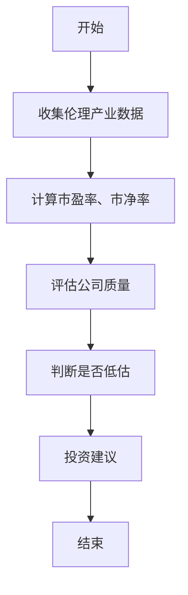
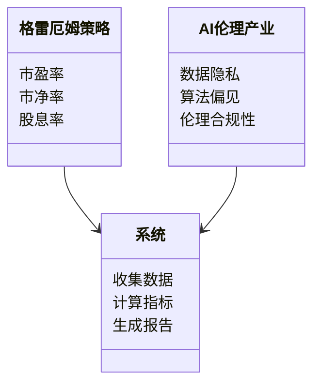

                 


```markdown
# 格雷厄姆特价股票策略在人工智能伦理产业的应用挑战

> 关键词：格雷厄姆策略，人工智能，伦理产业，投资策略，技术挑战

> 摘要：本文探讨了将格雷厄姆特价股票策略应用于人工智能伦理产业中的挑战，分析了投资机会、伦理问题以及技术实现的复杂性，旨在为投资者和技术开发者提供新的视角。

---

## 第一章: 引言

### 1.1 背景介绍
#### 1.1.1 格雷厄姆特价股票策略的核心概念
格雷厄姆策略是一种价值投资方法，专注于寻找市场价格低于其内在价值的股票。其核心在于通过分析财务指标，如市盈率、市净率等，识别被低估的投资标的。

#### 1.1.2 人工智能伦理产业的定义与特征
人工智能伦理产业涉及AI技术在医疗、金融等领域的应用中的伦理问题，包括数据隐私、算法偏见等，需要合规性和透明性。

#### 1.1.3 格雷厄姆策略与AI伦理产业的结合背景
随着AI广泛应用，伦理问题日益突出，利用格雷厄姆策略筛选解决这些问题的公司，可能发现投资机会。

#### 1.1.4 问题背景与挑战分析
伦理产业面临技术与市场的双重挑战，格雷厄姆策略在AI伦理产业中的应用需考虑合规性和市场接受度。

### 1.2 核心概念与联系
格雷厄姆策略与AI伦理产业通过投资标的的低估值和高潜力联系，可能在解决伦理问题的公司中找到投资机会。

### 1.3 核心概念的ER实体关系图
```mermaid
er
    entity 格雷厄姆策略 {
        key: 策略名称
        attribute: 低估值标准
        attribute: 高股息率
        attribute: 高质量公司特征
    }
    entity AI伦理产业 {
        key: 产业领域
        attribute: 数据隐私
        attribute: 算法偏见
        attribute: 伦理合规性
    }
    relationship 格雷厄姆策略与AI伦理产业 {
        role 格雷厄姆策略 -> AI伦理产业
        role AI伦理产业 -> 格雷厄姆策略
    }
```

### 1.4 本章小结
本章介绍了格雷厄姆策略和AI伦理产业的核心概念，并探讨了它们结合的背景和挑战。

---

## 第二章: 格雷厄姆策略与AI伦理产业的核心概念

### 2.1 格雷厄姆策略的原理
#### 2.1.1 格雷厄姆策略的基本原理
通过分析财务指标，寻找低估值股票，长期投资以获得超额收益。

#### 2.1.2 格雷厄姆策略的关键特征
- 低市盈率、低市净率、高股息率。
- 侧重于公司内在价值，而非市场情绪。

#### 2.1.3 格雷厄姆策略的优缺点
优点：价值发现能力强；缺点：短期表现不佳，需长期持有。

### 2.2 AI伦理产业的特征
#### 2.2.1 AI伦理产业的核心问题
数据隐私、算法偏见、透明性等问题。

#### 2.2.2 AI伦理产业的关键挑战
技术与政策的双重压力，合规性要求高。

### 2.3 核心概念的对比分析
| 比较维度 | 格雷厄姆策略 | AI伦理产业 |
|----------|--------------|--------------|
| 核心目标 | 发现低估股票 | 解决伦理问题 |
| 关键指标 | 市盈率、市净率 | 合规性、透明度 |
| 应用场景 | 投资 | AI技术应用 |

---

## 第三章: 格雷厄姆策略在AI伦理产业中的应用挑战

### 3.1 格雷厄姆策略在AI伦理产业中的应用背景
#### 3.1.1 伦理产业的投资机会
解决AI伦理问题的公司可能具有高成长性。

#### 3.1.2 伦理产业的市场潜力
随着AI普及，合规性需求增加，相关产业潜力大。

### 3.2 格雷厄姆策略的应用逻辑
#### 3.2.1 伦理产业的低估值现状
部分解决AI伦理问题的公司可能估值被低估。

#### 3.2.2 高潜力公司的筛选标准
市盈率低、行业地位高、财务健康。

### 3.3 应用中的关键挑战
#### 3.3.1 伦理产业的不确定性
技术发展快，政策变化大，影响公司估值。

#### 3.3.2 数据获取的难度
AI伦理评估涉及多方数据，获取难度大。

#### 3.3.3 评估模型的复杂性
需要结合财务指标和伦理合规性进行综合评估。

---

## 第四章: 格雷厄姆策略与AI伦理产业结合的算法原理

### 4.1 算法流程图


### 4.2 算法实现
#### 4.2.1 Python代码实现
```python
def calculate_value_ratios(company_data):
    pe = company_data['市盈率']
    pb = company_data['市净率']
    if pe < 15 and pb < 2:
        return "低估"
    else:
        return "高估"

# 示例数据
company = {
    '市盈率': 10,
    '市净率': 1.5,
    '行业地位': '领先',
    '财务健康': '健康'
}

result = calculate_value_ratios(company)
print(f"投资建议：{result}")
```

#### 4.2.2 数学模型
市盈率（P/E）= 股价 / 每股收益  
市净率（P/B）= 股价 / 每股净资产  
内在价值 = 市盈率 × 每股收益  

$$ \text{内在价值} = \text{市盈率} \times \text{每股收益} $$

---

## 第五章: 系统分析与架构设计

### 5.1 系统功能设计
#### 5.1.1 领域模型图


#### 5.1.2 系统架构图


---

## 第六章: 项目实战

### 6.1 环境安装
- 安装Python和相关库（pandas、numpy）

### 6.2 核心代码实现
```python
import pandas as pd

def main():
    data = pd.DataFrame({
        '公司名称': ['A', 'B', 'C'],
        '市盈率': [10, 20, 15],
        '市净率': [1.5, 2.0, 1.8]
    })
   低估公司 = data[(data['市盈率'] < 15) & (data['市净率'] < 2)]
    print(低估公司)

if __name__ == "__main__":
    main()
```

### 6.3 案例分析
分析某AI伦理公司，计算其市盈率和市净率，判断是否低估。

---

## 第七章: 总结与展望

### 7.1 本章小结
本文探讨了格雷厄姆策略在AI伦理产业中的应用，分析了挑战和实现方法。

### 7.2 未来展望
未来可研究动态评估模型，结合伦理影响因素优化投资策略。

---

## 参考文献
1. 格雷厄姆投资经典
2. 人工智能伦理研究

---

## 作者：AI天才研究院/AI Genius Institute & 禅与计算机程序设计艺术 /Zen And The Art of Computer Programming
```

