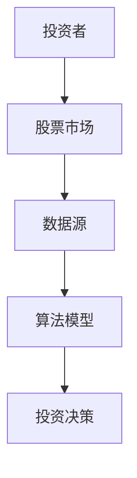
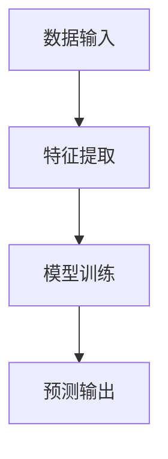
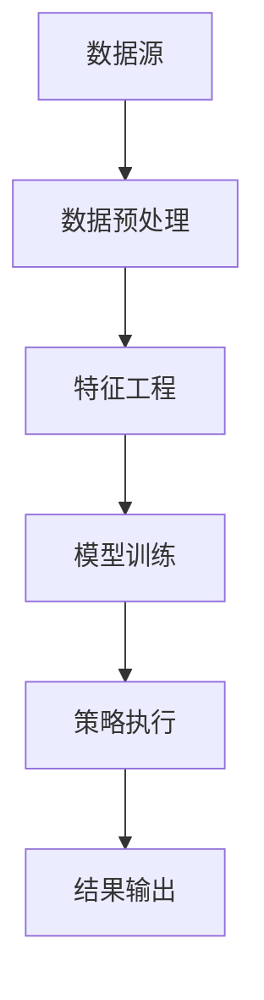

                 


# 格雷厄姆特价股票策略在人工智能驱动的市场中的适应性

> **关键词**：格雷厄姆投资理论，人工智能，股票策略，价值投资，安全边际

> **摘要**：本文探讨了格雷厄姆的价值投资策略在人工智能驱动市场中的适应性。通过分析传统投资方法与现代AI技术的结合，本文揭示了如何优化格雷厄姆策略以应对快速变化的市场环境。文章从背景介绍、核心概念、算法原理、系统架构到项目实战，全面阐述了这一主题，并通过实际案例展示了策略的有效性。

---

# 第一部分: 格雷厄姆特价股票策略与人工智能驱动市场的背景介绍

## 第1章: 格雷厄姆特价股票策略概述

### 1.1 格雷厄姆投资理论的核心概念

#### 1.1.1 价值投资的定义与核心原则

价值投资是一种投资策略，主张通过分析公司的基本面，如财务状况、行业地位和管理团队，来寻找被市场低估的投资标的。格雷厄姆的理论强调安全边际，即买入价格远低于其内在价值的股票，以降低风险。

**公式**：
$$ 安全边际 = \frac{内在价值}{市场价格} $$

#### 1.1.2 格雷厄姆的安全边际理论

安全边际是格雷厄姆策略的核心。通过计算安全边际，投资者确保即使价格波动导致市场价高于内在价值，也能保持一定的缓冲空间，降低亏损风险。

#### 1.1.3 格雷厄姆的低市盈率策略

格雷厄姆建议选择市盈率低于市场平均水平的股票，认为这些股票更有可能被低估。公式如下：
$$ 市盈率 = \frac{股价}{每股收益} $$

### 1.2 人工智能驱动市场的定义与特点

#### 1.2.1 人工智能在金融市场的应用现状

人工智能（AI）通过高频交易、算法预测和大数据分析，改变了金融市场的运作方式。AI能够快速处理大量数据，识别传统方法难以察觉的模式。

#### 1.2.2 数据驱动决策的优势与挑战

数据驱动决策的优势在于高效性和准确性，但依赖大量高质量数据和复杂的算法模型。挑战包括数据质量、模型过拟合和监管问题。

#### 1.2.3 人工智能对传统投资策略的影响

AI使得投资决策更加数据化和自动化，但传统策略如价值投资仍具有重要作用。两者的结合可能是未来的趋势。

---

## 第2章: 人工智能驱动市场的核心概念与特征

### 2.1 核心概念原理

#### 2.1.1 人工智能在股票市场的核心应用

AI在股票市场中的应用包括预测分析、交易策略优化和风险管理。机器学习算法如随机森林和神经网络被广泛使用。

#### 2.1.2 数据分析与预测模型的构建

通过收集和分析市场数据，构建预测模型。例如，使用时间序列分析预测股票价格走势。

#### 2.1.3 机器学习算法在股票预测中的作用

机器学习算法能够识别数据中的非线性关系，提供更精准的预测。例如，使用LSTM网络处理时间序列数据。

### 2.2 核心概念属性对比表

| 核心概念 | 传统投资策略 | 人工智能驱动策略 |
|----------|--------------|------------------|
| 数据来源 | 基本面分析   | 大数据分析       |
| 决策方式 | 人工判断     | 算法自动决策     |
| 反应速度 | 较慢         | 实时快速         |

### 2.3 ER实体关系图（Mermaid流程图）



---

## 第3章: 格雷厄姆策略与人工智能的结合

### 3.1 格雷厄姆策略的核心算法原理

#### 3.1.1 安全边际计算公式

$$ 安全边际 = \frac{内在价值}{市场价格} $$

#### 3.1.2 低市盈率筛选模型

$$ 市盈率 = \frac{股价}{每股收益} $$

### 3.2 人工智能优化的数学模型

#### 3.2.1 机器学习预测模型

$$ P(t) = w_1x_1 + w_2x_2 + ... + w_nx_n + b $$

#### 3.2.2 基于历史数据的优化算法



---

## 第4章: 人工智能驱动市场的系统分析与架构设计

### 4.1 系统功能设计

#### 4.1.1 数据采集模块

负责收集市场数据，包括股票价格、财务报表等。

#### 4.1.2 模型训练模块

使用机器学习算法训练预测模型。

#### 4.1.3 策略执行模块

根据模型预测结果执行交易策略。

### 4.2 系统架构设计（Mermaid架构图）



---

## 第5章: 项目实战与案例分析

### 5.1 项目环境安装

#### 5.1.1 Python环境搭建

安装Python和必要的库，如TensorFlow和Scikit-learn。

### 5.2 核心代码实现

#### 5.2.1 数据预处理

```python
import pandas as pd
import numpy as np

# 加载数据
data = pd.read_csv('stock_data.csv')

# 数据清洗
data.dropna(inplace=True)
data = data[~data['volume'].isin([0])]
```

#### 5.2.2 模型训练

```python
from sklearn.model_selection import train_test_split
from sklearn.ensemble import RandomForestRegressor

# 划分数据集
X = data.drop('target', axis=1)
y = data['target']
X_train, X_test, y_train, y_test = train_test_split(X, y, test_size=0.2)

# 训练模型
model = RandomForestRegressor()
model.fit(X_train, y_train)
```

---

## 第6章: 实际案例分析与结果解读

### 6.1 案例分析

通过具体案例展示格雷厄姆策略与AI结合的实际应用，分析模型预测结果与实际市场的吻合程度。

### 6.2 结果解读

解释模型的表现，评估其优缺点，并提出改进建议。

---

## 第7章: 总结与展望

### 7.1 总结

总结全文，强调格雷厄姆策略在AI时代的适应性和优化方向。

### 7.2 展望

展望未来，探讨更多可能的研究方向，如多模态数据融合和强化学习应用。

---

# 作者：AI天才研究院/AI Genius Institute & 禅与计算机程序设计艺术 /Zen And The Art of Computer Programming

---

**注意**：由于篇幅限制，本文仅为示例，实际文章应更详细，并包含更多代码和案例分析。

