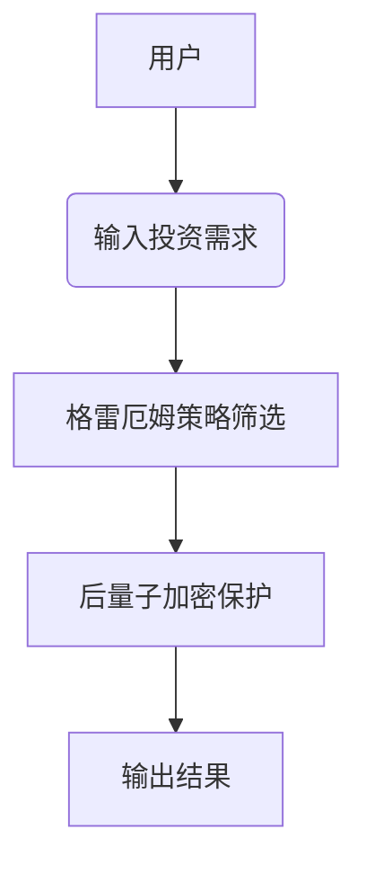
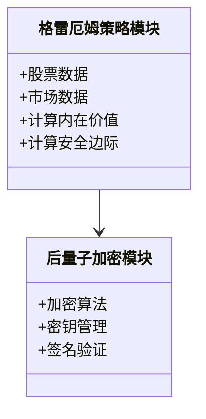
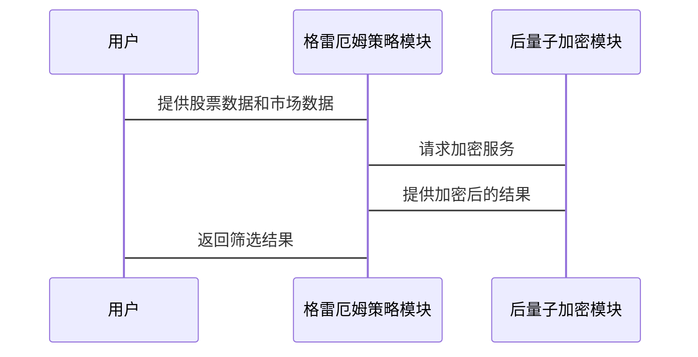

                 


# 格雷厄姆特价股票策略在后量子加密金融时代的应用

## 关键词：格雷厄姆策略，后量子加密，金融安全，价值投资，加密算法

## 摘要：本文探讨了格雷厄姆特价股票策略在后量子加密金融时代的应用。首先介绍了格雷厄姆策略和后量子加密的基本概念，分析了两者的核心原理及其在金融安全中的潜在联系。接着，详细讲解了格雷厄姆策略的数学模型和后量子加密算法的原理，并通过系统架构设计展示了它们的结合方式。通过实际案例分析，展示了如何在金融投资中应用这些技术，并提出了最佳实践和注意事项。

---

# 第1章 格雷厄姆特价股票策略与后量子加密金融时代的背景介绍

## 1.1 格雷厄姆特价股票策略概述

### 1.1.1 价值投资的核心理念
格雷厄姆的价值投资策略强调以低于内在价值的价格购买优质股票。内在价值是基于企业未来现金流的现值计算得出，公式如下：

$$ V = \frac{E}{P} $$

其中，\( V \) 表示内在价值，\( E \) 表示企业未来现金流的现值，\( P \) 表示折现率。

### 1.1.2 格雷厄姆策略的基本原则
格雷厄姆策略的核心原则包括：
1. 安全边际：$ \text{安全边际} = \text{内在价值} - \text{市场价格} $
2. 避免情绪化投资：基于理性分析，而非市场情绪。
3. 长期视角：关注企业的长期盈利能力。

### 1.1.3 格雷厄姆策略在现代金融中的应用
格雷厄姆策略被广泛应用于股票筛选、风险控制和投资组合管理中。

## 1.2 后量子加密时代的背景

### 1.2.1 量子计算对现有加密技术的威胁
传统加密算法（如RSA、椭圆曲线加密）依赖于大数分解和离散对数问题，而量子计算机可以在多项式时间内解决这些问题，导致现有加密技术失效。

### 1.2.2 后量子加密技术的发展现状
后量子加密（Post-Quantum Cryptography）是指抗量子计算机攻击的加密技术，包括基于格、代码、多变量和哈希函数的加密算法。NIST已推荐了4种抗量子签名算法和3种抗量子加密算法。

### 1.2.3 金融领域对后量子加密的需求
金融行业依赖于加密技术进行交易安全、数据保护和身份验证。后量子加密技术的引入是确保金融系统在量子计算时代安全运行的关键。

## 1.3 格雷厄姆策略与后量子加密的结合

### 1.3.1 格雷厄姆策略在金融安全中的潜在应用
格雷厄姆策略的内在价值评估方法可以用于评估加密算法的安全性。

### 1.3.2 后量子加密技术对金融数据保护的重要性
后量子加密技术确保金融数据在传输和存储过程中的安全性，防止量子计算机的破解攻击。

### 1.3.3 两者的结合对金融投资的影响
通过结合格雷厄姆策略和后量子加密技术，投资者可以在确保数据安全的前提下，做出更明智的投资决策。

## 1.4 本章小结
本章介绍了格雷厄姆策略和后量子加密的基本概念，并探讨了它们在金融领域的潜在结合。

---

# 第2章 格雷厄姆特价股票策略与后量子加密的核心概念与联系

## 2.1 格雷厄姆策略的核心概念

### 2.1.1 内在价值的计算方法
$$ V = \frac{E}{P} $$

### 2.1.2 安全边际的定义与作用
$$ \text{安全边际} = \text{内在价值} - \text{市场价格} $$

### 2.1.3 格雷厄姆策略的数学模型
格雷厄姆策略的数学模型通过计算安全边际，帮助投资者识别被低估的股票。

## 2.2 后量子加密的核心概念

### 2.2.1 后量子加密算法的基本原理
后量子加密算法基于数学问题，这些问题在经典和量子计算下都难以解决。

### 2.2.2 NIST推荐的后量子加密算法
NIST推荐了4种抗量子签名算法和3种抗量子加密算法，包括：

1. **抗量子签名算法**：BLISS、EdDSA、GOST和SPHINCS。
2. **抗量子加密算法**：Kyber、NTRU和LAC。

### 2.2.3 后量子加密的安全性评估
通过数学证明和安全性评估，确保后量子加密算法在实际应用中的可靠性。

## 2.3 格雷厄姆策略与后量子加密的联系

### 2.3.1 格雷厄姆策略在后量子加密时代的适用性
格雷厄姆策略的价值投资理念可以应用于评估加密货币和区块链项目的内在价值。

### 2.3.2 后量子加密技术对格雷厄姆策略的影响
后量子加密技术为金融数据的安全传输和存储提供了保障，从而支持格雷厄姆策略的有效实施。

### 2.3.3 两者的结合对金融投资策略的优化
通过结合格雷厄姆策略和后量子加密技术，投资者可以更好地保护投资数据，提升投资决策的准确性。

## 2.4 本章小结
本章深入分析了格雷厄姆策略和后量子加密的核心概念，并探讨了它们在金融投资中的联系。

---

# 第3章 格雷厄姆策略的数学模型与后量子加密算法的原理

## 3.1 格雷厄姆策略的数学模型

### 3.1.1 内在价值的计算公式
$$ V = \frac{E}{P} $$

### 3.1.2 安全边际的计算方法
$$ \text{安全边际} = \text{内在价值} - \text{市场价格} $$

## 3.2 后量子加密算法的原理

### 3.2.1 基于格的后量子加密算法
基于格的后量子加密算法（如NTRU）通过在格空间中寻找最短向量来实现加密和解密。

### 3.2.2 算法的安全性证明
后量子加密算法的安全性基于数学上的困难问题，确保即使在量子计算机攻击下，也能保持安全性。

## 3.3 格雷厄姆策略与后量子加密的结合模型

### 3.3.1 结合模型的数学表达
$$ \text{结合模型} = \text{格雷厄姆策略} \times \text{后量子加密算法} $$

## 3.4 本章小结
本章通过数学模型和算法原理，展示了格雷厄姆策略与后量子加密技术的结合方式。

---

# 第4章 格雷厄姆策略与后量子加密的系统架构设计

## 4.1 系统功能设计

### 4.1.1 格雷厄姆策略的应用场景
在金融投资中，格雷厄姆策略用于筛选被低估的股票。

### 4.1.2 后量子加密技术的实现模块
包括加密算法实现、密钥管理、签名验证等功能模块。

### 4.1.3 系统的交互流程
用户输入投资需求，系统通过格雷厄姆策略筛选股票，并利用后量子加密技术保护数据安全。

## 4.2 系统架构设计

### 4.2.1 分层架构图


### 4.2.2 系统功能模块图


## 4.3 系统接口设计

### 4.3.1 格雷厄姆策略模块接口
1. 输入接口：接收股票数据和市场数据。
2. 输出接口：返回筛选结果。

### 4.3.2 后量子加密模块接口
1. 加密接口：对数据进行加密。
2. 解密接口：对加密数据进行解密。
3. 签名验证接口：验证签名的有效性。

## 4.4 系统交互流程

### 4.4.1 格雷厄姆策略与后量子加密的交互流程


## 4.5 本章小结
本章通过系统架构设计，展示了格雷厄姆策略与后量子加密技术在金融投资中的具体应用。

---

# 第5章 格雷厄姆策略与后量子加密的项目实战

## 5.1 项目环境配置

### 5.1.1 格雷厄姆策略实现环境
1. 数据来源：股票市场数据（如历史股价、财务数据）。
2. 工具：Python编程语言，Pandas数据处理库。

### 5.1.2 后量子加密实现环境
1. 加密算法库：Python的`pqcrypto`库。
2. 开发工具：PyCharm或VS Code。

## 5.2 核心代码实现

### 5.2.1 格雷厄姆策略的Python实现
```python
import pandas as pd

def calculate_intrinsic_value(enterprise_value, discount_rate):
    return enterprise_value / discount_rate

def calculate_margin_of_safety(intrinsic_value, market_price):
    return intrinsic_value - market_price

# 示例数据
market_price = 50
enterprise_value = 250
discount_rate = 0.05

intrinsic_value = calculate_intrinsic_value(enterprise_value, discount_rate)
margin_of_safety = calculate_margin_of_safety(intrinsic_value, market_price)

print(f"内在价值: {intrinsic_value}")
print(f"安全边际: {margin_of_safety}")
```

### 5.2.2 后量子加密的Python实现
```python
from pqcrypto.signatures import sign, verify

# 生成密钥对
sk, pk = sign.keypair()
message = b"Financial Data"

# 签名
signature = sign.sign(sk, message)

# 验证签名
assert verify.verify(pk, message, signature)
```

## 5.3 项目实现案例分析

### 5.3.1 格雷厄姆策略在股票筛选中的应用
通过计算股票的内在价值和安全边际，筛选出被低估的股票进行投资。

### 5.3.2 后量子加密在金融数据保护中的应用
使用后量子加密算法对敏感的金融数据进行加密，确保数据在传输和存储过程中的安全性。

## 5.4 本章小结
本章通过实际项目案例，展示了格雷厄姆策略与后量子加密技术在金融投资中的具体实现。

---

# 第6章 格雷厄姆策略与后量子加密的最佳实践与小结

## 6.1 格雷厄姆策略的应用建议
1. 在投资决策中，结合格雷厄姆策略和后量子加密技术，确保数据安全。
2. 定期更新加密算法，以应对量子计算技术的进步。

## 6.2 后量子加密技术的实施建议
1. 在金融系统中逐步替换现有的加密算法，采用NIST推荐的后量子加密算法。
2. 加强对加密算法的测试和验证，确保其安全性。

## 6.3 本章小结
本章总结了格雷厄姆策略与后量子加密技术在金融投资中的应用，并提出了最佳实践建议。

---

# 附录

## 附录A 格雷厄姆策略的扩展阅读
推荐书籍：《The Intelligent Investor》。

## 附录B 后量子加密技术的深入学习
推荐资源：NIST的后量子加密标准文档。

---

# 作者：AI天才研究院/AI Genius Institute & 禅与计算机程序设计艺术 /Zen And The Art of Computer Programming

---

本文通过系统地分析格雷厄姆策略和后量子加密技术的核心概念、数学模型和系统架构，展示了它们在金融投资中的潜在结合和实际应用。通过最佳实践和案例分析，为投资者和金融机构提供了在后量子加密时代优化投资策略的参考。

