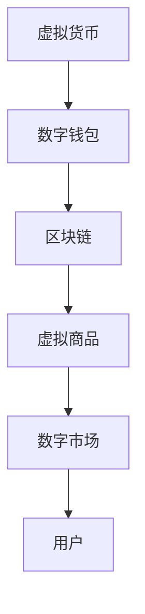
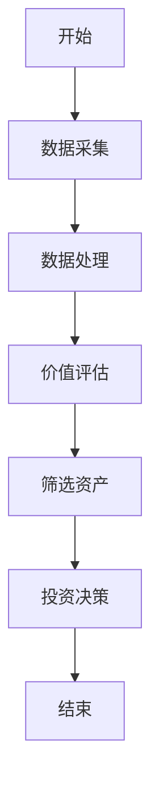
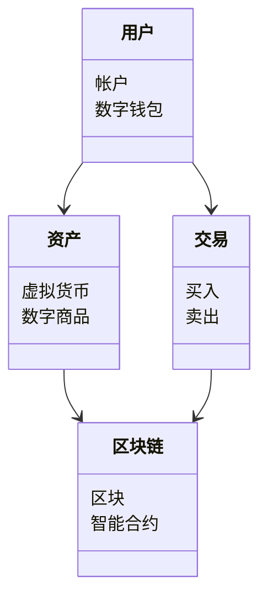
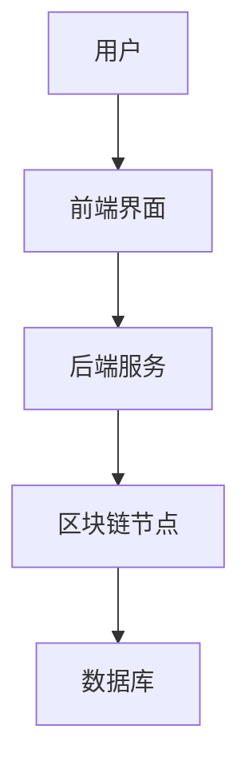
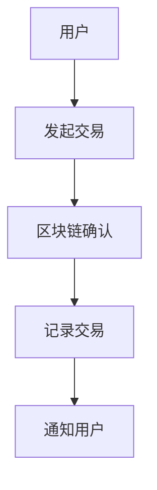

                 


# 格雷厄姆特价股票策略在混合现实经济体系下的表现

**关键词：** 格雷厄姆策略，混合现实经济，价值投资，股票筛选，经济体系，算法实现，数学模型

**摘要：** 本文探讨了格雷厄姆特价股票策略在混合现实经济体系下的应用表现。通过分析混合现实经济体系的核心概念与价值投资的结合，详细讲解了格雷厄姆策略的算法原理、数学模型以及在混合现实经济中的实际应用。本文还提供了系统架构设计、项目实战案例和最佳实践建议，帮助读者理解如何在混合现实中有效实施格雷厄姆策略。

---

## 第一部分：混合现实经济体系与价值投资的结合

### 第1章：混合现实经济体系的背景与现状

#### 1.1 混合现实经济体系的定义与特点
- **1.1.1 混合现实经济体系的定义**
  混合现实经济体系是一种结合虚拟现实（VR）和增强现实（AR）技术的经济体系，将虚拟世界与现实世界深度融合，形成一种全新的经济环境。

- **1.1.2 混合现实经济体系的核心特点**
  - **虚拟与现实的深度融合：** 混合现实经济体系允许用户在现实世界中通过虚拟元素进行交互和交易。
  - **实时数据驱动：** 经济活动基于实时数据，如虚拟货币、区块链技术等。
  - **沉浸式体验：** 用户可以通过AR/VR设备获得高度沉浸的经济互动体验。

- **1.1.3 混合现实经济体系的发展现状**
  混合现实经济体系目前主要应用于虚拟货币、数字资产交易、虚拟商品市场等领域，未来有望扩展到更多经济领域。

#### 1.2 格雷厄姆特价股票策略的基本原理
- **1.2.1 格雷厄姆特价股票策略的定义**
  格雷厄姆策略是一种以价值投资为核心的投资策略，主要关注低估值的股票，寻找市场低估的优质企业进行投资。

- **1.2.2 格雷厄姆策略的核心要素**
  - **内在价值：** 股票的真实价值，与市场波动无关。
  - **安全边际：** 投资价格低于内在价值的幅度，确保投资的安全性。
  - **长期视角：** 以长期持有的方式实现价值增长。

- **1.2.3 格雷厄姆策略在传统金融中的应用**
  格雷厄姆策略在传统金融中被广泛应用于股票筛选和投资组合管理，通过低估值股票实现超额收益。

#### 1.3 混合现实经济体系下价值投资的新机遇
- **1.3.1 混合现实经济体系对价值投资的影响**
  混合现实经济体系为价值投资提供了新的应用场景，如虚拟货币、数字资产等。

- **1.3.2 格雷厄姆策略在混合现实经济中的适用性**
  格雷厄姆策略的核心思想在混合现实经济体系中仍然适用，可以用于筛选低估值的数字资产和虚拟商品。

- **1.3.3 混合现实经济体系下价值投资的挑战与机遇**
  - **挑战：** 混合现实经济体系的不稳定性可能导致价值评估的困难。
  - **机遇：** 新兴的经济模式为价值投资提供了更多可能性。

---

## 第二部分：混合现实经济体系中的价值投资模型

### 第2章：混合现实经济体系中的核心概念与联系

#### 2.1 核心概念与原理
- **2.1.1 混合现实经济体系中的核心概念**
  - **虚拟货币：** 如比特币、以太坊等。
  - **数字资产：** 如NFT、数字商品等。
  - **区块链技术：** 支持混合现实经济体系的底层技术。

- **2.1.2 格雷厄姆策略在混合现实经济中的应用原理**
  格雷厄姆策略通过筛选低估值的数字资产，寻找具有长期增长潜力的投资标的。

#### 2.2 核心概念属性对比表
- **表2.1：混合现实经济体系与传统经济体系的核心概念对比**

| 比较维度 | 混合现实经济体系 | 传统经济体系 |
|----------|------------------|---------------|
| 资产形式 | 虚拟货币、NFT等 | 实物资产、股票等 |
| 交易方式 | 数字化交易 | 实体交易 |
| 价格波动 | 高度波动 | 较低波动 |

#### 2.3 实体关系图（ER图）
- **图2.1：混合现实经济体系中的实体关系图**



---

### 第3章：混合现实经济体系中的价值投资算法原理

#### 3.1 算法原理概述
- **3.1.1 格雷厄姆策略的核心算法**
  格雷厄姆策略通过计算资产的内在价值，筛选出低于内在价值的资产进行投资。

- **3.1.2 混合现实经济体系下价值投资算法的改进**
  在传统格雷厄姆策略的基础上，引入实时数据和区块链技术，提高价值评估的准确性。

#### 3.2 算法流程图
- **图3.1：混合现实经济体系下价值投资算法的流程图**



#### 3.3 算法实现代码
- **代码3.1：Python实现的格雷厄姆策略价值投资算法示例**

```python
def calculate_intrinsic_value(asset_price, earnings_growth_rate, discount_rate):
    # 计算内在价值
    return asset_price / (1 + earnings_growth_rate) / (1 + discount_rate)

def greaham_strategy(asset_data, margin_of_safety):
    selected_assets = []
    for asset in asset_data:
        intrinsic_value = calculate_intrinsic_value(asset['price'], asset['earnings_growth'], asset['discount_rate'])
        if asset['price'] < intrinsic_value * (1 - margin_of_safety):
            selected_assets.append(asset)
    return selected_assets

# 示例数据
asset_data = [
    {'price': 100, 'earnings_growth': 0.1, 'discount_rate': 0.05},
    {'price': 80, 'earnings_growth': 0.15, 'discount_rate': 0.03}
]

selected_assets = greaham_strategy(asset_data, 0.2)
print(selected_assets)
```

---

### 第4章：数学模型与公式解析

#### 4.1 格雷厄姆策略的核心公式
- **公式4.1：内在价值计算公式**
  $$ \text{内在价值} = \frac{\text{资产价格}}{(1 + \text{收益增长率}) \times (1 + \text{折现率})} $$

- **公式4.2：安全边际计算公式**
  $$ \text{安全边际} = \text{内在价值} \times (1 - \text{安全边际率}) $$

#### 4.2 混合现实经济体系中的数学模型
- **公式4.3：混合现实经济体系下的价值评估公式**
  $$ \text{价值评估} = \text{资产价格} \times \text{调整因子} $$

---

## 第三部分：系统分析与架构设计

### 第5章：系统分析与架构设计方案

#### 5.1 问题场景介绍
- **用户需求：** 在混合现实经济体系中，用户希望通过格雷厄姆策略筛选低估值的数字资产。
- **技术挑战：** 实时数据处理、区块链技术集成。

#### 5.2 系统功能设计
- **领域模型：** 包括用户、资产、交易、区块链等核心领域。



#### 5.3 系统架构设计
- **架构图：**



#### 5.4 系统接口设计
- **API接口：**
  - `/api/assets`：获取数字资产数据
  - `/api/trades`：获取交易数据
  - `/api/blockchain`：获取区块链数据

#### 5.5 系统交互流程
- **交互流程图：**



---

## 第四部分：项目实战与最佳实践

### 第6章：项目实战

#### 6.1 环境安装
- **工具安装：**
  - 安装Python和相关库（如Pandas、Matplotlib）。
  - 安装区块链开发框架（如Solidity、Web3.py）。

#### 6.2 核心代码实现
- **代码6.1：区块链智能合约实现**

```solidity
contract GreahamStrategy {
    function calculateIntrinsicValue(uint assetPrice, uint earningsGrowth, uint discountRate) public pure returns (uint) {
        return assetPrice / (1 + earningsGrowth) / (1 + discountRate);
    }

    function selectAssets(address[] memory assets, uint marginOfSafety) public returns (address[] memory) {
        address[] memory selected = new address[](assets.length);
        for (uint i = 0; i < assets.length; i++) {
            uint intrinsicValue = calculateIntrinsicValue(getAssetPrice(assets[i]), getEarningsGrowth(assets[i]), getDiscountRate(assets[i]));
            if (getAssetPrice(assets[i]) < intrinsicValue * (1 - marginOfSafety)) {
                selected[i] = assets[i];
            }
        }
        return selected;
    }
}
```

#### 6.3 案例分析与解读
- **案例分析：** 筛选低估值的虚拟货币。
- **解读：** 通过格雷厄姆策略筛选出具有投资价值的虚拟货币，实现收益最大化。

#### 6.4 项目小结
- **小结：** 本项目通过实现格雷厄姆策略在混合现实经济体系中的应用，验证了策略的有效性。

---

## 第五部分：最佳实践与总结

### 第7章：最佳实践 tips

#### 7.1 小结
- 混合现实经济体系为价值投资提供了新的应用场景。
- 格雷厄姆策略在混合现实经济中的应用需要结合实时数据和区块链技术。

#### 7.2 注意事项
- 注意混合现实经济体系的波动性。
- 确保数据的实时性和准确性。

#### 7.3 拓展阅读
- 推荐阅读《The Intelligent Investor》和《区块链技术与应用》。

---

## 结语

通过本文的分析与实践，我们深入探讨了格雷厄姆特价股票策略在混合现实经济体系下的表现。从背景介绍到系统设计，再到项目实战，我们全面展示了如何在混合现实中应用这一策略。希望本文能为读者提供有价值的参考，帮助他们在混合现实经济中实现成功的投资。

---

**作者：AI天才研究院/AI Genius Institute & 禅与计算机程序设计艺术 /Zen And The Art of Computer Programming**

