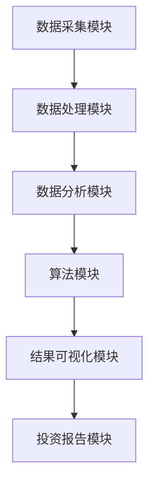
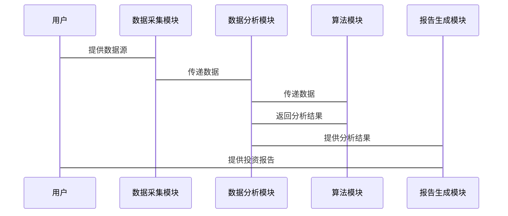

                 


# 格雷厄姆特价股票策略在清洁能源行业的应用挑战

## 关键词：格雷厄姆投资理论，清洁能源行业，股票估值，价值投资，投资策略

## 摘要：本文深入探讨了格雷厄姆特价股票策略在清洁能源行业的应用挑战，分析了该行业的特殊性、核心指标以及投资策略的适用性。文章从理论基础、行业特点、策略调整、系统架构、实战案例等多个维度展开，结合具体算法和系统设计，详细阐述了如何将格雷厄姆策略应用于清洁能源行业，并通过实际案例分析和代码实现，为投资者提供了可行的解决方案和实践指导。

---

## 第一部分: 格雷厄姆特价股票策略与清洁能源行业的背景介绍

### 第1章: 格雷厄姆投资理论的核心概念

#### 1.1 格雷厄姆投资理论的核心概念
- **价值投资的基本原理**: 格雷厄姆强调以低于内在价值的价格买入股票，注重安全边际和长期投资。
- **格雷厄姆的选股标准**: 重点关注低市盈率、低市净率、高股息率等指标，寻找被市场低估的企业。
- **特价股票的定义与特征**: 特价股票是指市场价格低于内在价值的股票，通常具有较高的安全边际。

#### 1.2 清洁能源行业的特点与挑战
- **行业现状分析**: 清洁能源行业处于快速发展阶段，但受政策和技术的双重影响，市场波动较大。
- **企业特征**: 清洁能源企业通常具有较高的技术壁垒，但财务风险和政策风险较高。
- **行业风险与机遇**: 行业具有较高的成长性，但也面临技术更新快、政策变化频繁等挑战。

#### 1.3 格雷厄姆策略在清洁能源行业的结合
- **契合点**: 清洁能源行业的技术优势和长期增长潜力与格雷厄姆的长期投资理念相符。
- **估值方法**: 结合清洁能源行业的特点，调整传统估值方法，引入动态市盈率和市净率等指标。
- **投资逻辑**: 通过分析企业的财务健康状况、技术优势和市场地位，寻找具有长期竞争优势的低估股票。

---

### 第2章: 清洁能源行业的核心指标分析

#### 2.1 清洁能源企业的财务指标
- **收益能力分析**: 重点关注净利润率、ROE（净资产收益率）等指标，评估企业的盈利能力。
- **资产负债结构**: 通过分析资产负债率和负债结构，评估企业的财务健康状况。
- **现金流与盈利能力**: 重点分析经营活动现金流，确保企业具备稳定的现金流来源。

#### 2.2 清洁能源行业的市场指标
- **市场规模与增长**: 通过分析行业市场规模和增长率，评估行业的成长潜力。
- **市场竞争格局**: 通过分析市场份额和竞争格局，评估企业的市场地位和竞争优势。
- **行业周期性分析**: 清洁能源行业受政策和技术驱动，具有较强的周期性，需关注行业周期变化。

#### 2.3 清洁能源行业的技术指标
- **技术创新与专利分析**: 通过分析企业的专利数量和技术创新能力，评估企业的技术优势。
- **技术路线与成本控制**: 重点关注企业的技术路线和成本控制能力，评估企业的竞争优势。
- **技术壁垒与竞争优势**: 通过分析技术壁垒，评估企业在行业中的竞争优势和市场地位。

---

### 第3章: 格雷厄姆策略在清洁能源行业的核心理论

#### 3.1 格雷厄姆策略的核心理论
- **买入低于内在价值的股票**: 通过分析企业的内在价值，寻找市场价格低于内在价值的股票。
- **安全边际的概念**: 通过计算安全边际（市场价格与内在价值的差额），评估投资的风险和收益。
- **长期投资与价值回归**: 通过长期持有股票，等待价值回归，实现投资收益。

#### 3.2 清洁能源行业的内在价值评估
- **内在价值的定义与计算**: 内在价值是指企业未来现金流的现值，通过DCF模型计算。
- **清洁能源企业的估值模型**: 结合清洁能源行业的特点，调整DCF模型，引入行业特定的假设和参数。
- **行业风险与折现率的影响**: 通过分析行业风险，调整折现率，确保估值模型的准确性。

#### 3.3 格雷厄姆策略在清洁能源行业的适用性
- **清洁能源行业的特殊性**: 清洁能源行业的技术驱动和政策依赖性较强，需调整格雷厄姆策略的应用。
- **策略的调整与优化**: 通过引入动态估值模型和行业特定指标，优化格雷厄姆策略的适用性。
- **长期投资价值**: 通过分析清洁能源行业的长期增长潜力，评估其长期投资价值。

---

### 第4章: 清洁能源行业的投资策略与挑战

#### 4.1 清洁能源行业的投资策略
- **价值发现策略**: 通过分析企业的财务指标、技术优势和市场地位，发现具有长期竞争优势的低估股票。
- **风险控制策略**: 通过分散投资、设置止损点等方法，控制投资风险。
- **长期持有策略**: 通过长期持有股票，等待价值回归，实现投资收益。

#### 4.2 清洁能源行业的投资挑战
- **政策风险**: 清洁能源行业受政策影响较大，需关注政策变化对企业的影响。
- **技术风险**: 行业技术更新快，需关注企业的技术创新能力和技术壁垒。
- **市场波动性**: 清洁能源行业的市场波动较大，需关注市场周期变化和企业应对能力。

---

## 第二部分: 清洁能源行业的系统架构与算法设计

### 第5章: 系统架构与算法设计

#### 5.1 系统功能设计
- **数据采集与处理**: 从多个数据源获取清洁能源企业的财务数据、市场数据和行业数据，进行清洗和预处理。
- **数据分析与建模**: 使用格雷厄姆策略的核心算法，结合清洁能源行业的特定指标，构建估值模型。
- **结果可视化与报告生成**: 通过数据可视化工具，生成投资报告和估值报告，指导投资决策。

#### 5.2 系统架构设计


#### 5.3 系统接口设计
- **数据接口**: 与多个数据源对接，获取企业财务数据、市场数据和行业数据。
- **用户接口**: 提供用户友好的界面，支持用户输入参数和查看分析结果。
- **报告接口**: 生成投资报告和估值报告，支持导出和分享。

#### 5.4 系统交互设计


---

## 第三部分: 项目实战与案例分析

### 第6章: 项目实战

#### 6.1 环境安装与数据准备
- **环境安装**: 安装Python、Pandas、NumPy、Matplotlib等工具。
- **数据准备**: 下载清洁能源企业的财务数据和市场数据，进行清洗和预处理。

#### 6.2 核心算法实现
```python
import pandas as pd
import numpy as np
import matplotlib.pyplot as plt

def graham_valuation(df):
    # 计算内在价值
    df['内在价值'] = df['净利润'] * (1 + df['ROE'].mean())
    # 计算安全边际
    df['安全边际'] = df['股价'] - df['内在价值']
    return df

# 示例数据
data = {
    '股价': [10, 15, 20, 25, 30],
    '净利润': [5, 7, 9, 11, 13],
    'ROE': [0.1, 0.12, 0.15, 0.18, 0.2]
}
df = pd.DataFrame(data)
result = graham_valuation(df)
print(result)
```

#### 6.3 实战案例分析
- **案例分析**: 以某家清洁能源企业为例，分析其财务指标、市场地位和技术优势，应用格雷厄姆策略进行估值。
- **代码实现**: 使用Python代码实现数据收集、分析和可视化，展示如何识别被低估的股票。
- **结果解读**: 通过分析结果，指导投资者进行投资决策。

---

## 第四部分: 总结与展望

### 第7章: 总结与展望

#### 7.1 总结
- 本文深入分析了格雷厄姆策略在清洁能源行业的应用，探讨了其在行业特殊性、核心指标和投资策略等方面的挑战。
- 通过系统架构和算法设计，提出了一个完整的解决方案，为投资者提供了可行的实践指导。

#### 7.2 展望
- 未来的研究可以进一步优化格雷厄姆策略，结合行业动态和政策变化，提高投资策略的适应性。
- 可以开发更多的工具和平台，帮助投资者更好地应用格雷厄姆策略，实现长期投资收益。

---

## 作者：AI天才研究院/AI Genius Institute & 禅与计算机程序设计艺术 /Zen And The Art of Computer Programming

---

感谢您的阅读！如需进一步了解或合作，请联系作者。

