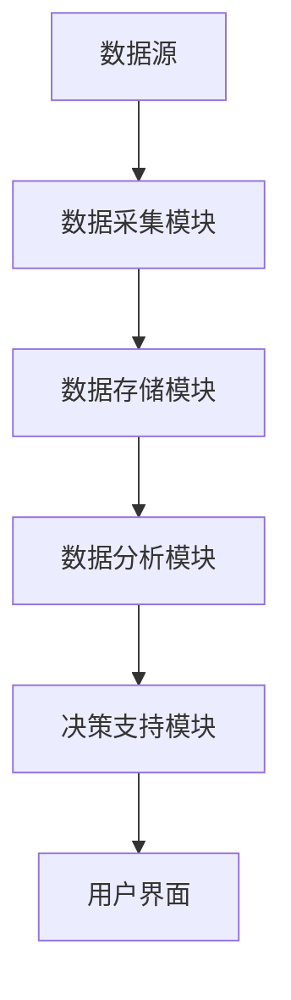

                 


# 《格雷厄姆特价股票策略在生物科技行业的应用挑战》

## 关键词：格雷厄姆特价股票策略、生物科技行业、股票投资、风险管理、技术分析、算法优化

## 摘要：本文探讨了格雷厄姆特价股票策略在生物科技行业的应用，分析了其独特性和挑战。通过系统化的方法和技术手段，结合数学模型和算法优化，提出应对策略。本文还提供了实际案例和系统架构设计，以期为投资者提供参考。

---

## 第1章：格雷厄姆特价股票策略概述

### 1.1 格雷厄姆投资理论的核心概念

#### 1.1.1 价值投资的基本原理
价值投资强调以低于公平价值的价格购买优质资产。格雷厄姆的策略关注于公司内在价值，而非市场情绪。核心在于识别被市场低估的股票。

#### 1.1.2 特价股票的定义与特征
特价股票是指市场价格低于其内在价值的股票。特征包括低市盈率（P/E）、低市净率（P/B）和高股息率等。

#### 1.1.3 格雷厄姆策略在现代投资中的应用
尽管格雷厄姆策略诞生于传统行业，但其核心思想在现代投资中依然适用，尤其是其价值发现的方法。

### 1.2 生物科技行业的特点与挑战

#### 1.2.1 生物科技行业的定义与范围
生物科技行业涉及医药、基因技术、医疗设备等领域，具有高技术门槛和高研发投入的特点。

#### 1.2.2 生物科技行业的市场波动性
生物科技行业受政策、研发进展和市场情绪影响，股价波动剧烈。

#### 1.2.3 生物科技行业的投资风险与机遇
高风险源于研发失败和政策变化，但成功研发带来的高回报也为投资者提供了机遇。

---

## 第2章：格雷厄姆策略在生物科技行业的应用背景

### 2.1 特价股票策略在生物科技行业的可行性

#### 2.1.1 生物科技行业与传统行业的比较
生物科技行业具有高增长潜力，但传统价值指标可能不完全适用。

#### 2.1.2 特价股票策略在生物科技行业的独特性
需调整传统指标，引入适合生物科技行业的评估方法。

#### 2.1.3 生物科技行业中的价值发现机会
通过识别低估的生物科技公司，投资者可获得超额收益。

### 2.2 生物科技行业的财务指标分析

#### 2.2.1 常见财务指标的定义与计算
- 市盈率（P/E）= 市价 / 每股收益
- 市净率（P/B）= 市价 / 每股净资产
- 股息率 = 每股股息 / 市价

#### 2.2.2 生物科技行业特有的财务指标
- 研发投入占总收入比例
- 产品管线价值

#### 2.2.3 格雷厄姆策略中的关键指标筛选
重点考虑低市盈率、低市净率和高股息率，同时结合行业特性调整权重。

---

## 第3章：格雷厄姆策略的核心算法与模型

### 3.1 格雷厄姆策略的数学模型

#### 3.1.1 市盈率计算公式
$$ P/E = \frac{\text{市价}}{\text{每股收益}} $$

#### 3.1.2 市净率计算公式
$$ P/B = \frac{\text{市价}}{\text{每股净资产}} $$

#### 3.1.3 其他相关指标
- 股息率：$ \text{股息率} = \frac{\text{每股股息}}{\text{市价}} $
- 净利润增长率：$ \text{净利润增长率} = \frac{\text{本年净利润} - \text{上年净利润}}{\text{上年净利润}} $

### 3.2 生物科技行业中的算法优化

#### 3.2.1 行业特定的权重调整
调整市盈率和市净率的权重，以反映生物科技行业的特点。

#### 3.2.2 数据预处理与特征选择
- 数据清洗：处理缺失值和异常值。
- 特征选择：选取对生物科技行业影响较大的指标，如研发投入和产品管线价值。

#### 3.2.3 多因素回归模型的应用
通过回归分析，评估各因素对股价的影响，优化筛选指标。

---

## 第4章：系统架构与数据流设计

### 4.1 系统功能模块设计

#### 4.1.1 数据采集模块
从金融数据库获取生物科技公司数据，包括股价、财务指标和新闻摘要。

#### 4.1.2 数据分析模块
计算各项指标，评估是否符合格雷厄姆策略。

#### 4.1.3 决策支持模块
提供可视化报告和投资建议。

### 4.2 系统架构设计



### 4.3 系统接口与交互设计

```mermaid
sequenceDi
    用户 --> 数据采集模块: 请求数据
    数据采集模块 --> 数据分析模块: 传输数据
    数据分析模块 --> 决策支持模块: 提供分析结果
    决策支持模块 --> 用户界面: 显示建议
    用户 --> 用户界面: 选择投资组合
```

---

## 第5章：项目实战

### 5.1 案例分析

#### 5.1.1 背景介绍
某生物科技公司，市盈率低于行业平均水平，但研发投入高。

#### 5.1.2 数据分析
计算市盈率、市净率等指标，评估是否低估。

#### 5.1.3 投资建议
建议买入，预期未来增长。

### 5.2 系统实现

#### 5.2.1 数据采集与处理
使用Python爬取数据，清洗处理。

#### 5.2.2 特征工程
选择关键指标，构建模型。

#### 5.2.3 模型实现
应用回归分析，优化筛选指标。

#### 5.2.4 结果分析
通过回测验证策略的有效性。

---

## 第6章：最佳实践与总结

### 6.1 总结经验

#### 6.1.1 核心经验总结
- 价值发现是关键。
- 生物科技行业需特殊处理。

#### 6.1.2 优势与劣势分析
优势：识别低估公司；劣势：高波动性和高风险。

### 6.2 投资建议

#### 6.2.1 组合投资
分散投资，降低风险。

#### 6.2.2 长期持有
耐心等待价值回归。

### 6.3 拓展与展望

#### 6.3.1 算法优化
引入机器学习，提升预测准确性。

#### 6.3.2 未来研究方向
研究生物科技行业的动态变化，优化策略模型。

---

## 结论与展望

格雷厄姆特价股票策略在生物科技行业面临挑战，但通过系统化方法和技术手段，投资者仍能发现价值。未来，结合新技术，策略将进一步优化。

---

## 作者：AI天才研究院 & 禅与计算机程序设计艺术

---

这篇文章通过详细分析格雷厄姆策略在生物科技行业的应用，结合数学模型和系统设计，为投资者提供了有价值的参考。希望本文能帮助读者更好地理解策略，并在实际投资中应用。

