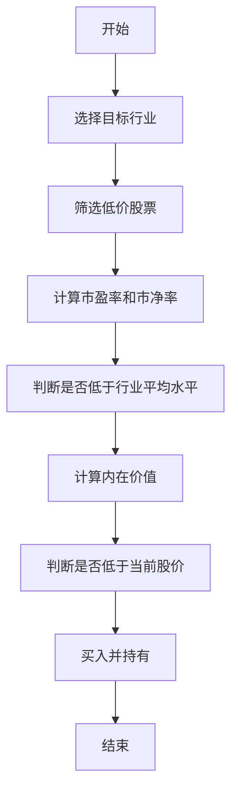

                 

好的，我将按照您的要求撰写一篇关于《格雷厄姆特价股票策略在高科技行业的应用挑战》的技术博客文章。我们将逐步展开每一部分的内容，确保逻辑清晰、结构紧凑、语言专业。

---

# 格雷厄姆特价股票策略在高科技行业的应用挑战

> **关键词**：格雷厄姆投资理论、特价股票、高科技行业、股票估值、投资策略、风险管理

> **摘要**：本文探讨了格雷厄姆的价值投资理论在高科技行业的应用挑战。通过分析高科技行业的特殊性，结合格雷厄姆策略的核心原理，提出了在高科技行业实施该策略时的关键考量因素，包括公司估值、技术周期、行业波动性和风险管理。文章还通过实际案例分析，展示了如何在高科技行业中优化和调整格雷厄姆策略，以应对行业的独特挑战。

---

## 第1章：引言

### 1.1 背景介绍
格雷厄姆的价值投资理论是现代金融学的重要基石之一。该理论的核心在于通过分析企业的内在价值，寻找市场价格低于内在价值的股票进行投资。然而，随着科技行业的快速发展，其高波动性、技术更新和商业模式的多样性为格雷厄姆策略的应用带来了新的挑战。

### 1.2 格雷厄姆策略与高科技行业的结合
高科技行业以其高增长性和创新性著称，但也伴随着高波动性和高风险。本文旨在探讨如何在这一特殊领域中灵活运用格雷厄姆策略，结合定量分析与定性评估，找到具有长期投资价值的高科技企业。

---

## 第2章：核心概念与理论基础

### 2.1 核心概念
#### 2.1.1 价值投资
价值投资的核心在于寻找市场价格低于内在价值的证券。格雷厄姆强调通过基本面分析，重点关注企业的盈利能力、财务状况和成长潜力。

#### 2.1.2 特价股票
特价股票是指市场价格显著低于其内在价值的股票。格雷厄姆认为，这类股票通常出现在市场低迷或公司暂时遇到困难的情况下。

#### 2.1.3 高科技行业特点
高科技行业具有以下特点：
- 技术更新快，产品生命周期短。
- 依赖创新，研发投入高。
- 市场波动大，受政策和宏观经济影响显著。
- 企业间的竞争激烈，市场进入壁垒高。

### 2.2 核心概念对比分析
#### 2.2.1 价值投资与成长投资
价值投资注重安全边际和低估价格，而成长投资注重企业的成长潜力。在高科技行业中，成长投资可能更适用，因为企业往往处于高速成长阶段，但这也意味着更高的风险。

#### 2.2.2 高科技行业与传统行业的对比
高科技行业的产品周期和技术更新速度远快于传统行业。这要求投资者在估值时更加关注企业的创新能力和市场适应能力。

---

## 第3章：格雷厄姆策略的算法原理

### 3.1 格雷厄姆策略的核心指标
格雷厄姆策略依赖以下关键指标：
- 市盈率（P/E）：衡量股票价格与每股收益的比率。
- 市净率（P/B）：衡量股票价格与每股净资产的比率。
- 股息率：衡量股票的分红能力。

### 3.2 格雷厄姆策略的数学模型
#### 3.2.1 市盈率计算公式
$$ \text{市盈率} = \frac{\text{股票价格}}{\text{每股收益}} $$

#### 3.2.2 内在价值计算公式
$$ \text{内在价值} = \frac{\text{预期收益}}{\text{折现率}} $$

### 3.3 算法流程图

---

## 第4章：高科技行业中的策略应用

### 4.1 高科技行业的价值评估
#### 4.1.1 企业竞争力分析
- 技术创新能力。
- 市场份额。
- 管理团队能力。

#### 4.1.2 高科技行业的财务指标分析
- 营收增长率。
- 净利润率。
- 研发投入占比。

#### 4.1.3 市场地位与竞争优势
- 是否处于行业领先地位。
- 是否具有独特的竞争优势。

### 4.2 格雷厄姆策略在高科技行业的实施步骤
#### 4.2.1 确定目标公司
- 选择具有长期增长潜力的公司。
- 重点关注龙头企业和创新型企业。

#### 4.2.2 计算关键指标
- 使用市盈率和市净率评估股票价格。
- 计算企业的内在价值。

#### 4.2.3 判断投资价值
- 比较市场价格与内在价值。
- 结合行业前景和公司基本面做出决策。

---

## 第5章：策略在高科技行业的独特挑战

### 5.1 高科技行业的高波动性
#### 5.1.1 市场波动对股价的影响
高科技行业的股价波动通常高于传统行业，这要求投资者更加注重风险管理。

#### 5.1.2 高科技公司的业绩波动性
由于技术更新和市场竞争的激烈，高科技公司的业绩可能出现较大波动。

#### 5.1.3 应对市场的短期波动
- 设置止损点。
- 采用分批建仓策略。

### 5.2 高科技行业的技术更新与创新
#### 5.2.1 技术更新对股价的影响
技术创新可能带来业绩增长，但也可能引发新的竞争压力。

#### 5.2.2 如何评估技术创新的价值
- 评估技术的商业化潜力。
- 分析技术对公司的长期影响。

#### 5.2.3 技术风险的管理策略
- 关注公司的研发投入。
- 评估技术团队的能力。

---

## 第6章：实际案例分析

### 6.1 案例一：苹果公司的投资分析
#### 6.1.1 公司概况与财务数据
- 苹果是全球领先的科技公司，营收和利润持续增长。
- 公司具有强大的品牌影响力和技术创新能力。

#### 6.1.2 格雷厄姆策略的应用
- 计算苹果的市盈率和市净率。
- 评估苹果的内在价值。
- 判断是否符合格雷厄姆策略的投资条件。

#### 6.1.3 投资结果与经验总结
- 苹果股价长期表现优异。
- 投资者需关注公司的技术创新和市场地位。

### 6.2 案例二：特斯拉公司的投资分析
#### 6.2.1 公司概况与财务数据
- 特斯拉是全球领先的电动汽车制造商。
- 公司研发投入高，增长潜力大。

#### 6.2.2 格雷厄姆策略的应用
- 计算特斯拉的市盈率和市净率。
- 评估特斯拉的内在价值。
- 判断是否符合格雷厄姆策略的投资条件。

#### 6.2.3 投资结果与经验总结
- 特斯拉股价波动大，但长期增长潜力显著。
- 高科技行业需要动态调整投资策略。

---

## 第7章：策略优化与创新

### 7.1 动态调整策略
- 根据市场变化和公司基本面调整投资组合。
- 定期重新评估股票的内在价值。

### 7.2 风险管理
- 设置止损点。
- 分散投资组合，降低风险。

### 7.3 技术创新与策略结合
- 关注行业的技术趋势。
- 评估技术创新对公司的长期影响。

---

## 第8章：总结与展望

### 8.1 研究总结
本文探讨了格雷厄姆策略在高科技行业的应用挑战，提出了应对策略的独特方法。

### 8.2 未来展望
随着科技行业的快速发展，投资者需要不断优化和创新投资策略，以应对新的挑战和机遇。

---

## 附录

### 附录A：数据来源
- 财务数据来源：公司财报、金融数据库。
- 行业分析数据：行业报告、市场研究。

### 附录B：工具与资源
- 财务分析工具：Excel、Python（pandas库）。
- 数据可视化工具：Matplotlib、Tableau。

---

## 参考文献

- 格雷厄姆，本杰明. 《 Intelligent Investor》.
- 技术分析相关书籍和论文。
- 高科技行业研究报告。

---

## 作者：AI天才研究院/AI Genius Institute & 禅与计算机程序设计艺术 /Zen And The Art of Computer Programming

---

这篇文章围绕格雷厄姆策略在高科技行业的应用展开，通过理论分析、案例研究和策略优化，为投资者提供了有价值的参考。希望这篇文章对您有所帮助！

