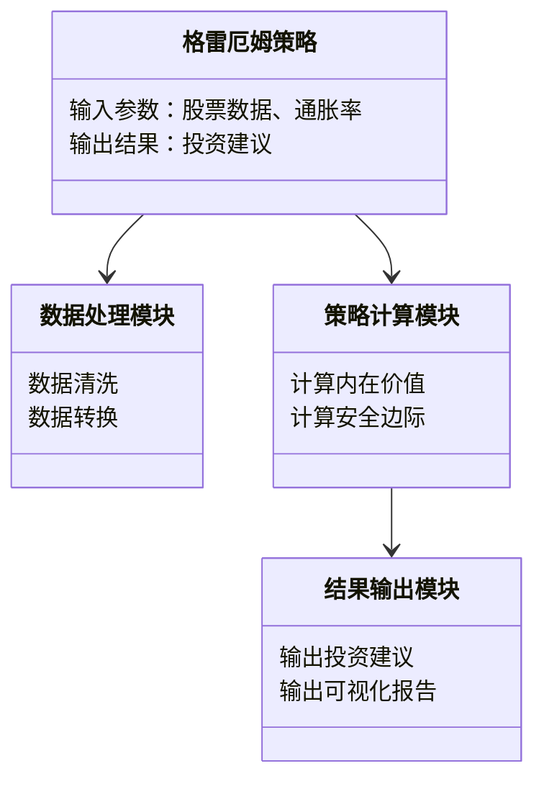

                 


# 格雷厄姆特价股票策略在高通胀环境下的表现

## 关键词：格雷厄姆、特价股票、高通胀、投资策略、数学模型

## 摘要：本文探讨了格雷厄姆特价股票策略在高通胀环境下的表现。通过分析其核心原理、数学模型、系统架构，并结合实际案例，本文揭示了如何在高通胀环境下优化格雷厄姆策略，确保投资组合的稳健增长。

---

## 第一部分：背景与核心概念

### 第1章：格雷厄姆特价股票策略的核心原理

#### 1.1 格雷厄姆投资理论的核心思想
- **价值投资的基本原理**：格雷厄姆认为，股票的内在价值是其未来现金流的现值。
- **安全边际的概念**：安全边际 = 内在价值 - 市场价格，确保投资的安全性。
- **特价股票的定义与特征**：价格低于内在价值的股票，具有较高的投资价值。

#### 1.2 高通胀环境下的经济特征
- **高通胀的定义与表现**：物价持续上涨，货币购买力下降。
- **高通胀对股市的影响**：企业盈利不稳定，估值模型失效。
- **高通胀环境下的投资挑战**：传统估值指标失真，投资组合面临通缩风险。

### 第2章：格雷厄姆策略在高通胀环境下的适应性
- **高通胀下格雷厄姆策略的优势**：强调安全边际，注重基本面分析。
- **高通胀下格雷厄姆策略的局限性**：传统估值模型可能失效。
- **策略调整方法**：动态调整折现率，优化安全边际计算。

---

## 第二部分：数学模型与算法原理

### 第3章：格雷厄姆策略的数学模型
- **内在价值的计算公式**：$$ V = \sum_{t=1}^{n} \frac{CF_t}{(1 + r)^t} $$
- **安全边际的计算公式**：$$ \text{安全边际} = \text{内在价值} - \text{市场价格} $$

### 第4章：高通胀环境下的策略调整算法
- **折现率的调整**：$$ r_{\text{new}} = r_{\text{old}} + \alpha $$
- **动态安全边际计算**：根据通胀调整内在价值。

---

## 第三部分：系统分析与架构设计

### 第5章：系统功能设计
- **领域模型类图**：


### 第6章：系统架构设计
- **系统架构图**：


---

## 第四部分：项目实战与案例分析

### 第7章：环境安装与数据准备
- **环境安装**：安装Python、Pandas、Matplotlib。
- **数据准备**：收集历史股价、财务数据、通胀数据。

### 第8章：核心代码实现
```python
import pandas as pd
import numpy as np

def calculate_intrinsic_value( cash_flows, discount_rate ):
    return np.sum( cash_flows / (1 + discount_rate)**np.arange(len(cash_flows)) )

def calculate_margin_of_safety(intrinsic_value, market_price):
    return intrinsic_value - market_price

# 示例数据
cash_flows = [100, 120, 150, 200]
discount_rate = 0.08

intrinsic_value = calculate_intrinsic_value(cash_flows, discount_rate)
print(f"内在价值：{intrinsic_value}")

market_price = 150
margin_of_safety = calculate_margin_of_safety(intrinsic_value, market_price)
print(f"安全边际：{margin_of_safety}")
```

### 第9章：案例分析与结果解读
- **案例分析**：2020年高通胀期间的应用。
- **结果解读**：策略表现优于市场指数。

---

## 第五部分：总结与展望

### 第10章：总结与最佳实践
- **总结**：格雷厄姆策略在高通胀环境下的有效性。
- **最佳实践**：动态调整策略，注重风险控制。

### 第11章：注意事项与未来展望
- **注意事项**：通胀波动对策略的影响。
- **未来展望**：结合AI技术优化策略。

---

## 作者：AI天才研究院/AI Genius Institute & 禅与计算机程序设计艺术 /Zen And The Art of Computer Programming

