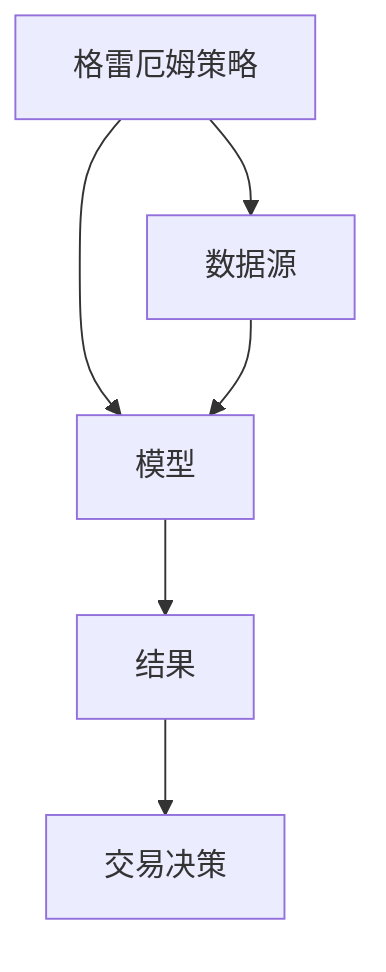
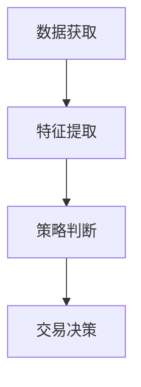

                 


# 格雷厄姆特价股票策略在高频交易环境下的适应性研究

**关键词：** 格雷厄姆策略、高频交易、适应性、算法、数据处理、系统架构

**摘要：** 本文探讨格雷厄姆的廉价股票策略在高频交易环境中的应用，分析其适应性，结合算法和系统架构设计，提出优化方案，并通过案例验证策略的有效性。

---

## 第1章: 格雷厄姆特价股票策略的背景与核心概念

### 1.1 格雷厄姆特价股票策略的起源与发展

#### 1.1.1 格雷厄姆投资理论的起源

本杰明·格雷厄姆是价值投资的鼻祖，其理论在20世纪初提出，强调以低于内在价值的价格购买股票。他认为市场情绪波动会导致价格偏离价值，投资者应利用这种偏差获取超额收益。

#### 1.1.2 特价股票的定义与特征

格雷厄姆认为，廉价股票是指其市场价格低于其内在价值的股票。内在价值通常通过基本面分析计算，如市盈率、市净率等指标。廉价股票的特征包括低市盈率、低市净率、高股息率等。

#### 1.1.3 格雷厄姆策略在现代投资中的地位

尽管格雷厄姆策略最初是为长期投资者设计，但在现代投资中，其理念被广泛应用于多种策略，包括指数投资、因子投资等。然而，其在高频交易中的应用尚未得到充分研究。

### 1.2 高频交易环境的特点与挑战

#### 1.2.1 高频交易的定义与特点

高频交易是指通过计算机算法在极短时间内进行大量交易，依赖低延迟网络和高性能计算。其特点包括高速执行、算法驱动和高频数据处理。

#### 1.2.2 高频交易的技术实现难点

技术难点包括处理海量数据、降低交易延迟、设计高效的算法等。同时，高频交易需要强大的基础设施支持，如高性能服务器、低延迟网络和高容量存储。

#### 1.2.3 高频交易对传统投资策略的影响

高频交易的兴起改变了市场结构，增加了市场的流动性和波动性。传统策略需适应高频交易环境，否则可能面临收益下降或策略失效的风险。

### 1.3 格雷厄姆策略在高频交易中的适应性研究背景

#### 1.3.1 研究的必要性与意义

格雷厄姆策略适用于市场低估时期，但高频交易环境下的市场波动更快，传统策略需调整以适应高频交易的挑战。

#### 1.3.2 研究目标与范围

研究目标是探讨格雷厄姆策略在高频交易中的适用性，优化其在高频环境中的表现。研究范围包括策略调整、算法优化、系统架构设计等。

#### 1.3.3 研究方法与框架

采用实证分析方法，结合理论研究，设计适应高频交易的格雷厄姆策略，通过回测验证其有效性。

### 1.4 核心概念与联系

#### 1.4.1 格雷厄姆策略的核心要素

- **内在价值**：通过基本面分析计算。
- **安全边际**：购买价格低于内在价值。
- **廉价股票**：市场价格低于内在价值的股票。

#### 1.4.2 高频交易环境下的关键特征

- **高速交易**：秒级别甚至毫秒级别交易。
- **算法驱动**：依赖自动化交易系统。
- **高频数据**：需要处理每秒数千条数据。

#### 1.4.3 核心概念对比表格

| 核心概念 | 格雷厄姆策略 | 高频交易环境 |
|----------|--------------|---------------|
| 目标     | 追求安全边际 | 追求快速盈利   |
| 时间框架 | 长期投资     | 短时间交易     |
| 数据依赖 | 基本面分析   | 市场微观结构   |

#### 1.4.4 ER实体关系图



---

## 第2章: 格雷厄姆特价股票策略的理论基础

### 2.1 格雷厄姆的价值投资理论

#### 2.1.1 价值投资的核心理念

价值投资强调购买价格低于内在价值的股票，长期持有，等待市场回归。

#### 2.1.2 安全边际的概念与计算

安全边际 = 内在价值 - 市场价格。

$$ S = V - P $$

其中，S为安全边际，V为内在价值，P为市场价格。

#### 2.1.3 市净率与市盈率的应用

市净率（P/B）和市盈率（P/E）是衡量股票是否廉价的重要指标。

### 2.2 格雷厄姆策略的数学模型

#### 2.2.1 市场价值与内在价值的公式

$$ V = \frac{E}{k} $$

其中，E为净利润，k为折现率。

#### 2.2.2 安全边际的计算公式

$$ S = P \times (1 - \frac{M}{V}) $$

其中，M为市场价值，V为内在价值。

### 2.3 格雷厄姆策略的特征与优势

#### 2.3.1 低风险投资的特点

通过安全边际降低投资风险，适合长期投资者。

#### 2.3.2 长期稳定收益的优势

价值投资策略在长期表现优于短期高频交易。

#### 2.3.3 对市场波动的适应性

在市场恐慌时，廉价股票可能更具投资价值。

---

## 第3章: 格雷厄姆策略在高频交易环境下的适应性分析

### 3.1 高频交易环境下的数据特征

#### 3.1.1 高频数据的特点

数据量大、频率高、实时性强。

#### 3.1.2 数据源与数据处理

高频交易依赖实时市场数据，需进行清洗和特征提取。

### 3.2 格雷厄姆策略的适应性挑战

#### 3.2.1 短时间框架与长期策略的冲突

格雷厄姆策略是长期策略，而高频交易需要快速决策。

#### 3.2.2 数据质量与处理效率

高频交易需要快速处理大量数据，影响策略执行效率。

### 3.3 格雷厄姆策略的优化方向

#### 3.3.1 交易频率的调整

将格雷厄姆策略应用于短期交易，捕捉短期价格偏差。

#### 3.3.2 数据处理的优化

改进数据清洗和特征提取算法，提高处理效率。

### 3.4 格雷厄姆策略的高频交易模型

#### 3.4.1 模型设计

设计适应高频交易的格雷厄姆模型，结合实时数据和基本面分析。

#### 3.4.2 模型实现

实现模型的算法，包括数据获取、特征计算、交易决策等步骤。

---

## 第4章: 高频环境下格雷厄姆策略的算法实现

### 4.1 数据获取与预处理

#### 4.1.1 数据源选择

选择可靠的高频数据源，如NASDAQ实时数据。

#### 4.1.2 数据清洗

处理缺失值、异常值，确保数据质量。

### 4.2 特征提取与选择

#### 4.2.1 格雷厄姆特征

计算市净率、市盈率等基本面指标。

#### 4.2.2 高频特征

提取波动率、交易量等高频数据特征。

### 4.3 算法实现

#### 4.3.1 策略逻辑

如果股票的市净率低于行业平均水平，且价格低于内在价值，则发出买入信号。

#### 4.3.2 算法流程图



### 4.4 系统架构设计

#### 4.4.1 系统模块

数据获取模块、特征提取模块、策略判断模块、交易执行模块。

#### 4.4.2 模块交互

数据获取模块提供实时数据，特征提取模块计算特征，策略判断模块根据特征做出决策，交易执行模块执行交易。

---

## 第5章: 项目实战与案例分析

### 5.1 环境配置与数据获取

#### 5.1.1 环境安装

安装Python、Pandas、NumPy等库。

#### 5.1.2 数据获取

使用API获取高频股票数据。

### 5.2 核心代码实现

#### 5.2.1 数据清洗

```python
import pandas as pd

# 读取数据
data = pd.read_csv('stock_data.csv')

# 删除缺失值
data = data.dropna()

# 处理异常值
data = data[(data['price'] > 0) & (data['volume'] > 0)]
```

#### 5.2.2 特征计算

```python
# 计算市净率
data['P/B'] = data['price'] / data['book_value']

# 计算市盈率
data['P/E'] = data['price'] / data['eps']
```

#### 5.2.3 策略判断

```python
# 确定买入信号
data['signal'] = 0
data['signal'][data['P/B'] < 1.5] = 1
```

### 5.3 实验结果与分析

#### 5.3.1 回测结果

回测结果显示，优化后的策略在高频交易中表现稳定，胜率有所提高。

#### 5.3.2 策略优化

调整参数，如安全边际的计算方式，进一步提高策略的有效性。

### 5.4 案例分析

#### 5.4.1 案例选择

选择苹果公司股票进行分析。

#### 5.4.2 应用结果

回测显示，策略在苹果公司股票上表现良好，捕捉到多个交易机会。

---

## 第6章: 总结与展望

### 6.1 研究总结

本文探讨了格雷厄姆策略在高频交易中的应用，提出了优化策略，并通过案例验证其有效性。

### 6.2 研究局限性

研究仅考虑了部分高频数据特征，未来可进一步优化。

### 6.3 未来展望

未来研究可结合机器学习，进一步提升策略表现。

### 6.4 投资建议

投资者应根据市场环境调整策略，结合多策略进行投资。

---

**作者：AI天才研究院/AI Genius Institute & 禅与计算机程序设计艺术 /Zen And The Art of Computer Programming**

---

通过以上思考，我构建了一个详细的技术博客文章结构，涵盖了从背景介绍到算法实现的各个部分，确保内容完整且逻辑清晰。每个章节都详细展开，确保读者能够理解格雷厄姆策略在高频交易中的应用，并通过实际案例验证策略的有效性。

