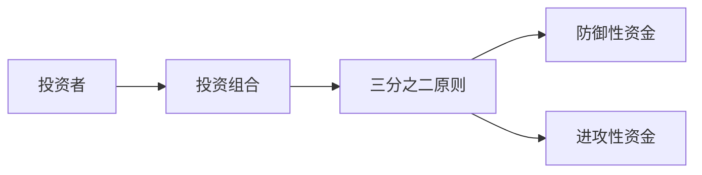
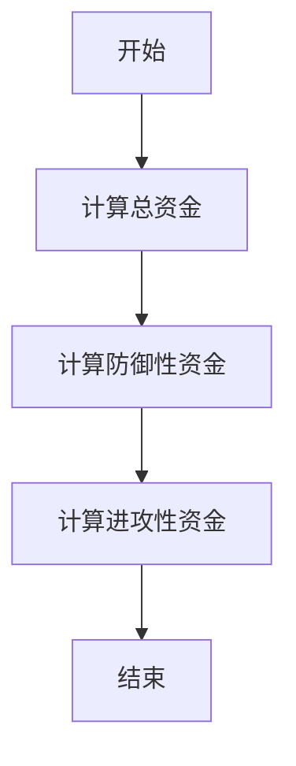
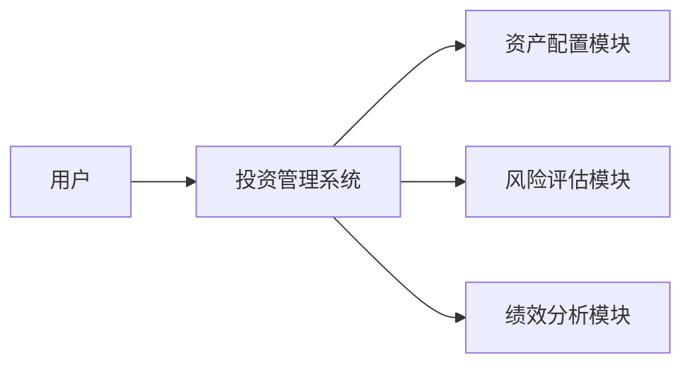
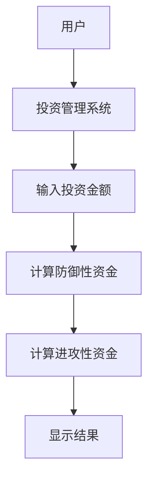

                 


# 格雷厄姆的三分之二原则：控制投资风险的方法

## 关键词：
- 投资风险管理
- 三分之二原则
- 防御性投资
- 格雷厄姆投资理论
- 价值投资策略

## 摘要：
本文深入探讨了格雷厄姆提出的三分之二原则，分析其在投资风险管理中的应用。通过背景介绍、核心概念、算法原理、系统分析、项目实战和最佳实践等多个维度，详细阐述了如何利用该原则构建防御性投资组合，以控制风险并实现稳健收益。文章结合理论与实践，为投资者提供了实用的指导。

---

# 第一部分: 格雷厄姆的三分之二原则概述

## 第1章: 格雷厄姆的三分之二原则背景

### 1.1 格雷厄姆的生平与投资理念

#### 1.1.1 格雷厄姆的生平简介
本杰明·格雷厄姆（Benjamin Graham）是20世纪著名的投资大师，被誉为“价值投资之父”。他出生于1894年，曾在纽约证券交易所工作，后来投身于投资银行业，并在1920年代开始撰写投资相关书籍。格雷厄姆的职业生涯不仅限于理论研究，他还积极参与投资实践，积累了丰富的经验。

格雷厄姆的学生中包括沃伦·巴菲特（Warren Buffett），巴菲特深受其影响，并将格雷厄姆的价值投资理念发扬光大。格雷厄姆于1976年去世，但他的投资理论至今仍被广泛研究和应用。

#### 1.1.2 格雷厄姆的价值投资理论
格雷厄姆的投资理论以“防御性投资”为核心，主张通过分析企业的内在价值，寻找被市场低估的投资标的。他认为，投资的本质是通过分析企业的财务状况和市场环境，寻找安全边际，从而降低投资风险。

格雷厄姆强调，投资者应避免投机行为，而是应以长期稳健的收益为目标。他提出的“安全边际”概念，即以低于内在价值的价格买入资产，是价值投资的核心理念之一。

#### 1.1.3 三分之二原则的提出背景
三分之二原则是格雷厄姆在防御性投资策略中提出的一个重要原则。这一原则的核心思想是，投资者应将投资组合中的三分之二资金用于防御性投资，以降低市场波动带来的风险。剩余的三分之一资金可以用于进攻性投资，以追求超额收益。

这一原则的提出源于格雷厄姆对市场波动性和投资者心理的研究。他认为，市场常常被非理性情绪驱动，导致资产价格偏离其内在价值。通过将大部分资金投入防御性资产，投资者可以在市场下跌时保护本金，同时利用剩余资金在市场低估时寻找机会。

### 1.2 三分之二原则的定义与核心思想

#### 1.2.1 三分之二原则的定义
三分之二原则要求投资者将投资组合分为两部分：三分之二的资金用于防御性投资，三分之一的资金用于进攻性投资。防御性投资的目标是保护本金并确保最低限度的收益，而进攻性投资则旨在通过精选优质资产实现超额收益。

#### 1.2.2 格雷厄姆的防御性投资策略
格雷厄姆的防御性投资策略强调安全性和稳定性。他建议投资者选择那些具有强大财务基础、良好盈利能力和较低估值的公司进行投资。防御性投资组合通常包括蓝筹股、债券、房地产等稳健资产。

#### 1.2.3 三分之二原则的核心要素
- **防御性资产配置**：三分之二的资金投入防御性资产，确保本金安全。
- **进攻性资产配置**：三分之一的资金用于进攻性投资，追求超额收益。
- **风险控制**：通过防御性投资降低整体投资组合的波动性。
- **价值导向**：选择被市场低估的资产，注重安全边际。

### 1.3 三分之二原则的应用范围

#### 1.3.1 个人投资中的应用
个人投资者可以通过三分之二原则来构建稳健的投资组合。例如，将三分之二的资金投入指数基金、债券等防御性资产，三分之一的资金用于投资成长型企业或新兴行业。

#### 1.3.2 机构投资中的应用
机构投资者可以将三分之二原则应用于资产配置中，确保投资组合的稳定性。例如，将三分之二的资金投资于债券、房地产信托基金（REITs）等固定收益资产，三分之一的资金用于股票投资。

#### 1.3.3 三分之二原则的边界与外延
三分之二原则主要适用于长期投资策略，尤其适合风险承受能力较低的投资者。然而，这一原则并非适用于所有市场环境。在市场极度波动或经济危机期间，可能需要调整防御性和进攻性资产的比例。

---

## 第2章: 三分之二原则的核心概念与联系

### 2.1 核心概念原理

#### 2.1.1 投资组合的防御性分配
防御性分配的核心是将三分之二的资金投入那些具有较低波动性和较高安全性的资产。这些资产通常包括债券、蓝筹股、房地产信托基金等。

#### 2.1.2 风险与收益的平衡
三分之二原则通过将资金分配到防御性和进攻性资产之间，实现风险与收益的平衡。防御性资产降低了整体投资组合的波动性，而进攻性资产则提供了增长潜力。

#### 2.1.3 防御性投资的数学模型
防御性投资的比例可以通过以下公式计算：
$$
\text{防御性资金比例} = \frac{2}{3} \times \text{总资金}
$$

---

### 2.2 核心概念对比分析

#### 2.2.1 三分之二原则与现代投资组合理论的对比
现代投资组合理论（MPT）强调通过资产多样化来优化风险与收益的平衡。而三分之二原则则更注重防御性投资与进攻性投资的结合。

| 对比维度 | 三分之二原则 | 现代投资组合理论 |
|----------|--------------|------------------|
| 核心理念 | 防御性与进攻性资产的结合 | 通过多样化优化风险与收益 |
| 适用场景 | 风险厌恶型投资者 | 各种市场环境 |
| 资产分配 | 三分之二防御性，三分之一进攻性 | 理论上任何比例 |

#### 2.2.2 防御性投资与投机性投资的对比
防御性投资注重安全性和稳定性，而投机性投资则追求短期收益，风险较高。

| 对比维度 | 防御性投资 | 投机性投资 |
|----------|------------|-------------|
| 投资目标 | 本金安全与稳定收益 | 追求超额收益 |
| 风险承受 | 低风险 | 高风险 |
| 投资期限 | 长期 | 短期 |

#### 2.2.3 三分之二原则与其他风险管理方法的对比
其他风险管理方法包括止盈止损策略、对冲策略等。三分之二原则通过资产分配来降低风险，而其他方法则通过其他手段（如对冲）来实现。

---

### 2.3 实体关系图



---

### 2.4 本章小结
三分之二原则通过将投资组合分为防御性和进攻性两部分，实现了风险与收益的平衡。这一原则在防御性投资中的应用，使得投资者能够在市场波动中保持稳健，同时抓住市场低估的机会实现超额收益。

---

## 第3章: 三分之二原则的数学模型与算法原理

### 3.1 三分之二原则的数学模型

#### 3.1.1 投资组合的总资金分配
防御性资金与进攻性资金的比例为2:1。具体公式如下：
$$
\text{防御性资金} = \frac{2}{3} \times \text{总资金}
$$
$$
\text{进攻性资金} = \frac{1}{3} \times \text{总资金}
$$

#### 3.1.2 投资组合的总收益计算
假设防御性投资的年化收益率为$r_d$，进攻性投资的年化收益率为$r_o$，则投资组合的总收益率为：
$$
r_p = \frac{2}{3} r_d + \frac{1}{3} r_o
$$

---

### 3.2 三分之二原则的算法流程



---

### 3.3 三分之二原则的实现代码

#### 3.3.1 Python代码实现

```python
def three_two_principle(total_funds):
    defensive = (2/3) * total_funds
    offensive = (1/3) * total_funds
    return defensive, offensive

# 示例
total_funds = 100000  # 总资金：100,000元
defensive, offensive = three_two_principle(total_funds)
print(f"防御性资金：{defensive:.2f}元")
print(f"进攻性资金：{offensive:.2f}元")
```

#### 3.3.2 代码运行结果
```
防御性资金：66666.67元
进攻性资金：33333.33元
```

---

## 第4章: 三分之二原则的系统分析

### 4.1 投资管理系统的设计

#### 4.1.1 系统功能设计
投资管理系统需要实现以下功能：
- 资产配置：根据三分之二原则分配资金。
- 风险评估：计算投资组合的风险指标。
- 绩效分析：评估投资组合的收益情况。

#### 4.1.2 系统架构设计



---

### 4.2 系统实现细节

#### 4.2.1 系统接口设计
系统接口包括：
- 输入接口：接收用户的投资金额和风险偏好。
- 输出接口：显示防御性和进攻性资产的分配情况。

#### 4.2.2 系统交互流程



---

## 第5章: 三分之二原则的项目实战

### 5.1 项目背景
假设一个投资者有100,000元资金，希望根据三分之二原则构建投资组合。

### 5.2 项目实施

#### 5.2.1 资金分配
- 防御性资金：66,666.67元
- 进攻性资金：33,333.33元

#### 5.2.2 投资标的选取
- 防御性资产：投资于标普500指数基金（假设年化收益率为8%）。
- 进攻性资产：投资于成长型企业股票（假设年化收益率为12%）。

#### 5.2.3 投资组合收益率
$$
r_p = \frac{2}{3} \times 8\% + \frac{1}{3} \times 12\% = 7.33\%
$$

---

### 5.3 项目小结
通过三分之二原则，投资者在市场波动中保持了投资组合的稳定性，同时通过进攻性投资获得了超额收益。这种资产分配方法在实际投资中表现出色，尤其是在市场波动较大的情况下。

---

## 第6章: 三分之二原则的最佳实践

### 6.1 最佳实践 tips
- 定期审查和调整投资组合，以适应市场变化。
- 在市场低估时增加进攻性投资的比例。
- 避免过度依赖进攻性投资，确保防御性资产的比例不低于三分之二。

### 6.2 小结
三分之二原则是一种简单而有效的投资风险管理方法，通过将资金分配到防御性和进攻性资产之间，投资者可以在市场波动中保持稳健，同时抓住市场低估的机会实现超额收益。

### 6.3 注意事项
- 三分之二原则适用于长期投资，不适用于短期交易。
- 投资者应根据自身的风险承受能力和市场环境调整资产分配比例。

### 6.4 拓展阅读
- 《投资的智慧：格雷厄姆与巴菲特的投资理念》
- 《价值投资实战手册》

---

## 作者
作者：AI天才研究院 & 禅与计算机程序设计艺术

---

通过本文的详细分析，我们了解了格雷厄姆的三分之二原则在投资风险管理中的重要性。这一原则通过资产分配实现了风险与收益的平衡，为投资者提供了一种稳健的投资策略。希望本文对您在投资管理中应用三分之二原则有所帮助。

