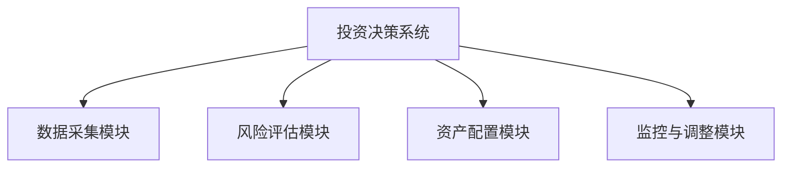

                 


# 格雷厄姆的'中庸之道'：在防御与进取之间找平衡

> 关键词：中庸之道、投资策略、风险管理、资产配置、防御性投资、进取性投资

> 摘要：本文深入探讨了格雷厄姆提出的“中庸之道”投资理念，分析了防御性投资与进取性投资的优缺点，并提出了在两者之间找到平衡点的策略。通过数学模型、系统架构设计和实战案例的详细讲解，帮助投资者在复杂多变的市场环境中实现长期稳定的收益。

---

## 第一章: 中庸之道的哲学基础

### 1.1 中庸之道的定义与核心思想

中庸之道是一种追求平衡的哲学思想，其核心在于避免极端，追求适度与和谐。在投资领域，格雷厄姆将这一理念应用于资产配置和投资策略的选择中。中庸之道并非简单的折中主义，而是通过科学的方法，在风险与收益之间找到最优平衡点。

#### 核心概念对比表

| 概念 | 特征 | 优缺点 |
|------|------|--------|
| 中庸之道 | 平衡风险与收益 | 稳定性高，风险可控，收益可持续 |
| 极端投资 | 过度集中于防御或进攻 | 风险过高或收益不足 |

### 1.2 格雷厄姆投资理念中的中庸之道

格雷厄姆在《聪明的投资者》中强调，成功的投资需要在防御与进取之间找到平衡。他提倡以价值为导向的投资，避免盲目跟风或过度保守。中庸之道的核心在于通过合理的资产配置，降低投资组合的整体风险，同时抓住市场机会。

---

## 第二章: 防御与进取的策略分析

### 2.1 防御性投资策略

防御性投资以稳健为主，注重资产的安全性和流动性。其核心理念是通过分散投资和选择低风险资产（如债券、黄金等）来规避市场波动带来的损失。

#### 防御性投资的优缺点对比

| 策略 | 优点 | 缺点 |
|------|------|------|
| 防御性 | 风险低，稳定性高 | 收益有限，难以应对通货膨胀 |
| 进取性 | 收益高，增长潜力大 | 风险高，波动性强 |

### 2.2 进取性投资策略

进取性投资以追求高收益为目标，通常投资于股票、创业公司等高风险资产。其优点是能够在市场繁荣时获得超额收益，但缺点是容易受到市场波动的影响。

#### 进取性投资的适用场景

| 场景 | 描述 | 适合策略 |
|------|------|----------|
| 市场低迷 | 投资者避险情绪浓厚 | 防御性投资 |
| 市场繁荣 | 投资者风险偏好上升 | 进取性投资 |

---

## 第三章: 防御与进取的平衡点

### 3.1 平衡点的定义与特征

平衡点是指在防御性投资和进取性投资之间找到一个最优配置比例，使得投资组合的风险和收益达到最佳匹配。这种平衡不是一成不变的，而是需要根据市场环境和个人风险偏好进行动态调整。

#### 平衡点的数学模型

$$ \text{平衡点} = \frac{\text{防御权重} + \text{进取权重}}{2} $$

### 3.2 平衡点的计算方法

#### 资产配置模型

$$ \max \sum_{i=1}^{n} w_i r_i $$
$$ \text{s.t.} \sum_{i=1}^{n} w_i = 1 $$
$$ 0 \leq w_i \leq 1 $$

其中，\( w_i \) 是第 \( i \) 种资产的配置权重，\( r_i \) 是其预期收益率。

---

## 第四章: 中庸之道的数学模型与公式

### 4.1 中庸之道的数学表达

平衡点的数学公式可以表示为：

$$ \text{收益} = \alpha \times \text{风险} + \beta $$

其中，\( \alpha \) 是风险收益系数，\( \beta \) 是截距项。

### 4.2 资产配置的优化模型

资产配置的线性规划模型如下：

$$ \max \sum_{i=1}^{n} w_i r_i $$
$$ \text{s.t.} \sum_{i=1}^{n} w_i = 1 $$
$$ 0 \leq w_i \leq 1 $$

---

## 第五章: 系统分析与架构设计方案

### 5.1 投资决策系统的总体架构

#### 系统功能模块划分

- 数据采集模块：收集市场数据和投资者偏好。
- 风险评估模块：评估各类资产的风险水平。
- 资产配置模块：根据模型计算最优配置比例。
- 监控与调整模块：实时监控市场变化并动态调整配置。

#### 系统架构的 Mermaid 图



### 5.2 投资组合的动态调整

#### 调整后的效果评估

动态调整的投资组合需要定期评估其风险和收益，确保平衡点的合理性。

---

## 第六章: 项目实战与代码实现

### 6.1 环境安装与配置

#### Python 环境的搭建

安装 Python 和必要的库（如 numpy、pandas、matplotlib）。

### 6.2 核心实现源代码

#### 计算最优投资组合的 Python 代码

```python
import numpy as np
import matplotlib.pyplot as plt

# 示例数据：资产收益率和相关系数矩阵
returns = np.array([0.05, 0.10, 0.08])
cov_matrix = np.array([[0.04, 0.02, 0.03],
                        [0.02, 0.06, 0.02],
                        [0.03, 0.02, 0.05]])

# 计算最优配置
n = len(returns)
weights = np.zeros(n)
weights[0] = 1  # 初始配置

# 迭代优化
for _ in range(100):
    # 计算投资组合的方差
    portfolio_variance = weights.dot(cov_matrix).dot(weights)
    # 计算每个资产的风险贡献
    risk_contribution = np.zeros(n)
    for i in range(n):
        risk_contribution[i] = (weights[i] * cov_matrix.dot(weights)) / portfolio_variance
    # 调整权重以平衡风险
    new_weights = np.zeros(n)
    new_weights[0] = 1 / (1 + (risk_contribution[0] / risk_contribution[1]))
    new_weights[1:] = (risk_contribution[1:] / risk_contribution[0]) / (1 + (risk_contribution[0] / risk_contribution[1]))
    weights = new_weights / sum(new_weights)

print("最优配置权重:", weights)
```

---

## 作者：AI天才研究院 & 禅与计算机程序设计艺术

通过本文的详细分析和实战案例，读者可以深入了解格雷厄姆的中庸之道，并将其应用于实际投资中。投资的真谛在于平衡，而中庸之道正是实现这一平衡的科学方法。希望本文能为投资者提供有价值的参考和启发。

---

*本文完*

