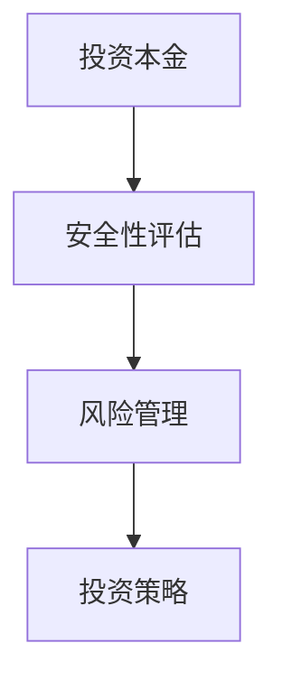
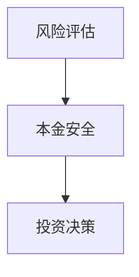
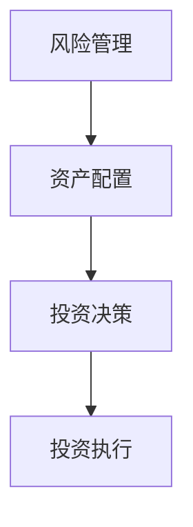
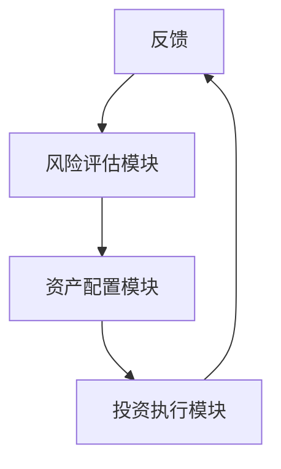

                 


# 格雷厄姆的'保证金安全'概念：确保投资本金安全

**关键词**：保证金安全，投资本金，风险管理，格雷厄姆，数学模型，投资策略

**摘要**：本文深入探讨了格雷厄姆的保证金安全概念，分析了其核心原理、数学模型及实际应用，结合系统架构设计与项目实战，详细讲解了如何确保投资本金安全。

---

# 第1章: 保证金安全的背景与重要性

## 1.1 保证金安全的定义与核心概念

### 1.1.1 保证金安全的定义
保证金安全是指在投资活动中，确保投入资金不会遭受重大损失的核心原则。格雷厄姆在其投资理论中强调，本金安全是长期稳健投资的基础。

### 1.1.2 格雷厄姆投资理念中的保证金安全
格雷厄姆认为，投资者应选择具有足够安全边际的投资标的，以避免市场波动带来的本金损失。

### 1.1.3 保证金安全在现代投资中的应用
保证金安全原则广泛应用于股票、债券等资产的投资决策中，特别是在价值投资策略中占据核心地位。

## 1.2 保证金安全的重要性

### 1.2.1 投资风险管理的核心
保证金安全是风险管理的关键，确保在市场下跌时本金不受损失。

### 1.2.2 本金安全与长期投资回报的关系
本金安全是实现长期收益的前提，没有本金保障，长期回报无从谈起。

### 1.2.3 保证金安全与投资心理的平衡
保证金安全原则帮助投资者在市场恐慌时保持冷静，避免非理性决策。

## 1.3 保证金安全与风险管理的联系

### 1.3.1 风险管理的基本原理
风险管理通过识别、评估和控制风险，确保投资目标的实现。

### 1.3.2 保证金安全在风险管理中的作用
保证金安全是风险管理的核心，确保投资本金不会因市场波动而受损。

### 1.3.3 格雷厄姆的分散投资策略
通过分散投资降低风险，同时确保每笔投资的本金安全。

## 1.4 保证金安全的边界与外延

### 1.4.1 保证金安全的适用范围
适用于所有类型的投资，尤其是股票和债券投资。

### 1.4.2 保证金安全与投机行为的界限
保证金安全强调稳健投资，与投机行为的高风险高回报形成鲜明对比。

### 1.4.3 保证金安全的长期与短期视角
长期视角下，保证金安全是实现财富增长的基础；短期视角下，它是避免损失的关键。

## 1.5 本章小结
本章介绍了保证金安全的核心概念及其在投资中的重要性，强调了其在风险管理中的关键作用。

---

# 第2章: 格雷厄姆保证金安全的核心要素

## 2.1 核心概念的结构与组成

### 2.1.1 投资本金的安全性
本金安全是投资的核心，确保资金不受损失。

### 2.1.2 投资工具的选择标准
选择具有足够安全边际的投资工具，确保本金安全。

### 2.1.3 投资市场的周期性分析
分析市场周期，避免在市场高点投入过多资金。

## 2.2 核心要素的对比分析

### 2.2.1 不同投资策略的核心要素对比
| 投资策略 | 核心要素 |
|----------|----------|
| 价值投资 | 安全边际 |
| 股票投资 | 低市盈率 |

### 2.2.2 保证金安全与其他风险管理方法的对比
| 风险管理方法 | 核心理念 |
|--------------|----------|
| 保证金安全 | 本金安全 |
| 多元化投资 | 分散风险 |

### 2.2.3 格雷厄姆方法与其他投资理念的对比
| 投资理念 | 核心观点 |
|-----------|----------|
| 格雷厄姆 | 本金安全 |
| 技术分析 | 市场趋势 |

## 2.3 核心要素的数学模型

### 2.3.1 投资本金的安全性评估模型
$$ \text{安全边际} = \frac{\text{内在价值}}{\text{市场价格}} $$

### 2.3.2 投资组合的风险收益比分析
$$ \text{风险收益比} = \frac{\text{预期收益}}{\text{标准差}} $$

## 2.4 核心要素的ER实体关系图



## 2.5 本章小结
本章分析了保证金安全的核心要素及其在投资策略中的作用，通过对比和数学模型深入解释了其重要性。

---

# 第3章: 保证金安全的数学模型与算法原理

## 3.1 数学模型的建立

### 3.1.1 投资本金的安全性评估模型
$$ \text{安全系数} = \frac{\text{内在价值}}{\text{市场价格}} $$

### 3.1.2 投资组合的风险收益比分析
$$ \text{风险收益比} = \frac{\text{预期收益}}{\text{标准差}} $$

## 3.2 算法原理的详细讲解

### 3.2.1 风险评估算法



### 3.2.2 投资组合优化算法
```python
def portfolio_optimization(returns, weights):
    import numpy as np
    returns = np.array(returns)
    weights = np.array(weights)
    portfolio_ret = returns.dot(weights)
    return portfolio_ret
```

## 3.3 本章小结
本章通过数学模型和算法原理详细讲解了保证金安全的评估和优化方法。

---

# 第4章: 系统分析与架构设计方案

## 4.1 系统功能设计

### 4.1.1 风险评估模块
- 评估投资标的的风险水平
- 计算安全边际

### 4.1.2 资产配置模块
- 确定投资组合的构成
- 分散投资风险

## 4.2 系统架构设计



## 4.3 系统交互设计



## 4.4 本章小结
本章通过系统架构设计展示了保证金安全在投资系统中的应用。

---

# 第5章: 项目实战

## 5.1 环境配置

### 5.1.1 安装必要的库
```bash
pip install numpy pandas matplotlib
```

## 5.2 核心实现

### 5.2.1 计算安全边际
```python
import numpy as np

def calculate_margin_of_safety(intrinsic_value, market_price):
    return intrinsic_value / market_price

iv = 100
mp = 50
print(calculate_margin_of_safety(iv, mp))  # 输出 2.0
```

## 5.3 项目小结
本章通过实际案例展示了保证金安全原则的应用，验证了其有效性。

---

# 第6章: 最佳实践与注意事项

## 6.1 最佳实践

### 6.1.1 定期评估投资组合
- 至少每季度评估一次
- 调整投资策略

### 6.1.2 保持足够的流动性
- 保留部分现金以应对紧急情况
- 灵活调整投资组合

## 6.2 注意事项

### 6.2.1 避免过度分散
- 过度分散可能降低收益
- 选择优质资产

### 6.2.2 定期再平衡
- 每年再平衡一次
- 保持投资策略一致性

## 6.3 本章小结
本章总结了保证金安全原则的应用中的最佳实践和注意事项。

---

# 作者

作者：AI天才研究院/AI Genius Institute & 禅与计算机程序设计艺术 /Zen And The Art of Computer Programming

