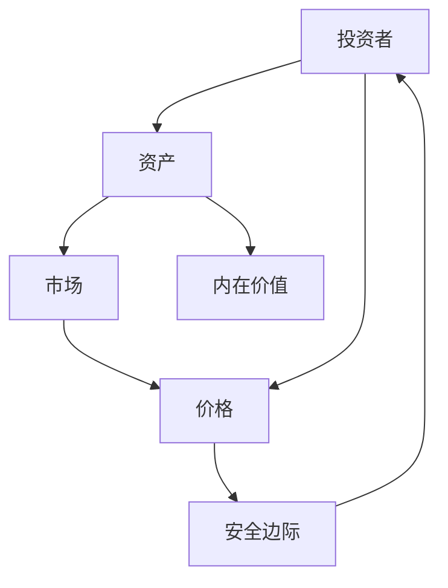
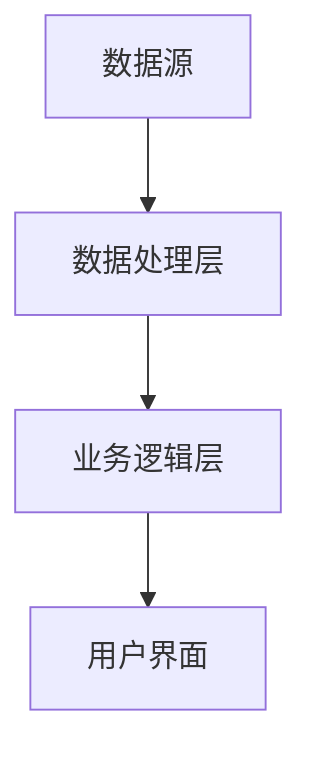

                 


# 格雷厄姆的'聪明的投资者'：价值投资圣经的现代解读

## 关键词：价值投资，格雷厄姆，安全边际，内在价值，现代解读，投资策略

## 摘要：本文深入解读了格雷厄姆的经典投资理论《聪明的投资者》，结合现代投资环境和技术手段，分析了价值投资的核心概念、算法模型和系统架构，探讨了其在当代的应用与挑战。通过结合数学模型、系统设计和实际案例，本文为现代投资者提供了新的视角和实践指导。

---

## 第1章: 价值投资的背景与起源

### 1.1 价值投资的核心概念

#### 1.1.1 价值投资的定义与核心要素

价值投资是一种以基本面分析为基础的投资策略，其核心在于识别市场中被低估的资产，并长期持有这些资产直至其价值回归。以下是价值投资的几个核心要素：

- **内在价值**：资产在合理市场条件下的公平价格，通常通过 discounted cash flow (DCF) 模型计算得出。
- **安全边际**：买入价格与内在价值之间的差异，确保投资者在市场波动中具备一定的保护空间。
- **长期视角**：价值投资强调长期持有，而非短期交易，以避免市场的短期波动干扰。

#### 1.1.2 价值投资与其它投资策略的区别

与其他投资策略（如成长投资、趋势投资）相比，价值投资有其独特性：

- **成长投资**：关注公司未来的盈利潜力，愿意为未来的增长支付更高的溢价。
- **趋势投资**：基于市场趋势和价格动能进行投资，依赖技术分析。
- **价值投资**：关注当前市场价格与内在价值的偏离，寻找被市场低估的机会。

以下是对几种投资策略的对比分析：

| 投资策略 | 核心关注点 | 风险承受能力 | 适合投资者类型 |
|----------|------------|---------------|----------------|
| 成长投资 | 未来增长潜力 | 较高           | 耐心的长期投资者 |
| 趋势投资 | 当前价格动向 | 中等           | 熟悉技术分析的投资者 |
| 价值投资 | 当前价格与价值偏离 | 较低           | 具备基本面分析能力的投资者 |

#### 1.1.3 价值投资的哲学基础

价值投资不仅仅是技术性的分析，更是一种哲学理念。它强调理性思考、独立判断和耐心持有。格雷厄姆在《聪明的投资者》中强调，投资者应避免情绪化决策，并保持对市场的独立思考。

---

### 1.2 格雷厄姆的贡献与影响

#### 1.2.1 格雷厄姆的生平简介

本杰明·格雷厄姆（Benjamin Graham）是20世纪最伟大的投资思想家之一，被誉为“价值投资之父”。他在1924年与大卫·多德（David Dodd）共同出版了《证券分析》一书，奠定了价值投资的基础。格雷厄姆的学生包括沃伦·巴菲特（Warren Buffett）等著名投资者。

#### 1.2.2 格雷厄姆的价值投资理论体系

格雷厄姆的核心理论包括以下几个方面：

1. **安全边际**：买入价格低于内在价值，确保投资者在市场波动中具备保护空间。
2. **内在价值评估**：通过基本面分析，计算公司的真实价值。
3. **市场情绪的影响**：市场先生（Mr. Market）是一个情绪化的存在，投资者应避免被其情绪左右。

以下是格雷厄姆投资理论的简要总结：

| 核心理论 | 描述 |
|----------|------|
| 安全边际 | 买入价格低于内在价值，确保投资的安全性 |
| 内在价值 | 资产在合理市场条件下的公平价格 |
| 市场情绪 | 市场波动是机会，而非威胁 |

#### 1.2.3 格雷厄姆对现代投资的影响

格雷厄姆的理论对现代投资产生了深远影响，尤其是在机构投资和个人投资领域。他的思想被广泛应用于投资组合管理、风险管理等领域。

---

### 1.3 价值投资的现代发展

#### 1.3.1 现代价值投资的演变

随着金融市场的复杂化和技术的进步，价值投资也在不断发展。现代价值投资更加注重数据驱动的分析，结合量化方法进行投资决策。

#### 1.3.2 技术进步对价值投资的影响

技术的进步为价值投资提供了新的工具和方法，例如：

- **大数据分析**：利用大数据技术进行更精准的内在价值评估。
- **算法交易**：通过算法实现快速、精准的投资决策。
- **人工智能**：利用AI技术预测市场波动，优化投资组合。

#### 1.3.3 价值投资在不同市场环境下的应用

在不同的市场环境下，价值投资需要灵活调整策略。例如，在低利率环境下，价值投资者可能更关注高股息率的股票；在高波动环境下，安全边际的计算尤为重要。

---

## 第2章: 价值投资的核心概念与联系

### 2.1 价值投资的原理

#### 2.1.1 安全边际的定义与计算

安全边际是价值投资的核心概念之一，它是指买入价格与内在价值之间的差异。计算安全边际的方法如下：

1. 计算内在价值（V_intrinsic）
2. 确定买入价格（P_buy）
3. 计算安全边际（SM）：SM = V_intrinsic - P_buy

例如，假设某股票的内在价值为50美元，买入价格为40美元，则安全边际为10美元。

#### 2.1.2 内在价值的评估方法

内在价值的评估方法主要包括：

1. **DCF模型**：通过未来现金流的现值计算内在价值。
2. **市盈率法**：通过市盈率与行业平均市盈率的比较，估算内在价值。
3. **资产重置成本法**：计算公司资产的重置成本，作为内在价值的参考。

#### 2.1.3 市场先生与投资者的关系

格雷厄姆将市场波动比作“市场先生”，投资者应避免被市场情绪左右。以下是市场先生的简要描述：

| 市场先生 | 特性 |
|----------|------|
| 情绪化 | 市场先生的情绪波动影响股价 |
| 独立性 | 投资者应独立于市场先生进行决策 |
| 机会 | 利用市场先生的情绪波动获利 |

---

### 2.2 核心概念对比与联系

#### 2.2.1 价值投资与成长投资的对比分析

| 投资策略 | 核心关注点 | 适合市场环境 |
|----------|------------|---------------|
| 价值投资 | 当前价格与价值偏离 | 熟悉基本面分析的投资者 |
| 成长投资 | 未来增长潜力 | 耐心的长期投资者 |

#### 2.2.2 价值投资与趋势投资的对比分析

| 投资策略 | 核心关注点 | 适合市场环境 |
|----------|------------|---------------|
| 价值投资 | 当前价格与价值偏离 | 熟悉基本面分析的投资者 |
| 趋势投资 | 当前价格动向 | 熟悉技术分析的投资者 |

#### 2.2.3 价值投资与其他投资策略的联系

尽管价值投资与其他投资策略存在差异，但在实际应用中，投资者可以根据市场环境和个人能力进行灵活调整。例如，结合价值投资的安全边际概念和趋势投资的技术分析方法，可以制定更加稳健的投资策略。

---

### 2.3 实体关系图

以下是价值投资的核心概念的实体关系图：



---

## 第3章: 价值投资的数学模型与算法原理

### 3.1 投资组合优化的数学模型

#### 3.1.1 均值-方差优化模型

均值-方差优化模型是投资组合优化的核心模型之一。以下是其数学公式：

$$
\text{Minimize } \sigma^2 \text{ subject to } \mu \geq \text{target return}
$$

其中，σ²是投资组合的方差，μ是投资组合的期望收益。

#### 3.1.2 CAPM模型的数学公式与应用

资本资产定价模型（CAPM）是评估资产预期收益的重要工具。其数学公式如下：

$$
E(r_i) = r_f + \beta_i (E(r_m) - r_f)
$$

其中，E(r_i)是资产i的预期收益率，r_f是无风险利率，β_i是资产i的贝塔系数，E(r_m)是市场预期收益率。

---

## 第4章: 价值投资的系统分析与架构设计

### 4.1 投资决策系统的功能设计

#### 4.1.1 系统功能模块划分

以下是一个典型的价值投资决策系统的功能模块划分：

| 功能模块 | 描述 |
|----------|------|
| 数据采集 | 采集市场数据，包括股票价格、财务数据等 |
| 内在价值评估 | 计算资产的内在价值 |
| 投资决策 | 根据安全边际和市场环境制定投资策略 |
| 风险管理 | 监控投资组合的风险，并进行调整 |

---

### 4.2 系统架构设计方案

#### 4.2.1 系统架构的mermaid架构图



---

## 第5章: 价值投资的项目实战

### 5.1 环境安装

以下是价值投资分析系统的环境安装指南：

1. **Python安装**：安装Python 3.8及以上版本。
2. **库安装**：安装必要的库，如Pandas、NumPy、Matplotlib等。

### 5.2 核心代码实现

以下是内在价值计算的Python代码：

```python
import pandas as pd
import numpy as np

def calculate_intrinsic_value(fcf, discount_rate):
    # 计算DCF模型的内在价值
    return fcf / discount_rate
```

### 5.3 案例分析

以下是一个简单的价值投资案例分析：

假设某股票的自由现金流（FCF）为100美元，折现率为10%，则其内在价值为：

$$
V_{\text{intrinsic}} = \frac{100}{0.10} = 1000 \text{美元}
$$

如果该股票的当前价格为900美元，则安全边际为：

$$
SM = 1000 - 900 = 100 \text{美元}
$$

---

## 第6章: 价值投资的最佳实践

### 6.1 小结

价值投资是一种长期有效的投资策略，其核心在于识别市场低估的机会，并通过安全边际保护投资本金。在现代投资环境中，价值投资需要结合技术手段和量化方法，以适应市场环境的变化。

### 6.2 注意事项

- **风险控制**：价值投资并非无风险，投资者需注意市场波动和公司基本面的变化。
- **持续学习**：投资环境不断变化，投资者需持续学习和调整策略。

### 6.3 拓展阅读

- 《证券分析》（Benjamin Graham & David Dodd）
- 《巴菲特的选股艺术》（Philip Fisher）

---

## 作者：AI天才研究院/AI Genius Institute & 禅与计算机程序设计艺术 /Zen And The Art of Computer Programming

---

以上是《格雷厄姆的'聪明的投资者'：价值投资圣经的现代解读》的完整目录和文章内容。希望这篇技术博客能为现代投资者提供新的视角和实践指导。

