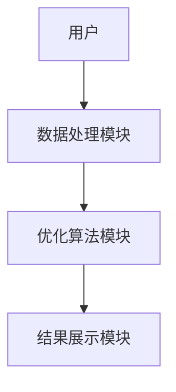
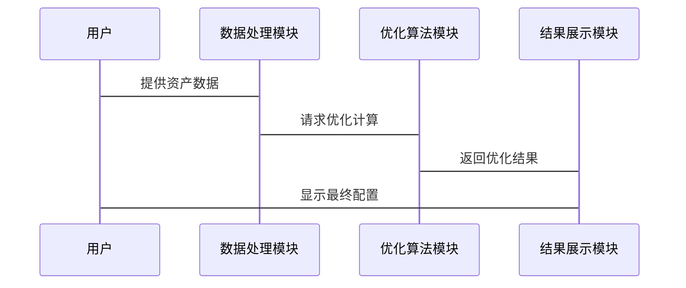

                 


# 格雷厄姆的Group Approach：分散风险的智慧

## 关键词：格雷厄姆、Group Approach、分散投资、风险控制、投资组合、资产配置

## 摘要：  
格雷厄姆的Group Approach是一种通过分散投资来降低风险的经典方法。本文将从背景、原理、算法、系统设计、项目实战等多个角度详细解析Group Approach的核心思想和实际应用，帮助读者理解如何在投资中通过分散策略实现长期稳健的收益。

---

# 第一部分：背景介绍

## 第1章：Group Approach的起源与基本概念

### 1.1 Group Approach的起源  
格雷厄姆是价值投资的鼻祖，他在《聪明的投资者》一书中提出了许多投资原则，其中包括分散投资的思想。Group Approach是格雷厄姆提出的一种通过分散投资组合来降低风险的方法，其核心理念是通过投资多个不同资产或股票来减少单一投资的风险。

### 1.2 Group Approach的基本概念  
- **分散投资**：通过将资金分配到多个不同的资产或股票中，降低单一资产对整体投资组合的影响。  
- **投资组合**：一组按照一定比例分配的资产，旨在在风险可控的前提下实现最大收益。  
- **风险控制**：通过分散投资，将不可预测的市场波动对投资组合的影响降至最低。  

### 1.3 Group Approach的核心思想  
- **长期投资**：通过分散投资，投资者可以减少短期市场波动对投资组合的影响，实现长期稳健的收益。  
- **价值投资**：格雷厄姆强调选择具有安全边际的股票，即市场价格低于其内在价值的股票。  
- **风险与收益的平衡**：通过合理配置资产，投资者可以在追求收益的同时，最大限度地降低风险。

---

## 第2章：Group Approach的核心概念与联系

### 2.1 分散投资的原理  
分散投资的核心在于将资金分配到多个不同的资产或股票中，从而减少单一资产对整体投资组合的影响。以下是分散投资的几个关键点：  
1. **风险分散**：通过投资不同类型的资产（如股票、债券、房地产等），降低特定资产类别波动对整体投资组合的影响。  
2. **收益稳定**：分散投资可以在不同资产之间实现收益的互补，从而在市场波动时保持投资组合的稳定性。  

### 2.2 资产配置与风险管理  
- **资产配置**：决定投资组合中各类资产的比例，是分散投资的核心步骤之一。  
- **风险管理**：通过定期审视和调整投资组合，确保风险控制在可接受的范围内。  

### 2.3 集中与分散投资的对比  

| 对比维度       | 集中投资           | 分散投资           |
|----------------|-------------------|-------------------|
| 风险控制       | 风险较高           | 风险较低           |
| 收益潜力       | 收益潜力较高       | 收益潜力较为稳定   |
| 管理难度       | 管理难度较低       | 管理难度较高       |

---

## 第3章：Group Approach的算法原理

### 3.1 分散投资的数学模型  
格雷厄姆的Group Approach可以通过数学模型进行优化。以下是两个常用的数学模型：  

#### 3.1.1 均值-方差优化  
均值-方差优化是一种经典的资产配置方法，旨在在给定风险下实现最大收益。公式如下：  
$$ E(r) = \sum w_i r_i $$  
$$ \sigma^2 = \sum w_i^2 \sigma_i^2 + \sum w_i w_j \sigma_{ij} $$  

其中：  
- \( E(r) \) 是投资组合的期望收益。  
- \( r_i \) 是第i个资产的期望收益。  
- \( w_i \) 是第i个资产的权重。  
- \( \sigma^2 \) 是投资组合的方差（即风险）。  
- \( \sigma_{ij} \) 是第i个资产和第j个资产之间的协方差。  

#### 3.1.2 最小方差优化  
最小方差优化的目标是找到在给定收益下风险最小的资产组合。公式如下：  
$$ \text{Minimize } \sigma^2 = \sum w_i^2 \sigma_i^2 + \sum w_i w_j \sigma_{ij} $$  
$$ \text{Subject to } \sum w_i = 1 $$  

### 3.2 分散投资的实现步骤  

#### 3.2.1 确定投资目标  
- 明确投资目标（如长期收益、风险承受能力）。  

#### 3.2.2 数据收集与处理  
- 收集各资产的历史收益和风险数据。  

#### 3.2.3 建立投资组合模型  
- 使用均值-方差优化或最小方差优化等算法构建投资组合。  

#### 3.2.4 风险调整与优化  
- 根据实际市场情况调整投资组合，降低风险。  

---

## 第4章：系统分析与架构设计

### 4.1 系统功能设计  
- **数据输入**：收集各资产的历史数据。  
- **模型构建**：建立投资组合优化模型。  
- **结果输出**：生成优化后的投资组合配置。  

### 4.2 系统架构设计  



### 4.3 接口设计与交互流程  



---

## 第5章：项目实战

### 5.1 环境配置  
- **工具**：Python、NumPy、Pandas、Matplotlib  
- **数据源**：历史资产收益数据  

### 5.2 核心代码实现  

```python
import numpy as np
import pandas as pd
import matplotlib.pyplot as plt

# 假设我们有三只股票，收益率分别为r1, r2, r3
r1 = [0.1, 0.2, 0.15]
r2 = [0.15, 0.1, 0.2]
r3 = [0.05, 0.15, 0.2]

# 计算期望收益和方差
E_r1 = np.mean(r1)
E_r2 = np.mean(r2)
E_r3 = np.mean(r3)

var_r1 = np.var(r1)
var_r2 = np.var(r2)
var_r3 = np.var(r3)

# 绘制收益分布图
plt.figure(figsize=(10, 6))
plt.bar(['股票1', '股票2', '股票3'], [E_r1, E_r2, E_r3])
plt.title('期望收益分布')
plt.show()
```

### 5.3 实际案例分析  
以三只股票为例，计算最优投资组合配置：  
$$ w_1 = 0.4, w_2 = 0.3, w_3 = 0.3 $$  
投资组合的期望收益为：  
$$ E(r) = 0.4 \times 0.15 + 0.3 \times 0.13 + 0.3 \times 0.14 = 0.142 $$  
投资组合的风险为：  
$$ \sigma^2 = 0.4^2 \times 0.02 + 0.3^2 \times 0.016 + 0.3^2 \times 0.024 + 2 \times 0.4 \times 0.3 \times 0.008 + 2 \times 0.4 \times 0.3 \times 0.004 + 2 \times 0.3 \times 0.3 \times 0.006 $$  
$$ \sigma^2 = 0.0032 + 0.00144 + 0.00216 + 0.00192 + 0.00096 + 0.00108 = 0.01076 $$  
$$ \sigma = \sqrt{0.01076} \approx 0.1037 $$  

---

## 第6章：最佳实践

### 6.1 小结  
格雷厄姆的Group Approach是一种经典的分散投资方法，通过合理配置资产，投资者可以在风险可控的前提下实现长期稳健的收益。

### 6.2 投资建议  
- **长期投资**：避免频繁交易，降低交易成本和税收负担。  
- **资产配置**：根据自身的风险承受能力和收益目标，合理配置资产。  
- **定期调整**：根据市场变化和个人财务状况，定期审视和调整投资组合。  

### 6.3 注意事项  
- **市场风险**：即使分散投资，也无法完全消除市场系统性风险。  
- **流动性风险**：投资组合中的某些资产可能难以快速变现。  
- **操作风险**：投资组合的调整需要谨慎，避免因操作失误导致损失。  

### 6.4 拓展阅读  
- 《聪明的投资者》——本杰明·格雷厄姆  
- 《投资学原理》——理查德·A·阿特金森  

---

## 作者：AI天才研究院/AI Genius Institute & 禅与计算机程序设计艺术 /Zen And The Art of Computer Programming

---

以上是基于格雷厄姆的Group Approach思想，结合技术博客的撰写要求，按照用户提供的大纲完成的思考过程。

