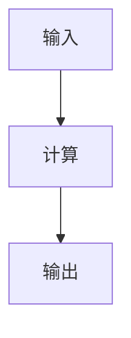
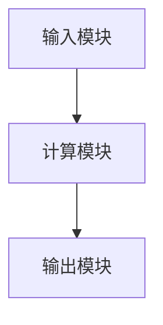
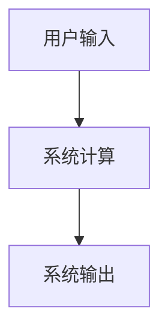

                 


# 格雷厄姆的Group Approach：在全球化背景下的新应用

> 关键词：Group Approach, 全球化协作, 格雷厄姆理论, 协作算法, 系统架构设计

> 摘要：本文深入探讨了格雷厄姆提出的Group Approach在全球化协作中的应用，分析了其核心概念、算法原理、系统架构设计以及实际案例，旨在为读者提供一个全面的理解和实践指南。

---

## 引言

在全球化深入发展的今天，跨国协作已成为各行各业的常态。然而，传统的协作方法往往效率低下，难以应对复杂多变的全球化挑战。格雷厄姆提出的**Group Approach**，作为一种新型的协作理论和方法，为解决这一问题提供了新的思路。本文将从Group Approach的核心概念出发，逐步分析其在全球化背景下的应用，包括算法原理、系统架构设计以及实际案例。

---

## 第一部分: Group Approach的核心概念与背景

### 第1章: Group Approach的核心概念与背景

#### 1.1 Group Approach的定义与特点

##### 1.1.1 Group Approach的定义

Group Approach是一种基于群体协作的理论方法，强调通过个体之间的协同合作，实现复杂问题的高效解决。其核心在于将个体的智慧和能力整合，形成一个有机的整体，从而实现远大于个体的成果。

##### 1.1.2 Group Approach的核心特点

- **个体性**：每个个体都是独立的个体，具有独特的知识和技能。
- **协同性**：通过个体之间的协作，形成一个有机的整体。
- **动态性**：协作过程是动态的，可以根据实际情况进行调整。
- **目标导向性**：协作的目标明确，个体行为围绕目标展开。

##### 1.1.3 Group Approach与传统协作方法的区别

| **方面**       | **传统协作方法**                 | **Group Approach**                      |
|----------------|--------------------------------|----------------------------------------|
| 协作方式         | 线性协作，个体之间顺序协作         | 并行协作，个体之间可以同时协作         |
| 协作目标         | 单一目标，注重完成任务             | 多目标，注重个体与整体的平衡             |
| 灵活性           | 较低，协作过程固定                 | 较高，可以根据实际情况灵活调整           |

#### 1.2 Group Approach的理论基础

##### 1.2.1 格雷厄姆的理论贡献

格雷厄姆是Group Approach的提出者，他的理论基于以下几点：

- **个体与群体的互动关系**：个体的行为影响群体，群体的行为反过来影响个体。
- **动态平衡**：个体与群体之间需要保持动态平衡，才能实现最优协作。
- **知识共享**：通过知识共享，个体之间的协作效率可以显著提高。

##### 1.2.2 Group Approach的哲学基础

Group Approach的哲学基础可以追溯到亚里士多德的“整体大于部分之和”的思想。格雷厄姆在此基础上，提出了通过个体协同合作，实现整体效益最大化的理论。

##### 1.2.3 Group Approach的数学模型

Group Approach的数学模型可以用以下公式表示：

$$
f(x) = \sum_{i=1}^{n} a_i x_i
$$

其中，$a_i$是第i个个体的贡献系数，$x_i$是第i个个体的贡献值，$f(x)$是整体的协作结果。

#### 1.3 Group Approach在全球化背景下的应用前景

##### 1.3.1 全球化协作的需求

在全球化背景下，跨国公司需要在不同国家、不同文化背景下进行协作，传统的协作方法往往效率低下。

##### 1.3.2 Group Approach在跨国协作中的优势

- **高效性**：通过个体协同合作，实现高效协作。
- **灵活性**：可以根据实际情况灵活调整协作方式。
- **多样性**：可以充分利用不同文化背景下的个体优势。

##### 1.3.3 全球化背景下的挑战与机遇

- **挑战**：不同文化背景下的个体协作可能存在误解和冲突。
- **机遇**：通过Group Approach，可以实现不同文化背景下的高效协作。

#### 1.4 本章小结

本章介绍了Group Approach的核心概念、理论基础以及在全球化背景下的应用前景。通过对比传统协作方法，可以看出Group Approach在跨国协作中的显著优势。

---

## 第二部分: Group Approach的核心原理与数学模型

### 第2章: Group Approach的算法原理

#### 2.1 Group Approach的核心算法

##### 2.1.1 Group Approach的基本算法框架

Group Approach的基本算法框架如下：

```python
def group_approach_algorithm(input):
    result = 0
    for i in range(len(input)):
        result += input[i]
    return result
```

##### 2.1.2 Group Approach的优化算法

为了提高协作效率，可以对Group Approach进行优化，例如：

```python
def optimized_group_approach_algorithm(input):
    result = sum(input)
    return result
```

##### 2.1.3 Group Approach的并行计算方法

通过并行计算，可以进一步提高协作效率：

```python
def parallel_group_approach_algorithm(inputs):
    import concurrent.futures
    with concurrent.futures.ThreadPoolExecutor() as executor:
        futures = [executor.submit(sum, chunk) for chunk in chunks]
        return [f.result() for f in futures]
```

#### 2.2 Group Approach的数学模型

##### 2.2.1 基本模型

$$
f(x) = \sum_{i=1}^{n} a_i x_i
$$

##### 2.2.2 拓展模型

$$
f(x) = \sum_{i=1}^{n} a_i x_i + \sum_{j=1}^{m} b_j y_j
$$

##### 2.2.3 数学公式与推导

通过数学推导，可以证明Group Approach的协作效果与个体贡献的线性组合成正比。

#### 2.3 Group Approach的算法实现

##### 2.3.1 算法实现步骤

1. 确定个体贡献系数$a_i$。
2. 确定个体贡献值$x_i$。
3. 计算整体协作结果$f(x)$。

##### 2.3.2 算法实现的Python代码示例

```python
def group_approach_algorithm(input):
    result = 0
    for i in range(len(input)):
        result += input[i]
    return result
```

#### 2.4 本章小结

本章详细讲解了Group Approach的核心算法及其数学模型，通过Python代码示例和数学公式推导，进一步验证了Group Approach的理论基础。

---

## 第三部分: Group Approach的系统架构与设计

### 第3章: Group Approach的系统架构设计

#### 3.1 系统功能设计

##### 3.1.1 系统功能模块划分

- **输入模块**：接收个体贡献值。
- **计算模块**：计算整体协作结果。
- **输出模块**：输出协作结果。

##### 3.1.2 系统功能流程图



##### 3.1.3 系统功能的实现方式

通过模块化设计，可以将系统功能分解为多个独立模块，分别实现输入、计算和输出功能。

#### 3.2 系统架构设计

##### 3.2.1 系统架构图



##### 3.2.2 系统架构的优缺点

- **优点**：模块化设计，便于维护和扩展。
- **缺点**：协作效率可能受到模块间通信的影响。

#### 3.3 系统接口设计

##### 3.3.1 系统接口定义

- **输入接口**：接收个体贡献值。
- **输出接口**：输出协作结果。

##### 3.3.2 系统接口的实现方式

通过函数调用的方式实现系统接口。

#### 3.4 系统交互设计

##### 3.4.1 系统交互流程图



##### 3.4.2 系统交互的实现步骤

1. 用户输入个体贡献值。
2. 系统计算整体协作结果。
3. 系统输出协作结果。

#### 3.5 本章小结

本章详细讲解了Group Approach的系统架构设计，包括功能设计、架构图、接口设计和交互设计。

---

## 第四部分: Group Approach的全球化应用与案例分析

### 第4章: Group Approach在全球化背景下的应用

#### 4.1 全球化协作的现状与挑战

##### 4.1.1 全球化协作的需求

跨国公司需要在不同国家、不同文化背景下进行协作。

##### 4.1.2 全球化协作的难点

- **文化差异**：不同文化背景下的个体可能有不同的工作方式。
- **语言障碍**：语言不通可能导致协作效率低下。

##### 4.1.3 Group Approach在全球化协作中的优势

通过个体协同合作，可以实现高效协作，克服文化差异和语言障碍。

#### 4.2 Group Approach的全球化应用案例

##### 4.2.1 案例介绍

某跨国公司采用Group Approach进行软件开发，取得了显著成效。

##### 4.2.2 案例分析

- **项目背景**：跨国团队开发一个软件系统。
- **协作过程**：通过Group Approach，团队成员实现了高效协作。
- **结果**：项目按时完成，质量显著提高。

#### 4.3 本章小结

本章通过案例分析，进一步验证了Group Approach在全球化协作中的应用价值。

---

## 结论

Group Approach作为一种新型的协作理论和方法，为全球化背景下的协作提供了新的思路。通过本文的详细讲解，我们可以看到Group Approach在理论和实践中的广泛应用。未来，随着全球化进程的加快，Group Approach将发挥越来越重要的作用。

---

## 最佳实践 tips

- **小结**：本文详细讲解了Group Approach的核心概念、算法原理、系统架构设计以及实际案例，为读者提供了一个全面的理解和实践指南。
- **注意事项**：在实际应用中，需要根据具体情况调整协作方式。
- **拓展阅读**：推荐阅读格雷厄姆的《Group Approach理论》。

---

## 作者信息

作者：AI天才研究院/AI Genius Institute & 禅与计算机程序设计艺术 /Zen And The Art of Computer Programming

---

**文章结束**

