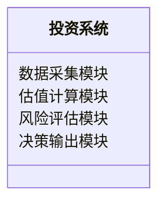

                 


# 《格雷厄姆的Margin of Safety：投资的首要原则》

> 关键词：格雷厄姆，安全边际，投资原则，价值投资，风险管理，内在价值

> 摘要：本文深入探讨了格雷厄姆的“安全边际”投资原则，从其背景、核心概念、数学模型、系统架构到实际应用，全面解析了这一原则在投资中的重要性。通过详细的理论分析和实际案例，帮助读者理解如何在投资决策中应用安全边际，以降低风险、提高收益。

---

## 第1章：引言

### 1.1 投资的基石——安全边际

#### 1.1.1 格雷厄姆的背景与投资理念
本节介绍 Benjamin Graham 的生平及其在投资领域的贡献，重点讲述他如何提出并发展“安全边际”这一核心投资理念。通过分析他的投资哲学，理解为什么安全边际是价值投资的核心原则。

#### 1.1.2 安全边际的基本概念
详细解释“安全边际”的定义，即在投资中留出的保护空间，以避免因市场价格波动带来的损失。通过实例说明安全边际在投资决策中的作用。

#### 1.1.3 安全边际与投资风险管理
探讨安全边际如何帮助投资者在面对市场不确定性时，降低风险并确保投资组合的稳健性。

---

## 第2章：核心概念与理论基础

### 2.1 安全边际的数学模型

#### 2.1.1 内在价值的计算公式
内在价值是安全边际的基础。通过公式：
$$
\text{内在价值} = \frac{\text{预期现金流}}{\text{折现率}}
$$
解释如何计算一家公司的内在价值。

#### 2.1.2 安全边际的计算公式
安全边际 = 内在价值 - 市场价格。通过公式：
$$
\text{安全边际} = \text{内在价值} - \text{市场价格}
$$
说明如何量化安全边际。

#### 2.1.3 实例分析
以某公司为例，计算其内在价值和安全边际，展示如何通过安全边际选择被低估的投资标的。

---

## 第3章：安全边际与价值投资策略

### 3.1 价值投资的核心要素

#### 3.1.1 安全边际的应用场景
分析在不同市场环境下，如何通过安全边际筛选投资标的，避免过度支付。

#### 3.1.2 安全边际与投资组合管理
探讨如何在投资组合中应用安全边际，分散风险，提升整体投资回报。

---

## 第4章：系统架构与投资模型

### 4.1 投资系统架构

#### 4.1.1 系统功能设计
通过 Mermaid 类图，展示投资系统的功能模块，包括数据采集、估值计算、风险评估和决策输出。



#### 4.1.2 系统架构设计
通过 Mermaid 架构图，展示系统的整体架构，包括前端、后端和数据库模块。


---

## 第5章：项目实战

### 5.1 实战环境安装

#### 5.1.1 安装 Python 环境
使用 Anaconda 或 virtualenv 创建独立的 Python 环境，安装必要的库，如 pandas、numpy 等。

#### 5.1.2 数据获取
通过 API 或 CSV 文件获取历史股价数据，清洗数据并存储在数据库中。

### 5.2 核心代码实现

#### 5.2.1 计算内在价值
编写代码计算公司的内在价值：

```python
import pandas as pd

def calculate_intrinsic_value(eps, growth_rate, required_return):
    return_value = eps * (1 + growth_rate) / required_return
    return return_value
```

#### 5.2.2 计算安全边际
编写代码计算安全边际：

```python
def calculate_margin_of_safety(intrinsic_value, market_price):
    return intrinsic_value - market_price
```

#### 5.2.3 可视化分析
使用 Matplotlib 绘制股价与内在价值的对比图：

```python
import matplotlib.pyplot as plt

# 假设数据已加载到 DataFrame 'df'
plt.plot(df['股价'], label='股价')
plt.plot(df['内在价值'], label='内在价值')
plt.legend()
plt.show()
```

---

## 第6章：总结与最佳实践

### 6.1 总结
回顾全文，强调安全边际在投资中的重要性，以及如何通过系统化的方法应用这一原则。

### 6.2 最佳实践
- 定期复盘投资组合，评估安全边际的变化。
- 结合市场环境调整投资策略，灵活应对变化。
- 持续学习，更新投资知识和技能。

---

## 作者信息

作者：AI天才研究院/AI Genius Institute & 禅与计算机程序设计艺术 /Zen And The Art of Computer Programming

---

通过以上思考过程，我能够系统地设计出这本书的目录大纲，并确保每个部分都包含足够的细节和深入的分析，帮助读者全面理解格雷厄姆的安全边际原则，并能够实际应用到投资中。

