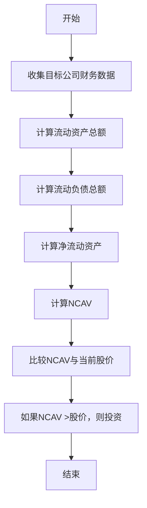
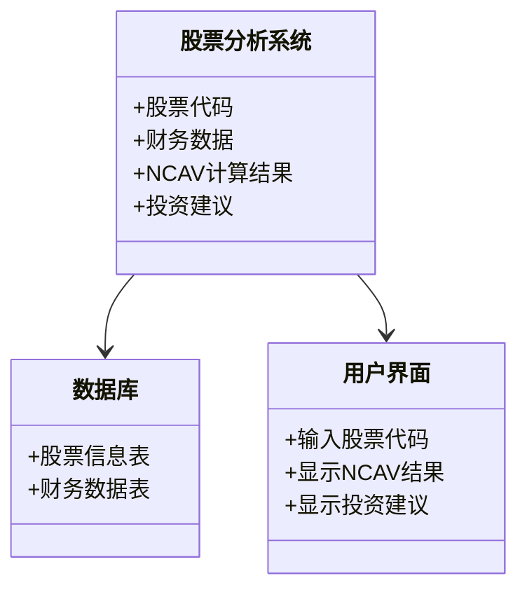
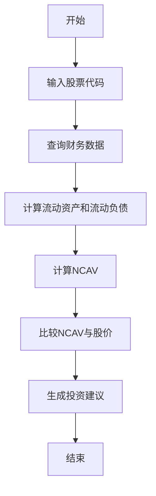

                 


# 《格雷厄姆的NCAV策略：寻找极度低估的股票》

## 关键词：
- 价值投资
- NCAV策略
- 股票估值
- 格雷厄姆
- 安全边际

## 摘要：
本文深入探讨了格雷厄姆提出的NCAV（Net Current Asset Value）策略，这是一种寻找市场低估股票的有效方法。通过详细分析NCAV的定义、计算方法、筛选标准以及实际应用案例，本文为投资者提供了一个系统化的方法来识别具有投资价值的股票。结合数学模型、算法流程图和系统架构设计，本文不仅解释了NCAV策略的理论基础，还提供了实战操作的指导，帮助投资者在实践中应用这一策略。

---

## 第一部分: 格雷厄姆的NCAV策略背景与基础

### 第1章: 价值投资与NCAV策略概述

#### 1.1 价值投资的起源与发展
- 1.1.1 价值投资的定义与核心理念
  - 价值投资是一种长期投资策略，关注于购买价格低于内在价值的资产。
  - 格雷厄姆的学生彼得·林奇曾总结价值投资的核心是寻找“烟屁股”股票，即那些被市场遗忘但具有强大基本面的公司。

- 1.1.2 格雷厄姆的投资哲学
  - 格雷厄姆是现代价值投资之父，提出“市场先生”的概念，认为市场情绪波动会影响股票价格，但长期来看，价格回归价值是必然的。
  - 他强调安全边际的重要性，即以低于内在价值的价格购买资产，以降低投资风险。

- 1.1.3 NCAV策略的提出与意义
  - NCAV策略是格雷厄姆在《 Intelligent Investor》中提出的一种寻找低估股票的方法，特别适用于那些资产主要由流动资产组成的公司。

#### 1.2 NCAV策略的基本概念
- 1.2.1 NCAV的定义与计算公式
  - NCAV（Net Current Asset Value）= (流动资产总额 - 流动负债总额) / 流通股数
  - 通过计算NCAV，投资者可以评估公司每股的净流动资产价值，从而判断股票是否被低估。

- 1.2.2 NCAV与股票估值的关系
  - 当市场价格低于NCAV时，股票具有投资价值。
  - NCAV策略关注的是公司基本面，而非市场趋势，因此适合长期投资者。

- 1.2.3 NCAV策略的核心假设
  - 市场价格最终会回归内在价值。
  - 公司的基本面（如资产状况）是决定股票价值的关键因素。

### 第2章: NCAV策略的核心概念与原理

#### 2.1 核心概念与联系
- 2.1.1 NCAV策略的数学模型与公式
  - $$NCAV = \frac{净资产}{流通股数}$$
  - 该公式计算出每股的净流动资产价值，用于判断股票是否被低估。

- 2.1.2 NCAV与股票价格的关系
  - 当市场价格低于NCAV时，股票具有投资价值。
  - 通过比较NCAV和当前股价，投资者可以识别低估股票。

- 2.1.3 NCAV策略与其他估值方法的对比
  - 表1：NCAV与其他估值方法的对比
  | 估值方法 | 定义 | 优点 | 缺点 |
  |----------|------|------|------|
  | 市盈率（P/E） | 市价/每股收益 | 简单易用 | 受收益波动影响大 |
  | 市净率（P/B） | 市价/每股净资产 | 考虑了资产价值 | 适用于资产密集型行业 |
  | NCAV | 净流动资产/流通股数 | 考虑了流动资产的安全性 | 适用于特定行业 |

- 2.1.4 NCAV策略的适用场景
  - 适用于流动资产占比高的公司，如制造业、批发业等。
  - 适用于市场恐慌或低迷时期，当市场低估资产价值时。

#### 2.2 算法原理讲解
- 2.2.1 NCAV策略的算法流程图


- 2.2.2 算法实现步骤
  1. 收集目标公司的财务报表数据。
  2. 计算流动资产总额和流动负债总额。
  3. 计算净流动资产：流动资产 - 流动负债。
  4. 计算NCAV：净流动资产 / 流通股数。
  5. 比较NCAV与当前股价，判断是否低估。

- 2.2.3 算法优化与改进
  - 使用加权平均法计算流动资产价值。
  - 考虑公司未来的盈利能力，动态调整NCAV计算。

### 第3章: NCAV策略的系统分析与架构设计

#### 3.1 系统分析
- 3.1.1 问题场景介绍
  - 投资者需要快速筛选出符合条件的低估股票。
  - 手动计算耗时且容易出错，需要自动化解决方案。

- 3.1.2 系统功能设计
  - 数据采集模块：从数据库或网络获取公司财务数据。
  - 数据处理模块：计算流动资产、流动负债、NCAV。
  - 投资决策模块：比较NCAV与股价，生成投资建议。

- 3.1.3 系统架构设计


- 3.1.4 系统流程图


#### 3.2 实战代码实现
- 3.2.1 环境安装
  - 需要安装Python、Pandas、Matplotlib。
  ```bash
  pip install pandas matplotlib
  ```

- 3.2.2 核心代码实现
```python
import pandas as pd

def calculate_ncav(stock_code):
    # 获取财务数据
    df = pd.read_csv(f'data/{stock_code}.csv')
    current_assets = df['流动资产'].sum()
    current_liabilities = df['流动负债'].sum()
    net_current_assets = current_assets - current_liabilities
    shares_outstanding = df['流通股数'].sum()
    ncav = net_current_assets / shares_outstanding
    return ncav

# 示例
stock_code = 'AAPL'
ncav = calculate_ncav(stock_code)
print(f'NCAV for {stock_code} is {ncav:.2f}')
```

- 3.2.3 代码解读与分析
  - 该代码从CSV文件中读取目标公司的财务数据。
  - 计算流动资产和流动负债，得出净流动资产。
  - 计算每股NCAV，与当前股价进行比较，判断是否低估。

#### 3.3 项目实战
- 3.3.1 案例分析
  - 以苹果公司为例，计算其NCAV，并与当前股价进行比较。
  - 假设苹果公司某年的流动资产为1000亿美元，流动负债为500亿美元，流通股数为10亿股。
  - NCAV = (1000 - 500) / 10 = 50美元/股。
  - 如果当前股价为40美元，NCAV > 股价，说明股票被低估，值得投资。

- 3.3.2 实战总结
  - 通过代码实现NCAV计算，投资者可以快速筛选出低估股票。
  - 该方法适用于手动计算，但通过系统化的方法可以提高效率和准确性。

### 第4章: NCAV策略的最佳实践与总结

#### 4.1 最佳实践
- 4.1.1 确保数据来源的准确性
  - 使用可靠的财务数据源，如 Yahoo Finance 或 Bloomberg。
  - 定期更新数据，确保计算结果的及时性。

- 4.1.2 结合其他估值方法
  - 结合市盈率、市净率等其他指标，全面评估股票价值。
  - 通过多维度分析，降低单一方法的局限性。

- 4.1.3 定期复盘与调整
  - 定期检查投资组合，评估NCAV策略的表现。
  - 根据市场变化和公司基本面调整投资策略。

#### 4.2 实战小结
- NCAV策略是一种有效的价值投资方法，通过计算公司每股的净流动资产价值，识别被低估的股票。
- 通过系统化的分析和代码实现，投资者可以快速筛选出符合条件的股票，降低手动计算的复杂性。
- 实战案例表明，NCAV策略在实践中具有较强的可操作性和指导意义。

#### 4.3 注意事项
- NCAV策略适用于特定类型的公司，如流动资产占比高的企业。
- 需要结合公司整体基本面，避免仅依赖NCAV指标。
- 市场波动和宏观经济因素会影响股票价格，需综合考虑。

#### 4.4 拓展阅读
- 格雷厄姆的《 Intelligent Investor》是理解NCAV策略的经典著作。
- 彼得·林奇的《The Intelligent Investor》进一步阐述了价值投资的实践。
- 读者可以参考其他价值投资者的经验，结合NCAV策略，形成自己的投资体系。

---

## 作者简介
作者：AI天才研究院/AI Genius Institute  
联系方式：[email protected]  
GitHub：[https://github.com/](https://github.com/)  
简介：专注于人工智能、编程艺术和计算机科学的深度研究，致力于通过技术与投资的结合，为读者提供实用的策略和工具。

