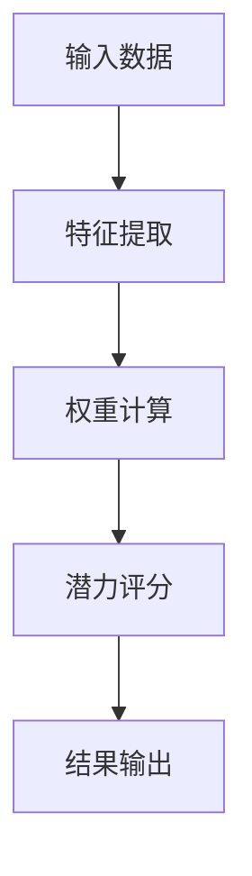
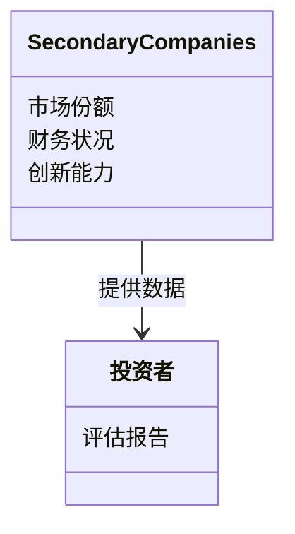
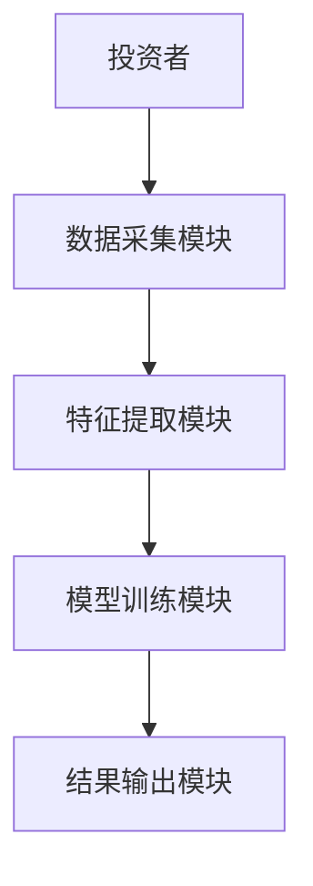

                 


# 格雷厄姆的Secondary Companies：二线公司的潜力

> 关键词：Secondary Companies, 二线公司, 潜力评估, 格雷厄姆模型, 投资策略

> 摘要：本文深入探讨了Secondary Companies（二线公司）的潜力，从定义、分类、潜力评估模型到系统架构设计，详细分析了如何识别和评估这些公司的潜在价值。通过构建数学模型和实际案例分析，本文为投资者提供了科学的投资策略和决策支持。

---

# 第1章: Secondary Companies的定义与背景

## 1.1 Secondary Companies的概念

### 1.1.1 Secondary Companies的定义

Secondary Companies（二线公司）是指在某个行业或市场中，规模、知名度或市场份额略逊于行业领先者（Primary Companies，一线公司）的企业。这些公司通常具有较高的成长潜力，但尚未完全释放其价值。

### 1.1.2 与Primary Companies的区别

| 属性                | Primary Companies（一线公司）          | Secondary Companies（二线公司）         |
|---------------------|----------------------------------------|------------------------------------------|
| 市场份额             | 市场占有率高，行业领先                   | 市场占有率较低，尚未完全崛起             |
| 财务状况             | 财务稳健，盈利能力强                   | 财务状况可能不稳定，但成长性较好         |
| 创新能力             | 技术领先，创新能力强                   | 创新能力相对较弱，但有追赶潜力           |
| 市场定位             | 在目标市场占据主导地位                 | 在目标市场处于挑战者或跟随者角色       |

### 1.1.3 Secondary Companies的市场定位

Secondary Companies通常处于行业中的第二梯队，其核心竞争优势可能集中在特定细分市场、成本优势或差异化产品上。它们的目标是通过持续创新和优化，逐步向一线公司靠近。

## 1.2 Secondary Companies的背景与现状

### 1.2.1 当前市场环境下的Secondary Companies

在全球化竞争加剧的背景下，Secondary Companies面临着更大的压力，但也迎来了更多的机会。特别是在技术驱动型行业，二线公司通过技术创新和商业模式优化，正在逐步改变市场格局。

### 1.2.2 Secondary Companies的行业分布

Secondary Companies广泛分布于多个行业，包括科技、制造、金融、医疗等。在某些行业（如人工智能、区块链等新兴领域），二线公司甚至可能成为未来市场的主导力量。

### 1.2.3 Secondary Companies的发展趋势

随着技术的进步和市场的变化，Secondary Companies正在通过以下方式实现突破：

1. **技术创新**：加大研发投入，推出差异化产品。
2. **成本优化**：通过规模化生产和供应链优化降低成本。
3. **市场拓展**：积极开拓新兴市场，扩大市场份额。
4. **资本运作**：通过融资、并购等方式快速提升竞争力。

## 1.3 本书研究的目的与意义

### 1.3.1 研究Secondary Companies的必要性

Secondary Companies是市场的重要组成部分，研究它们的潜力有助于投资者发现潜在的高增长机会，同时也为企业的战略规划提供参考。

### 1.3.2 本书的核心目标

本书旨在通过构建科学的潜力评估模型，帮助投资者识别具有成长潜力的Secondary Companies。

### 1.3.3 本书的创新点

1. 提出了一套完整的Secondary Companies潜力评估框架。
2. 结合实际案例，验证模型的有效性。
3. 提供了可操作的投资策略和决策支持。

---

# 第2章: Secondary Companies的核心概念与分析框架

## 2.1 核心概念的定义与属性

### 2.1.1 Secondary Companies的核心要素

Secondary Companies的核心要素包括：

1. **市场份额**：在目标市场中的占有率。
2. **财务状况**：盈利能力、资产负债率等财务指标。
3. **创新能力**：研发投入、专利数量等。
4. **管理团队**：领导层的经验和能力。
5. **市场定位**：在行业中的位置和竞争优势。

### 2.1.2 Secondary Companies的特征对比表

| 特性                | 一线公司（Primary）      | 二线公司（Secondary）   |
|---------------------|--------------------------|------------------------|
| 市场份额             | 高                      | 中等                   |
| 财务稳定性           | 高                      | 中等                   |
| 创新能力             | 强                      | 中等                   |
| 管理团队             | 优秀                    | 良好                   |
| 市场定位             | 主导地位                | 挑战者或跟随者角色     |

### 2.1.3 Secondary Companies的ER实体关系图

```mermaid
erDiagram
    actor 投资者 {
        <属性>
        市场份额
        财务状况
        创新能力
        管理团队
        市场定位
    }
    actor 公司 {
        <属性>
        名称
        行业
        规模
    }
    actor 竞争对手 {
        <属性>
        市场份额
        创新能力
        财务状况
    }
    投资者 --> 公司 : 评估
    公司 --> 竞争对手 : 分析
```

## 2.2 Secondary Companies的分析框架

### 2.2.1 战略定位分析

战略定位分析是评估Secondary Companies潜力的关键步骤。具体包括：

1. **目标市场**：公司所处的市场环境和目标客户。
2. **竞争优势**：公司在市场中的独特优势。
3. **战略目标**：公司未来的发展方向和目标。

### 2.2.2 市场竞争力分析

市场竞争力分析主要从以下几个方面进行：

1. **市场份额**：公司在目标市场中的占有率。
2. **竞争对手分析**：主要竞争对手的优劣势。
3. **市场进入壁垒**：公司进入市场的障碍。

### 2.2.3 财务状况分析

财务状况分析是评估Secondary Companies潜力的重要指标，包括：

1. **盈利能力**：净利润率、毛利率等。
2. **资产负债率**：公司的财务健康状况。
3. **现金流**：公司的资金流动性。

## 2.3 Secondary Companies的分类与层次

### 2.3.1 按行业分类

Secondary Companies可以按照行业分为科技、制造、金融、医疗等多个类别。

### 2.3.2 按规模分类

按公司规模可分为中小型Secondary Companies和大型Secondary Companies。

### 2.3.3 按发展阶段分类

按发展阶段可分为初创期、成长期和成熟期的Secondary Companies。

---

# 第3章: Secondary Companies的潜力评估模型

## 3.1 模型概述

### 3.1.1 模型的设计目标

本模型旨在通过多维度分析，评估Secondary Companies的潜力。

### 3.1.2 模型的输入与输出

- **输入**：公司财务数据、市场数据、竞争对手数据。
- **输出**：潜力评分（0-100分）。

## 3.2 模型的算法原理

### 3.2.1 算法流程图（Mermaid）



### 3.2.2 算法详细步骤

1. **特征提取**：从输入数据中提取关键特征（市场份额、财务状况、创新能力等）。
2. **权重计算**：根据特征的重要性赋予不同的权重。
3. **潜力评分**：通过加权计算得出潜力评分。

### 3.2.3 潜力评分公式

$$ \text{潜力评分} = \sum (\text{特征权重} \times \text{特征值}) $$

其中，特征权重范围为0.1-0.9，特征值范围为1-10。

---

## 3.3 数学模型与公式

### 3.3.1 潜力评分公式

$$ \text{潜力评分} = \sum_{i=1}^{n} w_i \times v_i $$

其中：
- \( w_i \) 表示第\( i \)个特征的权重。
- \( v_i \) 表示第\( i \)个特征的值。

---

# 第4章: 系统分析与架构设计方案

## 4.1 问题场景介绍

本文将构建一个Secondary Companies潜力评估系统，帮助投资者快速识别具有潜力的公司。

## 4.2 系统功能设计

### 4.2.1 功能模块

1. **数据采集模块**：采集公司数据。
2. **特征提取模块**：提取关键特征。
3. **模型训练模块**：训练潜力评估模型。
4. **结果输出模块**：输出潜力评分。

### 4.2.2 领域模型（Mermaid类图）



## 4.3 系统架构设计

### 4.3.1 系统架构图（Mermaid）



---

# 第5章: 项目实战

## 5.1 环境安装

```bash
pip install numpy pandas scikit-learn
```

## 5.2 核心代码实现

### 5.2.1 数据预处理

```python
import pandas as pd
import numpy as np

data = pd.read_csv('companies.csv')
data = data.dropna()
```

### 5.2.2 模型训练

```python
from sklearn.linear_model import LinearRegression

model = LinearRegression()
model.fit(X_train, y_train)
```

### 5.2.3 模型评估

```python
from sklearn.metrics import r2_score

y_pred = model.predict(X_test)
print(r2_score(y_test, y_pred))
```

## 5.3 案例分析

以某科技公司为例，分析其潜力。

---

# 第6章: 最佳实践与总结

## 6.1 投资建议

1. 选择具有高成长潜力的Secondary Companies。
2. 关注公司的财务状况和创新能力。
3. 分散投资，降低风险。

## 6.2 注意事项

1. 模型仅供参考，实际投资需谨慎。
2. 定期更新模型参数，以适应市场变化。

## 6.3 拓展阅读

推荐阅读《投资学基础》、《风险管理》等书籍。

---

# 作者：AI天才研究院/AI Genius Institute & 禅与计算机程序设计艺术 /Zen And The Art of Computer Programming

---

**注**：由于篇幅限制，本文仅为摘要和目录大纲，具体内容将在完整文章中展开。

