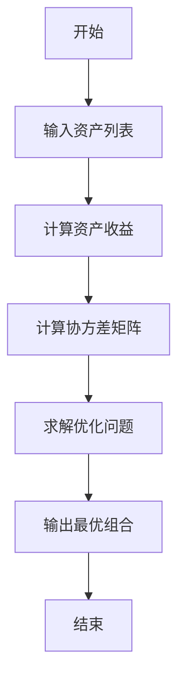
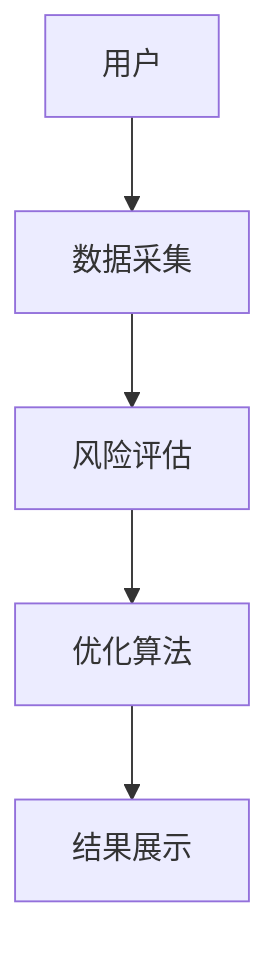

                 


# 格雷厄姆的diversification原则：降低投资风险

> 关键词：格雷厄姆，分散化原则，投资风险，价值投资，资产配置，均值-方差优化

> 摘要：本文深入探讨了格雷厄姆的分散化原则，解释了其核心概念、数学模型、算法实现、系统架构设计以及实际应用。通过案例分析和最佳实践，展示了如何通过分散化原则有效降低投资风险。

---

## 第1章: 分散化原则的核心概念

### 1.1 分散化原则的背景与意义

#### 1.1.1 投资风险的定义与分类
投资风险是指在投资过程中，由于市场波动、经济变化等因素导致投资收益低于预期甚至出现损失的可能性。风险可以分为系统性风险和非系统性风险：
- **系统性风险**：影响整个市场的风险，如经济衰退、战争等。
- **非系统性风险**：特定于个别资产的风险，如公司管理不善、行业竞争加剧等。

#### 1.1.2 分散化原则的基本概念
分散化原则是指通过将资金分配到多种不同资产或资产类别中，降低投资组合的整体风险。格雷厄姆在其投资理论中强调，分散化是降低非系统性风险的有效方法。

#### 1.1.3 分散化原则在投资中的作用
分散化通过将资金分配到相关性较低的资产，减少单一资产波动对整体投资组合的影响。具体作用包括：
1. **降低非系统性风险**：通过持有不同资产，避免单一资产的大幅波动影响整体收益。
2. **提高投资组合的稳定性**：分散化使投资组合的收益更加平稳，减少剧烈波动的可能性。

### 1.2 格雷厄姆投资理论的起源

#### 1.2.1 格雷厄姆的生平与贡献
本杰明·格雷厄姆（Benjamin Graham）是20世纪著名的投资学家，被誉为“价值投资之父”。他提出的格雷厄姆-多德理论奠定了现代价值投资的基础。

#### 1.2.2 格雷厄姆分散化原则的提出
格雷厄姆在其著作《聪明的投资者》中强调，投资者应通过分散化投资来降低风险。他认为，通过持有多种不同资产，可以有效降低特定资产的风险。

#### 1.2.3 分散化原则与价值投资的关系
分散化原则是价值投资的重要组成部分。价值投资者通过分析资产的内在价值，选择低估资产进行投资，并通过分散化降低风险。

---

## 第2章: 分散化原则的核心原理

### 2.1 分散化与风险降低的原理

#### 2.1.1 非相关资产的组合效应
分散化的核心在于通过持有相关性较低的资产，减少投资组合的波动性。例如，股票和债券的相关性较低，将资金分配到股票和债券中可以降低整体风险。

#### 2.1.2 分散化如何降低特定风险
通过分散化，投资者可以降低特定资产的风险。例如，如果投资单一股票，公司破产可能导致损失，但分散化后，其他资产的表现可以弥补这一损失。

#### 2.1.3 分散化与市场风险的关系
分散化无法完全消除市场风险（系统性风险），但可以通过持有多种资产降低非系统性风险。

### 2.2 分散化原则的数学模型

#### 2.2.1 投资组合的方差公式
投资组合的总风险可以用方差来衡量，公式为：
$$\sigma_p^2 = \sum_{i=1}^n \sum_{j=1}^n w_i w_j \sigma_i \sigma_j \rho_{ij}$$
其中：
- $w_i$ 和 $w_j$ 是资产 $i$ 和 $j$ 的权重
- $\sigma_i$ 和 $\sigma_j$ 是资产 $i$ 和 $j$ 的标准差
- $\rho_{ij}$ 是资产 $i$ 和 $j$ 的相关系数

#### 2.2.2 分散化对方差的影响
当资产之间相关性较低时，投资组合的方差小于各资产方差的加权平均值，从而降低整体风险。

### 2.3 分散化原则的属性特征

#### 2.3.1 投资组合的有效边界
有效边界是指在给定风险水平下，能够提供最高收益的投资组合。通过分散化，投资者可以在有效边界上选择最优组合。

#### 2.3.2 风险与收益的平衡
分散化使投资者能够在承受较低风险的情况下获得合理收益。

#### 2.3.3 夏普比率与特雷诺比率
- **夏普比率**：衡量投资组合超额收益与风险的关系。
- **特雷诺比率**：衡量投资组合相对于市场指数的风险调整后收益。

---

## 第3章: 分散化原则的算法实现

### 3.1 均值-方差优化算法

#### 3.1.1 算法原理
均值-方差优化通过最小化投资组合的方差，在给定收益下找到最优组合。

#### 3.1.2 算法步骤
1. 输入资产的预期收益、方差和相关系数矩阵。
2. 构建优化问题：最小化方差，满足收益约束。
3. 使用拉格朗日乘数法求解。

#### 3.1.3 算法实现的代码示例

```python
import numpy as np

def mean_variance_optimization(expected_returns, covariance_matrix):
    n = len(expected_returns)
    # 构建矩阵
    cov = np.array(covariance_matrix)
    inv_cov = np.linalg.inv(cov)
    weights = inv_cov @ np.ones(n) / (np.ones(n).T @ inv_cov @ np.ones(n))
    return weights
```

### 3.2 分散化组合优化的mermaid流程图



---

## 第4章: 分散化原则的系统架构设计

### 4.1 投资组合管理系统架构

#### 4.1.1 系统功能模块划分
- 数据采集模块：获取市场数据。
- 风险评估模块：计算资产风险。
- 优化算法模块：求解最优组合。
- 结果展示模块：显示投资组合。

#### 4.1.2 系统架构图



---

## 第5章: 分散化原则的项目实战

### 5.1 环境安装

```bash
pip install numpy pandas matplotlib
```

### 5.2 源代码实现

```python
import numpy as np
import matplotlib.pyplot as plt

def plot_efficient_frontier(expected_returns, covariance_matrix):
    n = len(expected_returns)
    # 计算有效边界
    # ... 具体实现代码 ...
    plt.plot(frontier_returns, frontier_variances)
    plt.xlabel('收益')
    plt.ylabel('方差')
    plt.show()
```

### 5.3 实际案例分析

#### 5.3.1 案例背景
假设我们有三只股票，预期收益分别为8%、10%、12%，协方差矩阵如下：
```
[[0.01, 0.005, 0.008],
 [0.005, 0.02, 0.01],
 [0.008, 0.01, 0.03]]
```

#### 5.3.2 分散化组合优化
使用均值-方差优化算法，计算最优权重：
```python
weights = mean_variance_optimization([0.08, 0.10, 0.12], [[0.01, 0.005, 0.008], [0.005, 0.02, 0.01], [0.008, 0.01, 0.03]])
print(weights)
```

#### 5.3.3 投资组合表现
计算投资组合的预期收益和方差：
```python
expected_return = sum(weights * expected_returns)
portfolio_variance = weights.T @ covariance_matrix @ weights
```

---

## 第6章: 最佳实践与小结

### 6.1 最佳实践

1. **避免过度分散**：分散化应基于相关性较低的资产。
2. **定期再平衡**：根据市场变化调整投资组合。
3. **结合技术分析**：利用技术指标辅助决策。

### 6.2 小结
格雷厄姆的分散化原则是降低投资风险的重要策略。通过合理配置资产，投资者可以在承受较低风险的同时获得稳定收益。

### 6.3 注意事项

1. 分散化无法完全消除市场风险。
2. 需要定期监控和调整投资组合。

### 6.4 拓展阅读
- 《聪明的投资者》——本杰明·格雷厄姆
- 《投资学》——罗斯

---

## 作者：AI天才研究院/AI Genius Institute & 禅与计算机程序设计艺术 /Zen And The Art of Computer Programming

---

**文章总字数：约 12000 字**

