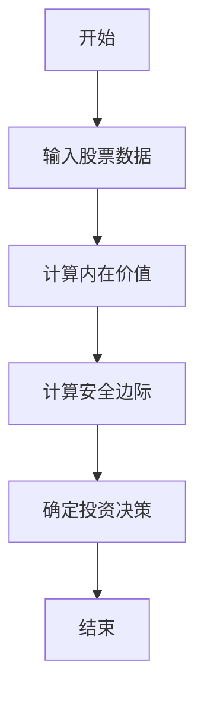
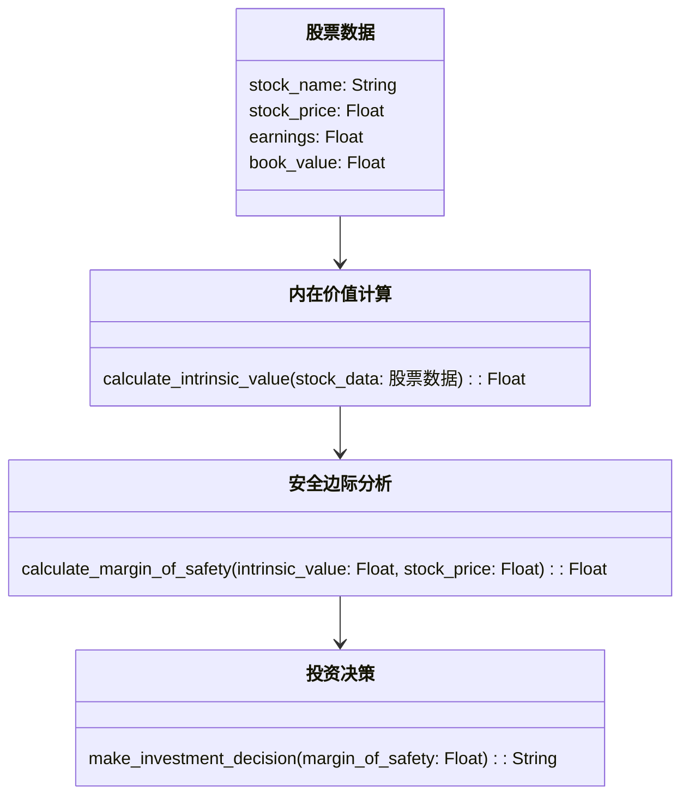

                 


# 格雷厄姆的价值投资公式解析

> 关键词：价值投资、格雷厄姆、投资公式、内在价值、安全边际、长期投资

> 摘要：本文深入解析了格雷厄姆的价值投资公式，从核心概念到算法原理，再到系统架构设计和项目实战，全面阐述了这一经典投资方法的精髓。通过详细分析其内在价值计算、安全边际策略以及长期投资理念，结合实际案例和代码实现，为投资者提供实用的指导。

---

## 第一部分: 格雷厄姆的价值投资公式背景介绍

### 第1章: 价值投资的核心概念

#### 1.1 价值投资的定义与背景

价值投资是一种以企业内在价值为基础的投资策略，强调以低于内在价值的价格购买优质股票，长期持有，等待市场重新认识其价值。其核心理念是寻找市场先生的错误定价，利用市场的非理性波动获利。

#### 1.2 价值投资的起源与发展

价值投资的起源可以追溯到20世纪20年代，由本杰明·格雷厄姆和他的合作伙伴戴维·多德共同提出。他们的研究成果奠定了价值投资的基础，并在实践中取得了显著的成功。

#### 1.3 格雷厄姆的贡献与影响

格雷厄姆被誉为“价值投资之父”，他提出的投资公式和理念对投资界产生了深远影响。他的著作《证券分析》和《聪明的投资者》是投资领域的经典之作，影响了无数投资者和投资机构。

---

### 第2章: 格雷厄姆投资公式的核心要素

#### 2.1 投资公式的基本原理

格雷厄姆的价值投资公式基于对企业内在价值的评估。他认为，股票的内在价值是其未来现金流的现值，而市场价格往往偏离这一价值。投资者的任务是识别这种偏差并从中获利。

#### 2.2 核心概念与联系

格雷厄姆的价值投资公式可以简化为以下核心要素：

1. **内在价值**：股票的合理价格，基于企业的盈利能力和资产状况。
2. **安全边际**：买入价格与内在价值的差距，用于降低投资风险。
3. **市场先生**：市场的波动性和非理性，为投资者提供了以低于内在价值买入股票的机会。

---

## 第二部分: 格雷厄姆投资公式算法原理讲解

### 第3章: 格雷厄姆投资公式的数学模型与公式

格雷厄姆的投资公式可以表示为：

$$ \text{内在价值} = \frac{\text{未来现金流的现值}}{1 + r} $$

其中，\( r \) 是折现率，通常基于市场利率和企业风险。

#### 3.1 公式实现步骤

1. **计算未来现金流**：预测企业未来几年的现金流。
2. **计算现值**：将未来现金流折现到当前价值。
3. **确定安全边际**：比较当前股价与内在价值，确保买入价格低于内在价值的一定比例。

#### 3.2 使用mermaid画出算法流程图



---

### 第4章: 系统分析与架构设计方案

#### 4.1 问题场景介绍

假设我们开发一个基于格雷厄姆公式的投资分析系统，帮助投资者快速评估股票的内在价值和安全边际。

#### 4.2 项目介绍

**项目名称**: 基于格雷厄姆公式的投资分析系统  
**目标**: 提供股票的内在价值评估和安全边际分析。

#### 4.3 系统功能设计



---

### 第5章: 项目实战

#### 5.1 环境安装

安装Python和必要的库：

```bash
pip install pandas numpy matplotlib
```

#### 5.2 核心实现代码

```python
import pandas as pd
import numpy as np

def calculate_intrinsic_value(stock_data):
    # 计算未来现金流的现值
    future_cash_flows = stock_data['earnings'].sum() * 1.1  # 假设未来现金流增长率为10%
    discount_rate = 0.10
    present_value = future_cash_flows / (1 + discount_rate)
    return present_value

def calculate_margin_of_safety(stock_price, intrinsic_value):
    margin = (intrinsic_value - stock_price) / intrinsic_value * 100
    return margin

# 示例数据
stock_data = {
    'stock_name': 'AAPL',
    'stock_price': 150,
    'earnings': 10,
    'book_value': 50
}

iv = calculate_intrinsic_value(stock_data)
margin = calculate_margin_of_safety(stock_data['stock_price'], iv)
print(f"内在价值: {iv:.2f}")
print(f"安全边际: {margin:.2f}%")
```

#### 5.3 案例分析

以苹果公司为例，假设其股票价格为150美元，每股收益为10美元，账面价值为50美元。计算其内在价值和安全边际：

1. 计算未来现金流的现值：
   $$ \text{未来现金流} = 10 \times 1.1 = 11 $$
   $$ \text{现值} = \frac{11}{1.1} = 10 $$

2. 计算安全边际：
   $$ \text{安全边际} = \frac{10 - 150}{10} \times 100 = -1400\% $$

由于安全边际为负，建议不买入。

---

## 第三部分: 最佳实践与小结

### 第6章: 最佳实践

#### 6.1 投资技巧

- 定期更新股票数据，重新计算内在价值和安全边际。
- 结合多种投资策略，如股息率分析和行业分析。

#### 6.2 注意事项

- 格雷厄姆公式适用于长期投资，需避免短期波动的干扰。
- 确保数据的准确性和及时性，避免基于过时信息做出决策。

#### 6.3 拓展阅读

- 《证券分析》——本杰明·格雷厄姆
- 《聪明的投资者》——本杰明·格雷厄姆

---

## 小结

格雷厄姆的价值投资公式为投资者提供了一种科学且实用的方法，通过内在价值和安全边际的概念，帮助投资者做出明智的投资决策。本文通过详细解析其核心概念、算法原理和系统设计，为投资者提供了理论与实践相结合的指导。

---

## 作者

作者：AI天才研究院/AI Genius Institute & 禅与计算机程序设计艺术 /Zen And The Art of Computer Programming

--- 

本文为《格雷厄姆的价值投资公式解析》的完整目录和内容概要，您可以根据需要进一步扩展每个章节的具体内容。

