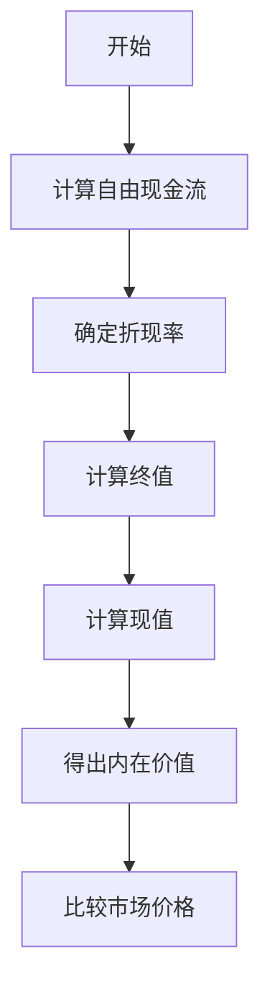
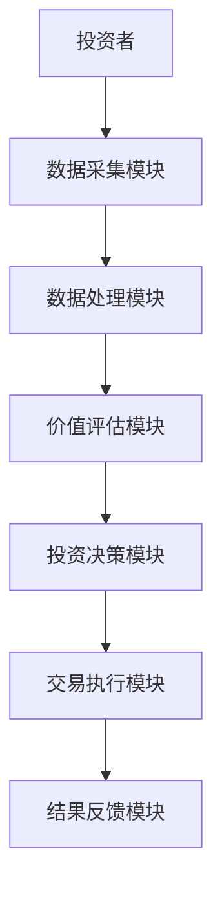

                 


# 《格雷厄姆的价值投资原则现代解读》

## 关键词：价值投资，格雷厄姆，现代解读，内在价值，安全边际，现金流折现，投资策略

## 摘要：  
本文系统地探讨了格雷厄姆的价值投资原则在现代金融环境下的应用与演变。通过分析其核心理念、数学模型和算法原理，结合实际案例，本文展示了如何将传统价值投资原则与现代技术相结合，以适应快速变化的市场环境。文章旨在为投资者提供一种新的视角，帮助他们在复杂的金融市场中做出更明智的投资决策。

---

# 第1章 价值投资的背景与发展

## 1.1 价值投资的起源  
### 1.1.1 投资学的起源与发展  
- 传统投资学的基石：从古典经济学到现代金融理论  
- 价值投资的诞生：格雷厄姆与巴菲特的双重影响  

### 1.1.2 格雷厄姆的贡献  
- 格雷厄姆的学术背景与投资实践  
- 《聪明的投资者》的核心思想  

### 1.1.3 现代投资环境的变化  
- 技术进步对金融市场的冲击  
- 全球化与金融创新对价值投资的影响  

## 1.2 格雷厄姆价值投资的核心理念  
### 1.2.1 价值投资的定义  
- 以低于内在价值的价格购买优质资产  
- 长期投资与复利效应  

### 1.2.2 格雷厄姆的价值投资原则  
- 安全边际：价格与价值的差距  
- 内在价值：资产的真正价值  
- 市场先生：市场的波动与投资者情绪  

### 1.2.3 价值投资与成长投资的对比  
- 价值投资的保守性与成长投资的风险性  
- 现代市场中两者的融合与演变  

---

# 第2章 核心概念与联系

## 2.1 价值投资的核心概念  
### 2.1.1 安全边际  
- 安全边际的计算方法  
- 安全边际与风险控制的关系  

### 2.1.2 内在价值  
- 内在价值的定义与计算公式  
- 内在价值与市场价值的差异  

### 2.1.3 市场先生  
- 市场先生的波动性与投资者决策  
- 市场先生与安全边际的关系  

## 2.2 核心概念的联系  
### 2.2.1 安全边际与内在价值的关系  
- 安全边际是内在价值的保护屏障  
- 安全边际的宽度与投资风险的关系  

### 2.2.2 市场先生与投资者决策的互动  
- 市场波动如何影响投资者的决策  
- 投资者如何利用市场波动获得超额收益  

### 2.2.3 价值投资与其他投资策略的对比  
- 与技术分析的对比：基本面分析与市场信号  
- 与趋势投资的对比：长期持有与顺势而为  

## 2.3 核心概念的数学模型  
### 2.3.1 内在价值的计算公式  
$$ \text{内在价值} = \frac{\text{未来现金流}}{\text{折现率}} $$  

### 2.3.2 安全边际的计算方法  
$$ \text{安全边际} = \text{内在价值} - \text{市场价格} $$  

### 2.3.3 市场价格与内在价值的差异分析  
- 通过实例计算分析市场价格波动对安全边际的影响  

---

# 第3章 价值投资的算法原理

## 3.1 价值评估的算法流程  
### 3.1.1 基本面分析方法  
- 财务报表分析：利润表、资产负债表、现金流量表  
- 关键财务指标：ROE、ROA、净利率等  

### 3.1.2 现金流折现法（DCF模型）  
- 自由现金流的计算方法  
- 折现率的确定：CAPM模型的应用  

### 3.1.3 市场价格与内在价值的对比  
- 通过数学模型计算内在价值与市场价格的差异  

## 3.2 DCF模型的实现与优化  
### 3.2.1 DCF模型的流程图  


### 3.2.2 Python代码实现DCF模型  
```python
import numpy as np
import pandas as pd

def calculate_intrinsic_value(cash_flows, discount_rate, terminal_value):
    present_value = 0
    for year in range(len(cash_flows)):
        present_value += cash_flows[year] / (1 + discount_rate) ** year
    present_value += terminal_value / (1 + discount_rate) ** len(cash_flows)
    return present_value

# 示例数据
cash_flows = [100, 120, 150, 180]  # 每年的自由现金流
discount_rate = 0.10  # 折现率
terminal_value = 200  # 终值

intrinsic_value = calculate_intrinsic_value(cash_flows, discount_rate, terminal_value)
print(f"内在价值：{intrinsic_value:.2f}")
```

### 3.2.3 数学模型的优化与扩展  
- 灵活调整折现率以适应市场变化  
- 结合多种现金流预测模型提高准确性  

---

# 第4章 系统分析与架构设计

## 4.1 投资管理系统的设计  
### 4.1.1 系统功能设计  
- 数据采集：市场数据、财务报表的获取与处理  
- 价值评估：基于DCF模型的内在价值计算  
- 投资决策：基于安全边际的买卖信号生成  

### 4.1.2 系统架构设计  


### 4.1.3 系统接口设计  
- 数据接口：与金融数据API的对接  
- 用户接口：Web界面或API调用  

---

# 第5章 项目实战：价值投资策略的实现

## 5.1 项目环境与工具安装  
### 5.1.1 Python环境的搭建  
- 安装Python、Pandas、NumPy等库  

### 5.1.2 数据获取工具的安装  
- 使用Yahoo Finance API获取股票数据  

## 5.2 价值投资策略的实现  
### 5.2.1 数据处理与清洗  
```python
import pandas as pd

# 示例数据
data = pd.DataFrame({
    'Date': ['2023-01-01', '2023-01-02', '2023-01-03'],
    'Price': [100, 105, 98]
})
print(data)
```

### 5.2.2 DCF模型的代码实现  
```python
def calculate_intrinsic_value(cash_flows, discount_rate, terminal_value):
    present_value = 0
    for year in range(len(cash_flows)):
        present_value += cash_flows[year] / (1 + discount_rate) ** year
    present_value += terminal_value / (1 + discount_rate) ** len(cash_flows)
    return present_value

# 示例数据
cash_flows = [100, 120, 150, 180]
discount_rate = 0.10
terminal_value = 200

intrinsic_value = calculate_intrinsic_value(cash_flows, discount_rate, terminal_value)
print(f"内在价值：{intrinsic_value:.2f}")
```

### 5.2.3 案例分析与策略优化  
- 以某公司为例，计算其内在价值与市场价格的差异  
- 根据安全边际发出买入或卖出信号  

## 5.3 项目小结  
- 项目实现的关键点总结  
- 项目中的常见问题与解决方案  

---

# 第6章 最佳实践与注意事项

## 6.1 最佳实践  
### 6.1.1 小结  
- 价值投资的现代应用总结  
- 技术与策略的结合对投资的影响  

### 6.1.2 注意事项  
- 数据来源的可靠性与准确性  
- 模型假设的合理性和可调整性  

## 6.2 拓展阅读  
- 推荐相关书籍与论文  
- 推荐金融技术博客与论坛  

---

# 作者：AI天才研究院 & 禅与计算机程序设计艺术

