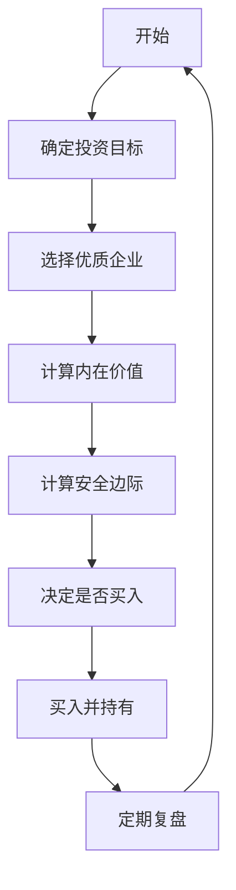
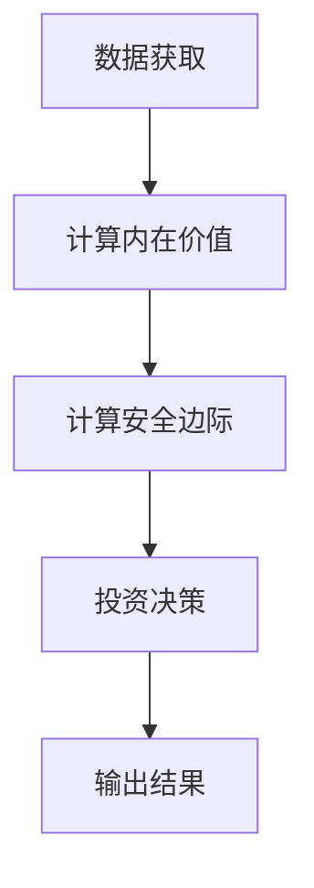
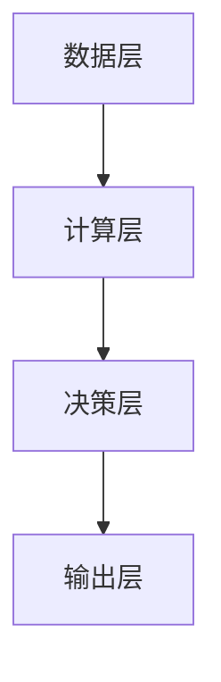

                 


# 格雷厄姆的价值投资实践指南

> 关键词：价值投资，格雷厄姆，内在价值，安全边际，投资策略，投资分析

> 摘要：本文深入探讨了格雷厄姆的价值投资理论与实践方法，结合技术分析与投资策略，详细讲解了内在价值计算、安全边际确定、投资组合构建等核心内容，并通过实际案例分析，帮助读者掌握格雷厄姆投资理念的精髓。

---

## 第一部分: 格雷厄姆的价值投资基础

### 第1章: 价值投资的起源与发展

#### 1.1 格雷厄姆的生平简介
 Benjamin Graham（本杰明·格雷厄姆）是20世纪最伟大的投资理论家之一，被誉为“价值投资之父”。他出生于1894年，去世于1976年，曾就读于哥伦比亚大学，毕业后进入华尔街工作。他在投资领域的主要贡献在于创立了价值投资理论，强调以低于内在价值的价格买入优质股票，从而实现长期稳定的收益。

#### 1.2 价值投资的起源与演变
 价值投资起源于20世纪20年代，格雷厄姆与戴维·多德（David Dodd）共同开发了这一理论，并在1934年出版的《证券分析》一书中首次系统阐述。该理论强调以企业的内在价值为基础进行投资，而非追随市场的短期波动。格雷厄姆的价值投资理念对后来的投资者产生了深远影响，包括沃伦·巴菲特、彼得·林奇等投资大师。

#### 1.3 格雷厄姆投资理论的核心思想
 格雷厄姆的价值投资理论的核心思想可以总结为以下几个方面：
 1. **安全边际**：买入价格低于内在价值的股票，以降低投资风险。
 2. **内在价值**：企业未来现金流的现值，是评估股票价值的核心指标。
 3. **市场先生**：市场波动反映了投资者情绪，而非企业的实际价值。
 4. **长期投资**：通过长期持有优质股票，获得稳定的复利收益。

---

### 第2章: 价值投资的核心概念与联系

#### 2.1 核心概念原理
 格雷厄姆的价值投资理论涉及多个核心概念，这些概念相互关联，构成了其理论体系的基础。

##### 2.1.1 安全边际的定义与计算
 安全边际是指股票的市场价格与内在价值之间的差距。它反映了投资者在买入股票时的风险承受能力。计算公式如下：

 $$ \text{安全边际} = \text{内在价值} - \text{市场价格} $$

 安全边际越大，投资的风险越小，回报潜力越大。

##### 2.1.2 内在价值的计算方法
 内在价值是企业未来现金流的现值。格雷厄姆通常使用股息率和市盈率等指标来估算内在价值。例如，市盈率法的公式为：

 $$ \text{内在价值} = \frac{\text{每股收益} \times \text{合理市盈率}}{\text{股票价格}} $$

##### 2.1.3 市场先生与投资者心理
 格雷厄姆将市场波动比作“市场先生”，认为市场先生的情绪化行为会导致股票价格与内在价值的偏离。投资者应利用这种偏离，以低于内在价值的价格买入股票。

#### 2.2 核心概念对比分析
 为了更好地理解格雷厄姆的价值投资理论，我们需要对相关概念进行对比分析。

##### 2.2.1 安全边际与内在价值的对比
 | 概念       | 描述                                   |
 |------------|----------------------------------------|
 | 内在价值   | 企业的未来现金流的现值                 |
 | 安全边际   | 内在价值与市场价格之间的差距           |

##### 2.2.2 内在价值与市场价值的对比
 | 概念       | 描述                                   |
 |------------|----------------------------------------|
 | 内在价值   | 企业的真实价值，基于未来现金流计算     |
 | 市场价值   | 市场参与者情绪化行为决定的股票价格       |

##### 2.2.3 格雷厄姆与其他投资流派的对比
 格雷厄姆的价值投资与其他投资流派（如技术分析、成长投资）有显著区别。例如，技术分析侧重于价格走势，而价值投资侧重于内在价值的计算。

---

### 第3章: 价值投资的算法原理

#### 3.1 内在价值计算的算法流程
 格雷厄姆的内在价值计算方法可以通过以下步骤实现：

 1. **确定企业的未来现金流**：预测企业未来5-10年的自由现金流。
 2. **计算终值**：使用适当的折现率计算终值。
 3. **计算现值**：将未来现金流和终值折现，得到内在价值。

 ##### 示例：使用Python计算内在价值

 ```python
 def calculate_intrinsic_value(earnings, pe_ratio, price):
     intrinsic_value = (earnings * pe_ratio) / price
     return intrinsic_value
 ```

#### 3.2 安全边际计算的数学模型
 安全边际的计算公式为：

 $$ \text{安全边际} = \text{内在价值} - \text{市场价格} $$

 例如，如果一只股票的内在价值为$50，市场价格为$40，则安全边际为$10，表示该股票有10%的安全空间。

#### 3.3 投资决策的流程图（Mermaid）



---

### 第4章: 价值投资的系统分析与架构设计

#### 4.1 投资决策系统的功能设计
 格雷厄姆的价值投资理念可以通过一个投资决策系统来实现，系统功能模块包括：

 1. **数据获取模块**：获取企业的财务数据和市场数据。
 2. **内在价值计算模块**：计算股票的内在价值。
 3. **安全边际计算模块**：确定股票的安全边际。
 4. **投资决策模块**：根据安全边际和内在价值决定是否买入。

 #### 系统功能流程图（Mermaid）



#### 4.2 投资决策系统的架构设计
 系统架构采用分层设计，包括数据层、计算层和决策层。

 #### 系统架构图（Mermaid）



---

### 第5章: 价值投资的项目实战

#### 5.1 环境安装与配置
 为了实践格雷厄姆的价值投资理念，我们需要以下工具：

 1. **数据源**：获取企业的财务数据和市场数据，可以通过Yahoo Finance等平台获取。
 2. **编程语言**：使用Python进行数据分析和计算。
 3. **工具库**：使用Pandas、NumPy等库进行数据处理。

#### 5.2 核心算法实现
 ##### 内在价值计算的Python代码实现

 ```python
 import pandas as pd
 import numpy as np

 # 假设我们已经获取了企业的财务数据
 df = pd.read_csv('financial_data.csv')
 earnings = df['Earnings'].mean()
 pe_ratio = 15  # 假设合理市盈率为15
 price = df['Price'].mean()

 intrinsic_value = (earnings * pe_ratio) / price
 print(f"内在价值为：{intrinsic_value}")
 ```

##### 安全边际计算的Python代码实现

 ```python
 def calculate_margin_of_safety(intrinsic_value, market_price):
     return intrinsic_value - market_price

 margin_of_safety = calculate_margin_of_safety(intrinsic_value, price)
 print(f"安全边际为：{margin_of_safety}")
 ```

#### 5.3 实际案例分析
 以可口可乐为例，假设其每股收益为2.5美元，合理市盈率为15，市场价格为80美元。

 ##### 内在价值计算

 $$ \text{内在价值} = \frac{2.5 \times 15}{80} = 0.46875 $$

 结果显示，可口可乐的市场价格远高于其内在价值，因此不建议买入。

---

## 第六章: 最佳实践与小结

### 6.1 小结
 格雷厄姆的价值投资理念强调以低于内在价值的价格买入优质股票，并长期持有。通过计算内在价值和安全边际，投资者可以有效降低风险，实现长期稳定的收益。

### 6.2 注意事项
 1. **数据准确性**：确保财务数据和市场数据的准确性。
 2. **模型假设**：内在价值计算依赖于假设（如合理市盈率），需合理调整。
 3. **市场变化**：需定期复盘，根据市场变化调整投资策略。

### 6.3 拓展阅读
 推荐阅读格雷厄姆的《证券分析》和巴菲特的《巴菲特投资指南》，深入理解价值投资的精髓。

---

## 作者：AI天才研究院/AI Genius Institute & 禅与计算机程序设计艺术/Zen And The Art of Computer Programming

---

通过本文的系统讲解，读者可以深入理解格雷厄姆的价值投资理论，并通过实际案例和代码实现，掌握其实践方法。希望本文能为投资者提供有价值的指导，帮助他们在投资领域实现长期稳定的收益。

