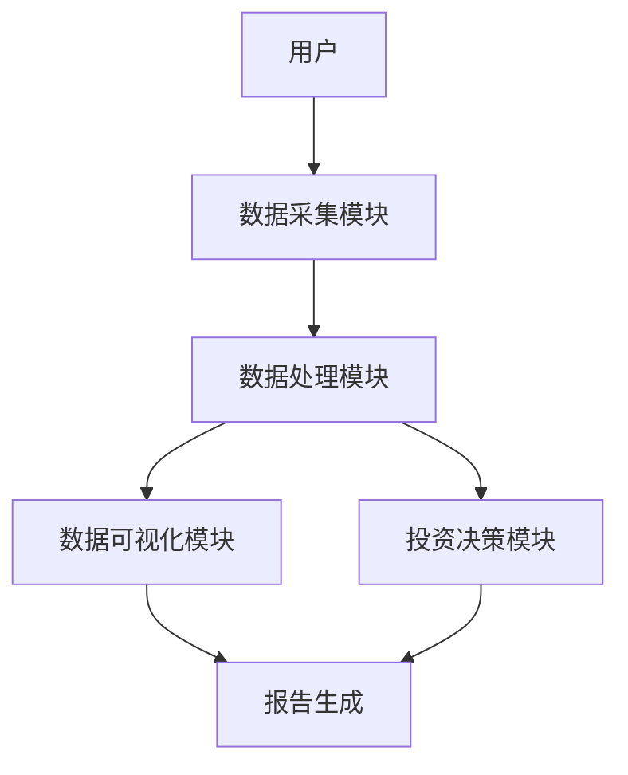
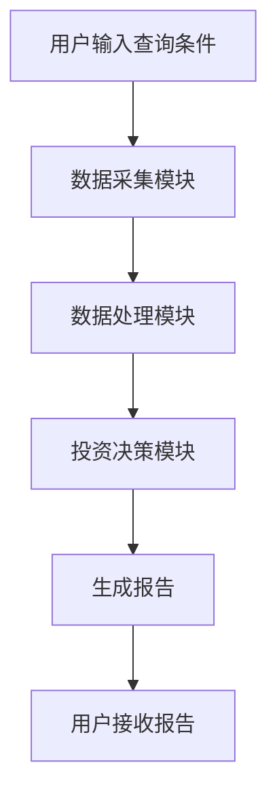

                 


# 格雷厄姆的价值投资实践案例

## 关键词：价值投资，格雷厄姆，投资策略，内在价值，安全边际

## 摘要：  
本文通过分析格雷厄姆的价值投资理论，结合实际案例，详细讲解了价值投资的核心理念、选股标准、投资组合构建以及风险控制策略。通过系统分析和数学建模，本文展示了如何利用技术手段辅助价值投资决策，并通过实战案例分析，验证了格雷厄姆理论的有效性。

---

# 第1章: 价值投资的背景与概念

## 1.1 价值投资的定义与核心理念

### 1.1.1 价值投资的定义  
价值投资是一种以低于股票内在价值的价格买入股票的投资策略。其核心理念是寻找市场中被低估的股票，通过长期持有实现资本增值。

### 1.1.2 格雷厄姆的价值投资理念  
格雷厄姆是价值投资的奠基人，他强调：  
1. **安全边际**：买入价格低于股票的内在价值，以确保投资的安全性。  
2. **防御性投资**：避免高风险投资，追求稳定收益。  
3. **长期持有**：通过复利效应实现财富增长。

### 1.1.3 价值投资与其它投资策略的区别  
- **基本面分析**：价值投资注重公司基本面，而技术分析则关注价格走势。  
- **长期 vs 短期**：价值投资强调长期持有，而短线交易关注短期波动。  
- **风险控制**：价值投资注重安全边际，而投机则更关注市场情绪。

---

## 1.2 投资的基本原则

### 1.2.1 格雷厄姆的投资哲学  
格雷厄姆认为，市场先生是不可预测的，投资者应关注企业的内在价值，而不是市场的短期波动。

### 1.2.2 投资中的安全边际  
安全边际 = 内在价值 - 市场价格。  
公式：  
$$ \text{安全边际} = \text{内在价值} - \text{市场价格} $$

### 1.2.3 长期投资与复利效应  
复利效应公式：  
$$ A = P \times (1 + r)^n $$  
其中，\( A \) 是终值，\( P \) 是本金，\( r \) 是年化收益率，\( n \) 是时间（年）。

---

# 第2章: 格雷厄姆的价值投资理论

## 2.1 格雷厄姆的投资策略

### 2.1.1 质价分析法  
质价分析法通过分析企业的财务状况、盈利能力、成长性和行业地位，确定其内在价值。

### 2.1.2 安全边际的确定  
格雷厄姆建议以低于内在价值的一定折扣价买入股票。例如，以内在价值的 80% 作为买入价格。

### 2.1.3 防御性投资与投机性投资的区别  
- **防御性投资**：注重安全性和稳定性，追求长期稳健的收益。  
- **投机性投资**：依赖市场情绪，追求短期暴利，风险较高。

---

## 2.2 投资组合的构建

### 2.2.1 投资组合的基本原则  
1. **分散化**：通过投资不同行业、不同公司的股票降低风险。  
2. **长期持有**：避免频繁交易，减少交易成本。  
3. **价值导向**：优先选择被低估的股票。

### 2.2.2 股票筛选标准  
- **低市盈率（P/E）**：市盈率低于行业平均水平。  
- **低市净率（P/B）**：市净率低于行业平均水平。  
- **高股息率**：股息率较高，且股息支付稳定。

### 2.2.3 投资组合的分散化  
公式：  
$$ \text{投资组合风险} = \sqrt{\sum w_i^2 \times \sigma_i^2} $$  
其中，\( w_i \) 是资产 \( i \) 的权重，\( \sigma_i \) 是资产 \( i \) 的标准差。

---

## 2.3 格雷厄姆的选股标准

### 2.3.1 低市盈率与低市净率  
公式：  
$$ \text{市盈率} = \frac{\text{股价}}{\text{每股收益}} $$  
$$ \text{市净率} = \frac{\text{股价}}{\text{每股净资产}} $$

### 2.3.2 高股息率与稳定的股息支付  
公式：  
$$ \text{股息率} = \frac{\text{股息/股}}{\text{股价}} $$

### 2.3.3 公司基本面分析  
- **盈利能力**：净利润率、ROE（净资产收益率）  
- **财务状况**：资产负债率、流动比率  
- **成长性**：收入增长率、净利润增长率  

---

# 第3章: 价值投资的数学模型与分析

## 3.1 股票内在价值的计算

### 3.1.1 股息贴现模型（DDM）  
公式：  
$$ P = \frac{D}{k - g} $$  
其中，\( P \) 是股票价格，\( D \) 是股息，\( k \) 是折现率，\( g \) 是股息增长率。

### 3.1.2 市盈率与市净率的分析  
- **市盈率（P/E）**：衡量股票价格相对于每股收益的高低。  
- **市净率（P/B）**：衡量股票价格相对于每股净资产的高低。

### 3.1.3 股票估值的公式推导  
公式：  
$$ \text{内在价值} = \text{股息} \times \left( \frac{1}{k - g} \right) $$

---

## 3.2 财务指标的量化分析

### 3.2.1 净利润与每股收益（EPS）  
- 净利润公式：  
$$ \text{净利润} = \text{收入} - \text{成本} - \text{费用} - \text{税金} $$  
- 每股收益公式：  
$$ \text{EPS} = \frac{\text{净利润}}{\text{总股本}} $$

### 3.2.2 资产负债率与杠杆比率  
公式：  
$$ \text{资产负债率} = \frac{\text{总负债}}{\text{总资产}} $$

### 3.2.3 现金流分析与自由现金流  
公式：  
$$ \text{自由现金流} = \text{净利润} - \text{资本支出} $$

---

## 3.3 投资组合的风险与收益分析

### 3.3.1 风险与收益的数学模型  
公式：  
$$ \text{收益} = r \times P $$  
$$ \text{风险} = \sigma \times P $$

### 3.3.2 标准差与夏普比率  
公式：  
$$ \text{夏普比率} = \frac{r_p - r_f}{\sigma_p} $$  
其中，\( r_p \) 是投资组合的收益，\( r_f \) 是无风险收益率，\( \sigma_p \) 是投资组合的风险（标准差）。

### 3.3.3 风险调整后的收益分析  
公式：  
$$ \text{风险调整后收益} = \text{收益} - \text{风险} \times \text{风险溢价} $$

---

# 第4章: 系统分析与架构设计

## 4.1 投资决策系统的构建

### 4.1.1 系统功能需求分析  
- 数据采集：收集股票的财务数据、市场数据。  
- 数据处理：清洗、转换和分析数据。  
- 数据可视化：生成图表和报告。  
- 投资决策：根据模型生成投资建议。

### 4.1.2 系统模块划分与设计  
1. 数据采集模块  
2. 数据处理模块  
3. 数据可视化模块  
4. 投资决策模块

### 4.1.3 系统架构图（Mermaid）  



---

## 4.2 投资组合优化的系统实现

### 4.2.1 数据采集与处理  
- 数据源：股票历史数据、财务报表。  
- 数据清洗：处理缺失值、异常值。  
- 数据转换：计算财务指标、市场指标。

### 4.2.2 股票筛选算法  
- 基于格雷厄姆的选股标准，筛选低市盈率、低市净率、高股息率的股票。

### 4.2.3 投资组合优化的数学模型  
公式：  
$$ \text{目标函数} = \max \sum w_i \times r_i $$  
约束条件：  
$$ \sum w_i = 1 $$  
$$ w_i \geq 0 $$

---

## 4.3 系统接口与交互设计

### 4.3.1 系统接口定义  
- API接口：提供数据接口、分析接口、报告接口。  
- 数据格式：JSON、CSV、Excel。

### 4.3.2 用户交互流程图（Mermaid）  



### 4.3.3 系统功能实现代码  

```python
import pandas as pd
import numpy as np

# 数据采集模块
def get_data(tickers):
    data = {}
    for ticker in tickers:
        # 获取股票数据
        df = pd.DataFrame()
        data[ticker] = df
    return data

# 数据处理模块
def process_data(data):
    processed = {}
    for ticker, df in data.items():
        # 计算财务指标
        df['PE'] = df['股价'] / df['每股收益']
        df['PB'] = df['股价'] / df['每股净资产']
        processed[ticker] = df
    return processed

# 投资决策模块
def investment_decision(processed_data):
    selected = []
    for ticker, df in processed_data.items():
        # 筛选低市盈率、低市净率、高股息率的股票
        if df['PE'].mean() < 15 and df['PB'].mean() < 1.5:
            selected.append(ticker)
    return selected
```

---

# 第5章: 项目实战与案例分析

## 5.1 实战环境搭建

### 5.1.1 Python环境的安装与配置  
- 安装Python 3.8或更高版本。  
- 安装必要的库：Pandas、NumPy、Matplotlib、Scikit-learn。

### 5.1.2 数据分析工具的安装  
- 安装Jupyter Notebook用于数据分析和可视化。  
- 安装Plotly用于高级数据可视化。

### 5.1.3 数据可视化工具的安装  
- 安装Matplotlib、Seaborn用于基本数据可视化。  

---

## 5.2 格雷厄姆投资策略的代码实现

### 5.2.1 股票筛选代码  

```python
import pandas as pd
import numpy as np

# 获取股票数据
def get_stock_data(tickers):
    data = {}
    for ticker in tickers:
        df = pd.read_csv(f'data/{ticker}.csv')
        data[ticker] = df
    return data

# 筛选低市盈率、低市净率的股票
def screen_stocks(data, threshold_pe=15, threshold_pb=1.5):
    selected = []
    for ticker, df in data.items():
        pe = df['股价'] / df['每股收益'].mean()
        pb = df['股价'] / df['每股净资产'].mean()
        if pe < threshold_pe and pb < threshold_pb:
            selected.append(ticker)
    return selected

# 示例代码
tickers = ['AAPL', 'MSFT', 'GOOGL']
data = get_stock_data(tickers)
selected = screen_stocks(data)
print(selected)
```

---

## 5.3 实战案例分析

### 5.3.1 案例背景  
以苹果公司（AAPL）为例，分析其是否符合格雷厄姆的选股标准。

### 5.3.2 数据分析  
- 苹果的市盈率：$$ \text{PE} = \frac{\text{股价}}{\text{每股收益}} $$  
- 苹果的市净率：$$ \text{PB} = \frac{\text{股价}}{\text{每股净资产}} $$  

### 5.3.3 投资决策  
根据计算结果，判断苹果是否符合低市盈率、低市净率的条件，并决定是否买入。

---

## 5.4 项目小结  
通过实战案例分析，验证了格雷厄姆投资策略的有效性。同时，通过技术手段辅助投资决策，提高了投资的科学性和准确性。

---

# 第6章: 总结与展望

## 6.1 核心观点总结  
- 价值投资的核心是寻找被低估的股票。  
- 格雷厄姆的安全边际理论是降低投资风险的重要工具。  
- 技术手段可以辅助投资决策，提高投资效率。

## 6.2 展望  
未来，随着人工智能和大数据技术的发展，价值投资将更加精准和高效。投资者可以通过技术手段进一步优化投资策略，实现更好的投资收益。

---

# 作者：AI天才研究院/AI Genius Institute & 禅与计算机程序设计艺术 /Zen And The Art of Computer Programming

