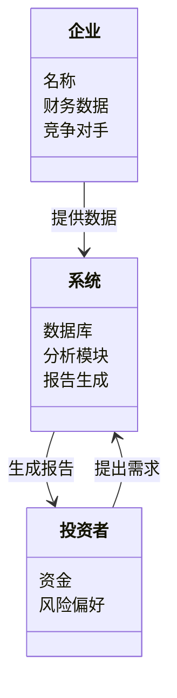
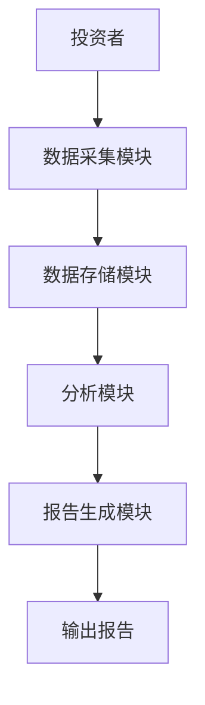
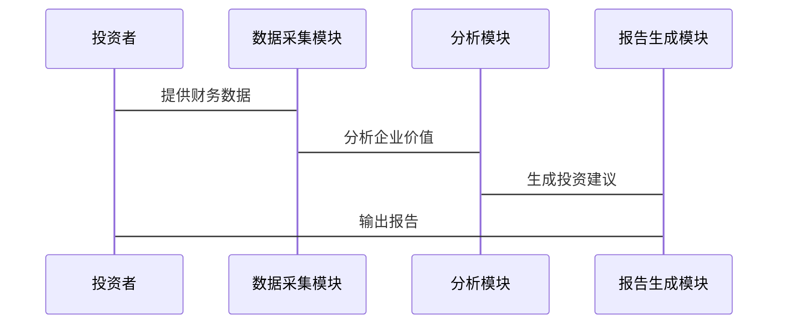

                 


```markdown
# 格雷厄姆的价值投资理念在私募股权中的应用

## 关键词
价值投资, 私募股权, 格雷厄姆, 投资策略, 企业估值

## 摘要
格雷厄姆的价值投资理念强调安全边际、内在价值和市场先生理论，这些原则在私募股权领域具有重要应用。本文探讨了如何将格雷厄姆的理念与私募股权的运作模式相结合，通过系统分析和案例研究，展示了其在项目筛选、估值分析和投资组合管理中的实际应用。文章还结合了数学模型和系统架构设计，为读者提供了全面的理论和实践指导。

---

## 第一部分: 格雷厄姆价值投资理念的背景与基础

### 第1章: 价值投资理念的概述

#### 1.1 价值投资的核心概念

##### 1.1.1 价值投资的定义
价值投资是一种以低于内在价值的价格买入优质资产的投资策略。其核心在于识别市场低估的标的，并长期持有以实现收益。

##### 1.1.2 格雷厄姆的价值投资理论
格雷厄姆的价值投资理论强调：
- **安全边际**：买入价格应低于保守估计的内在价值。
- **内在价值**：资产的真实价值，可通过财务指标计算。
- **市场先生**：市场情绪波动影响价格，但不应左右投资决策。

##### 1.1.3 价值投资与私募股权的结合
私募股权的特性（高回报、高风险）与价值投资理念高度契合，通过深入分析企业基本面，寻找被低估的投资机会。

#### 1.2 私募股权的特点与运作模式

##### 1.2.1 私募股权的基本概念
私募股权是指通过非公开市场投资于未上市公司股权，以实现资本增值。

##### 1.2.2 私募股权的运作流程
1. 项目筛选：基于财务指标和行业分析选择目标企业。
2. 投资决策：评估企业内在价值，决定投资金额。
3. 企业治理：参与企业管理，提升企业价值。
4. 退出机制：通过IPO或并购实现退出，获取收益。

##### 1.2.3 私募股权的市场特点
- **高风险**：市场波动大，投资回报不稳定。
- **高回报**：通过优质资产配置实现超额收益。
- **专业性**：需要深入的企业分析和行业洞察。

---

## 第二部分: 格雷厄姆价值投资理念在私募股权中的应用

### 第2章: 价值投资理念在私募股权中的核心应用

#### 2.1 格雷厄姆投资理念的核心要素

##### 2.1.1 安全边际的概念
安全边际是买入价格与内在价值之间的差距，确保在市场波动中仍能获得正收益。

##### 2.1.2 股票内在价值的计算
内在价值是基于企业未来现金流的现值，公式为：
$$ V = \sum_{t=1}^{n} \frac{CF_t}{(1 + r)^t} $$
其中，CF_t为第t年的现金流，r为折现率。

##### 2.1.3 市场先生的理论
市场情绪波动会影响资产价格，但长期来看，价格会回归内在价值。

#### 2.2 私募股权中的价值评估

##### 2.2.1 企业估值的基本方法
常用的企业估值方法包括：
1. 市盈率（P/E）：$P/E = \frac{P}{E}$，P为股价，E为每股收益。
2. 市净率（P/B）：$P/B = \frac{P}{B}$，B为每股净资产。
3. 现金流折现法（DCF）：基于未来现金流的现值计算内在价值。

##### 2.2.2 财务指标分析
关键的财务指标包括：
- **净利润率**：衡量企业的盈利能力。
- **资产负债率**：评估企业的财务健康状况。
- **ROE（净资产收益率）**：反映资产使用效率。

##### 2.2.3 行业分析与竞争评估
行业分析包括市场规模、竞争格局和未来趋势，竞争评估则关注企业的市场地位和竞争优势。

### 第3章: 价值投资与私募股权的结合策略

#### 3.1 价值投资在私募股权中的具体应用

##### 3.1.1 项目筛选与投资决策
- **项目筛选**：基于财务指标和行业分析，筛选具有潜力的企业。
- **投资决策**：通过内在价值评估，决定投资金额和时间。

##### 3.1.2 投资组合的构建
- **分散投资**：降低单一项目风险。
- **资产配置**：根据市场环境调整投资比例。

##### 3.1.3 风险管理与退出策略
- **风险管理**：通过定期评估和调整投资组合，控制风险。
- **退出策略**：选择合适的退出时机，最大化投资回报。

#### 3.2 格雷厄姆理念的创新应用

##### 3.2.1 安全边际的拓展
在私募股权中，安全边际可通过对企业治理的参与和长期持有实现。

##### 3.2.2 企业治理与价值提升
通过优化企业管理和提升竞争力，增强企业的内在价值。

##### 3.2.3 长期投资与价值创造
私募股权的长期持有策略与价值投资理念高度契合，通过时间的积累实现价值增值。

---

## 第三部分: 格雷厄姆价值投资理念在私募股权中的案例分析

### 第4章: 典型私募股权案例分析

#### 4.1 案例一: XYZ私募股权基金的投资策略

##### 4.1.1 投资背景与目标
XYZ基金专注于科技行业的早期投资，目标是通过价值投资实现高回报。

##### 4.1.2 价值评估与投资决策
通过对目标企业的财务指标和行业分析，计算其内在价值，确定投资金额。

##### 4.1.3 投资效果
通过长期持有和企业治理，XYZ基金实现了显著的投资回报。

#### 4.2 案例二: ABC私募股权基金的风险管理

##### 4.2.1 风险评估
通过财务指标分析和行业趋势预测，识别潜在风险。

##### 4.2.2 风险控制
通过分散投资和定期评估，有效控制投资风险。

##### 4.2.3 退出策略
选择合适的退出时机，最大化投资收益。

---

## 第四部分: 系统分析与架构设计方案

### 第5章: 系统分析与架构设计

#### 5.1 问题场景介绍
私募股权的投资决策需要结合市场分析、企业评估和风险管理，构建一个高效的系统架构。

#### 5.2 系统功能设计

##### 5.2.1 领域模型设计
领域模型类图展示企业的核心业务流程和关键实体关系。



#### 5.3 系统架构设计

##### 5.3.1 系统架构图
系统架构图展示各模块的交互和数据流。



#### 5.4 系统接口设计
接口设计包括数据输入、分析模块调用和报告生成。

#### 5.5 系统交互设计
交互序列图展示投资者与系统之间的互动流程。



---

## 第五部分: 项目实战

### 第6章: 项目实战

#### 6.1 环境安装
- 安装Python和相关库（如Pandas、NumPy）。
- 配置数据源（如企业财务数据、行业分析报告）。

#### 6.2 系统核心实现

##### 6.2.1 核心代码实现
以下为价值评估的Python代码示例：

```python
import pandas as pd
import numpy as np

def calculate_intrinsic_value(fcf, discount_rate):
    # 计算未来现金流的现值
    pv = sum(fcf / (1 + discount_rate)**t for t in range(len(fcf)))
    return pv

# 示例数据
fcf = [100, 150, 200]
discount_rate = 0.1

iv = calculate_intrinsic_value(fcf, discount_rate)
print(f"内在价值为: {iv}")
```

##### 6.2.2 代码应用解读
- **函数定义**：`calculate_intrinsic_value`计算未来现金流的现值。
- **数据输入**：自由现金流和折现率。
- **结果输出**：计算出的内在价值。

#### 6.3 案例分析与解读
通过实际案例分析，展示如何利用价值投资理念进行私募股权投资。

#### 6.4 项目小结
总结项目实施过程中的关键点和经验教训，为读者提供实践参考。

---

## 第六部分: 结论与展望

### 第7章: 结论与展望

#### 7.1 核心观点总结
格雷厄姆的价值投资理念为私募股权提供了科学的投资方法，通过安全边际和内在价值的分析，投资者可以实现长期稳定的收益。

#### 7.2 未来展望
随着私募股权市场的不断发展，价值投资理念的应用将更加广泛，技术的进步也将为投资者提供更强大的工具和方法。

---

## 附录

### 附录A: 经典文献推荐

1. 格雷厄姆《证券分析》
2. 巴菲特《巴菲特致股东的信》
3. 纳什《博弈论与经济行为》

### 附录B: 工具推荐

- 数据分析工具：Python、Excel
- 投资管理工具：Morningstar、Bloomberg

### 附录C: 数据源

- 财务数据：Yahoo Finance、Google Finance
- 行业报告：Bain、McKinsey

---

## 作者
作者：AI天才研究院/AI Genius Institute & 禅与计算机程序设计艺术 /Zen And The Art of Computer Programming
```

