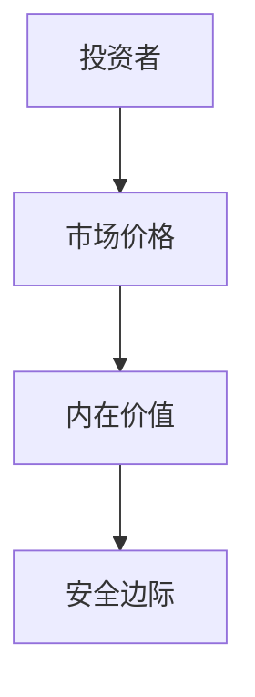
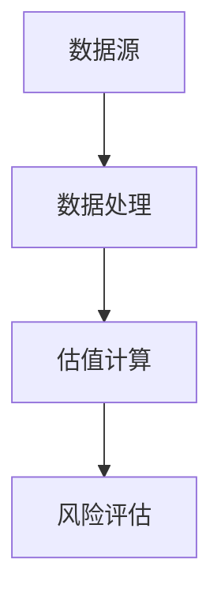
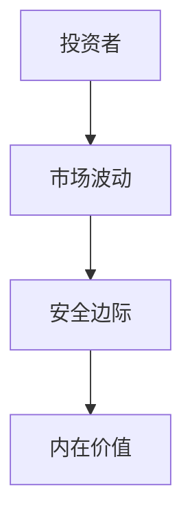

                 

# 格雷厄姆的价值投资者修炼之道

**关键词：** 价值投资、格雷厄姆、内在价值、安全边际、投资策略、风险管理

**摘要：** 本文系统地介绍格雷厄姆的价值投资理论，从基础概念到实战策略，结合数学模型和案例分析，详细阐述如何通过安全边际和内在价值的计算，制定有效的投资策略，并构建风险可控的投资组合。文章结合技术语言和逻辑推理，帮助读者逐步掌握价值投资的核心思想和实践方法。

---

## 第1章: 价值投资概述

### 1.1 格雷厄姆的背景与投资理念
格雷厄姆是价值投资的奠基人，他的投资理念强调安全边际和内在价值。他提出，市场先生是市场的波动性代表，投资者应以低于内在价值的价格买入优质资产。

### 1.2 价值投资的核心思想
- **长期视角**：投资不是投机，而是通过深入分析找到被市场低估的资产。
- **安全边际**：买入价格低于内在价值，以降低风险。
- **逆向思维**：在市场恐慌时寻找机会，在市场疯狂时保持冷静。

### 1.3 价值投资与成长投资的区别
| 方面       | 价值投资                     | 成长投资                     |
|------------|------------------------------|------------------------------|
| 核心理念   | 买入低估资产                 | 投资高增长潜力的公司         |
| 风险控制   | 强调安全边际                 | 更注重未来增长               |
| 适用场景   | 经济衰退期                   | 经济快速增长期               |

---

## 第2章: 安全边际与内在价值

### 2.1 内在价值的计算
格雷厄姆提出，内在价值是资产在未来现金流的现值。公式如下：

$$ V = \sum_{t=1}^{n} \frac{CF_t}{(1 + r)^t} $$

其中：
- \( CF_t \) 为第 \( t \) 年的现金流
- \( r \) 为折现率

### 2.2 安全边际的确定
安全边际 = 内在价值 - 市场价格

$$ \text{安全边际} = V_{\text{intrinsic}} - P $$

### 2.3 实体关系图（Mermaid）

---

## 第3章: 价值投资策略的制定

### 3.1 识别低估股票
- **市盈率法**：\( P/E \) 比例低于行业平均水平。
- **市净率法**：\( P/B \) 比例低于行业平均水平。
- **股息率法**：股息率高于行业平均水平。

### 3.2 投资组合的构建
1. **资产配置**：将资金分配到股票、债券等不同资产中。
2. **定期再平衡**：定期调整投资组合，确保安全边际。

### 3.3 风险管理
- **风险识别**：分析市场的波动性和个股的波动性。
- **风险对冲**：通过投资债券或现金对冲市场风险。

---

## 第4章: 价值投资的系统分析

### 4.1 投资系统的功能设计
- **数据采集**：收集股票的基本面数据。
- **估值计算**：计算内在价值和安全边际。
- **风险评估**：分析市场的波动性和个股风险。

### 4.2 系统架构图（Mermaid）

---

## 第5章: 实战案例分析

### 5.1 经典投资案例
- **案例1**：买入价格低于内在价值的股票。
- **案例2**：通过安全边际避免市场波动带来的损失。

### 5.2 案例分析的 Mermaid 图

---

## 第6章: 价值投资的未来与发展

### 6.1 价值投资的创新
- **量化分析**：利用大数据和算法优化投资决策。
- **行为金融学**：结合心理学因素改进投资策略。

### 6.2 价值投资的挑战
- **市场有效性**：市场的有效性降低了低估资产的可得性。
- **技术进步**：AI技术的应用可能改变投资方式。

---

## 第7章: 总结与展望

### 7.1 本章小结
格雷厄姆的价值投资理论为投资者提供了长期稳定的收益策略。通过安全边际和内在价值的分析，投资者可以在市场波动中找到优质资产。

### 7.2 实践中的注意事项
- **长期视角**：避免短期市场的干扰。
- **风险管理**：合理控制投资风险。
- **持续学习**：市场变化需要不断更新知识。

---

## 作者：AI天才研究院 & 禅与计算机程序设计艺术

---

这篇文章通过系统化的方法，详细讲解了格雷厄姆的价值投资理论，并结合技术语言和案例分析，帮助读者逐步掌握价值投资的核心思想和实践方法。

